# [Tansoftware](https://www.tansoftware.com) — Mathématiques pour la programmation de jeux vidéo

[](https://fr.wikipedia.org/wiki/Fran%C3%A7ais) [](LICENSE) [](https://www.markdownguide.org/) [](https://en.wikipedia.org/wiki/Video_game_graphics) [^1]

> Un cours complet, en français, qui rassemble les fondations mathématiques nécessaires pour comprendre, concevoir et programmer un jeu vidéo moderne — du vecteur 2D jusqu'au pipeline de rendu d'un GPU.

---

## Table des matières

1. [Introduction](#introduction)
2. [Bases des mathématiques](#bases-des-mathématiques)
   - [Coordonnées cartésiennes](#coordonnées-cartésiennes)
   - [Trigonométrie](#trigonométrie)
   - [Vecteurs](#vecteurs)
     - [Magnitude](#magnitude)
     - [Addition et soustraction de vecteurs](#addition-et-soustraction-de-vecteurs)
     - [Multiplication par un scalaire](#multiplication-par-un-scalaire)
     - [Produit scalaire](#produit-scalaire)
     - [Produit vectoriel](#produit-vectoriel)
   - [Interpolation](#interpolation)
   - [Matrices](#matrices)
     - [Addition et soustraction de matrices](#addition-et-soustraction-de-matrices)
     - [Multiplication d'une matrice par un scalaire](#multiplication-dune-matrice-par-un-scalaire)
     - [Multiplication de matrices](#multiplication-de-matrices)
   - [Transformations](#transformations)
     - [Translation](#translation)
     - [Rotation](#rotation)
     - [Quaternions](#quaternions)
     - [Mise à l'échelle](#mise-à-léchelle)
     - [Homothétie](#homothétie)
     - [Cisaillement](#cisaillement)
   - [Géométrie linéaire](#géométrie-linéaire)
     - [Projection](#projection)
     - [Perspective](#perspective)
     - [Transformation de vue](#transformation-de-vue)
     - [Espaces de coordonnées](#espaces-de-coordonnées)
3. [Graphiques informatiques](#graphiques-informatiques)
   - [Graphiques vectoriels et bitmap](#graphiques-vectoriels-et-bitmap)
   - [Résolution et profondeur de couleur](#résolution-et-profondeur-de-couleur)
   - [Espaces de couleur](#espaces-de-couleur)
   - [Formats de fichier d'image](#formats-de-fichier-dimage)
4. [Éclairage et ombres](#éclairage-et-ombres)
   - [Sources de lumière](#sources-de-lumière)
   - [Modèles d'éclairage](#modèles-déclairage)
   - [Ombres](#ombres)
5. [Texture et mappage UV](#texture-et-mappage-uv)
   - [Texture et coordonnées de texture](#texture-et-coordonnées-de-texture)
   - [Mappage UV](#mappage-uv)
6. [Animation](#animation)
   - [Animation par squelette](#animation-par-squelette)
   - [Animation de forme](#animation-de-forme)
   - [Cinématique inverse](#cinématique-inverse)
7. [Physique des jeux](#physique-des-jeux)
   - [Simulation physique](#simulation-physique)
   - [Détection de collision](#détection-de-collision)
   - [Résolution de collision](#résolution-de-collision)
8. [Intelligence artificielle](#intelligence-artificielle)
   - [Comportement de base](#comportement-de-base)
   - [Navigation](#navigation)
   - [Apprentissage automatique](#apprentissage-automatique)
9. [Réseau et multijoueur](#réseau-et-multijoueur)
   - [Modèles de réseau](#modèles-de-réseau)
   - [Protocoles de communication](#protocoles-de-communication)
   - [Programmation de jeu multijoueur](#programmation-de-jeu-multijoueur)
10. [Techniques avancées](#techniques-avancées)
    - [Génération procédurale et bruit](#génération-procédurale-et-bruit)
    - [Physique des fluides](#physique-des-fluides)
    - [Écrans multiples et fenêtrage](#écrans-multiples-et-fenêtrage)
    - [Intelligence artificielle avancée](#intelligence-artificielle-avancée)
    - [Rendu avancé](#rendu-avancé)
11. [Pipeline de rendu](#pipeline-de-rendu)
    - [Étapes du pipeline](#étapes-du-pipeline)
    - [Culling et occlusion](#culling-et-occlusion)
    - [Shaders](#shaders)
      - [Vertex shaders](#vertex-shaders)
      - [Geometry shaders](#geometry-shaders)
      - [Fragment shaders](#fragment-shaders)
12. [Pour aller plus loin](#pour-aller-plus-loin)

---

## Introduction

> **Avant toute chose**, si vous n'êtes pas familiarisé avec les formules ou notions mathématiques présentées ici, nous vous conseillons de prendre le temps nécessaire pour monter en compétences dans le domaine des mathématiques et de la physique, par exemple sur le site [Khan Academy](https://fr.khanacademy.org/).

Ce dépôt est conçu pour vous fournir une **compréhension approfondie** des concepts mathématiques et des techniques utilisés dans la programmation de jeux 3D et les graphiques informatiques.

Nous allons couvrir une variété de sujets allant des **bases des mathématiques** (vecteurs, matrices, transformations) aux **transformations géométriques**, en passant par l'**éclairage**, la **couleur**, les **projections**, le **rendu 3D**, les **techniques d'optimisation**, la **physique** et la **simulation**.

Vous apprendrez à appliquer ces concepts pour résoudre les problèmes liés à :

- la **géométrie** et aux **transformations** (déplacer, faire tourner, redimensionner) ;
- l'**éclairage** et au **rendu** (calculer la couleur d'un pixel) ;
- la **performance** (n'afficher que ce qui est visible) ;
- la **physique du jeu** (faire bouger les objets, gérer les collisions).

Que vous soyez un développeur expérimenté ou que vous débutiez tout juste, nous espérons que ce dépôt vous aidera à **renforcer vos connaissances** en mathématiques et à **améliorer vos compétences** en programmation de jeux 3D.

[🔝 Retour en haut de page](#table-des-matières)

---

## Bases des mathématiques

Dans cette section, nous explorerons les concepts fondamentaux des mathématiques nécessaires pour la programmation de jeux 3D et les graphiques informatiques. Nous aborderons les **coordonnées cartésiennes**, les **vecteurs**, les **matrices** et les **transformations**.

### Coordonnées cartésiennes

Les coordonnées cartésiennes sont un système de coordonnées permettant de représenter les points dans l'espace à l'aide de nombres réels.

> Les nombres **réels** sont une extension des nombres rationnels qui permettent de représenter toutes les grandeurs physiques, y compris les nombres irrationnels tels que $\pi$ et $\sqrt{2}$.
>
> 

En **2D**, l'espace cartésien est un plan composé d'un axe horizontal et d'un axe vertical. Les coordonnées d'un point dans ce plan sont généralement notées $(x, y)$, où $x$ est l'**abscisse** (horizontal) et $y$ est l'**ordonnée** (vertical).

En **3D**, l'espace cartésien est un espace à trois dimensions composé d'un axe horizontal (l'axe des $x$), d'un axe vertical (l'axe des $y$) et d'un axe perpendiculaire à ces deux axes (l'axe des $z$). Les coordonnées d'un point dans cet espace sont généralement notées $(x, y, z)$.

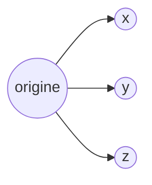

L'espace cartésien est défini par un système de coordonnées cartésiennes, qui utilise des **axes orthogonaux** (des droites perpendiculaires les unes aux autres) et des nombres réels pour définir la position de points dans l'espace.

Fondamentales dans le domaine des jeux vidéo, en particulier pour les jeux en 3 dimensions, elles permettent de représenter et de manipuler les **positions**, les **mouvements** et les **orientations** des objets dans l'espace virtuel.

### Trigonométrie

La trigonométrie est l'étude des relations entre les **angles** et les **longueurs** dans un triangle. C'est un outil omniprésent en programmation de jeux : rotation d'un sprite, déplacement d'un projectile, oscillation, calcul d'un angle de tir, etc.

#### Le cercle trigonométrique

Sur le cercle unité (rayon $1$ centré à l'origine), un point repéré par l'angle $\theta$ a pour coordonnées :

```math
(x, y) = (\cos\theta,\ \sin\theta)
```

> ℹ️ En programmation, les angles sont **presque toujours exprimés en radians** ($2\pi$ rad $= 360°$). La conversion se fait avec : $\theta_\text{rad} = \theta_\text{deg} \times \dfrac{\pi}{180}$.

#### Fonctions trigonométriques

Pour un angle $\theta$ dans un triangle rectangle d'hypoténuse $h$, de côté opposé $o$ et de côté adjacent $a$ :

```math
\sin\theta = \frac{o}{h}, \quad \cos\theta = \frac{a}{h}, \quad \tan\theta = \frac{o}{a} = \frac{\sin\theta}{\cos\theta}
```

#### Identités utiles

```math
\sin^2\theta + \cos^2\theta = 1
```

```math
\sin(\alpha + \beta) = \sin\alpha\cos\beta + \cos\alpha\sin\beta
```

```math
\cos(\alpha + \beta) = \cos\alpha\cos\beta - \sin\alpha\sin\beta
```

#### Exemple : déplacement d'un projectile

Pour tirer un projectile à la vitesse $v$ et à l'angle $\theta$ :

```math
v_x = v \cos\theta, \quad v_y = v \sin\theta
```

```csharp
float angleRad = angleDeg * MathF.PI / 180f;
Vector2 velocity = new Vector2(
    speed * MathF.Cos(angleRad),
    speed * MathF.Sin(angleRad)
);
```

#### atan2 — l'incontournable

Pour retrouver l'angle correspondant à un vecteur $(x, y)$, on utilise `atan2(y, x)` plutôt que `atan(y/x)` — car `atan2` gère correctement les quatre quadrants et le cas $x = 0$ :

```math
\theta = \mathrm{atan2}(y, x) \in (-\pi,\ \pi]
```

C'est l'outil idéal pour faire pivoter un personnage ou une arme vers un point cible.

### Vecteurs

Les vecteurs sont des entités mathématiques représentant à la fois une **magnitude** (longueur) et une **direction**. Ils sont généralement utilisés pour décrire la position, la vitesse, l'accélération et d'autres propriétés dans l'espace 2D ou 3D, dans un espace cartésien.

> Dans un jeu vidéo, on privilégiera un type particulier de repère cartésien : le **repère orthonormé**.


Son format d'écriture usuel s'exprime par :

```math
V =
\begin{pmatrix}
v_1 \\
v_2 \\
\vdots \\
v_n
\end{pmatrix}
```

où chaque $v_i$ est une **composante** du vecteur $V$ (telle que $v_1$ est la première composante, $v_2$ la deuxième, et ainsi de suite). La matrice représente un vecteur à $n$ composantes, disposées verticalement en une seule colonne.

> Dans le contexte des vecteurs, une composante est un élément constitutif du vecteur qui indique sa valeur le long d'un axe particulier. Un vecteur est défini par un ensemble de composantes, qui ensemble déterminent sa direction et sa magnitude.
>
> Par exemple, un vecteur à deux dimensions a deux composantes ($v_1$ et $v_2$) qui représentent respectivement sa valeur le long des axes $x$ et $y$. De même, un vecteur à trois dimensions a trois composantes ($v_1$, $v_2$ et $v_3$), qui correspondent à sa valeur le long des axes $x$, $y$ et $z$.
>
> Les composantes d'un vecteur permettent de décrire sa position ou sa direction dans un espace à $n$ dimensions, où $n$ est le nombre de composantes du vecteur.


#### Magnitude

La magnitude d'un vecteur en dimension $n$ est donnée par la formule suivante :

```math
\left\Vert\mathbf{v}\right\Vert = \sqrt{\sum_{i=1}^{n} v_i^2}
```

> Le symbole $\sum$ est appelé « somme » en mathématiques. Il indique que l'on doit additionner les termes indiqués. Ici, on additionne les carrés de chaque composante du vecteur $\mathbf{v}$.
>
> Le symbole $\left\Vert\mathbf{v}\right\Vert$ représente la magnitude (ou norme) du vecteur $\mathbf{v}$, c'est-à-dire sa longueur ou sa taille.
>
> Les indices $i$ de la somme indiquent qu'on somme les carrés des composantes de $\mathbf{v}$ de $i=1$ jusqu'à $i=n$, où $n$ est la dimension du vecteur. Cela signifie qu'on calcule le carré de la première composante, puis le carré de la deuxième, et ainsi de suite jusqu'à la $n$-ème composante.
>
> Le symbole $v_i$ représente la $i$-ème composante du vecteur $\mathbf{v}$. On élève cette composante au carré en utilisant le symbole $^2$.
>
> Enfin, la racine carrée $\sqrt{\ }$ est appliquée à la somme des carrés pour obtenir la magnitude. L'opération de carré supprime les signes négatifs des composantes (toutes les valeurs deviennent positives), tout en gardant leur contribution proportionnelle à leur magnitude.

Pour un vecteur 2D représenté par les coordonnées $(x, y)$, la magnitude est donnée par :

```math
\left\Vert\mathbf{v}\right\Vert = \sqrt{\sum_{i=1}^{2} v_i^2} = \sqrt{v_1^2 + v_2^2}
```

En effet, dans un espace 2D, $n = 2$ ; dans un espace 3D, $n = 3$, etc.

La magnitude d'un vecteur 2D est donc égale à la racine carrée de la somme des carrés de ses deux composantes — autrement dit, à la longueur de l'**hypoténuse** d'un triangle rectangle dont les côtés adjacents sont les composantes $x$ et $y$ du vecteur.

##### Une représentation possible en C\#

```csharp
using TansoftwareEngine;

public class Game : GameEngine
{
    void Start()
    {
        Vector3 position = new Vector3(1.0f, 2.0f, 3.0f);
        Player myPlayer = new Player();

        myPlayer.setPosition(position);
    }
}
```

> Ici, la classe `Game` instancie une position qui est un vecteur de dimension 3, affectée au joueur, avec une position en $x$ (`1.0f`) correspondant à l'abscisse (horizontal), $y$ (`2.0f`) à l'ordonnée (vertical) et $z$ (`3.0f`) à la profondeur de champ (distance par rapport à une caméra).

La magnitude serait donc :

```math
\|\mathbf{v}\| = \sqrt{\sum_{i=1}^{3} v_i^2} = \sqrt{1.0^2 + 2.0^2 + 3.0^2} \approx 3{,}74
```

L'avantage d'utiliser des vecteurs, plutôt que des nombres concrets, tient aux propriétés mathématiques associées, qui permettent une représentation plus flexible et une manipulation aisée des quantités géométriques dans les jeux vidéo et d'autres applications.

En outre, les opérations vectorielles standard — addition, soustraction et multiplication par un scalaire — simplifient les calculs et les transformations géométriques requises dans de nombreux scénarios.

#### Addition et soustraction de vecteurs

Pour additionner ou soustraire deux vecteurs, on additionne ou soustrait les composantes correspondantes de chaque vecteur :

- **Addition** : $\mathbf{u} + \mathbf{v} = (u_x + v_x,\ u_y + v_y,\ u_z + v_z)$
- **Soustraction** : $\mathbf{u} - \mathbf{v} = (u_x - v_x,\ u_y - v_y,\ u_z - v_z)$

#### Multiplication par un scalaire

> Un **scalaire** est la représentation d'une quantité, sans direction.

Pour multiplier un vecteur par un scalaire, on multiplie chaque composante du vecteur par le scalaire :

- **Multiplication par un scalaire** : $a \cdot \mathbf{v} = (a \cdot v_x,\ a \cdot v_y,\ a \cdot v_z)$

#### Produit scalaire

Le produit scalaire (ou produit intérieur) prend deux vecteurs et renvoie un nombre réel. Il est défini comme suit :

```math
\mathbf{u} \cdot \mathbf{v} = u_x v_x + u_y v_y + u_z v_z = \|\mathbf{u}\|\,\|\mathbf{v}\|\,\cos\theta
```

où $\theta$ est l'angle entre les deux vecteurs. Le produit scalaire est utilisé entre autres pour calculer un **angle** entre deux directions ou pour tester si deux vecteurs sont **orthogonaux** (produit scalaire nul).

#### Produit vectoriel

Le produit vectoriel (ou produit extérieur) prend deux vecteurs et renvoie un nouveau vecteur **perpendiculaire** à ces deux vecteurs. Il est défini comme suit :

```math
\mathbf{u} \times \mathbf{v} = (u_y v_z - u_z v_y,\ u_z v_x - u_x v_z,\ u_x v_y - u_y v_x)
```

Le produit vectoriel est très utilisé pour calculer la **normale** d'un triangle (utile pour l'éclairage), pour déterminer un **sens de rotation**, ou pour construire un repère orthonormé local à partir de deux vecteurs.

### Interpolation

L'**interpolation** consiste à calculer une valeur intermédiaire entre deux (ou plusieurs) valeurs connues. C'est l'une des opérations les plus utilisées dans un jeu : caméra qui suit le joueur en douceur, animation de fondu, transition de couleur, lissage d'un déplacement réseau, etc.

#### Interpolation linéaire (LERP)

L'interpolation linéaire entre deux valeurs $A$ et $B$ avec un paramètre $t \in [0, 1]$ s'écrit :

```math
\mathrm{lerp}(A, B, t) = (1 - t) \cdot A + t \cdot B = A + t \cdot (B - A)
```

- $t = 0$ donne $A$ ;
- $t = 1$ donne $B$ ;
- $t = 0{,}5$ donne le milieu entre $A$ et $B$.

```csharp
float Lerp(float a, float b, float t) => a + (b - a) * t;
Vector3 LerpVec(Vector3 a, Vector3 b, float t) => a + (b - a) * t;
```

#### Inverse-LERP

L'opération inverse — retrouver $t$ connaissant $A$, $B$ et la valeur courante $V$ :

```math
\mathrm{invLerp}(A, B, V) = \frac{V - A}{B - A}
```

#### Interpolation sphérique (SLERP)

Pour interpoler entre deux **directions** ou deux **rotations** sur une sphère unité, l'interpolation linéaire ne suffit pas (vitesse non constante). On utilise le **SLERP** :

```math
\mathrm{slerp}(\mathbf{q}_0, \mathbf{q}_1, t) = \frac{\sin\!\big((1-t)\,\Omega\big)}{\sin\Omega}\,\mathbf{q}_0 + \frac{\sin(t\,\Omega)}{\sin\Omega}\,\mathbf{q}_1
```

où $\Omega$ est l'angle entre $\mathbf{q}_0$ et $\mathbf{q}_1$ ($\cos\Omega = \mathbf{q}_0 \cdot \mathbf{q}_1$). Le SLERP est l'outil de référence pour interpoler entre deux **quaternions** (rotation 3D).

#### Easing — interpolation non-linéaire

Pour un rendu plus naturel, on remplace souvent le $t$ linéaire par une fonction d'easing. Quelques classiques :

```math
\text{easeInQuad}(t) = t^2
```

```math
\text{easeOutQuad}(t) = 1 - (1 - t)^2
```

```math
\text{easeInOutQuad}(t) = \begin{cases} 2t^2 & \text{si } t < 0{,}5 \\ 1 - 2(1-t)^2 & \text{sinon} \end{cases}
```

```math
\text{smoothstep}(t) = 3t^2 - 2t^3
```

> 💡 La fonction `smoothstep` (et sa cousine `smootherstep`) est très utilisée en graphisme et dans les shaders : elle a une dérivée nulle aux extrémités, ce qui donne un mouvement très naturel.

#### Courbes de Bézier

Pour un mouvement plus libre (trajectoire d'une caméra, animation d'UI…), on utilise des **courbes de Bézier**. La courbe cubique entre $P_0$ et $P_3$ avec deux points de contrôle $P_1$ et $P_2$ s'écrit :

```math
B(t) = (1-t)^3 P_0 + 3(1-t)^2 t P_1 + 3(1-t)t^2 P_2 + t^3 P_3, \quad t \in [0, 1]
```

### Matrices

Les matrices sont des **tableaux rectangulaires** de nombres, utilisés pour effectuer des transformations linéaires sur des vecteurs.

Elles sont couramment utilisées pour représenter des transformations géométriques telles que la translation, la rotation, la mise à l'échelle, etc., que nous verrons par la suite.

Une matrice est généralement représentée sous la forme d'un tableau avec $M$ lignes et $N$ colonnes. Les matrices sont généralement notées en lettres majuscules, telles que $A$, $B$, $C$, etc.

Les opérations courantes sur les matrices incluent l'addition, la soustraction, la multiplication par un scalaire et la multiplication de matrices.

> Il convient de différencier les matrices selon leur représentation **mathématique** et **informatique**.
>
> En mathématiques, elles sont utilisées pour représenter des transformations linéaires, résoudre des systèmes d'équations linéaires et effectuer des opérations sur des vecteurs.
>
> En informatique, elles sont utilisées pour stocker et manipuler des données sous forme de tableaux à deux dimensions, pour des applications telles que les graphiques, l'apprentissage automatique, la modélisation de données et la simulation.

#### Addition et soustraction de matrices

Pour additionner ou soustraire deux matrices, on additionne ou soustrait les éléments correspondants de chaque matrice :

- **Addition** : $A + B = [\,a_{ij} + b_{ij}\,]$
- **Soustraction** : $A - B = [\,a_{ij} - b_{ij}\,]$

#### Multiplication d'une matrice par un scalaire

Pour multiplier une matrice par un scalaire, il suffit de multiplier chaque élément de la matrice par le scalaire :

- **Multiplication par un scalaire** : $a \cdot A = [\,a \cdot a_{ij}\,]$

#### Multiplication de matrices

La multiplication de matrices est une opération qui prend deux matrices et renvoie une nouvelle matrice. Elle est définie de telle manière que si $A$ est une matrice de taille $m \times n$ et $B$ une matrice de taille $n \times p$, alors le produit $AB$ est une matrice de taille $m \times p$.

La multiplication est effectuée en multipliant les éléments de chaque ligne de la première matrice par les éléments correspondants de chaque colonne de la deuxième matrice, puis en additionnant les résultats :

```math
AB = [\,c_{ij}\,] \quad \text{où} \quad c_{ij} = \sum_{k=1}^{n} a_{ik} \cdot b_{kj}
```

> ⚠️ La multiplication de matrices **n'est pas commutative** : en général, $AB \neq BA$.

### Transformations

Une transformation en mathématiques est une fonction qui associe à chaque élément d'un ensemble un autre élément du même ensemble.

En graphisme, on utilise principalement les transformations suivantes — chacune représentée par une matrice qu'on peut combiner par multiplication :

#### Translation

La **translation** est une transformation qui déplace un objet d'une position à une autre sans changer sa forme ou son orientation. En 3D, elle peut être représentée par une matrice de transformation homogène 4×4 :

```math
\begin{pmatrix} 1 & 0 & 0 & t_x \\ 0 & 1 & 0 & t_y \\ 0 & 0 & 1 & t_z \\ 0 & 0 & 0 & 1 \end{pmatrix}
```

où $t_x$, $t_y$ et $t_z$ sont les quantités de mouvement dans chaque direction.

Cette matrice peut être utilisée pour déplacer un vecteur de position homogène

```math
\mathbf{v}_h = \begin{pmatrix} x \\ y \\ z \\ 1 \end{pmatrix}
```

d'une quantité de mouvement spécifique dans chaque direction.

La multiplication de la matrice de translation homogène par le vecteur de position homogène produit un nouveau vecteur de position homogène :

```math
\mathbf{v}'_h = \begin{pmatrix} 1 & 0 & 0 & t_x \\ 0 & 1 & 0 & t_y \\ 0 & 0 & 1 & t_z \\ 0 & 0 & 0 & 1 \end{pmatrix} \begin{pmatrix} x \\ y \\ z \\ 1 \end{pmatrix} = \begin{pmatrix} x + t_x \\ y + t_y \\ z + t_z \\ 1 \end{pmatrix}
```

#### Rotation

La **rotation** en 3D est une transformation qui fait tourner un objet autour d'un point ou d'un axe donné, sans changer sa position ou sa taille. En 3D, elle peut être représentée par une matrice de transformation homogène 4×4 :

```math
\begin{pmatrix} r_{11} & r_{12} & r_{13} & 0 \\ r_{21} & r_{22} & r_{23} & 0 \\ r_{31} & r_{32} & r_{33} & 0 \\ 0 & 0 & 0 & 1 \end{pmatrix}
```

où $r_{11}, r_{12}, \ldots, r_{33}$ sont les coefficients de la matrice de rotation.

Ces coefficients peuvent être calculés à partir des angles de rotation autour de chacun des axes $X$, $Y$ et $Z$, ou à partir d'un vecteur d'axe de rotation et d'un angle de rotation.

Par exemple, la rotation autour de l'axe $Z$ d'un angle $\theta$ s'écrit :

```math
R_z(\theta) = \begin{pmatrix} \cos\theta & -\sin\theta & 0 & 0 \\ \sin\theta & \cos\theta & 0 & 0 \\ 0 & 0 & 1 & 0 \\ 0 & 0 & 0 & 1 \end{pmatrix}
```

La multiplication de la matrice de rotation homogène par le vecteur de position homogène produit un nouveau vecteur de position homogène :

```math
\mathbf{v}'_h = \begin{pmatrix} r_{11} & r_{12} & r_{13} & 0 \\ r_{21} & r_{22} & r_{23} & 0 \\ r_{31} & r_{32} & r_{33} & 0 \\ 0 & 0 & 0 & 1 \end{pmatrix} \begin{pmatrix} x \\ y \\ z \\ 1 \end{pmatrix} = \begin{pmatrix} r_{11} x + r_{12} y + r_{13} z \\ r_{21} x + r_{22} y + r_{23} z \\ r_{31} x + r_{32} y + r_{33} z \\ 1 \end{pmatrix}
```

#### Quaternions

Les **quaternions** sont des nombres hypercomplexes utilisés pour représenter les **rotations en 3D**. Ils sont devenus le standard dans les moteurs de jeu modernes (Unity, Unreal, Godot…) parce qu'ils résolvent plusieurs problèmes des matrices de rotation et des angles d'Euler.

##### Pourquoi pas les angles d'Euler ?

Les angles d'Euler (yaw / pitch / roll) souffrent du **gimbal lock** (perte d'un degré de liberté quand deux axes s'alignent), interpolent mal et accumulent des erreurs numériques. Les quaternions évitent ces problèmes.

##### Définition

Un quaternion s'écrit :

```math
\mathbf{q} = w + x\,\mathbf{i} + y\,\mathbf{j} + z\,\mathbf{k} = (w,\ x,\ y,\ z)
```

avec les règles : $\mathbf{i}^2 = \mathbf{j}^2 = \mathbf{k}^2 = \mathbf{i}\mathbf{j}\mathbf{k} = -1$.

Pour représenter une rotation d'angle $\theta$ autour d'un axe unitaire $\mathbf{u} = (u_x, u_y, u_z)$, on utilise un **quaternion unitaire** :

```math
\mathbf{q} = \left(\cos\frac{\theta}{2},\ u_x \sin\frac{\theta}{2},\ u_y \sin\frac{\theta}{2},\ u_z \sin\frac{\theta}{2}\right)
```

##### Propriétés

- **Norme** : $\|\mathbf{q}\| = \sqrt{w^2 + x^2 + y^2 + z^2}$. Un quaternion unitaire a une norme de $1$.
- **Conjugué** : $\mathbf{q}^* = (w, -x, -y, -z)$.
- **Inverse** : pour un quaternion unitaire, $\mathbf{q}^{-1} = \mathbf{q}^*$.

##### Multiplication (produit de Hamilton)

La composition de deux rotations $\mathbf{q}_1$ puis $\mathbf{q}_2$ correspond au produit $\mathbf{q}_2 \cdot \mathbf{q}_1$ :

```math
\mathbf{q}_1 \mathbf{q}_2 = \begin{pmatrix}
w_1 w_2 - x_1 x_2 - y_1 y_2 - z_1 z_2 \\
w_1 x_2 + x_1 w_2 + y_1 z_2 - z_1 y_2 \\
w_1 y_2 - x_1 z_2 + y_1 w_2 + z_1 x_2 \\
w_1 z_2 + x_1 y_2 - y_1 x_2 + z_1 w_2
\end{pmatrix}
```

> ⚠️ Comme la multiplication de matrices, la multiplication de quaternions **n'est pas commutative** : $\mathbf{q}_1 \mathbf{q}_2 \neq \mathbf{q}_2 \mathbf{q}_1$.

##### Rotation d'un vecteur

Pour faire tourner un vecteur $\mathbf{v}$ par un quaternion $\mathbf{q}$, on construit le quaternion pur $\mathbf{p} = (0, v_x, v_y, v_z)$ puis on calcule :

```math
\mathbf{v}' = \mathbf{q}\,\mathbf{p}\,\mathbf{q}^{-1}
```

##### Interpolation : SLERP

Pour interpoler entre deux orientations $\mathbf{q}_0$ et $\mathbf{q}_1$ de manière fluide, on utilise le **SLERP** (*Spherical Linear Interpolation*), vu plus haut.

```csharp
// Unity / .NET
Quaternion targetRot = Quaternion.AngleAxis(45f, Vector3.up);
transform.rotation = Quaternion.Slerp(transform.rotation, targetRot, t);
```

#### Mise à l'échelle

La **mise à l'échelle** est une transformation qui agrandit ou rétrécit un objet en multipliant ses coordonnées par un facteur de mise à l'échelle, sans changer sa position.

En 2D, elle peut être représentée par une matrice de transformation homogène 3×3 :

```math
\begin{pmatrix} s_x & 0 & 0 \\ 0 & s_y & 0 \\ 0 & 0 & 1 \end{pmatrix}
```

où $s_x$ et $s_y$ sont les facteurs de mise à l'échelle selon les axes $X$ et $Y$ respectivement.

Si $s_x$ et $s_y$ sont supérieurs à 1, la mise à l'échelle agrandit l'objet ; s'ils sont inférieurs à 1, elle le rétrécit. S'ils sont négatifs, la mise à l'échelle reflète l'objet par rapport à l'axe correspondant.

En 3D, la mise à l'échelle peut être représentée par une matrice de transformation homogène 4×4 :

```math
\begin{pmatrix} s_x & 0 & 0 & 0 \\ 0 & s_y & 0 & 0 \\ 0 & 0 & s_z & 0 \\ 0 & 0 & 0 & 1 \end{pmatrix}
```

où $s_x$, $s_y$ et $s_z$ sont les facteurs selon les axes $X$, $Y$ et $Z$.

La multiplication produit le nouveau vecteur de position homogène :

**En 2D :**

```math
\mathbf{v}'_h = \begin{pmatrix} s_x & 0 & 0 \\ 0 & s_y & 0 \\ 0 & 0 & 1 \end{pmatrix} \begin{pmatrix} x \\ y \\ 1 \end{pmatrix} = \begin{pmatrix} s_x x \\ s_y y \\ 1 \end{pmatrix}
```

**En 3D :**

```math
\mathbf{v}'_h = \begin{pmatrix} s_x & 0 & 0 & 0 \\ 0 & s_y & 0 & 0 \\ 0 & 0 & s_z & 0 \\ 0 & 0 & 0 & 1 \end{pmatrix} \begin{pmatrix} x \\ y \\ z \\ 1 \end{pmatrix} = \begin{pmatrix} s_x x \\ s_y y \\ s_z z \\ 1 \end{pmatrix}
```

#### Homothétie

L'**homothétie** consiste à agrandir ou réduire un objet en multipliant toutes les distances entre ses points par un même facteur d'échelle $s$. C'est un cas particulier de mise à l'échelle où $s_x = s_y = s_z$.

En 2D, l'homothétie peut être représentée par une matrice de transformation homogène 3×3 :

```math
\begin{pmatrix} s & 0 & 0 \\ 0 & s & 0 \\ 0 & 0 & 1 \end{pmatrix}
```

où $s$ est le facteur d'échelle. Si $s > 1$, l'homothétie agrandit l'objet ; si $0 < s < 1$, elle le réduit. Si $s$ est négatif, elle inverse l'objet.

En 3D :

```math
\begin{pmatrix} s & 0 & 0 & 0 \\ 0 & s & 0 & 0 \\ 0 & 0 & s & 0 \\ 0 & 0 & 0 & 1 \end{pmatrix}
```

#### Cisaillement

Le **cisaillement** est une transformation géométrique qui déforme un objet en le poussant le long d'un axe parallèle à un autre axe. Il peut être considéré comme une combinaison de translations et d'étirements.

En 2D :

```math
\begin{pmatrix} 1 & a & 0 \\ 0 & 1 & 0 \\ 0 & 0 & 1 \end{pmatrix}
```

où $a$ est le coefficient de cisaillement. Le coefficient $a$ détermine la quantité de déplacement du vecteur dans la direction de l'axe des $x$, par rapport à sa position d'origine, en fonction de sa coordonnée sur l'axe des $y$.

En 3D :

```math
\begin{pmatrix} 1 & a_{xy} & a_{xz} & 0 \\ a_{yx} & 1 & a_{yz} & 0 \\ a_{zx} & a_{zy} & 1 & 0 \\ 0 & 0 & 0 & 1 \end{pmatrix}
```

où $a_{xy}$, $a_{xz}$, $a_{yx}$, $a_{yz}$, $a_{zx}$ et $a_{zy}$ sont les coefficients de cisaillement pour chaque paire d'axes.

La multiplication produit :

**En 2D :**

```math
\mathbf{v}'_h = \begin{pmatrix} 1 & a & 0 \\ 0 & 1 & 0 \\ 0 & 0 & 1 \end{pmatrix} \begin{pmatrix} x \\ y \\ 1 \end{pmatrix} = \begin{pmatrix} x + a y \\ y \\ 1 \end{pmatrix}
```

**En 3D :**

```math
\mathbf{v}'_h = \begin{pmatrix} 1 & a_{xy} & a_{xz} & 0 \\ a_{yx} & 1 & a_{yz} & 0 \\ a_{zx} & a_{zy} & 1 & 0 \\ 0 & 0 & 0 & 1 \end{pmatrix} \begin{pmatrix} x \\ y \\ z \\ 1 \end{pmatrix} = \begin{pmatrix} x + a_{xy} y + a_{xz} z \\ y + a_{yx} x + a_{yz} z \\ z + a_{zx} x + a_{zy} y \\ 1 \end{pmatrix}
```

### Géométrie linéaire

La géométrie linéaire est la branche des mathématiques qui étudie les transformations géométriques dans l'espace en utilisant des outils algébriques tels que les **matrices** et les **vecteurs**.

En informatique graphique, la géométrie linéaire est utilisée pour créer des images en 2D et en 3D. Les transformations géométriques sont appliquées aux objets pour les déplacer, les faire tourner et les étirer dans l'espace. Les images sont ensuite **projetées** sur un écran pour les afficher.

#### Projection

La **projection** est une transformation utilisée pour projeter un objet en 3D sur un plan en 2D pour son affichage à l'écran. Elle peut être réalisée en multipliant un vecteur de position homogène

```math
\begin{pmatrix} x \\ y \\ z \\ 1 \end{pmatrix}
```

par une matrice de projection appropriée.

Il existe deux types de projection couramment utilisés : la **projection orthographique** et la **projection perspective**. La projection orthographique projette l'objet en parallèle sur le plan en 2D ; la projection perspective utilise une distance de vue pour simuler les effets de perspective dans l'affichage de l'objet.

En 3D, la projection **orthographique** peut être représentée par :

```math
\begin{pmatrix} 1 & 0 & 0 & 0 \\ 0 & 1 & 0 & 0 \\ 0 & 0 & 0 & 0 \\ 0 & 0 & 0 & 1 \end{pmatrix}
```

où la troisième colonne est remplacée par des zéros pour indiquer que la projection se fait sur un plan en 2D.

La projection **perspective** peut être représentée en 3D par une matrice 4×4 :

```math
\begin{pmatrix} \dfrac{1}{\tan\left(\dfrac{\theta}{2}\right)} & 0 & 0 & 0 \\ 0 & \dfrac{h}{w\cdot\tan\left(\dfrac{\theta}{2}\right)} & 0 & 0 \\ 0 & 0 & \dfrac{-(f+n)}{f-n} & \dfrac{-2fn}{f-n} \\ 0 & 0 & -1 & 0 \end{pmatrix}
```

où $\theta$ est l'angle de vue (FOV), $w$ et $h$ sont les largeur et hauteur de l'écran, $n$ et $f$ sont les distances du plan de coupe avant (*near*) et arrière (*far*).

#### Perspective

> ℹ️ Nous vous invitons à ne pas confondre la **perspective**, qui fait référence à la façon dont les objets apparaissent différents en taille et en forme en fonction de leur position et de leur distance par rapport à un point de vue, et la **projection perspective**, vue juste avant, qui est une méthode utilisée pour projeter des objets en 3D sur un plan en 2D en utilisant une caméra virtuelle.

La perspective est une transformation utilisée en informatique graphique pour donner une **impression de profondeur** et de distance aux objets en 3D. Elle peut être représentée en 3D par la même matrice 4×4 que la projection perspective :

```math
\begin{pmatrix} \dfrac{1}{\tan\left(\dfrac{\theta}{2}\right)} & 0 & 0 & 0 \\ 0 & \dfrac{h}{w\cdot\tan\left(\dfrac{\theta}{2}\right)} & 0 & 0 \\ 0 & 0 & \dfrac{-(f+n)}{f-n} & \dfrac{-2fn}{f-n} \\ 0 & 0 & -1 & 0 \end{pmatrix}
```

Cette matrice peut être utilisée pour transformer un vecteur de position homogène

```math
\begin{pmatrix} x \\ y \\ z \\ 1 \end{pmatrix}
```

en un nouveau vecteur de position homogène qui représente la position de l'objet vue depuis le point de vue de l'observateur, en appliquant une perspective qui diminue la taille des objets à mesure qu'ils s'éloignent.

#### Transformation de vue

La **transformation de vue** est utilisée pour modifier la perspective de l'observateur sur un objet en 3D — autrement dit, exprimer le monde dans le repère de la caméra.

Elle peut être représentée en 3D par une matrice de transformation homogène 4×4 :

```math
\begin{pmatrix} R_{11} & R_{12} & R_{13} & -d_x \\ R_{21} & R_{22} & R_{23} & -d_y \\ R_{31} & R_{32} & R_{33} & -d_z \\ 0 & 0 & 0 & 1 \end{pmatrix}
```

où $d_x$, $d_y$ et $d_z$ sont les composantes de la position de la caméra et $R$ est la matrice de rotation qui représente l'orientation de la caméra.

Cette matrice transforme un vecteur de position homogène

```math
\begin{pmatrix} x \\ y \\ z \\ 1 \end{pmatrix}
```

en un nouveau vecteur de position homogène qui représente la position de l'objet vue depuis le point de vue de l'observateur.

#### Espaces de coordonnées

Dans un moteur 3D, un sommet passe par **plusieurs espaces de coordonnées** avant d'arriver à l'écran. Comprendre cette chaîne est essentiel pour déboguer un problème de rendu, écrire un shader ou positionner correctement un objet.

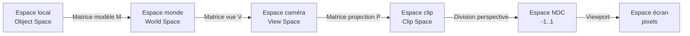

| Espace | Repère | Usage |
| --- | --- | --- |
| **Local / Objet** | repère de l'objet | sommets tels qu'exportés du logiciel 3D |
| **Monde** | repère global de la scène | position absolue de l'objet |
| **Vue / Caméra** | caméra à l'origine, regardant $-Z$ | éclairage, calculs liés à la caméra |
| **Clip** | espace de projection | culling avant projection |
| **NDC** | cube $[-1, 1]^3$ | espace normalisé après division par $w$ |
| **Écran** | pixels | affichage final |

La transformation complète d'un sommet $\mathbf{v}_{\text{local}}$ s'écrit comme un produit de matrices, appliqué dans l'ordre $\text{modèle} \to \text{vue} \to \text{projection}$ — c'est la fameuse matrice **MVP** :

```math
\mathbf{v}_{\text{clip}} = P \cdot V \cdot M \cdot \mathbf{v}_{\text{local}}
```

[🔝 Retour en haut de page](#table-des-matières)

---

## Graphiques informatiques

En informatique graphique, les graphiques informatiques constituent une partie non négligeable, souvent traduite par la notion d'**image numérique**.

### Graphiques vectoriels et bitmap

Bien que les images puissent être représentées de différentes manières (matricielles, HDR — *High Dynamic Range*, panoramiques, etc.), les deux méthodes les plus courantes dans le domaine des jeux vidéo sont les **graphiques vectoriels** et les **graphiques bitmap**.

#### Graphiques vectoriels

Contrairement aux images bitmap, qui sont composées de pixels individuels, les images vectorielles sont constituées de **courbes**, de **lignes** et de **formes géométriques**.

Ce sont donc des images créées à partir de **formules mathématiques** décrivant les différentes formes et couleurs de l'image.

Lorsque l'image est agrandie ou réduite, ces formes sont simplement recalculées en fonction de la nouvelle taille de l'image, garantissant ainsi que l'image conserve une qualité élevée — à l'instar des bitmaps qui étirent les pixels affichés et les « dégradent ».

##### Fonctionnement (vectoriel)

Les images vectorielles sont constituées de formes géométriques décrites mathématiquement par des équations.

Chaque forme est représentée par un ensemble de **points**, de **lignes** et de **courbes** qui sont reliés les uns aux autres pour créer la forme souhaitée.

Les formes géométriques peuvent être de différentes sortes : des lignes droites, des **courbes de Bézier**, des cercles, des ellipses, des polygones, etc.

##### Exemple

Prenons un cercle de rayon $r$ centré en $(x_c, y_c)$ sur un plan cartésien. Sa représentation mathématique est donnée par l'équation suivante :

```math
(x - x_c)^2 + (y - y_c)^2 = r^2
```

Pour représenter ce cercle dans une image vectorielle, on utilise une équation paramétrique qui décrit chaque point $(x, y)$ de la forme comme une fonction de son angle $\theta$ :

```math
x = x_c + r \cos \theta, \quad y = y_c + r \sin \theta
```

On peut ensuite relier ces points par des segments de ligne pour créer le cercle dans l'image vectorielle.

Ainsi, pour un cercle de rayon $3$ centré en $(2, 2)$, l'équation mathématique est $(x - 2)^2 + (y - 2)^2 = 9$ et son équation paramétrique :

```math
x = 2 + 3 \cos \theta
```

```math
y = 2 + 3 \sin \theta
```

> $\cos$ et $\sin$ de $\theta$ sont utilisés ici, dans le cas du cercle, pour obtenir les valeurs $x$ et $y$ correspondant à chaque angle $\theta$ donné.

où $\theta$ est l'angle par rapport à l'origine du cercle.

En prenant des valeurs différentes de $\theta$ (par exemple $\theta = 0, \pi/4, \pi/2, 3\pi/4, \pi, \ldots$), on calcule les coordonnées correspondantes $(x, y)$ et on relie ces points par des segments de ligne pour créer le cercle dans l'image vectorielle.

#### Bitmap

Les **graphiques bitmap**, également appelés images matricielles, sont créés en utilisant une grille de pixels de différentes couleurs.

##### Fonctionnement (bitmap)

Les images bitmap sont stockées sous forme de **matrice de pixels**, où chaque pixel est représenté par une valeur de couleur. Pour comprendre comment cela fonctionne, considérons un exemple simple : une image bitmap en noir et blanc de taille 4×4.

Nous pouvons stocker cette image sous forme de matrice de pixels 4×4 où chaque pixel est représenté par un nombre binaire indiquant s'il est blanc ($0$) ou noir ($1$) :

```math
\begin{pmatrix} 0 & 1 & 0 & 1 \\ 1 & 0 & 1 & 0 \\ 0 & 1 & 0 & 1 \\ 1 & 0 & 1 & 0 \end{pmatrix}
```

Plus la résolution de l'image est élevée, plus la taille de la matrice de pixels est grande et plus l'image est détaillée.

Pour stocker des images en couleur, nous pouvons utiliser une matrice de pixels **tridimensionnelle** où chaque pixel est représenté par une valeur de couleur RVB (rouge, vert, bleu) ou CMJN (cyan, magenta, jaune, noir).

La valeur de chaque canal de couleur est généralement stockée dans un octet (8 bits), ce qui signifie qu'il y a 256 niveaux de chaque couleur (de 0 à 255).

### Résolution et profondeur de couleur

La résolution et la profondeur de couleur sont deux concepts étroitement liés qui déterminent la **qualité visuelle** et la **taille des données** d'une image numérique.

#### Résolution

La résolution d'une image est définie par le nombre de pixels qu'elle contient horizontalement et verticalement, généralement noté $W \times H$ (par exemple, 800×600, signifiant 800 pixels de large pour 600 pixels de haut).

La résolution a des implications importantes sur la quantité de données requises pour stocker une image. Pour une image fixe avec une profondeur de couleur constante $b$, le nombre total de bits requis est donné par :

```math
N_\text{bits} = W \times H \times b
```

où $W$ est la largeur, $H$ la hauteur et $b$ la profondeur de couleur en bits.

La résolution a également un impact sur la **bande passante** requise pour transmettre des images en temps réel, comme c'est le cas dans les jeux vidéo : une résolution plus élevée nécessite plus de bande passante.

#### Profondeur de couleur

La profondeur de couleur, également appelée *bit depth*, représente le nombre de bits utilisés pour décrire la couleur d'un pixel, généralement noté $b$.

Une profondeur de couleur plus élevée permet de représenter un plus grand nombre de couleurs $C = 2^b$, rendant les transitions entre les couleurs plus douces et permettant des images plus réalistes.

Supposons que nous utilisions un espace de couleur RVB. La profondeur de couleur est divisée également entre les composantes rouge, verte et bleue, chacune ayant $b_\text{RGB} = b/3$ bits. Alors, le nombre de valeurs possibles pour chaque composante est $2^{b_\text{RGB}}$. Par conséquent, le nombre total de couleurs différentes pouvant être représentées est :

```math
C = (2^{b_\text{RGB}})^3 = 2^b
```

### Espaces de couleur

Les images bitmap peuvent être stockées en utilisant différents espaces de couleur, qui déterminent la manière dont les informations de couleur sont représentées. Les espaces de couleur les plus courants sont :

- **RVB** (Rouge, Vert, Bleu) : chaque pixel est représenté par trois valeurs de couleur pour les composantes rouge, verte et bleue. C'est le format le plus couramment utilisé dans les jeux vidéo et les applications graphiques. La représentation mathématique d'une couleur est donnée par un triplet $(R, G, B)$.
- **RVBA** : RVB avec un canal alpha supplémentaire pour représenter la transparence.
- **CMJN** (Cyan, Magenta, Jaune, Noir) : utilisé surtout en impression.
- **HSL / HSV** (Teinte, Saturation, Luminosité / Valeur) : pratique pour la manipulation artistique des couleurs.
- **YUV / YCbCr** : utilisé en compression vidéo (JPEG, MPEG).

### Formats de fichier d'image

Les formats de fichier d'image déterminent la manière dont les données d'image sont organisées et stockées. Plusieurs formats sont couramment utilisés dans les jeux vidéo et les applications graphiques :

- **BMP** (Bitmap) : format non compressé développé par Microsoft. Il stocke les données pixel par pixel, sans compression, ce qui peut entraîner des fichiers volumineux.
- **JPEG** (*Joint Photographic Experts Group*) : format compressé avec **perte** qui utilise la compression DCT (*Discrete Cosine Transform*) pour réduire la taille des fichiers. Bien adapté aux images photographiques avec de nombreux détails et variations de couleur.
- **PNG** (*Portable Network Graphics*) : format compressé **sans perte** qui utilise la compression DEFLATE. Bien adapté aux images avec des zones de couleur uniforme et des bords nets, comme des graphiques ou des logos.
- **GIF** (*Graphics Interchange Format*) : format compressé sans perte développé par CompuServe. Limité à une palette de 256 couleurs, principalement utilisé pour les images animées simples et les graphiques avec des zones de couleur uniforme.
- **TGA** (Targa) : format développé par Truevision qui prend en charge les images en couleur 8, 16, 24 et 32 bits. Souvent utilisé dans les jeux vidéo et les applications de rendu 3D pour stocker des **textures**.

#### Schéma comparatif

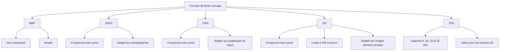

[🔝 Retour en haut de page](#table-des-matières)

---

## Éclairage et ombres

Les techniques d'éclairage et de gestion des ombres sont basées sur des concepts mathématiques et physiques qui permettent de **simuler la manière dont la lumière interagit** avec les objets et l'environnement.

### Sources de lumière

Les sources de lumière sont des entités qui émettent de la lumière dans une scène. Les principales sources utilisées dans les jeux vidéo et les graphiques 3D sont :

1. **Lumière directionnelle** : représente une source située à une distance infinie, comme le soleil. Tous les rayons lumineux sont parallèles et ont la même intensité. Souvent utilisée pour simuler la lumière du jour.
2. **Lumière ponctuelle** : émet de la lumière dans toutes les directions à partir d'un point dans l'espace. L'intensité diminue avec la distance à la source, généralement proportionnelle à l'**inverse du carré de la distance**.
3. **Lumière spot** : émet de la lumière dans une direction conique à partir d'un point dans l'espace. Souvent utilisée pour simuler les projecteurs ou les lampes torches.

### Modèles d'éclairage

Les modèles d'éclairage décrivent comment la lumière interagit avec les objets et les surfaces. Voici quelques-uns des modèles les plus couramment utilisés :

1. **Modèle d'éclairage de Phong** : basé sur trois composantes — l'éclairage **ambiant**, l'éclairage **diffus** et l'éclairage **spéculaire**. L'éclairage ambiant est une constante qui simule la lumière indirecte réfléchie par l'environnement. L'éclairage diffus est proportionnel à l'angle entre la normale de la surface et la direction de la lumière. L'éclairage spéculaire dépend de l'angle entre la direction de la lumière réfléchie et la direction de la caméra.
2. **Modèle d'éclairage de Lambert** : simplification du modèle de Phong, qui ne prend en compte que l'éclairage ambiant et l'éclairage diffus. Moins réaliste mais plus rapide à calculer — un choix approprié pour les jeux vidéo sur des systèmes à faible puissance de calcul.
3. **Modèle d'éclairage de Blinn-Phong** : amélioration du modèle de Phong qui utilise une approximation de la direction de la lumière réfléchie pour calculer l'éclairage spéculaire. Plus réaliste que le modèle de Phong et souvent utilisé dans les jeux vidéo modernes.

### Ombres

Les **ombres** sont des zones où la lumière est bloquée par un objet. Elles ajoutent de la profondeur et du réalisme à une scène. Voici quelques techniques couramment utilisées :

1. **Ombres portées** (*Shadow mapping*) : on crée une carte des profondeurs (*depth map*) à partir de la perspective de la source de lumière. Cette carte stocke la distance entre la source de lumière et le point le plus proche qui la bloque. Lors du rendu, on compare la distance entre la source de lumière et le point courant avec la distance stockée dans la carte. Si la distance courante est supérieure, le point est dans l'ombre.
2. **Ombres volumétriques** (*Volumetric shadows*) : simulent les ombres en calculant l'atténuation de la lumière lorsqu'elle traverse des objets semi-transparents, comme la fumée ou la brume. Donnent un aspect réaliste aux scènes où la lumière interagit avec des particules en suspension dans l'air.
3. **Ombres douces** (*Soft shadows*) : ombres qui présentent un flou progressif en s'éloignant de l'objet qui les projette. On simule plusieurs sources de lumière proches les unes des autres, ou on utilise des techniques de filtrage pour adoucir les bords des ombres portées.
4. **Ray tracing** : technique de rendu avancée qui simule le comportement de la lumière en traçant des rayons depuis la caméra jusqu'à la source de lumière, en prenant en compte les **réflexions** et les **réfractions**. Permet de générer des ombres, des reflets et des effets de lumière globale très réalistes — mais coûteux en temps de calcul. De plus en plus utilisé dans les jeux vidéo grâce à l'évolution des cartes graphiques et des algorithmes de rendu.

[🔝 Retour en haut de page](#table-des-matières)

---

## Texture et mappage UV

### Texture et coordonnées de texture

Les **textures** sont des images 2D appliquées sur des objets 3D pour donner l'illusion de détails tels que les couleurs, les motifs ou les reliefs.

Elles peuvent être utilisées pour représenter la **couleur** de base d'un objet, sa **brillance**, sa **rugosité**, sa **transparence**, etc.

Les **coordonnées de texture**, également appelées **coordonnées UV**, déterminent la manière dont une texture est mappée sur un objet 3D.

Pour appliquer une texture à un objet 3D, on attribue à chaque sommet de l'objet un ensemble de coordonnées UV, qui correspondent aux coordonnées $(u, v)$ dans l'image de texture. Les coordonnées UV varient généralement de $0$ à $1$, où $(0, 0)$ correspond au coin inférieur gauche de l'image de texture et $(1, 1)$ au coin supérieur droit.

### Mappage UV

Le **mappage UV** est le processus qui consiste à déterminer les coordonnées UV pour chaque sommet d'un objet 3D. Ce processus est souvent réalisé manuellement par des artistes 3D à l'aide de logiciels spécialisés, mais il existe également des algorithmes de mappage UV automatiques.

Il existe plusieurs techniques de mappage UV :

1. **Mappage planaire** : projette la texture sur l'objet 3D à partir d'un plan. Fonctionne bien pour les objets ayant une forme relativement plane, mais peut provoquer des distorsions et des étirements sur les objets plus complexes.
2. **Mappage cylindrique** : enroule la texture autour de l'objet 3D comme si elle était imprimée sur un cylindre. Fonctionne bien pour les objets cylindriques.
3. **Mappage sphérique** : projette la texture sur l'objet 3D à partir d'une sphère. Fonctionne bien pour les objets sphériques, mais peut provoquer des distorsions aux pôles.
4. **Mappage par morceaux** (*UV unwrapping*) : on découpe l'objet 3D en morceaux, puis on les déplie en 2D pour créer une représentation plane de l'objet. Cette technique permet de minimiser les distorsions, mais nécessite généralement un travail manuel minutieux pour obtenir de bons résultats.

[🔝 Retour en haut de page](#table-des-matières)

---

## Animation

L'animation en infographie consiste à créer l'illusion de **mouvement** ou de **changement** d'un objet ou d'une scène 3D au fil du temps.

Les techniques les plus courantes sont l'**animation par squelette**, l'**animation de forme** et la **cinématique inverse**.

### Animation par squelette

L'**animation par squelette** (*Rigging*), également appelée animation par armature, consiste à définir une structure osseuse (ou armature) pour un objet 3D et à manipuler cette structure pour créer des mouvements.

Chaque os de l'armature est associé à une partie de l'objet 3D et déforme cette partie lorsqu'il est déplacé ou orienté. L'animation par squelette est largement utilisée pour animer des **personnages** et des **créatures** dans les jeux vidéo et les films d'animation.

Une armature est un ensemble de **nœuds** (ou articulations) reliés par des **os**. Les nœuds ont des positions 3D et des orientations, généralement représentées par des matrices de transformation 4×4. Pour déterminer la position et l'orientation d'un nœud, on utilise la relation suivante :

```math
T_\text{parent} \times T_\text{local} = T_\text{global}
```

où $T_\text{parent}$ est la matrice de transformation globale du nœud parent, $T_\text{local}$ est la matrice de transformation locale du nœud actuel, et $T_\text{global}$ est la matrice de transformation globale du nœud actuel.

L'animation d'une armature consiste à modifier les matrices de transformation locale des nœuds au fil du temps, créant ainsi des mouvements.

### Animation de forme

L'**animation de forme**, également appelée *morphing* ou interpolation de formes, consiste à interpoler entre différentes formes d'un objet 3D pour créer des animations. Cette technique est souvent utilisée pour animer des objets dont la géométrie change de manière complexe, comme les **visages** ou les **vêtements**.

L'animation de forme implique généralement l'**interpolation linéaire** entre les positions des sommets des différentes formes. Pour interpoler entre deux formes $A$ et $B$ à un facteur d'interpolation $t$, où $0 \leq t \leq 1$, on utilise la formule suivante :

```math
P_\text{interpolated} = (1 - t) \times P_A + t \times P_B
```

où $P_\text{interpolated}$ est la position interpolée du sommet, et $P_A$ et $P_B$ sont les positions du sommet dans les formes $A$ et $B$, respectivement.

### Cinématique inverse

La **cinématique inverse** (*Inverse Kinematics*, IK) est une technique d'animation utilisée pour calculer les angles des articulations d'une armature en fonction de la **position désirée** d'un effecteur (généralement la main ou le pied d'un personnage).

Cette technique est particulièrement utile pour les animations interactives — par exemple, lorsqu'un personnage saisit un objet ou marche sur un terrain irrégulier.

La cinématique inverse implique généralement la résolution d'un **système d'équations non linéaires** décrivant les positions et les orientations des nœuds de l'armature. Les algorithmes les plus connus sont **CCD** (*Cyclic Coordinate Descent*) et **FABRIK** (*Forward And Backward Reaching Inverse Kinematics*).

[🔝 Retour en haut de page](#table-des-matières)

---

## Physique des jeux

La **physique des jeux** est un élément clé pour créer des environnements interactifs et réalistes dans les jeux vidéo. Elle comprend la **simulation de mouvements**, de **forces** et de **collisions** entre objets dans un monde virtuel.

Les principales composantes de la physique des jeux incluent la simulation physique, la détection de collision et la résolution de collision.

### Simulation physique

La simulation physique implique le calcul des **mouvements** et des **forces** qui agissent sur les objets dans un monde virtuel. Les mouvements sont généralement basés sur les lois fondamentales de la mécanique classique, comme la **deuxième loi de Newton** :

```math
F = m \times a
```

où $F$ est la force, $m$ est la masse de l'objet et $a$ est son accélération.

Les forces peuvent inclure la **gravité**, les **forces de contact**, les **forces de frottement** et d'autres forces externes. L'accélération d'un objet est calculée en fonction de la somme des forces qui agissent sur lui :

```math
a = \frac{\sum F}{m}
```

Ensuite, la position et la vitesse de l'objet sont mises à jour en fonction de son accélération (intégration d'**Euler explicite**, la plus simple) :

```math
v_{t+1} = v_t + a \times \Delta t
```

```math
p_{t+1} = p_t + v_{t+1} \times \Delta t
```

où $v_t$ et $p_t$ sont la vitesse et la position de l'objet à l'instant $t$, et $\Delta t$ est le pas de temps de la simulation.

> 💡 Pour une simulation plus stable, on préfère souvent l'**intégration de Verlet** ou des intégrateurs **semi-implicites** (*semi-implicit Euler*), qui se comportent mieux sur de longues simulations.

### Détection de collision

La **détection de collision** est le processus par lequel on détermine si deux objets se touchent ou se croisent. Il existe de nombreuses techniques pour détecter les collisions :

- les tests de **boîtes englobantes** (AABB — *Axis-Aligned Bounding Box*) ;
- les tests de **sphères englobantes** ;
- les tests de **séparation d'axes** (SAT — *Separating Axis Theorem*) ;
- l'algorithme **GJK** (*Gilbert-Johnson-Keerthi*) pour les formes convexes.

Chaque technique a ses avantages et ses inconvénients en termes de **précision** et de **performances**.

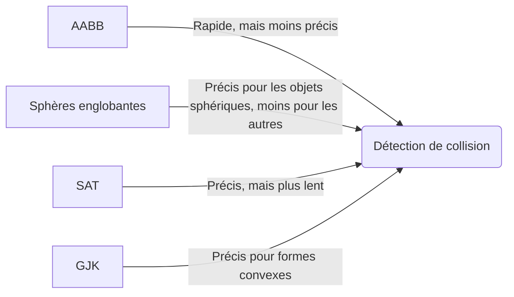

### Résolution de collision

La **résolution de collision** est le processus par lequel on modifie les positions, les vitesses et les forces des objets en collision pour éviter qu'ils ne se chevauchent ou ne traversent les autres objets.

La résolution de collision peut être basée sur des principes de mécanique classique, comme la conservation de l'**énergie cinétique** et de la **quantité de mouvement**, ou sur des techniques heuristiques pour simplifier les calculs et améliorer les performances.

La résolution de collision implique généralement l'application d'une **force d'impulsion** aux objets en collision pour les séparer :

```math
J = \frac{-(1 + e) \times (v_{A_t} - v_{B_t}) \cdot n}{\dfrac{1}{m_A} + \dfrac{1}{m_B}}
```

où $J$ est l'impulsion, $e$ est le coefficient de **restitution** (élasticité, $0$ = parfaitement inélastique, $1$ = parfaitement élastique), $v_{A_t}$ et $v_{B_t}$ sont les vitesses des objets $A$ et $B$ avant la collision, $m_A$ et $m_B$ sont les masses des objets, et $n$ est le vecteur normal à la surface de contact.

Ensuite, les vitesses des objets après la collision sont mises à jour en fonction de l'impulsion appliquée :

```math
v_{A_{t+1}} = v_{A_t} + \frac{J}{m_A} \times n
```

```math
v_{B_{t+1}} = v_{B_t} - \frac{J}{m_B} \times n
```

La position des objets peut également être corrigée pour éviter les chevauchements en déplaçant les objets en fonction de la profondeur de pénétration $P$ et d'un facteur de correction :

```math
p_{A_{t+1}} = p_{A_t} - \frac{1}{m_A} \times \frac{m_A + m_B}{m_A \times m_B} \times P \times n
```

```math
p_{B_{t+1}} = p_{B_t} + \frac{1}{m_B} \times \frac{m_A + m_B}{m_A \times m_B} \times P \times n
```

où $P$ est la profondeur de pénétration et $n$ est le vecteur normal à la surface de contact.

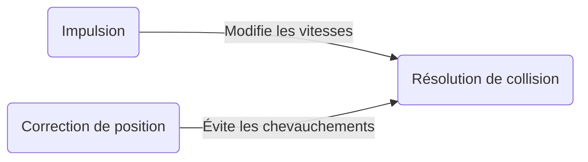

[🔝 Retour en haut de page](#table-des-matières)

---

## Intelligence artificielle

Les jeux vidéo utilisent souvent l'**intelligence artificielle** (IA) pour contrôler les **personnages non joueurs** (PNJ).

### Comportement de base

Les comportements de base des PNJ peuvent être modélisés à l'aide de **machines à états finis** (FSM) ou d'**arbres de comportement** (*Behavior Trees*).

- Les **FSM** représentent l'état actuel d'un PNJ et les transitions entre les différents états en fonction des conditions du jeu (par exemple : *patrouille → poursuite → attaque*).
- Les **arbres de comportement** sont des structures hiérarchiques qui déterminent le comportement d'un PNJ en fonction de l'évaluation des conditions à chaque niveau de l'arbre. Ils sont plus modulaires et réutilisables que les FSM.

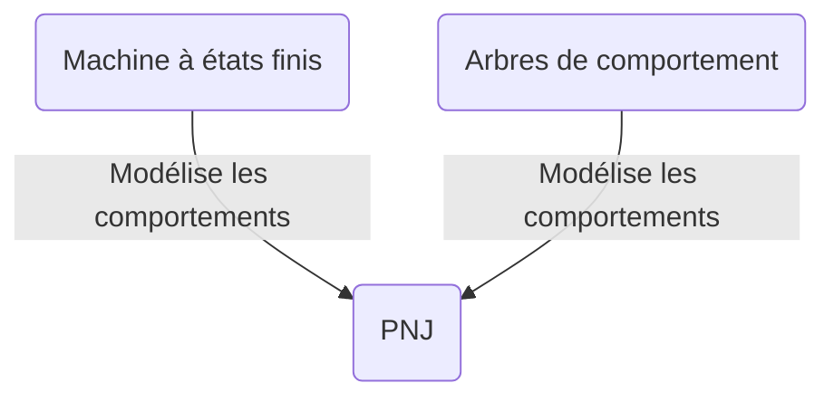

### Navigation

La **navigation** des PNJ dans un environnement de jeu nécessite la planification de chemins pour éviter les obstacles et atteindre les objectifs. Les algorithmes de planification de chemins tels que l'algorithme **A\*** sont couramment utilisés pour déterminer le chemin optimal entre deux points, en tenant compte des contraintes de l'environnement.

L'algorithme A\* utilise une fonction d'évaluation :

```math
f(n) = g(n) + h(n)
```

pour estimer le coût total du chemin passant par le nœud $n$, où :

- $g(n)$ représente le coût réel pour atteindre le nœud $n$ depuis le nœud de départ ;
- $h(n)$ est une **heuristique** qui estime le coût restant pour atteindre le nœud d'arrivée depuis le nœud $n$.

L'algorithme A\* explore les nœuds ayant le coût total le plus faible en premier, garantissant la découverte du chemin optimal (à condition que l'heuristique soit **admissible**, c'est-à-dire qu'elle ne surestime jamais le coût réel).

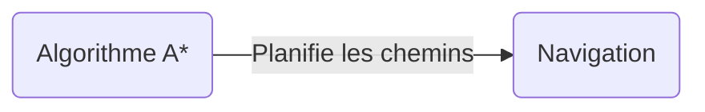

### Apprentissage automatique

L'**apprentissage automatique** peut également être utilisé pour améliorer l'IA des jeux vidéo. Les **réseaux de neurones artificiels** (ANN) sont une méthode populaire pour modéliser les comportements complexes des PNJ et des systèmes de jeu.

Les ANN sont composés de **nœuds** (neurones) organisés en **couches**, et sont capables d'apprendre des modèles à partir de données d'entrée en ajustant les poids des connexions entre les neurones.

Les algorithmes d'**apprentissage par renforcement**, tels que **Q-learning** et **Deep Q-Network (DQN)**, sont particulièrement adaptés aux jeux vidéo, car ils permettent aux agents d'apprendre des **politiques optimales** en interagissant avec l'environnement de jeu.

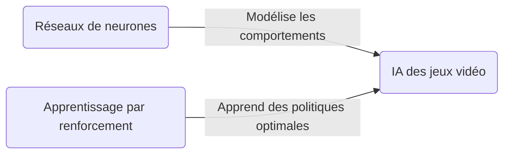

[🔝 Retour en haut de page](#table-des-matières)

---

## Réseau et multijoueur

Le **réseau** et le **multijoueur** introduisent une dimension supplémentaire dans les jeux vidéo : la **synchronisation** d'un état partagé entre plusieurs machines, malgré la latence et la perte de paquets. Cette section présente les modèles d'architecture, les protocoles utilisés et les principaux défis de la programmation multijoueur.

### Modèles de réseau

Les jeux multijoueurs en réseau reposent sur différentes architectures pour synchroniser les données entre les joueurs. Les deux modèles principaux sont le modèle **client-serveur** et le modèle **peer-to-peer** (P2P).

- **Client-serveur** : un serveur central gère l'état du jeu et communique avec les clients (les joueurs). Les clients envoient des informations sur leurs actions au serveur, qui met à jour l'état du jeu et envoie des mises à jour aux clients. Le serveur est responsable de la synchronisation des données et de la gestion des conflits entre les clients. C'est le modèle dominant pour les jeux compétitifs (il facilite l'**autorité serveur** et la lutte anti-triche).

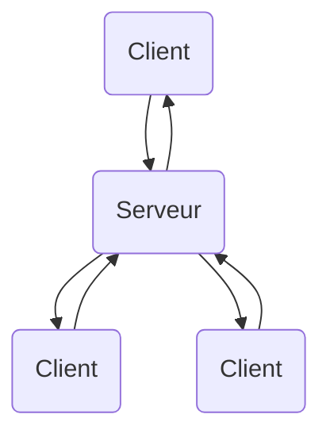

- **Peer-to-peer** : les joueurs se connectent directement les uns aux autres sans passer par un serveur central. Chaque joueur est responsable de la synchronisation de son propre état de jeu avec les autres joueurs. Ce modèle peut être plus efficace en termes de bande passante et de latence, mais il peut également être plus complexe à mettre en œuvre, en particulier pour les jeux avec un grand nombre de joueurs.

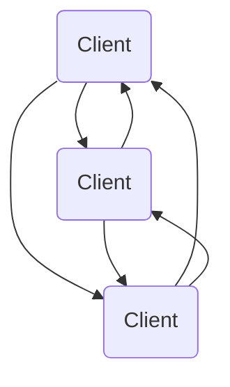

### Protocoles de communication

Les jeux en réseau utilisent différents protocoles de communication pour échanger des données entre les joueurs. Les deux protocoles les plus courants sont :

- **UDP** (*User Datagram Protocol*) : protocole de communication **sans connexion** et **sans garantie** de livraison. Généralement utilisé dans les jeux en temps réel en raison de sa faible **latence**. Cependant, les paquets de données peuvent être perdus ou arriver dans le désordre, ce qui nécessite une gestion supplémentaire (numéros de séquence, retransmissions sélectives) de la part du programme de jeu.
- **TCP** (*Transmission Control Protocol*) : protocole de communication **orienté connexion** avec **garantie** de livraison. Il garantit que les paquets de données sont livrés dans l'ordre et sans erreurs. Généralement utilisé pour les communications non critiques pour le temps, telles que le chat en jeu, la mise à jour des classements ou le téléchargement d'assets.

> 💡 De plus en plus de jeux modernes utilisent **WebRTC** ou **QUIC** (basé sur UDP), qui combinent fiabilité, faible latence et chiffrement.

#### Synchronisation et latence

Pour qu'un jeu multijoueur reste fluide malgré le réseau, plusieurs techniques sont utilisées :

- **Client-side prediction** : le client simule immédiatement les actions du joueur sans attendre la réponse du serveur, puis corrige si le serveur est en désaccord.
- **Server reconciliation** : le client conserve un historique de ses entrées et rejoue les inputs après une correction du serveur.
- **Lag compensation** : le serveur tient compte de la latence de chaque joueur pour valider les actions (par exemple, un tir « dans le passé » dans un FPS).
- **Interpolation / extrapolation** : on interpole entre les états reçus du serveur (interpolation) ou on extrapole pour combler les paquets manquants (extrapolation).

Mathématiquement, l'interpolation linéaire d'un état entre deux instants $t_0$ et $t_1$ s'exprime :

```math
S(t) = (1 - \alpha) \cdot S_0 + \alpha \cdot S_1, \quad \alpha = \frac{t - t_0}{t_1 - t_0}
```

### Programmation de jeu multijoueur

La programmation de jeu multijoueur implique la gestion de la **synchronisation** des données entre les joueurs, la **détection** et la **résolution des conflits**, et la **gestion des erreurs** de réseau. Les développeurs de jeux doivent également prendre en compte des problèmes tels que la **latence**, la **bande passante** et la **sécurité**.

Pour gérer ces problèmes, les développeurs peuvent utiliser des bibliothèques de réseau spécifiques au jeu (comme **ENet**, **yojimbo** ou **GameNetworkingSockets**) ou des moteurs de jeu intégrant des fonctionnalités réseau (Unity Netcode, Unreal Replication, Godot High-Level Multiplayer, Photon, Mirror, etc.).

Les développeurs doivent également implémenter des mécanismes pour gérer les **déconnexions** de joueurs, les **tricheurs** et les **attaques par déni de service**.

[🔝 Retour en haut de page](#table-des-matières)

---

## Techniques avancées

Cette section regroupe quelques **techniques avancées** que l'on retrouve dans les jeux modernes. Elles s'appuient sur tout ce qui a été vu précédemment — vecteurs, matrices, équations différentielles, IA — mais en poussent les limites pour atteindre un niveau de réalisme ou de complexité supérieur.

### Génération procédurale et bruit

La **génération procédurale** consiste à produire du contenu (terrain, textures, niveaux, biomes…) à partir d'algorithmes plutôt que manuellement. Elle s'appuie largement sur des **fonctions de bruit** déterministes, c'est-à-dire des fonctions qui retournent toujours la même valeur pour une même entrée mais qui semblent aléatoires.

#### Bruit blanc

Le bruit le plus simple : à chaque coordonnée entière, on associe une valeur pseudo-aléatoire indépendante :

```math
N_\text{blanc}(x, y) = \mathrm{hash}(x, y) \in [0, 1]
```

Le bruit blanc est trop discontinu pour modéliser un terrain — chaque pixel est indépendant.

#### Bruit de Perlin

Le **bruit de Perlin** (Ken Perlin, 1983 — Oscar 1997 pour son apport) génère une fonction **continue et lisse** qui semble naturelle. Pour un point $(x, y)$ :

1. Trouver la cellule entière qui contient $(x, y)$ ;
2. Pour chaque coin de la cellule, calculer un **gradient pseudo-aléatoire** ;
3. Calculer le produit scalaire entre le gradient et le vecteur du coin vers $(x, y)$ ;
4. **Interpoler** ces produits scalaires avec une fonction d'easing (typiquement `smootherstep`).

```math
\mathrm{smootherstep}(t) = 6t^5 - 15t^4 + 10t^3
```

Le bruit de Simplex (Perlin, 2001) est une amélioration : moins coûteux en haute dimension, moins d'artefacts directionnels.

#### Bruit fractal (FBM — *Fractional Brownian Motion*)

En sommant plusieurs octaves d'un bruit, chaque octave ayant une fréquence deux fois plus élevée et une amplitude deux fois plus faible que la précédente, on obtient un terrain réaliste :

```math
\mathrm{FBM}(x, y) = \sum_{i=0}^{N-1} \frac{1}{2^i} \cdot \mathrm{noise}\!\big(2^i \cdot x,\ 2^i \cdot y\big)
```

#### Applications

- **Heightmap de terrain** : Minecraft, *No Man's Sky*, *Terraria* utilisent du bruit fractal.
- **Textures procédurales** : marbre, bois, nuages, eau.
- **Distribution d'objets** : placement d'arbres, de rochers.
- **Donjons et niveaux** : algorithmes BSP, Wave Function Collapse, marche aléatoire.

```csharp
float Terrain(float x, float z)
{
    float h = 0f;
    float amplitude = 1f, frequency = 0.01f;
    for (int i = 0; i < 5; i++)
    {
        h += amplitude * Mathf.PerlinNoise(x * frequency, z * frequency);
        amplitude *= 0.5f;
        frequency *= 2f;
    }
    return h;
}
```

### Physique des fluides

La **simulation de fluides** dans les jeux vidéo est une technique avancée qui permet de reproduire le comportement des **liquides** et des **gaz**. Les fluides sont généralement simulés à l'aide d'équations aux dérivées partielles, telles que les **équations de Navier-Stokes** :

```math
\rho \left( \frac{\partial \mathbf{v}}{\partial t} + \mathbf{v} \cdot \nabla \mathbf{v} \right) = -\nabla p + \mu \nabla^2 \mathbf{v} + \mathbf{f}
```

où $\rho$ est la densité du fluide, $\mathbf{v}$ son champ de vitesse, $p$ la pression, $\mu$ la viscosité dynamique et $\mathbf{f}$ les forces externes.

Les méthodes de résolution numérique, telles que la **méthode des différences finies**, la **méthode des éléments finis** ou les méthodes **SPH** (*Smoothed Particle Hydrodynamics*), sont utilisées pour résoudre ces équations et générer des animations réalistes de fluides.

### Écrans multiples et fenêtrage

Les jeux modernes offrent souvent la possibilité de jouer sur **plusieurs écrans** ou dans des **fenêtres redimensionnables**. Cette fonctionnalité nécessite une gestion avancée du rendu et de la résolution d'affichage, ainsi que la prise en charge de plusieurs moniteurs et configurations de fenêtres.

Les développeurs de jeux doivent tenir compte :

- de la **synchronisation** entre les écrans (taux de rafraîchissement potentiellement différents) ;
- des **performances graphiques** (un setup multi-écrans multiplie le nombre de pixels à rendre) ;
- des **ratios** d'affichage (16:9, 21:9 ultrawide, 32:9 super ultrawide) qui imposent un FOV adapté pour éviter la déformation.

### Intelligence artificielle avancée

L'**intelligence artificielle avancée** dans les jeux vidéo englobe des techniques telles que l'**apprentissage automatique**, la **planification**, la **prise de décision** et le **traitement du langage naturel**. Ces techniques permettent de créer des PNJ plus réalistes et convaincants, ainsi que des systèmes de jeu **dynamiques** et **adaptatifs**.

Les développeurs de jeux peuvent utiliser des bibliothèques et des frameworks d'IA spécifiques pour implémenter ces fonctionnalités, comme **TensorFlow**, **PyTorch**, **ONNX Runtime** ou les API d'**OpenAI**. Ces outils permettent d'entraîner des modèles d'apprentissage profond pour la reconnaissance d'image, la génération de texte, la synthèse vocale et d'autres tâches complexes.

> 💡 De plus en plus de jeux intègrent des **modèles génératifs** (LLM, diffusion) pour produire dialogues, missions ou textures à la volée.

### Rendu avancé

Le **rendu avancé** dans les jeux vidéo englobe un large éventail de techniques pour améliorer la **qualité visuelle** et la **performance** du rendu. Parmi ces techniques :

- **Rendu basé sur la physique (PBR)** : approche de rendu qui simule la façon dont la lumière interagit avec les matériaux de manière réaliste. Elle utilise des modèles d'éclairage et de réflexion basés sur des mesures physiques pour générer des images plus fidèles à la réalité. Les paramètres clés sont l'**albedo**, la **métallicité**, la **rugosité** et la **normale**.
- **Occlusion ambiante** (*Ambient Occlusion*) : simule l'obscurcissement de la lumière ambiante dans les coins et les recoins d'une scène. Cette technique ajoute de la profondeur et du réalisme aux scènes en renforçant les détails géométriques et les ombres. Variantes : **SSAO**, **HBAO**, **GTAO**.
- **Tessellation** : subdivise les maillages en polygones plus petits pour améliorer la qualité des détails à proximité du spectateur. Cette technique peut être utilisée en combinaison avec le ***displacement mapping*** pour créer des surfaces extrêmement détaillées sans sacrifier les performances.
- **Ray tracing** : simule la trajectoire des rayons de lumière pour générer des images réalistes avec des **réflexions**, des **réfractions** et des **ombres** précises. Bien que cette technique soit très coûteuse en termes de performances, l'émergence de matériel spécialisé — comme les GPU compatibles avec le ray tracing en temps réel (RTX, RDNA 2/3, Apple Silicon) — a rendu cette technologie plus accessible.
- **Path tracing** : extension du ray tracing qui suit aussi les rebonds indirects de la lumière pour produire un éclairage global complet (utilisé dans *Cyberpunk 2077: Path Tracing*, *Quake II RTX*, etc.).
- **Global illumination** (illumination globale) : technique qui simule la façon dont la lumière se propage et rebondit dans une scène pour produire un éclairage indirect réaliste. Plusieurs méthodes : **lightmaps précalculées**, approches basées sur les **voxels** (*VXGI*), approches basées sur les **sondes de lumière** (*Light Probes*, *DDGI*) ou Lumen (Unreal Engine 5).
- **Upscaling temporel** : techniques comme **DLSS** (NVIDIA), **FSR** (AMD) ou **XeSS** (Intel) qui rendent l'image à une résolution interne réduite puis la reconstruisent en haute résolution à l'aide d'un réseau de neurones ou d'algorithmes temporels.

[🔝 Retour en haut de page](#table-des-matières)

---

## Pipeline de rendu

Le **pipeline de rendu** est un processus séquentiel qui convertit les objets 3D et les textures du jeu en images 2D affichées à l'écran. Il comprend plusieurs étapes — depuis la transformation des objets 3D dans le repère du monde jusqu'à l'affichage final.

### Étapes du pipeline

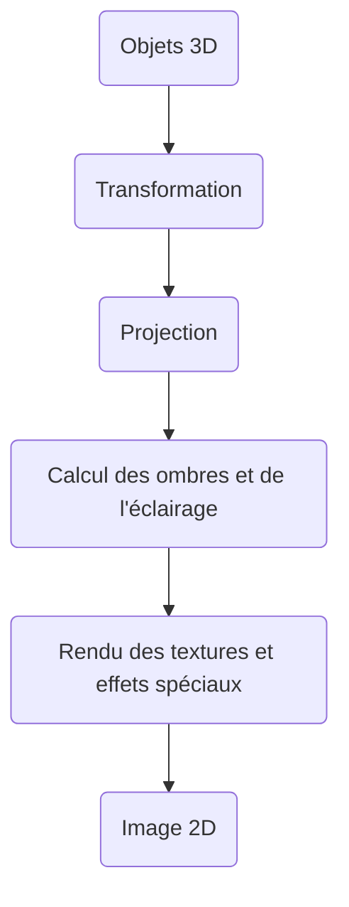

À un niveau plus détaillé, le pipeline d'un GPU moderne ressemble à :

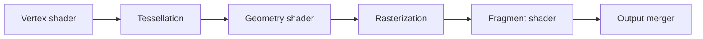

### Culling et occlusion

Le **culling** et l'**occlusion** sont des techniques utilisées pour optimiser le rendu graphique en éliminant les objets ou les parties d'objets qui ne sont pas visibles à l'écran.

- Le **culling** se concentre sur l'élimination des **objets entiers** qui sont en dehors du champ de vision de la caméra (*frustum culling*) ou orientés à l'opposé (*backface culling*).
- L'**occlusion** élimine les **parties d'objets** qui sont cachées derrière d'autres objets (*occlusion culling*, *Z-buffer*, *Hi-Z*).

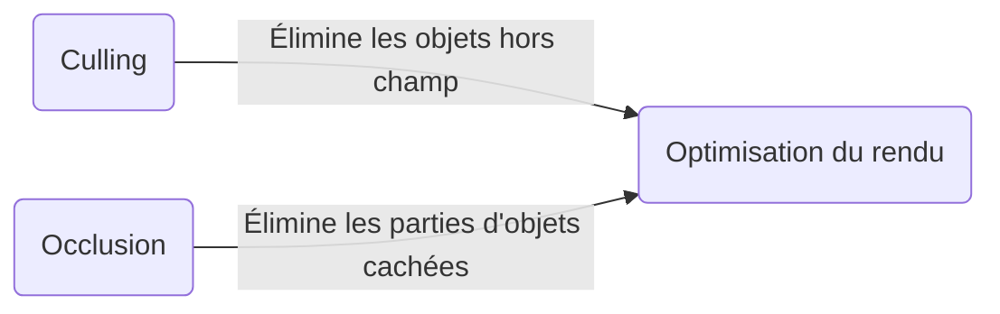

### Shaders

Les **shaders** sont des programmes qui sont exécutés sur les **unités de traitement graphique** (GPU) pour déterminer les caractéristiques visuelles des objets affichés à l'écran.

Généralement écrits dans des langages spécifiques au GPU, tels que **GLSL** (*OpenGL Shading Language*), **HLSL** (*High-Level Shading Language*) ou **WGSL** (*WebGPU Shading Language*), ils permettent de créer des effets spéciaux, tels que les **réflexions**, les **ombres** et les **animations de texture**.

> Exemple : un effet de brouillard, où le shader applique un effet de flou et de couleur uniforme sur les pixels les plus éloignés de la caméra.

En somme, le but d'un shader est de **personnaliser l'apparence visuelle** des objets à l'écran. Nous allons ici aborder les vertex shaders, geometry shaders et les fragment shaders.

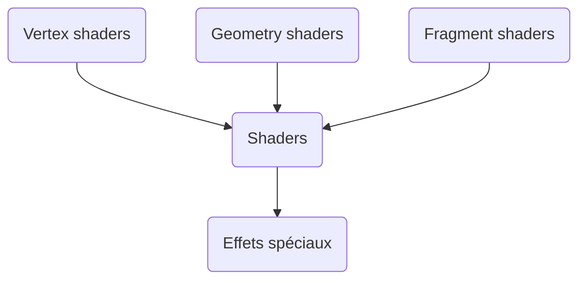

#### Vertex shaders

Les [vertex](https://github.com/tanguychenier/Terminal_3DEngine) shaders sont des programmes exécutés sur **chaque sommet** des objets lors de leur rendu. Ils sont utilisés pour transformer les positions des sommets, en appliquant des transformations linéaires sur les coordonnées des sommets.

> Les objets 3D sont généralement définis par un ensemble de **sommets**, qui sont reliés entre eux par des **arêtes** pour former des polygones, tels que des triangles ou des quadrilatères.
>
> Les vertex shaders sont appliqués à chaque sommet de ces polygones lors du rendu, pour déterminer la position finale de chaque sommet dans l'image affichée à l'écran.

##### Fonctionnement du vertex shader

Chaque sommet est représenté par un vecteur de position homogène $\mathbf{v}_h$, qui peut être transformé en un nouveau vecteur de position homogène $\mathbf{v}'_h$ par l'application d'une matrice de transformation homogène $M_{VS}$ représentant le vertex shader :

```math
\mathbf{v}'_h = M_{VS} \, \mathbf{v}_h
```

La matrice de transformation $M_{VS}$ peut être construite en combinant plusieurs types de transformations linéaires, telles que la translation, la rotation et la mise à l'échelle. Ces transformations peuvent être représentées par des matrices de transformation homogène 4×4.

Par exemple, pour effectuer une translation de vecteur $\mathbf{t} = (t_x, t_y, t_z)$, on peut construire la matrice de translation homogène $T$ :

```math
T = \begin{pmatrix} 1 & 0 & 0 & t_x \\ 0 & 1 & 0 & t_y \\ 0 & 0 & 1 & t_z \\ 0 & 0 & 0 & 1 \end{pmatrix}
```

On peut ensuite combiner plusieurs transformations en multipliant les matrices correspondantes. Par exemple, pour effectuer une translation suivie d'une rotation autour de l'axe des $y$ d'un angle $\theta$ :

```math
M_{VS} = R_y(\theta) \cdot T
```

où $R_y(\theta)$ est la matrice de rotation homogène autour de l'axe des $y$.

##### Pipeline de données

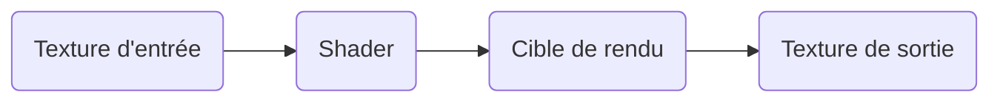

Bien que les détails de ces opérations dépendent du langage de programmation utilisé pour écrire les shaders (GLSL, HLSL, WGSL...), ils peuvent également effectuer d'autres opérations sur les sommets : application de textures, génération de coordonnées de texture, ou envoi de données supplémentaires aux shaders de géométrie et de fragment.

#### Geometry shaders

Étape de traitement intermédiaire entre les vertex shaders et les fragment shaders dans le pipeline de rendu graphique, les **shaders de géométrie** offrent la possibilité de **générer de nouveaux éléments graphiques**, tels que des points, des lignes ou des triangles, à partir des primitives d'entrée.

Cette étape est facultative et peut être utilisée pour réaliser des effets complexes : déplacement de sommets, génération de géométrie procédurale, création d'ombres volumétriques, etc.

> 💡 Un cas concret pourrait être par exemple la **modélisation procédurale** pour générer ou modifier la géométrie d'un personnage en temps réel — créer des détails supplémentaires ou modifier la forme du personnage selon certaines conditions du jeu.

##### Fonctionnement du geometry shader

Considérons un exemple simple pour illustrer le fonctionnement des geometry shaders. Soit une ligne définie par deux points $A$ et $B$. Nous souhaitons **extruder** cette ligne pour former un tube de rayon $r$. Le geometry shader va générer un ensemble de triangles formant le tube.

Soit $\vec{AB} = \vec{B} - \vec{A}$. Nous commençons par calculer un vecteur $\vec{u}$ orthogonal à $\vec{AB}$ :

```math
\vec{u} = \begin{cases}
(\vec{AB}_y, -\vec{AB}_x, 0) & \text{si } \vec{AB}_z = 0 \\
(-\vec{AB}_z, 0, \vec{AB}_x) & \text{sinon}
\end{cases}
```

Ensuite, nous calculons un vecteur $\vec{v}$ orthogonal à $\vec{AB}$ et $\vec{u}$ en utilisant le produit vectoriel :

```math
\vec{v} = \vec{AB} \times \vec{u}
```

Nous normalisons les vecteurs $\vec{u}$ et $\vec{v}$ :

```math
\hat{u} = \frac{\vec{u}}{\|\vec{u}\|}, \quad \hat{v} = \frac{\vec{v}}{\|\vec{v}\|}
```

Soit $N$ le nombre de segments pour approximer le cercle du tube. Nous générons $N$ points $C_i$ et $D_i$ autour de chaque extrémité $A$ et $B$ :

```math
C_i = \vec{A} + r \cos \frac{2 \pi i}{N} \hat{u} + r \sin \frac{2 \pi i}{N} \hat{v}, \quad i = 0, 1, \dots, N-1
```

```math
D_i = \vec{B} + r \cos \frac{2 \pi i}{N} \hat{u} + r \sin \frac{2 \pi i}{N} \hat{v}, \quad i = 0, 1, \dots, N-1
```

Maintenant que nous avons les points autour de chaque extrémité, nous générons les triangles formant le tube. Pour chaque paire de points consécutifs $C_i$, $C_{i+1}$, $D_i$ et $D_{i+1}$, nous formons deux triangles : $(C_i, D_i, C_{i+1})$ et $(C_{i+1}, D_i, D_{i+1})$. Nous devons également traiter le cas où $i = N-1$ pour fermer le tube en connectant les points $C_0$, $C_{N-1}$, $D_0$ et $D_{N-1}$.

##### Démonstration

Pour démontrer que l'extrusion décrite précédemment forme un tube autour de la ligne $AB$, nous devons montrer que chaque point $C_i$ et $D_i$ se trouve à une distance $r$ de la ligne et que les triangles générés décrivent un tube continu.

###### Étape 1 — La distance entre chaque point $C_i$ et la ligne $AB$

Soit $M_i$ le point de la ligne $AB$ le plus proche de $C_i$. Le vecteur $\vec{M_i C_i}$ est orthogonal à $\vec{AB}$, donc leur produit scalaire est nul :

```math
\vec{AB} \cdot \vec{M_i C_i} = 0
```

En utilisant la définition des points $C_i$ :

```math
\vec{AB} \cdot \left(\vec{A} + r \cos \frac{2 \pi i}{N} \hat{u} + r \sin \frac{2 \pi i}{N} \hat{v} - \vec{A}\right) = 0
```

```math
\vec{AB} \cdot \left(r \cos \frac{2 \pi i}{N} \hat{u} + r \sin \frac{2 \pi i}{N} \hat{v}\right) = 0
```

Comme $\hat{u}$ et $\hat{v}$ sont orthogonaux à $\vec{AB}$, cette équation est vérifiée. La distance entre $C_i$ et $AB$ est donc $r$.

###### Étape 2 — La continuité du tube

Nous avons généré les triangles en connectant chaque paire de points consécutifs $C_i$, $C_{i+1}$, $D_i$ et $D_{i+1}$. Comme les points sont générés en suivant un cercle autour de chaque extrémité, cela garantit que les triangles forment un tube continu autour de la ligne $AB$. Le cas où $i = N-1$ permet de fermer le tube en connectant les points initiaux et finaux.

En conclusion, l'extrusion décrite forme un tube de rayon $r$ autour de la ligne $AB$, et les triangles générés décrivent un tube continu. ∎

#### Fragment shaders

Les **fragment shaders** permettent de déterminer la **couleur finale** de chaque pixel à afficher à l'écran, en prenant en compte les propriétés des matériaux, l'éclairage, les textures et d'autres facteurs.

> Les *fragments* sont créés par le processus de [rasterization](https://github.com/tanguychenier/Terminal_3DEngine), qui consiste à convertir la géométrie en pixels — chaque pixel de l'image est découpé en « fragments » qui sont ensuite traités par le fragment shader pour déterminer la couleur finale de ce pixel.
>
> Cet algorithme est donc chargé de calculer la couleur de chaque fragment en fonction des propriétés des matériaux, de l'éclairage, des textures et d'autres facteurs, avant que ces fragments ne soient finalement combinés pour créer l'image finale.

##### 1. Interpolation des attributs de sommet

Lorsque les sommets sont transformés par le vertex shader, ils sont accompagnés d'attributs tels que les coordonnées de texture, les normales et les couleurs. Ces attributs sont ensuite **interpolés** pour chaque fragment à l'intérieur du triangle.

Soit $A$, $B$ et $C$ les sommets du triangle avec leurs attributs respectifs $A_a$, $B_a$ et $C_a$. Pour un fragment $F$ à l'intérieur du triangle, les attributs interpolés $F_a$ sont déterminés en utilisant les **coordonnées barycentriques** $\alpha$, $\beta$ et $\gamma$ :

```math
F_a = \alpha A_a + \beta B_a + \gamma C_a
```

avec $\alpha + \beta + \gamma = 1$ et $0 \leq \alpha, \beta, \gamma \leq 1$.

##### 2. Calcul de l'éclairage

Le fragment shader doit également prendre en compte l'éclairage de la scène pour déterminer la couleur finale du fragment. Soit $L$ la direction de la source de lumière, $N$ la normale au fragment et $V$ la direction de la caméra. La couleur finale $C_f$ est déterminée en utilisant l'**équation de Phong**, qui est une combinaison de la composante ambiante, diffuse et spéculaire :

```math
C_f = k_a I_a + k_d (N \cdot L) I_d + k_s (R \cdot V)^n I_s
```

où :

- $k_a$, $k_d$, $k_s$ sont les coefficients d'éclairage ambiant, diffus et spéculaire ;
- $I_a$, $I_d$, $I_s$ sont les intensités de lumière ambiante, diffuse et spéculaire ;
- $R$ est la direction de réflexion de la lumière ;
- $n$ est l'**exposant de brillance** (*shininess*).

##### 3. Application des textures

Les fragment shaders peuvent également utiliser des textures pour déterminer la couleur finale du fragment. Soit $T(u, v)$ la couleur de la texture aux coordonnées de texture $(u, v)$. La couleur finale $C_t$ du fragment est alors déterminée en modulant la couleur interpolée $F_a$ avec la couleur de la texture :

```math
C_t = F_a \odot T(u, v)
```

où $\odot$ représente le **produit terme à terme** (modulation) des composantes de couleur.

##### 4. Combinaison des couleurs

Finalement, la couleur finale du fragment est déterminée en combinant les couleurs calculées à partir de l'éclairage et des textures :

```math
C_{\text{final}} = C_f \odot C_t
```

Cette couleur finale $C_{\text{final}}$ est ensuite utilisée pour déterminer la couleur du pixel à afficher à l'écran.

##### 5. Transparence

Les fragment shaders peuvent également gérer la **transparence** des objets. Pour cela, ils utilisent une valeur **alpha** pour chaque fragment, qui détermine l'opacité de ce fragment. La couleur finale $C_f$ du fragment est alors combinée avec la couleur du fond $C_b$ en utilisant la valeur alpha $a$ pour obtenir la couleur du pixel à afficher :

```math
C_{\text{pixel}} = C_f \odot a + C_b \odot (1 - a)
```

##### 6. Effets spéciaux

Les fragment shaders peuvent être utilisés pour créer des effets spéciaux, tels que des ombres, des reflets, des flous ou des effets de distorsion. Pour cela, il est souvent nécessaire de modifier la couleur finale du fragment de manière spécifique.

Par exemple, pour créer une ombre, la couleur finale du fragment peut être multipliée par un facteur d'ombre qui réduit l'intensité de la couleur. Pour créer un effet de flou, la couleur finale peut être calculée en moyennant les couleurs des fragments environnants.

###### Flou gaussien

La couleur finale $C_f$ peut être calculée en utilisant une **somme pondérée** de la couleur des fragments environnants :

> Une somme pondérée est une somme dans laquelle chaque terme est multiplié par un poids spécifique. Les couleurs sont représentées par des valeurs numériques, qui peuvent être considérées comme des « substances » numériques que l'on pondère.

```math
C_f(x, y) = \frac{1}{2\pi\sigma^2} \sum_{i=-k}^{k} \sum_{j=-k}^{k} w(i, j) \cdot C(x+i, y+j)
```

où $\sigma$ est l'écart-type de la distribution gaussienne, $k$ est la taille du filtre et $w(i, j)$ est la pondération de chaque fragment voisin $(i, j)$.

##### 7. Optimisations

- **Culling** : technique qui consiste à éviter le rendu de fragments qui ne sont pas visibles à l'écran. Par exemple, si un objet est entièrement masqué par un autre, on évite de le rendre afin de préserver la charge de calcul du GPU et améliorer les performances globales.
- **Discarding** : similaire au culling, mais s'applique aux fragments qui ne sont pas nécessaires pour l'image finale. Si un objet est partiellement masqué par un autre, seuls les fragments visibles doivent être rendus ; les fragments masqués peuvent être supprimés (« jetés »), réduisant la charge de calcul pour le GPU.
- **Simplification de la géométrie** (*Level of Detail*, LOD) : consiste à réduire le nombre de triangles nécessaires pour représenter un objet. Si un objet est suffisamment éloigné de la caméra, il peut être représenté par un nombre réduit de triangles sans affecter de manière significative la qualité de l'image.
- **Mipmapping** : utilise des versions pré-réduites des textures pour les objets distants, ce qui améliore les performances et réduit le *aliasing*.

[🔝 Retour en haut de page](#table-des-matières)

---

## Pour aller plus loin

Voici quelques ressources reconnues pour approfondir les sujets abordés dans ce cours :

### Livres

- *Mathematics for 3D Game Programming and Computer Graphics* — Eric Lengyel
- *Real-Time Rendering* — Tomas Akenine-Möller, Eric Haines, Naty Hoffman et al.
- *Game Engine Architecture* — Jason Gregory
- *Physically Based Rendering: From Theory to Implementation* — Matt Pharr, Wenzel Jakob, Greg Humphreys ([disponible en ligne](https://www.pbr-book.org/))
- *Game Programming Patterns* — Robert Nystrom ([disponible en ligne](https://gameprogrammingpatterns.com/))

### Sites et tutoriels

- [Khan Academy — Mathématiques](https://fr.khanacademy.org/math) — bases solides en algèbre, trigonométrie, calcul.
- [LearnOpenGL](https://learnopengl.com/) — un excellent tutoriel pour comprendre le pipeline graphique en pratique.
- [Scratchapixel](https://www.scratchapixel.com/) — articles très approfondis sur le rendu et la 3D.
- [The Book of Shaders](https://thebookofshaders.com/) — introduction interactive aux shaders.
- [Catlike Coding](https://catlikecoding.com/unity/tutorials/) — tutoriels avancés Unity (rendu, mathématiques, shaders).

### Moteurs et frameworks à explorer

- [Unity](https://unity.com/), [Unreal Engine](https://www.unrealengine.com/), [Godot](https://godotengine.org/) — moteurs grand public.
- [Bevy](https://bevyengine.org/) (Rust), [MonoGame](https://www.monogame.net/) (C\#), [raylib](https://www.raylib.com/) (C) — frameworks plus légers, idéaux pour apprendre.

[🔝 Retour en haut de page](#table-des-matières)

---

## Contribuer

Ce dépôt est en évolution permanente. Si vous repérez une coquille, une imprécision mathématique ou si vous souhaitez ajouter un schéma ou un exemple :

1. **Fork** ce dépôt
2. Créez une branche : `git checkout -b ameliore-section-xxx`
3. Faites vos modifications
4. Ouvrez une **Pull Request** avec une description claire

Toute contribution — correction, illustration, exemple de code, traduction — est la bienvenue.

## Licence

Ce projet est distribué sous licence **MIT**. Voir le fichier [LICENSE](LICENSE) pour plus d'informations.

---

[^1]: Des modifications peuvent survenir. — [Tanguy Chénier](https://www.linkedin.com/in/tanguy-chenier/).
