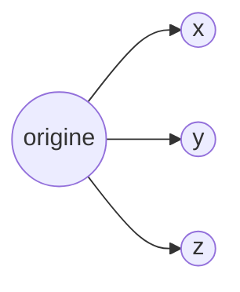
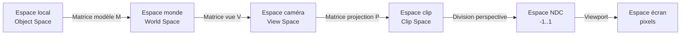

[← Introduction](01-introduction.md) · [↑ Sommaire](../README.md#table-des-matières) · [Graphiques informatiques →](03-graphiques-informatiques.md)

# 2. Bases des mathématiques

Dans cette section, nous explorerons les concepts fondamentaux des mathématiques nécessaires pour la programmation de jeux 3D et les graphiques informatiques. Nous aborderons les **coordonnées cartésiennes**, les **vecteurs**, les **matrices** et les **transformations**.

### Coordonnées cartésiennes

Les coordonnées cartésiennes sont un système de coordonnées permettant de représenter les points dans l'espace à l'aide de nombres réels.

> Les nombres **réels** sont une extension des nombres rationnels qui permettent de représenter toutes les grandeurs physiques, y compris les nombres irrationnels tels que $`\pi`$ et $`\sqrt{2}`$.
>
> **Petit aide-mémoire de notation.** $`\pi \approx 3{,}14159`$ est le rapport circonférence/diamètre d'un cercle ; il revient partout en trigonométrie et en géométrie. Le symbole $`\sqrt{x}`$ désigne la **racine carrée** de $`x`$ (le nombre positif dont le carré vaut $`x`$) ; plus généralement, $`\sqrt[n]{x}`$ est la **racine n-ième** de $`x`$ (le nombre positif dont la puissance $`n`$ vaut $`x`$). $`|x|`$ note la **valeur absolue** d'un nombre (sa version positive : $`|-3| = 3`$) — à ne pas confondre plus loin avec $`\|\mathbf{v}\|`$, qui désigne la **norme** d'un vecteur (sa longueur). Enfin, $`\approx`$ se lit "approximativement égal à", $`\equiv`$ "identiquement égal à" (égalité par définition ou modulo) et $`\propto`$ "proportionnel à".
>
> 

En **2D**, l'espace cartésien est un plan composé d'un axe horizontal et d'un axe vertical. Les coordonnées d'un point dans ce plan sont généralement notées $`(x, y)`$, où $`x`$ est l'**abscisse** (horizontal) et $`y`$ est l'**ordonnée** (vertical).

En **3D**, l'espace cartésien est un espace à trois dimensions composé d'un axe horizontal (l'axe des $`x`$), d'un axe vertical (l'axe des $`y`$) et d'un axe perpendiculaire à ces deux axes (l'axe des $`z`$). Les coordonnées d'un point dans cet espace sont généralement notées $`(x, y, z)`$.



L'espace cartésien est défini par un système de coordonnées cartésiennes, qui utilise des **axes orthogonaux** (des droites perpendiculaires les unes aux autres) et des nombres réels pour définir la position de points dans l'espace.

Fondamentales dans le domaine des jeux vidéo, en particulier pour les jeux en 3 dimensions, les coordonnées cartésiennes permettent de représenter et de manipuler les **positions**, les **mouvements** et les **orientations** des objets dans l'espace virtuel.

#### Conventions de repère : main droite vs main gauche, Y-up vs Z-up

Trois choses qu'on néglige souvent à ses dépens :

1. **L'orientation du repère** : *main droite* (right-handed, RH) ou *main gauche* (left-handed, LH). Étendez les doigts de votre main droite : pouce $`= x`$, index $`= y`$, majeur $`= z`$. Pour un repère gauche, répétez le geste avec la main gauche — l'axe $`z`$ pointe alors dans la direction opposée.
2. **L'axe vertical** : *Y-up* (l'axe $`y`$ pointe vers le haut) ou *Z-up* (l'axe $`z`$ pointe vers le haut).
3. **Le sens de rotation positif** : antihoraire (mathématiques classiques) ou horaire selon la convention.

Les moteurs et outils ne sont pas d'accord :

| Système                 | Orientation | Vertical         | Notes                                |
| ----------------------- | ----------- | ---------------- | ------------------------------------ |
| OpenGL, Maya, Houdini   | main droite | $`Y`$ vers le haut | Convention "graphique" historique    |
| DirectX (legacy), Unity | main gauche | $`Y`$ vers le haut | $`z`$ pointe vers l'écran              |
| Unreal Engine           | main gauche | $`Z`$ vers le haut | Hérité du moteur Quake               |
| Blender, 3ds Max, CAO   | main droite | $`Z`$ vers le haut | Hérité de la convention CAO          |
| glTF, Vulkan, WebGPU    | main droite | $`Y`$ vers le haut | Standard d'échange moderne           |

**Pourquoi ça compte ?** Quand on importe un modèle Blender (RH, Z-up) dans Unity (LH, Y-up), un asset orienté correctement à l'export apparaît tourné de 90° et reflété par rapport à un axe. Les outils d'import font automatiquement la conversion, mais quand un asset arrive « sur le toit » ou avec ses normales à l'envers dans le moteur, c'est presque toujours là qu'il faut chercher.

**Conversion Z-up → Y-up** : on permute $`y`$ et $`z`$ et on change un signe :

```math
\begin{pmatrix} x' \\ y' \\ z' \end{pmatrix}_\text{Y-up} = \begin{pmatrix} x \\ z \\ -y \end{pmatrix}_\text{Z-up}
```

**Conversion main-droite → main-gauche** : on inverse un seul axe (souvent $`z`$) — *toutes les rotations doivent alors être inversées* (sinon les rotations apparaissent à l'envers) :

```math
\begin{pmatrix} x' \\ y' \\ z' \end{pmatrix}_\text{LH} = \begin{pmatrix} x \\ y \\ -z \end{pmatrix}_\text{RH}
```

> **Règle de survie.** Quand vous écrivez du code mathématique dans un projet, **annoncez la convention en commentaire** au début du fichier ("Convention : right-handed, Y-up, rotation positive antihoraire vue depuis l'axe positif"). Une bonne partie des bugs de rotation inverse, de skybox à l'envers ou de normales mal orientées s'explique simplement par une convention que personne n'a écrite noir sur blanc.

### Précision flottante : ce que tout dev de jeu doit savoir

Les nombres réels n'existent pas en machine. Ce que votre CPU/GPU manipule, ce sont des **flottants IEEE 754**, et leurs limites se révèlent dès qu'on programme un jeu sérieux.

> **IEEE 754** est la norme internationale (1985, révisée en 2008/2019) qui définit comment encoder un nombre réel sur 32 bits (`float` / `binary32`), 64 bits (`double` / `binary64`) ou 16 bits (`half` / `binary16`, omniprésent sur GPU). Trois zones : un **bit de signe**, un **exposant biaisé** (l'exposant réel auquel on ajoute un offset constant — 127 pour binary32 — pour éviter d'avoir à gérer un signe sur l'exposant) et une **mantisse** (les chiffres significatifs après le `1.` implicite). La norme spécifie aussi les valeurs spéciales `NaN`, `+∞`, `-∞`, `-0`, et les modes d'arrondi.

#### Représentation : le format `float` 32 bits

Un `float` (binary32) découpe ses 32 bits en :

- **1 bit** de signe ;
- **8 bits** d'exposant (biaisé de 127) ;
- **23 bits** de mantisse (24 bits effectifs avec le `1` implicite).

La valeur représentée est : $`(-1)^s \times 1{.}m \times 2^{e-127}`$.

Conséquences pratiques pour le game-dev :

- **Précision relative**, pas absolue. À l'origine, la précision est d'environ $`1.2 \times 10^{-7}`$ ; à $`x = 10\,000`$, l'écart minimum représentable (*ulp*) est d'environ $`6 \times 10^{-4}`$ (~0,6 mm). À $`x = 1\,000\,000`$ (carte open-world très large), cet écart dépasse $`6 \times 10^{-2}`$ (~6 cm) : les objets s'animent avec des saccades visibles.
- **L'addition n'est pas associative** : `(a + b) + c ≠ a + (b + c)` en général. Si vous accumulez du `Δt` à chaque frame depuis l'origine, vous accumulez aussi de l'erreur — d'où l'usage du compteur de temps en `double`.
- **`0.1 + 0.2 == 0.3` est faux** : la base 2 ne représente pas exactement les fractions de base 10.

#### Le piège de la comparaison directe

```csharp
// FAUX en général (transform.position et Mathf sont des APIs Unity/C#)
if (transform.position.y == targetHeight) { ... }

// Correct : comparer à un epsilon (Mathf.Abs — Unity)
if (Mathf.Abs(transform.position.y - targetHeight) < 1e-4f) { ... }

// Encore mieux : epsilon relatif, agnostique moteur (MathF — .NET standard)
bool ApproxEqual(float a, float b, float relTol = 1e-5f, float absTol = 1e-7f)
 => MathF.Abs(a - b) <= MathF.Max(absTol, relTol * MathF.Max(MathF.Abs(a), MathF.Abs(b)));
```

> **`Mathf.Approximately` (en C#/Unity) utilise un epsilon de l'ordre de $`10^{-6}`$** : adapté aux objets proches de l'origine, mais inutilisable pour comparer des positions à plusieurs kilomètres. Dans ce cas il vaut mieux écrire son propre comparateur, par exemple le `ApproxEqual` ci-dessus.

#### Catastrophic cancellation

Soustraire deux nombres flottants proches **détruit la précision relative** :

```text
a = 1.234567f          // 7 chiffres significatifs
b = 1.234566f          // 7 chiffres significatifs
a - b = 0.000001f      // 1 seul chiffre significatif !
```

C'est pourquoi le calcul d'une normale de triangle par `cross(b - a, c - a)` est sensible quand les trois sommets sont presque colinéaires : on soustrait des positions très proches.

#### Open-world : la solution du repère flottant

Au-delà de quelques kilomètres en `float`, la solution canonique est de **recentrer le repère sur le joueur** : périodiquement (toutes les `1024` unités, par exemple), on recalcule toutes les positions du monde par rapport au joueur, qui retourne à $`(0, 0, 0)`$. *Star Citizen*, *Outerra* et *Kerbal Space Program* utilisent cette technique. Alternative : passer en `double` côté CPU et reconvertir en `float` juste avant l'envoi GPU.

### Aléa et déterminisme

Un jeu vidéo a besoin d'aléa **partout** — placement d'arbres dans une forêt, dégâts critiques, mélange du paquet de cartes, génération de niveau infini, bruit pour les textures, comportement d'IA. Mais cet "aléa" doit souvent être **reproductible** :

- **Replay** : rejouer une partie enregistrée doit reproduire les mêmes événements.
- **Multijoueur lockstep** : *Age of Empires*, *StarCraft*, *Factorio* synchronisent les joueurs en n'envoyant que les inputs ; tout le reste (collisions, IA, RNG) doit donner le même résultat sur chaque machine. (*Lockstep* signifie littéralement « pas cadencé » — tous les clients avancent simulation et inputs au même rythme et sont contraints de rester bit-pour-bit identiques. Détails dans le chapitre Réseau.)
- **Génération procédurale** : *Minecraft*, *Terraria*, *No Man's Sky* doivent recréer le même monde à partir d'une **seed** (graine) donnée.

D'où l'usage de **PRNG** (pseudo-random number generators) : des générateurs déterministes qui, à partir d'un état initial, produisent une séquence "qui ressemble à de l'aléatoire".

#### Anatomie d'un PRNG

Un PRNG entretient un **état** $`S_n`$ et applique une fonction de transition $`f`$ à chaque appel :

```math
S_{n+1} = f(S_n) \qquad x_n = g(S_n)
```

où $`x_n`$ est le nombre observable. La **période** est la longueur du cycle $`S_0 \to S_1 \to \cdots \to S_0`$ avant répétition.

#### Choisir un PRNG

| Algorithme             | État (bits) | Période             | Vitesse | Qualité                | Cas d'usage                          |
| ---------------------- | ----------- | ------------------- | ------- | ---------------------- | ------------------------------------ |
| **LCG**                | 32-64       | $`\le 2^{64}`$        |    | Médiocre (motifs 2D)   | À éviter, présent par héritage       |
| **Mersenne Twister**   | 19 968      | $`2^{19937}-1`$       |      | Bonne                  | `rand()` de C++/Python, surpoids RAM |
| **xorshift / xoshiro** | 64-256      | $`\ge 2^{128}-1`$     |     | Bonne                  | Rust `SmallRng`, GPU-friendly        |
| **PCG**                | 64-128      | $`\ge 2^{64}`$        |     | Excellente (BigCrush)  | Le défaut moderne (M. O'Neill, 2014) |
| **SplitMix64**         | 64          | $`2^{64}`$            |    | Bonne                  | Seeder, hachages spatiaux            |

 **Lexique du tableau :**

- **État (bits)** : la mémoire interne du générateur. Plus c'est grand, plus la séquence avant répétition peut être longue.
- **Période** : nombre d'appels avant que la séquence se répète exactement à l'identique.
- **BigCrush** : suite de tests statistiques de référence (TestU01, Pierre L'Ecuyer) utilisée pour disqualifier les PRNG biaisés.
- **LCG** (*Linear Congruential Generator*) : la formule $`S_{n+1} = (a \cdot S_n + c) \bmod m`$.

> **Aucun PRNG standard n'est cryptographiquement sûr** — pour générer un token de session ou simuler un tirage certifié équitable avec mise réelle, il faut un **CSPRNG** (générateur cryptographiquement sûr), disponible dans la bibliothèque standard de chaque langage (`crypto` en Node.js, `secrets` en Python, `SecureRandom` en Java, `BCryptGenRandom` sur Windows…). Dans la plupart des jeux vidéo sans mise réelle (FPS, RPG, jeux de plateforme), un PRNG standard suffit et un CSPRNG serait inutilement coûteux. En revanche, pour les loot boxes monétisées, les jeux de casino en ligne ou tout tirage devant être certifié équitable, un CSPRNG est indispensable.

#### Seeder proprement

Une seed mal choisie biaise la séquence. Deux règles :

1. **Éviter `time()` seul comme seed en production** : sur un cluster multijoueur, deux instances démarrées à la même seconde ont la même seed. Pour un prototype solo c'est acceptable ; pour une application multijoueur ou serveur, préférez une combinaison `time()`-XOR-`pid()`-XOR-`hash(machineId)`.
2. **Passer la seed à travers SplitMix64** avant de l'utiliser : SplitMix64 distribue uniformément les bits, ce qui évite les corrélations sur des seeds proches (`seed=1` et `seed=2` donneraient sinon des séquences similaires sur certains PRNG).

```python
def splitmix64(x: int) -> int:
 x = (x + 0x9E3779B97F4A7C15) & 0xFFFFFFFFFFFFFFFF
 x = ((x ^ (x >> 30)) * 0xBF58476D1CE4E5B9) & 0xFFFFFFFFFFFFFFFF
 x = ((x ^ (x >> 27)) * 0x94D049BB133111EB) & 0xFFFFFFFFFFFFFFFF
 return x ^ (x >> 31)
```

#### Hachage spatial (PRNG sans état)

Pour un terrain procédural infini, on a besoin d'aléa par cellule **sans entretenir d'état** : `noise(x, y)` doit toujours donner le même résultat sans dépendre de l'ordre d'appel. La technique : un **hachage** `(x, y) → uint32` qu'on découpe en bits :

```csharp
// Hachage spatial déterministe (style PCG)
uint Hash2D(int x, int y, uint seed)
{
 uint h = seed;
 h ^= (uint)x * 0x85EBCA6B;
 h ^= ((uint)y * 0xC2B2AE35) ^ (h >> 16);
 h *= 0x27D4EB2F;
 return h ^ (h >> 16);
}
float Random01(uint h) => (h >> 8) * (1f / (1u << 24));
```

C'est l'idée derrière le placement d'arbres dans *Minecraft* : `Hash2D(blockX, blockZ, worldSeed)` détermine le contenu de chaque chunk, sans avoir à mémoriser quoi que ce soit côté serveur.

#### Distributions au-delà de l'uniforme

Un PRNG donne des nombres uniformes dans $`[0, 1[`$ (intervalle fermé en 0, ouvert en 1 : 0 inclus, 1 exclu). Pour autre chose :

- **Loi normale** (les valeurs « tombent en cloche » autour d'une moyenne, comme la taille des humains autour de 1,70 m) : la **transformation de Box-Muller** convertit deux uniformes en deux variables qui suivent cette loi. Si $`u_1, u_2`$ sont uniformes, alors $`z = \sqrt{-2 \ln u_1}\,\cos(2\pi u_2)`$ suit la loi normale standard. Utile pour le bruit gaussien et la dispersion réaliste des tirs.
- **Choix pondéré** (par exemple les *loot tables* d'un boss : 1 % de chance de drop légendaire, 10 % épique, etc.) : on calcule la somme cumulative des poids, on tire $`u`$ uniforme dans $`[0, \text{somme}]`$ et on renvoie l'item correspondant. Pour un grand nombre d'items, la **méthode alias de Walker** (1977) effectue ce tirage en $`O(1)`$ par appel après un précalcul en $`O(n)`$, en remplaçant la recherche dichotomique par deux accès à des tableaux pré-construits.
- **Échantillonnage de Poisson** (placement d'objets sans agglomérat — par exemple disposer des arbres dans une forêt sans que deux ne se chevauchent) : la technique de référence est le **Poisson disk sampling**. **L'algorithme de Bridson** (2007) en donne une implémentation en $`O(n)`$ : on entretient une file de points actifs, on tire des candidats dans une couronne autour d'eux, et on accepte un candidat seulement s'il est suffisamment éloigné des points déjà placés (vérifié rapidement via une grille spatiale). Utilisé pour le placement réaliste d'arbres, d'étoiles, de nuages.

### Trigonométrie

La trigonométrie est l'étude des relations entre les **angles** et les **longueurs** dans un triangle. C'est un outil omniprésent en programmation de jeux : rotation d'un sprite, déplacement d'un projectile, oscillation, calcul d'un angle de tir, etc.

#### Le cercle trigonométrique

Sur le cercle unité (rayon $`1`$ centré à l'origine), un point repéré par l'angle $`\theta`$ a pour coordonnées :

```math
(x, y) = (\cos\theta,\ \sin\theta)
```

> ℹ En programmation, les angles sont **presque toujours exprimés en radians** ($`2\pi`$ rad $`= 360°`$). La conversion se fait avec : $`\theta_\text{rad} = \theta_\text{deg} \times \dfrac{\pi}{180}`$.

#### Fonctions trigonométriques

Pour un angle $`\theta`$ dans un triangle rectangle d'hypoténuse $`h`$, de côté opposé $`o`$ et de côté adjacent $`a`$ :

```math
\sin\theta = \frac{o}{h}, \quad \cos\theta = \frac{a}{h}, \quad \tan\theta = \frac{o}{a} = \frac{\sin\theta}{\cos\theta}
```

#### Identités utiles

```math
\sin^2\theta + \cos^2\theta = 1
```

```math
\sin(\alpha + \beta) = \sin\alpha\cos\beta + \cos\alpha\sin\beta
```

```math
\cos(\alpha + \beta) = \cos\alpha\cos\beta - \sin\alpha\sin\beta
```

#### Exemple : déplacement d'un projectile

Pour tirer un projectile à la vitesse $`v`$ et à l'angle $`\theta`$ :

```math
v_x = v \cos\theta, \quad v_y = v \sin\theta
```

```csharp
float angleRad = angleDeg * MathF.PI / 180f;
Vector2 velocity = new Vector2(
 speed * MathF.Cos(angleRad),
 speed * MathF.Sin(angleRad)
);
```

#### atan2 — l'incontournable

Pour retrouver l'angle correspondant à un vecteur $`(x, y)`$, on utilise `atan2(y, x)` plutôt que `atan(y/x)` — car `atan2` gère correctement les quatre quadrants et le cas $`x = 0`$ :

```math
\theta = \mathrm{atan2}(y, x) \in (-\pi,\ \pi]
```

C'est l'outil idéal pour faire pivoter un personnage ou une arme vers un point cible.

### Vecteurs

Les vecteurs sont des entités mathématiques représentant à la fois une **magnitude** (longueur) et une **direction**. Ils sont généralement utilisés pour décrire la position, la vitesse, l'accélération et d'autres propriétés dans l'espace 2D ou 3D, dans un espace cartésien.

> Dans un jeu vidéo, on privilégiera un type particulier de repère cartésien : le **repère orthonormé**.


Le format d'écriture usuel d'un vecteur colonne s'exprime par :

```math
V =
\begin{pmatrix}
v_1 \\
v_2 \\
\vdots \\
v_n
\end{pmatrix}
```

où chaque $`v_i`$ est une **composante** du vecteur $`V`$ (telle que $`v_1`$ est la première composante, $`v_2`$ la deuxième, et ainsi de suite). La matrice représente un vecteur à $`n`$ composantes, disposées verticalement en une seule colonne.

> Dans le contexte des vecteurs, une composante est un élément constitutif du vecteur qui indique sa valeur le long d'un axe particulier. Un vecteur est défini par un ensemble de composantes, qui ensemble déterminent sa direction et sa magnitude.
>
> Par exemple, un vecteur à deux dimensions a deux composantes ($`v_1`$ et $`v_2`$) qui représentent respectivement sa valeur le long des axes $`x`$ et $`y`$. De même, un vecteur à trois dimensions a trois composantes ($`v_1`$, $`v_2`$ et $`v_3`$), qui correspondent à sa valeur le long des axes $`x`$, $`y`$ et $`z`$.
>
> Les composantes d'un vecteur permettent de décrire sa position ou sa direction dans un espace à $`n`$ dimensions, où $`n`$ est le nombre de composantes du vecteur.


#### Magnitude

La magnitude d'un vecteur en dimension $`n`$ est donnée par la formule suivante :

```math
\left\Vert\mathbf{v}\right\Vert = \sqrt{\sum_{i=1}^{n} v_i^2}
```

> Le symbole $`\sum`$ est appelé « somme » en mathématiques. Il indique que l'on doit additionner les termes indiqués. Ici, on additionne les carrés de chaque composante du vecteur $`\mathbf{v}`$.
>
> Le symbole $`\left\Vert\mathbf{v}\right\Vert`$ représente la magnitude (ou norme) du vecteur $`\mathbf{v}`$, c'est-à-dire sa longueur ou sa taille.
>
> Les indices $`i`$ de la somme indiquent qu'on somme les carrés des composantes de $`\mathbf{v}`$ de $`i=1`$ jusqu'à $`i=n`$, où $`n`$ est la dimension du vecteur. Cela signifie qu'on calcule le carré de la première composante, puis le carré de la deuxième, et ainsi de suite jusqu'à la $`n`$-ème composante.
>
> Le symbole $`v_i`$ représente la $`i`$-ème composante du vecteur $`\mathbf{v}`$. On élève cette composante au carré en utilisant le symbole $`^2`$.
>
> Enfin, la racine carrée $`\sqrt{\ }`$ est appliquée à la somme des carrés pour obtenir la magnitude. L'opération de carré supprime les signes négatifs des composantes (toutes les valeurs deviennent positives), tout en gardant leur contribution proportionnelle à leur magnitude.

Pour un vecteur 2D représenté par les coordonnées $`(x, y)`$, la magnitude est donnée par :

```math
\left\Vert\mathbf{v}\right\Vert = \sqrt{\sum_{i=1}^{2} v_i^2} = \sqrt{v_1^2 + v_2^2}
```

En effet, dans un espace 2D, $`n = 2`$ ; dans un espace 3D, $`n = 3`$, etc.

La magnitude d'un vecteur 2D est donc égale à la racine carrée de la somme des carrés de ses deux composantes — autrement dit, à la longueur de l'**hypoténuse** d'un triangle rectangle dont les côtés adjacents sont les composantes $`x`$ et $`y`$ du vecteur.

##### Une représentation possible en C\#

```csharp
using TansoftwareEngine;

public class Game : GameEngine
{
 void Start()
 {
 Vector3 position = new Vector3(1.0f, 2.0f, 3.0f);
 Player myPlayer = new Player();

 myPlayer.setPosition(position);
 }
}
```

> Ici, la classe `Game` instancie une position qui est un vecteur de dimension 3, affectée au joueur, avec une position en $`x`$ (`1.0f`) correspondant à l'abscisse (horizontal), $`y`$ (`2.0f`) à l'ordonnée (vertical) et $`z`$ (`3.0f`) à la profondeur de champ (distance par rapport à une caméra).

La magnitude serait donc :

```math
\|\mathbf{v}\| = \sqrt{\sum_{i=1}^{3} v_i^2} = \sqrt{1.0^2 + 2.0^2 + 3.0^2} \approx 3{,}74
```

L'avantage d'utiliser des vecteurs, plutôt que des nombres concrets, tient aux propriétés mathématiques associées, qui permettent une représentation plus flexible et une manipulation aisée des quantités géométriques dans les jeux vidéo et d'autres applications.

En outre, les opérations vectorielles standard — addition, soustraction et multiplication par un scalaire — simplifient les calculs et les transformations géométriques requises dans de nombreux scénarios.

#### Addition et soustraction de vecteurs

Pour additionner ou soustraire deux vecteurs, on additionne ou soustrait les composantes correspondantes de chaque vecteur :

- **Addition** : $`\mathbf{u} + \mathbf{v} = (u_x + v_x,\ u_y + v_y,\ u_z + v_z)`$
- **Soustraction** : $`\mathbf{u} - \mathbf{v} = (u_x - v_x,\ u_y - v_y,\ u_z - v_z)`$

#### Multiplication par un scalaire

> Un **scalaire** est la représentation d'une quantité, sans direction.

Pour multiplier un vecteur par un scalaire, on multiplie chaque composante du vecteur par le scalaire :

- **Multiplication par un scalaire** : $`a \cdot \mathbf{v} = (a \cdot v_x,\ a \cdot v_y,\ a \cdot v_z)`$

#### Produit scalaire

Le produit scalaire (ou produit intérieur) prend deux vecteurs et renvoie un nombre réel. Il est défini comme suit :

```math
\mathbf{u} \cdot \mathbf{v} = u_x v_x + u_y v_y + u_z v_z = \|\mathbf{u}\|\,\|\mathbf{v}\|\,\cos\theta
```

où $`\theta`$ est l'angle entre les deux vecteurs. Le produit scalaire est utilisé entre autres pour calculer un **angle** entre deux directions ou pour tester si deux vecteurs sont **orthogonaux** (produit scalaire nul).

#### Produit vectoriel

Le produit vectoriel (ou produit extérieur) prend deux vecteurs et renvoie un nouveau vecteur **perpendiculaire** à ces deux vecteurs. Il est défini comme suit :

```math
\mathbf{u} \times \mathbf{v} = (u_y v_z - u_z v_y,\ u_z v_x - u_x v_z,\ u_x v_y - u_y v_x)
```

Le produit vectoriel est très utilisé pour calculer la **normale** d'un triangle (utile pour l'éclairage), pour déterminer un **sens de rotation**, ou pour construire un repère orthonormé local à partir de deux vecteurs.

### Interpolation

L'**interpolation** consiste à calculer une valeur intermédiaire entre deux (ou plusieurs) valeurs connues. C'est l'une des opérations les plus utilisées dans un jeu : caméra qui suit le joueur en douceur, animation de fondu, transition de couleur, lissage d'un déplacement réseau, etc.

#### Interpolation linéaire (LERP)

L'interpolation linéaire entre deux valeurs $`A`$ et $`B`$ avec un paramètre $`t \in [0, 1]`$ s'écrit :

```math
\mathrm{lerp}(A, B, t) = (1 - t) \cdot A + t \cdot B = A + t \cdot (B - A)
```

- $`t = 0`$ donne $`A`$ ;
- $`t = 1`$ donne $`B`$ ;
- $`t = 0{,}5`$ donne le milieu entre $`A`$ et $`B`$.

```csharp
// Vector3 disponible dans System.Numerics (.NET) et dans Unity
float Lerp(float a, float b, float t) => a + (b - a) * t;
Vector3 LerpVec(Vector3 a, Vector3 b, float t) => a + (b - a) * t;
```

#### Inverse-LERP

L'opération inverse — retrouver $`t`$ connaissant $`A`$, $`B`$ et la valeur courante $`V`$ :

```math
\mathrm{invLerp}(A, B, V) = \frac{V - A}{B - A}
```

#### Interpolation sphérique (SLERP)

Pour interpoler entre deux **directions** ou deux **rotations** sur une sphère unité, l'interpolation linéaire ne suffit pas (la vitesse angulaire varie). On utilise le **SLERP** (*Spherical Linear Interpolation*). La formule complète est donnée plus bas dans la [section Quaternions](#interpolation--slerp), où le contexte est plus naturel.

#### Easing — interpolation non-linéaire

> **Qu'est-ce que l'easing ?**
> *Easing* signifie littéralement "adoucir". C'est l'idée que dans la vraie vie, rien ne démarre à pleine vitesse et ne s'arrête pile : une voiture accélère puis freine, un objet rebondit, une porte de placard se referme avec un léger ralenti final. En interpolation, un LERP « tout droit » donne un mouvement mécanique, robotique. Les fonctions d'easing remplacent le paramètre $`t`$ par une version courbée de lui-même pour simuler ces accélérations et décélérations naturelles. On en retrouve dans les transitions CSS et les animations Apple ou Material, dans les caméras de jeu, et plus généralement dans à peu près toutes les animations d'interface modernes.

Le principe : on garde $`t \in [0, 1]`$ mais on l'envoie à travers une fonction $`f`$ avant l'interpolation : `lerp(A, B, f(t))`. Quelques classiques :

```math
\text{easeInQuad}(t) = t^2
```

départ lent, arrivée brutale.

```math
\text{easeOutQuad}(t) = 1 - (1 - t)^2
```

départ rapide, arrivée en douceur.

```math
\text{easeInOutQuad}(t) = \begin{cases} 2t^2 & \text{si } t < 0{,}5 \\ 1 - 2(1-t)^2 & \text{sinon} \end{cases}
```

départ et arrivée en douceur, vitesse maximale au milieu.

```math
\text{smoothstep}(t) = 3t^2 - 2t^3
```

> **Pourquoi `smoothstep` est partout en graphisme ?** Sa **dérivée** vaut 0 aux deux bords ($`t=0`$ et $`t=1`$) et $`1{,}5`$ au centre. Concrètement : la vitesse de l'animation démarre exactement à zéro, monte, puis revient à zéro. Pas de cassure à l'œil. Sa cousine `smootherstep(t) = 6t^5 - 15t^4 + 10t^3` pousse encore plus loin (dérivée première ET seconde nulles aux bords), au prix de quelques multiplications de plus. C'est la fonction d'easing préférée des shaders et de la génération procédurale.
>
> **Pour aller plus loin** — visualisez tous les easings classiques (sine, cubic, expo, elastic, bounce…) et copiez le code sur [easings.net](https://easings.net/). C'est la référence universelle des animateurs UI.

#### Courbes de Bézier

Pour un mouvement plus libre (trajectoire d'une caméra, animation d'UI…), on utilise des **courbes de Bézier**. La courbe cubique entre $`P_0`$ et $`P_3`$ avec deux points de contrôle $`P_1`$ et $`P_2`$ s'écrit :

```math
B(t) = (1-t)^3 P_0 + 3(1-t)^2 t P_1 + 3(1-t)t^2 P_2 + t^3 P_3, \quad t \in [0, 1]
```

##### Forme générale (degré $`n`$) et polynômes de Bernstein

Plus généralement, une courbe de Bézier de degré $`n`$ avec $`n+1`$ points de contrôle $`P_0, \dots, P_n`$ s'écrit comme une combinaison **affine** des points pondérés par les **polynômes de Bernstein** $`B_{i,n}(t)`$ :

```math
B(t) = \sum_{i=0}^{n} B_{i,n}(t)\,P_i, \qquad B_{i,n}(t) = \binom{n}{i} (1-t)^{n-i}\,t^{\,i}
```

Trois propriétés rendent les Bézier omniprésentes en infographie : ils restent **dans l'enveloppe convexe** des points de contrôle (pratique pour le culling), ils sont **invariants par transformation affine** (on peut faire pivoter les points de contrôle plutôt que recalculer la courbe) et ils s'évaluent en $`O(n)`$ par l'**algorithme de De Casteljau** — récursion de moyennes pondérées qui évite le calcul direct des binomiaux et reste numériquement stable.

##### Élévation de degré (*degree elevation*)

Un Bézier de degré $`n`$ peut être réécrit **exactement** comme un Bézier de degré $`n+1`$ en insérant un nouveau point de contrôle calculé par interpolation linéaire entre les voisins :

```math
P'_i = \frac{i}{n+1}\,P_{i-1} + \left(1 - \frac{i}{n+1}\right) P_i, \quad i = 0, 1, \dots, n+1
```

(avec la convention $`P_{-1} = P_{n+1} = 0`$ pour les bornes : seuls les indices intermédiaires changent réellement). Utilité pratique : harmoniser le degré de plusieurs courbes avant de les mélanger, ou ajouter de la marge de manœuvre à une courbe pour l'éditer plus finement sans changer sa trajectoire.

##### Forme de Hermite — l'autre façon de penser une cubique

Plutôt que de spécifier deux points et deux poignées, on peut imposer **deux points et deux tangentes**. C'est la **forme de Hermite cubique** :

```math
H(t) = (2t^3 - 3t^2 + 1)\,P_0 + (t^3 - 2t^2 + t)\,T_0 + (-2t^3 + 3t^2)\,P_1 + (t^3 - t^2)\,T_1
```

où $`P_0, P_1`$ sont les points et $`T_0, T_1`$ les vecteurs tangents. Hermite et Bézier cubiques sont **équivalents** : on passe de l'un à l'autre par un simple changement de base ($`P_1^\text{Bezier} = P_0 + T_0/3`$, $`P_2^\text{Bezier} = P_1 - T_1/3`$). Hermite est plus naturel quand on connaît la **vitesse à l'entrée et à la sortie** (interpolation de keyframes en animation, *racing-line* d'un véhicule).

##### Catmull-Rom — la spline d'animation par excellence

La **Catmull-Rom spline** est une variante de Hermite où les tangentes sont **calculées automatiquement** à partir des points de contrôle voisins :

```math
T_i = \frac{P_{i+1} - P_{i-1}}{2}
```

Conséquence : la courbe **passe exactement par chaque point de contrôle** (interpolante, pas approximante comme Bézier) et reste $`C^1`$ continue.

> **Notation $`C^k`$.** Une courbe est dite de classe $`C^0`$ si elle est continue (pas de saut), de classe $`C^1`$ si en plus sa dérivée est continue (pas de cassure de pente), de classe $`C^2`$ si la dérivée seconde l'est aussi (la courbure varie sans à-coup). Pour une caméra qui glisse le long d'une spline, on cherche au minimum $`C^1`$ pour éviter les changements brusques de direction, et idéalement $`C^2`$ pour que l'accélération ressentie reste lisse.

C'est une des splines les plus utilisées pour les trajectoires de caméra, les chemins de waypoints et l'animation de spline-IK. La variante **Catmull-Rom centripète** (paramétrisation $`t_{i+1} = t_i + \|P_{i+1} - P_i\|^{1/2}`$) supprime les boucles parasites quand deux points sont très proches ; c'est cette variante qui est retenue par défaut dans les *splines actor* d'Unreal Engine.

##### B-splines et NURBS — splines à degré arbitraire

Quand on a beaucoup de points de contrôle, un Bézier unique de degré élevé devient numériquement sensible aux perturbations des points de contrôle et perd le contrôle local (bouger un point déforme **toute** la courbe). Les **B-splines** (*Basis splines*) résolvent ces deux problèmes en remplaçant les polynômes de Bernstein globaux par des **fonctions de base à support local** $`N_{i,k}(t)`$, définies par récurrence sur une suite de **nœuds** $`\{t_0, t_1, \dots\}`$ (relation de Cox-de Boor). Une B-spline de degré $`k`$ s'écrit :

```math
S(t) = \sum_{i=0}^{n} N_{i,k}(t)\,P_i
```

Les **NURBS** (*Non-Uniform Rational B-Splines*) ajoutent un **poids** $`w_i`$ par point de contrôle :

```math
S(t) = \frac{\sum_{i} w_i\,N_{i,k}(t)\,P_i}{\sum_{i} w_i\,N_{i,k}(t)}
```

C'est cette fraction rationnelle qui leur permet de représenter **exactement** les coniques (cercles, ellipses, paraboles) — impossible avec un polynôme classique. Les NURBS sont le standard de la **CAO industrielle** (CATIA, SolidWorks, Rhino) et de la modélisation organique (avant que la sculpture polygonale type ZBrush ne reprenne la main pour les *assets* de jeu).

##### Repère de Frenet-Serret — orienter une caméra le long d'une spline

Faire glisser une caméra ou un véhicule le long d'une trajectoire requiert plus que la position : il faut **un repère orthonormé local** $`(T, N, B)`$ (tangente, normale, binormale) qui définit l'orientation à chaque instant. Le repère de **Frenet-Serret** se calcule à partir de la dérivée première et seconde de la courbe :

```math
T(t) = \frac{C'(t)}{\|C'(t)\|}, \quad
N(t) = \frac{T'(t)}{\|T'(t)\|}, \quad
B(t) = T(t) \times N(t)
```

Les équations de Frenet-Serret relient la dérivée du repère à la **courbure** $`\kappa`$ et à la **torsion** $`\tau`$ de la courbe :

```math
\frac{\mathrm{d}}{\mathrm{d}s}\begin{pmatrix} T \\ N \\ B \end{pmatrix} = \begin{pmatrix} 0 & \kappa & 0 \\ -\kappa & 0 & \tau \\ 0 & -\tau & 0 \end{pmatrix} \begin{pmatrix} T \\ N \\ B \end{pmatrix}
```

> **Le piège du Frenet-Serret pur**. La normale $`N`$ est définie par $`T'`$, donc elle bascule brutalement (de 180°) à chaque point d'inflexion ($`T' \to 0`$) — la caméra fait un *roll-flip* visible. Pour une caméra-on-rail jouable, on utilise plutôt un **repère parallèle** (*Rotation Minimizing Frame*, RMF) : on transporte la base d'un échantillon au suivant par la rotation **minimale** qui aligne $`T_i`$ sur $`T_{i+1}`$. Cette construction (méthode du *double reflection* de Wang, 2008) supprime tout twist parasite. C'est ce qu'utilisent les éditeurs de spline d'Unreal et Unity sous le capot.

### Matrices

Les matrices sont des **tableaux rectangulaires** de nombres, utilisés pour effectuer des transformations linéaires sur des vecteurs.

Elles sont couramment utilisées pour représenter des transformations géométriques telles que la translation, la rotation, la mise à l'échelle, etc., que nous verrons par la suite.

Une matrice est généralement représentée sous la forme d'un tableau avec $`M`$ lignes et $`N`$ colonnes. Les matrices sont généralement notées en lettres majuscules, telles que $`A`$, $`B`$, $`C`$, etc.

Les opérations courantes sur les matrices incluent l'addition, la soustraction, la multiplication par un scalaire et la multiplication de matrices.

> Il convient de différencier les matrices selon leur représentation **mathématique** et **informatique**.
>
> En mathématiques, elles sont utilisées pour représenter des transformations linéaires, résoudre des systèmes d'équations linéaires et effectuer des opérations sur des vecteurs.
>
> En informatique, elles sont utilisées pour stocker et manipuler des données sous forme de tableaux à deux dimensions, pour des applications telles que les graphiques, l'apprentissage automatique, la modélisation de données et la simulation.

#### Addition et soustraction de matrices

Pour additionner ou soustraire deux matrices, on additionne ou soustrait les éléments correspondants de chaque matrice :

- **Addition** : $`A + B = [\,a_{ij} + b_{ij}\,]`$
- **Soustraction** : $`A - B = [\,a_{ij} - b_{ij}\,]`$

#### Multiplication d'une matrice par un scalaire

Pour multiplier une matrice par un scalaire, il suffit de multiplier chaque élément de la matrice par le scalaire :

- **Multiplication par un scalaire** : $`a \cdot A = [\,a \cdot a_{ij}\,]`$

#### Multiplication de matrices

La multiplication de matrices est une opération qui prend deux matrices et renvoie une nouvelle matrice. Elle est définie de telle manière que si $`A`$ est une matrice de taille $`m \times n`$ et $`B`$ une matrice de taille $`n \times p`$, alors le produit $`AB`$ est une matrice de taille $`m \times p`$.

La multiplication est effectuée en multipliant les éléments de chaque ligne de la première matrice par les éléments correspondants de chaque colonne de la deuxième matrice, puis en additionnant les résultats :

```math
AB = [\,c_{ij}\,] \quad \text{où} \quad c_{ij} = \sum_{k=1}^{n} a_{ik} \cdot b_{kj}
```

> La multiplication de matrices **n'est pas commutative** : en général, $`AB \neq BA`$.

### Transformations

Une transformation en mathématiques est une fonction qui associe à chaque élément d'un ensemble un autre élément du même ensemble.

En graphisme, on utilise principalement les transformations suivantes — chacune représentée par une matrice qu'on peut combiner par multiplication :

#### Translation

La **translation** est une transformation qui déplace un objet d'une position à une autre sans changer sa forme ou son orientation. En 3D, elle peut être représentée par une matrice de transformation homogène 4×4 :

```math
\begin{pmatrix} 1 & 0 & 0 & t_x \\ 0 & 1 & 0 & t_y \\ 0 & 0 & 1 & t_z \\ 0 & 0 & 0 & 1 \end{pmatrix}
```

où $`t_x`$, $`t_y`$ et $`t_z`$ sont les quantités de mouvement dans chaque direction.

Cette matrice peut être utilisée pour déplacer un vecteur de position homogène

```math
\mathbf{v}_h = \begin{pmatrix} x \\ y \\ z \\ 1 \end{pmatrix}
```

d'une quantité de mouvement spécifique dans chaque direction.

La multiplication de la matrice de translation homogène par le vecteur de position homogène produit un nouveau vecteur de position homogène :

```math
\mathbf{v}'_h = \begin{pmatrix} 1 & 0 & 0 & t_x \\ 0 & 1 & 0 & t_y \\ 0 & 0 & 1 & t_z \\ 0 & 0 & 0 & 1 \end{pmatrix} \begin{pmatrix} x \\ y \\ z \\ 1 \end{pmatrix} = \begin{pmatrix} x + t_x \\ y + t_y \\ z + t_z \\ 1 \end{pmatrix}
```

#### Rotation

La **rotation** en 3D est une transformation qui fait tourner un objet autour d'un point ou d'un axe donné, sans changer sa position ou sa taille. En 3D, elle peut être représentée par une matrice de transformation homogène 4×4 :

```math
\begin{pmatrix} r_{11} & r_{12} & r_{13} & 0 \\ r_{21} & r_{22} & r_{23} & 0 \\ r_{31} & r_{32} & r_{33} & 0 \\ 0 & 0 & 0 & 1 \end{pmatrix}
```

où $`r_{11}, r_{12}, \ldots, r_{33}`$ sont les coefficients de la matrice de rotation.

Ces coefficients peuvent être calculés à partir des angles de rotation autour de chacun des axes $`X`$, $`Y`$ et $`Z`$, ou à partir d'un vecteur d'axe de rotation et d'un angle de rotation.

Par exemple, la rotation autour de l'axe $`Z`$ d'un angle $`\theta`$ s'écrit :

```math
R_z(\theta) = \begin{pmatrix} \cos\theta & -\sin\theta & 0 & 0 \\ \sin\theta & \cos\theta & 0 & 0 \\ 0 & 0 & 1 & 0 \\ 0 & 0 & 0 & 1 \end{pmatrix}
```

La multiplication de la matrice de rotation homogène par le vecteur de position homogène produit un nouveau vecteur de position homogène :

```math
\mathbf{v}'_h = \begin{pmatrix} r_{11} & r_{12} & r_{13} & 0 \\ r_{21} & r_{22} & r_{23} & 0 \\ r_{31} & r_{32} & r_{33} & 0 \\ 0 & 0 & 0 & 1 \end{pmatrix} \begin{pmatrix} x \\ y \\ z \\ 1 \end{pmatrix} = \begin{pmatrix} r_{11} x + r_{12} y + r_{13} z \\ r_{21} x + r_{22} y + r_{23} z \\ r_{31} x + r_{32} y + r_{33} z \\ 1 \end{pmatrix}
```

#### Quaternions

Les **quaternions** sont des nombres hypercomplexes utilisés pour représenter les **rotations en 3D**. Ils sont devenus le standard dans les moteurs de jeu modernes (Unity, Unreal, Godot…) parce qu'ils résolvent plusieurs problèmes des matrices de rotation et des angles d'Euler.

##### Pourquoi pas les angles d'Euler ?

Les angles d'Euler (yaw / pitch / roll) souffrent du **gimbal lock** (perte d'un degré de liberté quand deux axes s'alignent), interpolent mal et accumulent des erreurs numériques. Les quaternions évitent ces problèmes.

##### Définition

Un quaternion étend les nombres complexes à quatre dimensions : une partie scalaire réelle $`w`$ et trois parties imaginaires $`x`$, $`y`$, $`z`$ associées aux unités $`\mathbf{i}`$, $`\mathbf{j}`$, $`\mathbf{k}`$. Il s'écrit :

```math
\mathbf{q} = w + x\,\mathbf{i} + y\,\mathbf{j} + z\,\mathbf{k} = (w,\ x,\ y,\ z)
```

avec les règles de multiplication : $`\mathbf{i}^2 = \mathbf{j}^2 = \mathbf{k}^2 = \mathbf{i}\mathbf{j}\mathbf{k} = -1`$.

Pour représenter une rotation d'angle $`\theta`$ autour d'un axe unitaire $`\mathbf{u} = (u_x, u_y, u_z)`$, on utilise un **quaternion unitaire** :

```math
\mathbf{q} = \left(\cos\frac{\theta}{2},\ u_x \sin\frac{\theta}{2},\ u_y \sin\frac{\theta}{2},\ u_z \sin\frac{\theta}{2}\right)
```

##### Propriétés

- **Norme** : $`\|\mathbf{q}\| = \sqrt{w^2 + x^2 + y^2 + z^2}`$. Un quaternion unitaire a une norme de $`1`$.
- **Conjugué** : $`\mathbf{q}^* = (w, -x, -y, -z)`$.
- **Inverse** : pour un quaternion unitaire, $`\mathbf{q}^{-1} = \mathbf{q}^*`$.

##### Multiplication (produit de Hamilton)

Le produit de deux quaternions $`\mathbf{q}_a = (w_a, x_a, y_a, z_a)`$ et $`\mathbf{q}_b = (w_b, x_b, y_b, z_b)`$ s'écrit :

```math
\mathbf{q}_a \, \mathbf{q}_b = \begin{pmatrix}
w_a w_b - x_a x_b - y_a y_b - z_a z_b \\
w_a x_b + x_a w_b + y_a z_b - z_a y_b \\
w_a y_b - x_a z_b + y_a w_b + z_a x_b \\
w_a z_b + x_a y_b - y_a x_b + z_a w_b
\end{pmatrix}
```

> La multiplication de quaternions **n'est pas commutative** : $`\mathbf{q}_a \mathbf{q}_b \neq \mathbf{q}_b \mathbf{q}_a`$.

**Composition de rotations** — attention à la convention d'ordre : avec la formule de rotation $`\mathbf{v}' = \mathbf{q}\,\mathbf{p}\,\mathbf{q}^{-1}`$ (présentée juste après), pour appliquer **d'abord** $`\mathbf{q}_1`$ **puis** $`\mathbf{q}_2`$ on calcule :

```math
\mathbf{q}_\text{total} = \mathbf{q}_2 \, \mathbf{q}_1
```

C'est la même convention que les matrices : la transformation appliquée en premier se trouve **à droite** du produit. L'ordre est important — c'est exactement la raison pour laquelle on préfère les quaternions : ils composent proprement, sans gimbal-lock.

##### Rotation d'un vecteur

Pour faire tourner un vecteur $`\mathbf{v}`$ par un quaternion $`\mathbf{q}`$, on construit le quaternion pur $`\mathbf{p} = (0, v_x, v_y, v_z)`$ puis on calcule :

```math
\mathbf{v}' = \mathbf{q}\,\mathbf{p}\,\mathbf{q}^{-1}
```

##### Interpolation : SLERP

Pour interpoler entre deux orientations $`\mathbf{q}_0`$ et $`\mathbf{q}_1`$ de manière fluide, on utilise le **SLERP** (*Spherical Linear Interpolation*) :

```math
\mathrm{slerp}(\mathbf{q}_0, \mathbf{q}_1, t) = \frac{\sin\!\big((1-t)\,\Omega\big)}{\sin\Omega}\,\mathbf{q}_0 + \frac{\sin(t\,\Omega)}{\sin\Omega}\,\mathbf{q}_1
```

où $`\Omega`$ est l'angle entre les deux quaternions, donné par leur **produit scalaire 4D** :

```math
\cos\Omega = \mathbf{q}_0 \cdot \mathbf{q}_1 = w_0 w_1 + x_0 x_1 + y_0 y_1 + z_0 z_1
```

> **Astuce d'implémentation.** Si $`\cos\Omega < 0`$, on renverse le signe de l'un des deux quaternions ($`-\mathbf{q}`$ représente la même rotation) pour passer par le chemin court sur la sphère. Et quand $`\Omega`$ est très petit, on retombe sur un LERP suivi d'une normalisation pour éviter la division par $`\sin\Omega`$ qui tend vers zéro — la plupart des implémentations grand public (Unity, Unreal) font ce repli silencieusement.

```csharp
// Unity / .NET
Quaternion targetRot = Quaternion.AngleAxis(45f, Vector3.up);
transform.rotation = Quaternion.Slerp(transform.rotation, targetRot, t);
```

#### Mise à l'échelle (et son cas particulier, l'homothétie)

La **mise à l'échelle** agrandit ou rétrécit un objet en multipliant ses coordonnées par un facteur indépendant par axe, sans changer sa position. En matrices homogènes :

**En 2D :**

```math
S(s_x, s_y) = \begin{pmatrix} s_x & 0 & 0 \\ 0 & s_y & 0 \\ 0 & 0 & 1 \end{pmatrix}
\quad\Rightarrow\quad
S \begin{pmatrix} x \\ y \\ 1 \end{pmatrix} = \begin{pmatrix} s_x x \\ s_y y \\ 1 \end{pmatrix}
```

**En 3D :**

```math
S(s_x, s_y, s_z) = \begin{pmatrix} s_x & 0 & 0 & 0 \\ 0 & s_y & 0 & 0 \\ 0 & 0 & s_z & 0 \\ 0 & 0 & 0 & 1 \end{pmatrix}
```

- $`s > 1`$ agrandit ; $`0 < s < 1`$ réduit ; $`s < 0`$ effectue une réflexion par rapport à l'axe.
- L'**homothétie** est le cas particulier $`s_x = s_y = s_z = s`$ : un facteur unique appliqué uniformément. Toutes les distances entre les points de l'objet sont multipliées par $`s`$, les angles sont préservés.

> **Mettre à l'échelle non uniformément avant de faire pivoter** déforme l'objet (oblique). En infographie on suit en général l'ordre **scale → rotate → translate** : multiplier $`T \cdot R \cdot S`$ et appliquer la matrice à un sommet.

#### Cisaillement

Le **cisaillement** est une transformation géométrique qui déforme un objet en le poussant le long d'un axe parallèle à un autre axe. Il peut être considéré comme une combinaison de translations et d'étirements. La forme de la matrice diffère selon la dimension de l'espace de travail.

**En 2D**, la matrice de cisaillement de $`x`$ par $`y`$ s'écrit :

```math
\begin{pmatrix} 1 & a & 0 \\ 0 & 1 & 0 \\ 0 & 0 & 1 \end{pmatrix}
```

où $`a`$ est le coefficient de cisaillement. Le coefficient $`a`$ détermine la quantité de déplacement du vecteur dans la direction de l'axe des $`x`$, par rapport à sa position d'origine, en fonction de sa coordonnée sur l'axe des $`y`$.

**Cisaillement 3D — un axe à la fois.** Un cisaillement *pur* dans l'espace déforme un seul axe en fonction d'un autre. Les six combinaisons possibles ($`x`$ par $`y`$, $`x`$ par $`z`$, $`y`$ par $`x`$, $`y`$ par $`z`$, $`z`$ par $`x`$, $`z`$ par $`y`$) sont représentées par une seule entrée hors-diagonale dans la matrice. Par exemple, un cisaillement de $`x`$ par $`y`$ d'intensité $`a`$ s'écrit :

```math
S_{xy}(a) = \begin{pmatrix} 1 & a & 0 & 0 \\ 0 & 1 & 0 & 0 \\ 0 & 0 & 1 & 0 \\ 0 & 0 & 0 & 1 \end{pmatrix}
```

Combiner plusieurs cisaillements revient à multiplier ces matrices (l'ordre compte). Mettre simultanément les six coefficients hors-diagonale dans une même matrice produit une **transformation affine générale**, pas un cisaillement pur — à utiliser avec prudence.

Appliquée à un vecteur position homogène, la matrice de cisaillement déplace une coordonnée proportionnellement à une autre, laissant les axes restants inchangés. La multiplication donne :

**En 2D :** la coordonnée $`x`$ est décalée d'une quantité $`a \cdot y`$, tandis que $`y`$ est préservé.

```math
\mathbf{v}'_h = \begin{pmatrix} 1 & a & 0 \\ 0 & 1 & 0 \\ 0 & 0 & 1 \end{pmatrix} \begin{pmatrix} x \\ y \\ 1 \end{pmatrix} = \begin{pmatrix} x + a y \\ y \\ 1 \end{pmatrix}
```

**En 3D, cisaillement de $`x`$ par $`y`$ :** de même, seule la composante $`x`$ est modifiée.

```math
\mathbf{v}'_h = S_{xy}(a) \begin{pmatrix} x \\ y \\ z \\ 1 \end{pmatrix} = \begin{pmatrix} x + a y \\ y \\ z \\ 1 \end{pmatrix}
```

### Géométrie linéaire

La géométrie linéaire est la branche des mathématiques qui étudie les transformations géométriques dans l'espace en utilisant des outils algébriques tels que les **matrices** et les **vecteurs**.

En informatique graphique, la géométrie linéaire est utilisée pour créer des images en 2D et en 3D. Les transformations géométriques sont appliquées aux objets pour les déplacer, les faire tourner et les étirer dans l'espace. Les images sont ensuite **projetées** sur un écran pour les afficher.

#### Projection

La **projection** est une transformation utilisée pour projeter un objet en 3D sur un plan en 2D pour son affichage à l'écran. Elle peut être réalisée en multipliant un vecteur de position homogène

```math
\begin{pmatrix} x \\ y \\ z \\ 1 \end{pmatrix}
```

par une matrice de projection appropriée.

Il existe deux types de projection couramment utilisés : la **projection orthographique** et la **projection perspective**. La projection orthographique projette l'objet en parallèle sur le plan en 2D ; la projection perspective utilise une distance de vue pour simuler les effets de perspective dans l'affichage de l'objet.

En 3D, la projection **orthographique** dans sa forme simplifiée (sans mise à l'échelle du volume de vue) peut être représentée par :

```math
\begin{pmatrix} 1 & 0 & 0 & 0 \\ 0 & 1 & 0 & 0 \\ 0 & 0 & 0 & 0 \\ 0 & 0 & 0 & 1 \end{pmatrix}
```

où la troisième ligne est mise à zéro pour indiquer que la projection se fait sur le plan $`z = 0`$ (en supprimant la profondeur). En pratique, la matrice orthographique complète prend en compte les paramètres du volume de vue (gauche, droite, bas, haut, near, far) pour normaliser les coordonnées dans le cube NDC.

La projection **perspective** peut être représentée en 3D par une matrice 4×4 :

```math
\begin{pmatrix} \dfrac{1}{\tan\left(\dfrac{\theta}{2}\right)} & 0 & 0 & 0 \\ 0 & \dfrac{h}{w\cdot\tan\left(\dfrac{\theta}{2}\right)} & 0 & 0 \\ 0 & 0 & \dfrac{-(f+n)}{f-n} & \dfrac{-2fn}{f-n} \\ 0 & 0 & -1 & 0 \end{pmatrix}
```

où $`\theta`$ est l'angle de vue (**FOV**, *Field Of View* — l'angle d'ouverture vertical de la caméra, exprimé en degrés ou radians : ~60° vertical pour un FPS classique en 16:9, soit ~90° horizontal), $`w`$ et $`h`$ sont les largeur et hauteur de l'écran, $`n`$ et $`f`$ sont les distances du plan de coupe avant (*near*) et arrière (*far*) du **frustum** (le volume tronc-de-pyramide visible par la caméra, voir plus bas). Note : les jeux FPS compétitifs utilisent souvent 90°-110° de FOV **horizontal**.

#### Perspective

> ℹ Nous vous invitons à ne pas confondre la **perspective**, qui fait référence à la façon dont les objets apparaissent différents en taille et en forme en fonction de leur position et de leur distance par rapport à un point de vue, et la **projection perspective**, vue juste avant, qui est une méthode utilisée pour projeter des objets en 3D sur un plan en 2D en utilisant une caméra virtuelle.

La perspective est une transformation utilisée en informatique graphique pour donner une **impression de profondeur** et de distance aux objets en 3D. Elle est encodée par la même matrice 4×4 que la projection perspective présentée à la section précédente : cette matrice transforme un vecteur de position homogène $`\begin{pmatrix} x & y & z & 1 \end{pmatrix}^T`$ en un nouveau vecteur dont la division par $`w`$ (division perspective) produit les coordonnées NDC, réduisant la taille apparente des objets à mesure qu'ils s'éloignent.

#### Transformation de vue

La **transformation de vue** est utilisée pour modifier la perspective de l'observateur sur un objet en 3D — autrement dit, exprimer le monde dans le repère de la caméra.

Elle peut être représentée en 3D par une matrice de transformation homogène 4×4, obtenue comme le produit $`V = R^T \cdot T(-\mathbf{d})`$ où $`R`$ est la matrice de rotation de la caméra et $`\mathbf{d}`$ sa position dans le monde :

```math
\begin{pmatrix} R_{11} & R_{12} & R_{13} & t_x \\ R_{21} & R_{22} & R_{23} & t_y \\ R_{31} & R_{32} & R_{33} & t_z \\ 0 & 0 & 0 & 1 \end{pmatrix}
\quad \text{où} \quad
\begin{pmatrix} t_x \\ t_y \\ t_z \end{pmatrix} = -R^T \begin{pmatrix} d_x \\ d_y \\ d_z \end{pmatrix}
```

$`\mathbf{d} = (d_x, d_y, d_z)`$ est la position de la caméra dans le repère monde et $`R`$ est la matrice de rotation représentant l'orientation de la caméra. La transposée $`R^T`$ (et non $`R`$ directement) apparaît parce qu'on passe du repère monde au repère caméra, ce qui revient à inverser la rotation — et pour une matrice orthogonale, l'inverse est la transposée.

Cette matrice transforme un vecteur de position homogène

```math
\begin{pmatrix} x \\ y \\ z \\ 1 \end{pmatrix}
```

en un nouveau vecteur de position homogène qui représente la position de l'objet vue depuis le point de vue de l'observateur.

#### Espaces de coordonnées

> **Quelques termes du pipeline GPU pour les non-initiés.**
>
> - **Shader** : petit programme exécuté par le GPU sur **chaque** sommet (*vertex shader*) ou **chaque** pixel (*fragment shader* / *pixel shader*). C'est le code que vous écrivez pour décider où va un sommet et de quelle couleur sera un pixel. Langages courants : GLSL (OpenGL/Vulkan), HLSL (DirectX), WGSL (WebGPU), Metal Shading Language.
> - **Uniform** (ou *constant buffer* en HLSL) : variable globale envoyée du CPU au shader, identique pour tous les sommets/pixels d'un même *draw call*. La matrice MVP, par exemple, est un *uniform*.
> - **Draw call** : un appel d'API ("dessine ces triangles avec ce shader et ces textures"). Réduire leur nombre est un objectif de performance majeur.
> - **NDC** (*Normalized Device Coordinates*) : cube $`[-1, 1]^3`$ dans lequel se retrouvent les sommets après projection et division par $`w`$. C'est l'espace canonique avant transformation finale en pixels.

Dans un moteur 3D, un sommet passe par **plusieurs espaces de coordonnées** avant d'arriver à l'écran. Comprendre cette chaîne est essentiel pour déboguer un problème de rendu, écrire un shader ou positionner correctement un objet.



| Espace | Repère | Usage |
| --- | --- | --- |
| **Local / Objet** | repère de l'objet | sommets tels qu'exportés du logiciel 3D |
| **Monde** | repère global de la scène | position absolue de l'objet |
| **Vue / Caméra** | caméra à l'origine, regardant $`-Z`$ (OpenGL/Vulkan) ou $`+Z`$ (DirectX) | éclairage, calculs liés à la caméra |
| **Clip** | espace de projection | culling avant projection |
| **NDC** | $`[-1, 1]^3`$ (OpenGL/Vulkan) ou $`[-1,1]^2 \times [0,1]`$ en z (DirectX/Metal) | espace normalisé après division par $`w`$ |
| **Écran** | pixels | affichage final |

La transformation complète d'un sommet $`\mathbf{v}_{\text{local}}`$ s'écrit comme un produit de matrices, appliqué dans l'ordre $`\text{modèle} \to \text{vue} \to \text{projection}`$ — c'est la fameuse matrice **MVP** (*Model-View-Projection*, le produit $`P \cdot V \cdot M`$ qu'on envoie comme uniform au shader à chaque draw call pour positionner correctement chaque sommet) :

```math
\mathbf{v}_{\text{clip}} = P \cdot V \cdot M \cdot \mathbf{v}_{\text{local}}
```

##### Column-major vs row-major — *le* détail qui retourne tout

L'écriture précédente est la convention **column-major** : un vecteur est une **colonne** de 4 lignes, et on **pré-multiplie** la matrice à gauche. C'est la convention historique des mathématiciens, d'OpenGL/GLSL, de Vulkan, de WebGPU et de la plupart des moteurs (Unity en interne, Godot, Bevy). La transformation appliquée **en premier** se trouve **à droite** du produit, comme pour les quaternions (cohérence importante).

DirectX/HLSL ainsi qu'historiquement Direct3D et XNA utilisent la convention **row-major** : un vecteur est une **ligne** de 4 colonnes, et on **post-multiplie** à droite. Tout l'ordre s'inverse :

```math
\mathbf{v}_{\text{clip}} = \mathbf{v}_{\text{local}} \cdot M^{T} \cdot V^{T} \cdot P^{T}
```

Concrètement, dans un shader HLSL on écrit `mul(v, mul(M, mul(V, P)))` ou plus simplement `mul(v, MVP)` quand `MVP = M * V * P` est précalculée côté CPU avec l'ordre row-major. Mélanger les deux conventions sans s'en rendre compte donne un résultat très reconnaissable : la scène apparaît tournée de 90° (ou plus) après transfert sur le GPU, parce que les transformations sont appliquées dans le mauvais ordre. HLSL accepte le pragma `#pragma pack_matrix(row_major)` ou `column_major` pour fixer la convention de stockage indépendamment de la convention mathématique : il faut s'aligner sur ce que le moteur envoie au GPU.

> **Règle mnémotechnique**. *Column-major + pré-multiplication* (OpenGL) **et** *row-major + post-multiplication* (DirectX) sont mathématiquement **équivalents** : la matrice column-major $`M`$ et la matrice row-major $`M^T`$ stockent les **mêmes 16 floats dans le même ordre en mémoire**. La différence est purement conventionnelle (ce qu'on appelle "ligne" et ce qu'on appelle "colonne"). Le seul vrai piège : l'**ordre de multiplication** dans le code, qui s'inverse selon la convention.

[ Retour en haut de page](#table-des-matières)

---

---

[← Introduction](01-introduction.md) · [↑ Sommaire](../README.md#table-des-matières) · [Graphiques informatiques →](03-graphiques-informatiques.md)
