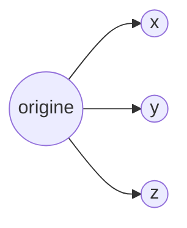
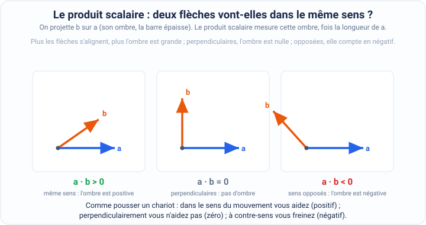
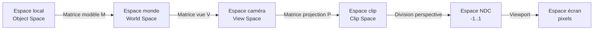

[← Introduction](01-introduction.md) · [↑ Sommaire](../README.md#table-des-matières) · [Graphiques informatiques →](03-graphiques-informatiques.md)

# 2. Bases des mathématiques

Faire bouger un personnage, viser avec une arme, faire tourner une caméra autour d'un héros : tout cela repose sur quelques objets mathématiques simples que l'on retrouve dans chaque moteur de jeu. Les **coordonnées cartésiennes** disent où se trouvent les choses, les **vecteurs** disent dans quelle direction et de combien elles se déplacent, les **matrices** servent à les faire tourner, grandir ou se déplacer toutes en même temps, et les **transformations** sont le nom général de ces mouvements. Tout part de la question la plus simple : comment décrire la position d'un point dans l'espace avec des nombres ?

### Coordonnées cartésiennes

Les coordonnées cartésiennes sont une façon de repérer un point dans l'espace en lui donnant une petite liste de nombres, comme une adresse. Au lieu d'écrire « la troisième maison après le carrefour », on écrit deux ou trois nombres qui disent exactement où aller.

> **Que veut dire « coordonnées » ?** Ce sont les nombres qui forment l'adresse d'un point. Comme sur une carte au trésor où l'on dit « avance de 3 cases vers la droite, puis de 2 cases vers le haut » : les nombres 3 et 2 sont les coordonnées de l'endroit où creuser.

> **Que veut dire « cartésiennes » ?** C'est juste le nom de la méthode, en hommage au mathématicien René Descartes qui l'a popularisée. Cela veut dire que l'on repère les points en comptant le long de lignes droites perpendiculaires (qui se croisent à angle droit, comme les bords d'une feuille).

> **Que veut dire « nombres réels » ?** Ce sont tous les nombres que l'on peut placer sur une règle graduée, sans aucun trou : les entiers (1, 2, 3), les nombres à virgule (3,5 ou -0,2), mais aussi des nombres au développement infini comme $`\pi`$ ou $`\sqrt{2}`$. En clair, n'importe quelle longueur, vitesse ou position que l'on peut imaginer dans le monde réel.

> **Le symbole $`\pi`$.** Il se prononce « pi » et vaut environ $`3{,}14159`$. C'est le nombre que l'on obtient en mesurant le tour d'un cercle (sa circonférence) puis en le divisant par sa largeur (son diamètre) : peu importe la taille du cercle, on retombe toujours sur ce même nombre. Il revient partout dès qu'il y a des cercles, des rotations ou des angles.

> **Le symbole $`\sqrt{x}`$.** Il se lit « racine carrée de $`x`$ ». C'est le nombre positif qui, multiplié par lui-même, redonne $`x`$. Par exemple $`\sqrt{9} = 3`$ parce que $`3 \times 3 = 9`$. C'est l'opération inverse du « mettre au carré ». Plus généralement, $`\sqrt[n]{x}`$ (« racine n-ième ») est le nombre positif qui donne $`x`$ quand on le multiplie $`n`$ fois par lui-même.

> **Le symbole $`|x|`$.** Il se lit « valeur absolue de $`x`$ » et désigne la version positive d'un nombre, c'est-à-dire la distance qui le sépare de zéro en oubliant le signe. Par exemple $`|-3| = 3`$ et $`|3| = 3`$. À ne pas confondre avec $`\|\mathbf{v}\|`$ (deux barres), qui apparaîtra plus loin pour désigner la **longueur d'un vecteur**.

> **Les symboles $`\approx`$, $`\equiv`$ et $`\propto`$.** $`\approx`$ se lit « à peu près égal à » (par exemple $`\pi \approx 3{,}14`$). $`\equiv`$ se lit « égal par définition » (les deux côtés sont la même chose, écrite de deux manières). $`\propto`$ se lit « proportionnel à » : quand l'un double, l'autre double aussi.

> 

> **Que veut dire « 2D » et « 3D » ?** « 2D » veut dire « deux dimensions » : un monde plat comme une feuille de papier, où l'on ne peut aller que vers la droite/gauche et vers le haut/bas. « 3D » veut dire « trois dimensions » : le monde en relief comme la vraie vie, où l'on peut en plus avancer et reculer en profondeur.

> **Que veut dire « axe » ?** Un axe est une ligne droite graduée qui sert de règle pour mesurer dans une direction. Comme la règle posée à plat sur une table pour mesurer la largeur, et une autre dressée pour mesurer la hauteur.

En **2D**, l'espace cartésien est un plan (une surface plate) avec une règle horizontale et une règle verticale qui se croisent. Les coordonnées d'un point sont alors notées $`(x, y)`$ : le premier nombre dit de combien on avance sur la règle horizontale, le second sur la règle verticale.

> **Que veulent dire « abscisse » et « ordonnée » ?** Ce sont les noms savants des deux nombres d'un point en 2D. L'**abscisse** est le nombre horizontal (de combien on va vers la droite), l'**ordonnée** le nombre vertical (de combien on monte). Un moyen de retenir : l'abscisse se lit en premier, en marchant « à plat » avant de grimper.

En **3D**, on ajoute une troisième règle, perpendiculaire aux deux autres (l'axe des $`z`$), pour mesurer la profondeur. Les coordonnées d'un point sont alors notées $`(x, y, z)`$ : trois nombres, un par direction.

> **Que veut dire « perpendiculaire » ?** Deux lignes sont perpendiculaires quand elles se croisent en formant un angle parfaitement droit (un coin carré, comme le coin d'une feuille ou l'angle d'un mur).



L'espace cartésien repose donc sur des **axes orthogonaux** et des nombres réels pour situer chaque point.

> **Que veut dire « orthogonaux » ?** C'est un autre mot pour « perpendiculaires » : des droites qui se croisent à angle droit. On garde des axes à angle droit parce que cela rend les mesures simples : avancer sur une règle ne change rien à ce qu'indiquent les autres.

Ce repérage est au cœur des jeux vidéo, surtout en 3D : il permet de décrire et de modifier les **positions** (où sont les objets), les **mouvements** (comment ils se déplacent) et les **orientations** (dans quel sens ils sont tournés) à l'intérieur du monde virtuel.

#### Conventions de repère : main droite vs main gauche, Y-up vs Z-up

Avant d'aller plus loin, il faut savoir que tous les logiciels ne placent pas les trois axes de la même façon. C'est une source d'erreurs très fréquente, alors prenons le temps de bien comprendre.

> **Que veut dire « repère » ?** Un repère, c'est l'ensemble des trois règles (les axes) et de leur point de départ commun, qui sert à mesurer les positions. C'est comme le quadrillage d'une carte : selon la carte, le « haut » et la « droite » ne sont pas forcément placés pareil.

Trois choses se choisissent et se négligent souvent à ses dépens :

1. **L'orientation du repère** : *main droite* (en anglais right-handed, abrégé RH) ou *main gauche* (left-handed, LH). Étendez les doigts de votre main droite : le pouce donne l'axe $`x`$, l'index l'axe $`y`$, le majeur l'axe $`z`$. Pour un repère « main gauche », refaites le geste avec la main gauche : l'axe $`z`$ pointe alors dans le sens opposé. C'est exactement comme un gant droit et un gant gauche, qui sont l'image l'un de l'autre dans un miroir.
2. **L'axe vertical** : *Y-up* (« Y vers le haut », l'axe $`y`$ pointe vers le ciel) ou *Z-up* (« Z vers le haut », c'est l'axe $`z`$ qui pointe vers le ciel).
3. **Le sens de rotation positif** : antihoraire (sens inverse des aiguilles d'une montre, choix habituel en mathématiques) ou horaire (sens des aiguilles), selon la convention retenue.

> **Que veut dire « convention » ?** Une convention est un choix décidé à l'avance, ni vrai ni faux, mais qu'il faut respecter pour se comprendre. Comme rouler à droite ou à gauche sur la route : peu importe le choix, du moment que tout le monde dans le même pays fait pareil.

> **Que veut dire « CAO » ?** C'est la « Conception Assistée par Ordinateur » : les logiciels qui servent aux ingénieurs à dessiner des pièces mécaniques, des bâtiments ou des avions. Ils ont leurs propres habitudes, héritées du dessin technique.

Les logiciels et moteurs de jeu ne sont pas tous d'accord entre eux :

| Système                 | Orientation | Vertical         | Notes                                |
| ----------------------- | ----------- | ---------------- | ------------------------------------ |
| OpenGL, Maya, Houdini   | main droite | $`Y`$ vers le haut | Convention « graphique » historique  |
| DirectX (legacy), Unity | main gauche | $`Y`$ vers le haut | $`z`$ pointe vers l'écran              |
| Unreal Engine           | main gauche | $`Z`$ vers le haut | Hérité du moteur Quake               |
| Blender, 3ds Max, CAO   | main droite | $`Z`$ vers le haut | Hérité de la convention CAO          |
| glTF, Vulkan, WebGPU    | main droite | $`Y`$ vers le haut | Standard d'échange moderne           |

> **Que veut dire « asset » ?** En jeu vidéo, un asset (mot anglais pour « ressource ») est un élément de contenu prêt à l'emploi : un modèle 3D de personnage, une texture, un son, une animation. C'est une brique que l'on fabrique d'un côté et que l'on charge dans le moteur de l'autre.

> **Que veut dire « normale » (d'une surface) ?** La normale est une petite flèche qui sort d'une surface en pointant exactement vers l'extérieur, à angle droit. Sur un mur, la normale pointe droit devant lui ; sur le sol, elle pointe vers le haut. Le moteur s'en sert pour savoir de quel côté éclairer une surface. Si elle pointe à l'envers, l'objet paraît éclairé de l'intérieur ou devient transparent.

**Pourquoi cela compte ?** Quand on importe un modèle fait dans Blender (main droite, Z vers le haut) dans Unity (main gauche, Y vers le haut), un objet pourtant bien orienté au départ peut apparaître tourné de 90° et inversé comme dans un miroir. Les outils d'import corrigent cela automatiquement la plupart du temps, mais quand un objet arrive « couché sur le toit » ou avec ses normales retournées, c'est presque toujours de là que vient le problème.

**Conversion Z-up vers Y-up** : on échange $`y`$ et $`z`$ et on change un signe :

```math
\begin{pmatrix} x' \\ y' \\ z' \end{pmatrix}_\text{Y-up} = \begin{pmatrix} x \\ z \\ -y \end{pmatrix}_\text{Z-up}
```

**Conversion main droite vers main gauche** : on inverse un seul axe (souvent $`z`$). Attention, toutes les rotations doivent alors être inversées elles aussi, sinon elles tournent à l'envers (c'est l'effet miroir : ce qui tournait vers la droite tourne désormais vers la gauche) :

```math
\begin{pmatrix} x' \\ y' \\ z' \end{pmatrix}_\text{LH} = \begin{pmatrix} x \\ y \\ -z \end{pmatrix}_\text{RH}
```

> **Que veut dire « skybox » ?** C'est le grand décor du ciel qui entoure toute la scène d'un jeu, comme une boîte géante peinte de nuages, d'étoiles ou d'un horizon, placée tout autour du joueur. Si la convention d'axes est mauvaise, ce ciel peut se retrouver à l'envers.

> **Règle de survie.** Quand vous écrivez du code de mathématiques dans un projet, **annoncez la convention en commentaire** tout en haut du fichier (par exemple « Convention : main droite, Y vers le haut, rotation positive dans le sens antihoraire »). Une bonne partie des bugs de rotation inversée, de ciel à l'envers ou de normales retournées vient simplement d'une convention que personne n'avait écrite noir sur blanc.
>
> **Que veut dire « bug » ?** Un bug est une erreur dans un programme qui le fait se comporter autrement que prévu. Le mot vient de l'anglais pour « insecte », depuis qu'un vrai papillon coincé dans une machine avait provoqué une panne.

### Précision flottante : ce que tout dev de jeu doit savoir

Les vrais nombres réels, avec leur infinité de chiffres, n'existent pas dans un ordinateur : une machine ne dispose que d'une quantité limitée de mémoire. Elle range donc les nombres à virgule sous une forme approchée appelée **flottants IEEE 754**, et les petites imprécisions de cette forme finissent toujours par se voir dans un vrai jeu.

> **Que veut dire « en machine » ou « dans un ordinateur » ?** Cela veut dire « tel que l'ordinateur le stocke réellement dans sa mémoire ». Or sa mémoire est faite de cases en nombre fini : il ne peut donc pas garder tous les chiffres d'un nombre comme $`\pi`$, il doit l'arrondir.

> **Que veut dire « CPU » et « GPU » ?** Le **CPU** (processeur central) est le « cerveau » polyvalent de l'ordinateur, qui exécute le programme principal. Le **GPU** (processeur graphique, la carte graphique) est un cerveau spécialisé dans le dessin, capable de calculer des millions de points et de pixels en même temps pour afficher l'image.

> **Que veut dire « flottant » (nombre à virgule flottante) ?** C'est la façon dont l'ordinateur écrit un nombre à virgule en mémoire. Au lieu de fixer la virgule à un endroit précis, il la laisse « flotter » : il retient quelques chiffres importants puis, séparément, à quelle puissance de 2 il faut les multiplier. C'est exactement l'idée de l'écriture scientifique ($`3{,}5 \times 10^{2}`$ pour 350), mais en base 2.

> **Que veut dire « IEEE 754 » ?** C'est le nom de la norme internationale (publiée en 1985, mise à jour ensuite) qui dit à tous les fabricants comment ranger ces nombres flottants en mémoire, pour que les calculs donnent les mêmes résultats partout. Elle prévoit trois tailles courantes : sur 32 bits (le type `float`), sur 64 bits (le type `double`, deux fois plus précis) et sur 16 bits (le type `half`, plus petit, très utilisé sur les cartes graphiques). Un nombre flottant s'y découpe en trois morceaux : le **signe** (un bit qui dit positif ou négatif), l'**exposant** (de combien on décale la virgule) et la **mantisse** (les chiffres importants du nombre).

> **Que veut dire « bit » ?** Un bit est la plus petite information d'un ordinateur : un simple 0 ou 1, comme un interrupteur éteint ou allumé. Avec beaucoup de bits côte à côte, on code des nombres. « 32 bits » veut dire que le nombre occupe 32 de ces petits interrupteurs.

#### Représentation : le format `float` 32 bits

Un `float` (le format sur 32 bits) répartit ses 32 cases ainsi :

- **1 bit** pour le signe (positif ou négatif) ;
- **8 bits** pour l'exposant (de combien on décale la virgule) ;
- **23 bits** pour la mantisse (les chiffres importants du nombre), soit 24 chiffres utiles en comptant un premier chiffre toujours présent.

La valeur obtenue se calcule par : $`(-1)^s \times 1{,}m \times 2^{e-127}`$, où $`s`$ est le signe, $`m`$ la mantisse et $`e`$ l'exposant. Autrement dit : un signe, des chiffres, et une puissance de 2 qui place la virgule, exactement comme l'écriture scientifique.

Ce format a trois conséquences très concrètes quand on fabrique un jeu :

- **La précision est relative, pas absolue.** Cela veut dire que le `float` est très précis pour les petits nombres et de moins en moins précis pour les grands : il garde toujours le même nombre de chiffres importants, donc plus le nombre est grand, plus le « cran » entre deux valeurs voisines est gros. Tout près de zéro, deux valeurs voisines ne sont distantes que d'environ $`1{,}2 \times 10^{-7}`$. Autour de la valeur $`10\,000`$, l'écart le plus petit représentable monte déjà à environ $`6 \times 10^{-4}`$ (soit à peu près 0,6 mm si l'unité est le mètre). Autour de $`1\,000\,000`$ (une carte de jeu géante), ce même écart dépasse $`6 \times 10^{-2}`$ (environ 6 cm) : un objet lointain ne peut alors plus se placer qu'à 6 cm près, et son déplacement devient saccadé à l'œil.

> **Que veut dire « ulp » ?** C'est l'abréviation de l'anglais *unit in the last place*, c'est-à-dire « le pas entre deux nombres flottants voisins » à un endroit donné. Plus on s'éloigne de zéro, plus ce pas grandit : c'est lui qui décide de la plus petite différence que la machine sait encore distinguer.

- **L'addition n'est pas associative.** En maths, $`(a + b) + c`$ donne toujours le même résultat que $`a + (b + c)`$. Avec les flottants, ce n'est plus garanti : chaque addition arrondit un peu, et l'ordre des arrondis change le total. Concrètement, si vous ajoutez à chaque image le petit temps écoulé $`\Delta t`$ à un total qui part de zéro, les minuscules erreurs s'accumulent ; c'est pourquoi on garde le compteur de temps dans le format `double`, plus précis.

> **Que veut dire « associative » ?** Une opération est associative quand le résultat ne dépend pas de la façon dont on regroupe les calculs : $`(2+3)+4`$ et $`2+(3+4)`$ donnent tous deux 9. Les flottants brisent légèrement cette belle propriété à cause des arrondis.

> **Que veut dire « $`\Delta t`$ » (delta t) ?** La lettre grecque $`\Delta`$ (delta) veut dire « petit écart de ». $`\Delta t`$ est donc le petit temps écoulé entre deux images du jeu (souvent quelques millièmes de seconde). On l'utilise pour faire avancer les déplacements à la bonne vitesse quel que soit le nombre d'images par seconde.

- **`0.1 + 0.2` ne vaut pas exactement `0.3` pour un ordinateur.** En base 2, certaines fractions toutes simples en base 10 (comme 0,1) tombent sur un développement sans fin, un peu comme $`1/3 = 0{,}3333\ldots`$ chez nous. La machine doit les arrondir, et la somme rate la cible de très peu.

#### Le piège de la comparaison directe

Puisqu'un flottant est presque toujours légèrement arrondi, demander si deux flottants sont **exactement** égaux échoue souvent, même quand ils « devraient » l'être. La bonne méthode consiste à vérifier qu'ils sont **assez proches**, à un tout petit écart près que l'on appelle un epsilon.

> **Que veut dire « epsilon » ?** Epsilon (la lettre grecque $`\varepsilon`$) désigne ici une très petite tolérance que l'on se fixe. Au lieu de demander « ces deux nombres sont-ils identiques ? », on demande « leur différence est-elle plus petite que ce minuscule seuil ? ». C'est comme dire que deux personnes ont « la même taille » si elles diffèrent de moins d'un millimètre.

```csharp
// FAUX en général (transform.position et Mathf sont des APIs Unity/C#)
if (transform.position.y == targetHeight) { ... }

// Correct : comparer à un epsilon (Mathf.Abs, Unity)
if (Mathf.Abs(transform.position.y - targetHeight) < 1e-4f) { ... }

// Encore mieux : epsilon relatif, agnostique moteur (MathF, .NET standard)
bool ApproxEqual(float a, float b, float relTol = 1e-5f, float absTol = 1e-7f)
 => MathF.Abs(a - b) <= MathF.Max(absTol, relTol * MathF.Max(MathF.Abs(a), MathF.Abs(b)));
```

> **À retenir.** L'outil tout prêt `Mathf.Approximately` (en C# avec Unity) utilise un epsilon d'environ $`10^{-6}`$ : parfait pour des objets proches du centre du monde, mais inadapté pour comparer des positions situées à plusieurs kilomètres (l'epsilon y devient trop petit devant les écarts naturels). Dans ce cas, il vaut mieux écrire son propre comparateur, comme le `ApproxEqual` ci-dessus.

#### Catastrophic cancellation

Ce titre anglais signifie « annulation catastrophique ». L'idée : soustraire deux flottants très proches **fait perdre presque toute la précision**. Chacun avait beaucoup de chiffres fiables, mais leur différence n'en garde qu'un seul.

```text
a = 1.234567f          // 7 chiffres significatifs
b = 1.234566f          // 7 chiffres significatifs
a - b = 0.000001f      // 1 seul chiffre significatif !
```

> **Que veut dire « chiffre significatif » ?** Ce sont les chiffres qui portent vraiment de l'information dans un nombre, en partant du premier chiffre non nul. Dans 0,000001, tous les zéros du début ne servent qu'à placer la virgule : il ne reste qu'un seul chiffre réellement utile, le 1.

C'est pour cette raison que calculer la normale d'un triangle avec la formule `cross(b - a, c - a)` devient fragile lorsque les trois coins du triangle sont presque alignés : on y soustrait des positions très proches les unes des autres, et l'annulation catastrophique frappe.

> **Que veut dire « sommet » (vertex) ?** En 3D, un sommet est l'un des coins d'une forme : les trois pointes d'un triangle, les huit coins d'un cube. Les objets des jeux sont faits de milliers de petits triangles, donc de milliers de sommets.

> **Que veut dire « colinéaires » / « alignés » ?** Trois points sont alignés (colinéaires) quand on peut les relier par une seule ligne droite. Un triangle dont les trois coins sont presque alignés est tout aplati, comme une aiguille, et son orientation devient difficile à calculer précisément.

> **Que veut dire « cross » ?** C'est le nom anglais du **produit vectoriel**, une opération entre deux flèches qui sera expliquée en détail plus loin. Ici, retenez juste qu'elle sert à trouver la flèche perpendiculaire à un triangle, c'est-à-dire sa normale.

#### Open-world : la solution du repère flottant

> **Que veut dire « open-world » ?** C'est un jeu en « monde ouvert » : une carte immense que le joueur explore librement, sans couloirs imposés. Plus la carte est grande, plus les positions deviennent de grands nombres, et plus les flottants perdent en précision (on l'a vu plus haut).

Au-delà de quelques kilomètres en `float`, la solution la plus répandue est de **recentrer le repère sur le joueur**. De temps en temps (par exemple chaque fois que le joueur s'est éloigné de 1024 unités), on recalcule toutes les positions du monde par rapport à lui, et le joueur revient en $`(0, 0, 0)`$, là où la précision est maximale. *Star Citizen*, *Outerra* et *Kerbal Space Program* emploient cette astuce. Autre solution : faire les calculs en `double` (plus précis) sur le CPU, puis reconvertir en `float` juste avant d'envoyer les données au GPU pour l'affichage.

### Aléa et déterminisme

Un jeu vidéo a besoin de **hasard** partout : disposer les arbres d'une forêt, décider d'un coup critique, mélanger un paquet de cartes, fabriquer un niveau différent à chaque partie, brouiller des textures pour les rendre naturelles, varier le comportement des ennemis.

> **Que veut dire « aléa » / « aléatoire » ?** C'est ce qui relève du hasard, de l'imprévisible : un résultat que l'on ne peut pas deviner à l'avance, comme un lancer de dé ou un tirage au sort.

Mais paradoxe : ce hasard doit souvent être **reproductible**, c'est-à-dire qu'il doit pouvoir redonner exactement la même chose quand on le relance. Voici pourquoi :

- **Le replay (la rediffusion)** : rejouer l'enregistrement d'une partie doit reproduire fidèlement les mêmes événements, sinon la rediffusion ne correspondrait plus à ce qui s'est passé.
- **Le multijoueur en lockstep** : des jeux comme *Age of Empires*, *StarCraft* ou *Factorio* gardent les joueurs synchronisés en ne s'échangeant que les commandes des joueurs (qui clique où) ; tout le reste (les chocs entre objets, les ennemis, le hasard) doit alors être recalculé à l'identique sur chaque ordinateur.

> **Que veut dire « input » ?** Un input (mot anglais pour « entrée ») est une action du joueur transmise au jeu : appuyer sur une touche, bouger la souris, cliquer. En lockstep, ce sont les seules informations échangées entre les machines.

> **Que veut dire « lockstep » ?** Littéralement « marcher au pas » : tous les ordinateurs avancent la simulation au même rythme et sont obligés d'obtenir des résultats rigoureusement identiques, jusqu'au moindre bit. Le sujet est détaillé dans le chapitre Réseau.

- **La génération procédurale** : des jeux comme *Minecraft*, *Terraria* ou *No Man's Sky* doivent pouvoir recréer exactement le même monde à partir d'une même **seed**.

> **Que veut dire « génération procédurale » ?** C'est l'idée de fabriquer du contenu (un monde, un donjon, une planète) automatiquement par une recette de calcul, plutôt que de le dessiner à la main. La même recette, relancée avec les mêmes ingrédients, redonne le même résultat.

> **Que veut dire « seed » (graine) ?** Une seed est le nombre de départ donné au générateur de hasard. Comme une graine de plante : la même graine fait toujours pousser la même plante. Dans Minecraft, deux joueurs qui entrent la même seed obtiennent exactement le même monde.

Pour tout cela, on n'utilise pas un vrai hasard, mais des **PRNG**.

> **Que veut dire « PRNG » ?** C'est l'abréviation de l'anglais *pseudo-random number generator*, soit « générateur de nombres pseudo-aléatoires ». Le mot « pseudo » (« faux » en grec) est important : ces générateurs ne tirent pas un vrai hasard, ils suivent une recette de calcul fixe qui **imite** le hasard. Du coup, en repartant du même point de départ (la seed), ils refont exactement la même suite de nombres : imprévisible à l'œil, mais parfaitement reproductible.

> **Que veut dire « déterministe » ?** Un calcul est déterministe quand les mêmes données de départ donnent toujours le même résultat, sans surprise. Les PRNG sont déterministes : c'est justement ce qui les rend reproductibles.

#### Anatomie d'un PRNG

Un PRNG garde en mémoire un **état** noté $`S_n`$ (sa situation interne du moment) et, à chaque fois qu'on lui demande un nombre, il transforme cet état avec une recette fixe $`f`$ pour passer à l'état suivant :

```math
S_{n+1} = f(S_n) \qquad x_n = g(S_n)
```

Ici, $`S_{n+1}`$ est le nouvel état (obtenu en appliquant la recette $`f`$ à l'état $`S_n`$), et $`x_n`$ est le nombre que l'on voit en sortie (extrait de l'état par une seconde recette $`g`$).

> **Que veut dire « état » ?** L'état est tout ce que le générateur retient entre deux appels, sa mémoire interne. C'est comme la position d'une bille dans un labyrinthe : elle détermine où la bille ira ensuite. À partir du même état, le générateur produit toujours la même suite.

> **Le symbole $`S_n`$ et l'indice $`n`$.** Le petit nombre en bas (l'indice $`n`$) sert à numéroter les étapes : $`S_0`$ est l'état de départ, $`S_1`$ l'état suivant, $`S_2`$ celui d'après, et ainsi de suite. C'est juste une façon de dire « le $`n`$-ième de la liste ».

> **Que veut dire « fonction » / « recette » ?** Une fonction est une machine à transformer : on lui donne quelque chose en entrée, elle ressort un résultat selon une règle fixe. Une fonction de distributeur : on entre un code, on récupère un produit précis.

La **période** est le nombre de tirages que le générateur peut faire avant que sa suite ne recommence exactement à l'identique. Plus elle est grande, mieux c'est : une suite qui se répète trop tôt finit par trahir des motifs visibles.

#### Choisir un PRNG

| Algorithme             | État (bits) | Période             | Vitesse | Qualité                | Cas d'usage                          |
| ---------------------- | ----------- | ------------------- | ------- | ---------------------- | ------------------------------------ |
| **LCG**                | 32-64       | $`\le 2^{64}`$        |    | Médiocre (motifs 2D)   | À éviter, présent par héritage       |
| **Mersenne Twister**   | 19 968      | $`2^{19937}-1`$       |      | Bonne                  | `rand()` de C++/Python, surpoids RAM |
| **xorshift / xoshiro** | 64-256      | $`\ge 2^{128}-1`$     |     | Bonne                  | Rust `SmallRng`, GPU-friendly        |
| **PCG**                | 64-128      | $`\ge 2^{64}`$        |     | Excellente (BigCrush)  | Le défaut moderne (M. O'Neill, 2014) |
| **SplitMix64**         | 64          | $`2^{64}`$            |    | Bonne                  | Seeder, hachages spatiaux            |

> **Que veut dire « algorithme » ?** Un algorithme est une suite d'étapes précises pour obtenir un résultat, comme une recette de cuisine. Chaque ligne du tableau ci-dessus est une recette différente pour fabriquer du hasard.

**Comment lire ce tableau :**

- **État (bits)** : la taille de la mémoire interne du générateur. Plus elle est grande, plus la suite peut être longue avant de se répéter.
- **Période** : le nombre de tirages avant que la suite recommence exactement pareil.
- **BigCrush** : une grande batterie de tests de référence (créée par le chercheur Pierre L'Ecuyer) qui sert de juge pour repérer et recaler les générateurs de mauvaise qualité.
- **LCG** (de l'anglais *Linear Congruential Generator*, « générateur congruentiel linéaire ») : la recette $`S_{n+1} = (a \cdot S_n + c) \bmod m`$, l'une des plus anciennes et des plus simples.

> **Le symbole $`\bmod`$.** « $`\bmod`$ » veut dire « modulo » : c'est le **reste** d'une division. Par exemple $`14 \bmod 12 = 2`$, comme une horloge où après 12 on revient à 1. Ici, le modulo sert à garder le résultat dans une plage de valeurs limitée.

> **Que veut dire « cryptographiquement sûr » ?** Cela veut dire « assez imprévisible pour résister à un tricheur déterminé ». Un PRNG ordinaire est facile à deviner si l'on connaît son fonctionnement ; un générateur dit cryptographiquement sûr est conçu pour qu'on ne puisse pas prédire le prochain nombre, même en ayant vu les précédents.

> **Important : aucun PRNG ordinaire n'est cryptographiquement sûr.** Pour fabriquer un jeton de connexion sécurisé, ou un tirage avec de l'argent réel qui doit être certifié honnête, il faut un **CSPRNG** (l'abréviation anglaise de « générateur de nombres pseudo-aléatoires cryptographiquement sûr »). Chaque langage en fournit un tout prêt (`crypto` avec Node.js, `secrets` avec Python, `SecureRandom` avec Java, etc.). Dans la majorité des jeux sans argent réel (jeux de tir, jeux de rôle, jeux de plateforme), un PRNG ordinaire suffit largement et un CSPRNG serait un gâchis de performance. En revanche, pour les loot boxes payantes, les casinos en ligne ou tout tirage devant être certifié équitable, le CSPRNG devient indispensable.

> **Que veut dire « loot box » ?** C'est un coffre à butin que l'on ouvre dans un jeu et dont le contenu est tiré au hasard (un objet rare, courant, etc.). Quand il s'achète avec de l'argent réel, la loi exige souvent que le tirage soit prouvé honnête, d'où le besoin d'un générateur sûr.

#### Seeder proprement

> **Que veut dire « seeder » ?** C'est l'action de donner sa seed (sa graine de départ) au générateur. Bien seeder, c'est choisir ce point de départ avec soin.

Une seed mal choisie « fausse » la suite (on dit qu'elle la **biaise** : elle fait apparaître des régularités qui ne devraient pas être là). Deux règles simples :

1. **Ne pas se contenter de l'heure (`time()`) comme seed dans un vrai service en ligne.** Si plusieurs serveurs démarrent à la même seconde, ils partent tous de la même seed et produisent le même « hasard ». Pour un petit prototype solo, c'est sans gravité ; pour un jeu en ligne, mieux vaut mélanger plusieurs sources : l'heure, le numéro du programme en cours et un identifiant propre à la machine.

> **Que veut dire « XOR » ?** XOR (« ou exclusif ») est une petite opération qui mélange deux nombres bit à bit. On s'en sert ici pour brasser plusieurs sources ensemble afin d'obtenir une seed bien plus variée qu'une seule source.

2. **Faire passer la seed dans SplitMix64 avant de s'en servir.** SplitMix64 est une petite recette qui éparpille bien les bits. Sans elle, deux seeds presque identiques (par exemple 1 et 2) donneraient, sur certains générateurs, des suites qui se ressemblent dangereusement. SplitMix64 casse cette ressemblance.

> **Que veut dire « corrélation » ?** Deux choses sont corrélées quand elles varient ensemble, de façon liée. Ici, on ne veut surtout pas que des seeds voisines donnent des suites voisines : on cherche au contraire des suites qui n'ont aucun rapport entre elles.

```python
def splitmix64(x: int) -> int:
 x = (x + 0x9E3779B97F4A7C15) & 0xFFFFFFFFFFFFFFFF
 x = ((x ^ (x >> 30)) * 0xBF58476D1CE4E5B9) & 0xFFFFFFFFFFFFFFFF
 x = ((x ^ (x >> 27)) * 0x94D049BB133111EB) & 0xFFFFFFFFFFFFFFFF
 return x ^ (x >> 31)
```

#### Hachage spatial (PRNG sans état)

Pour un terrain infini fabriqué par le jeu, on veut un hasard propre à **chaque case** du terrain, mais **sans rien garder en mémoire** : la fonction `noise(x, y)` doit toujours renvoyer la même valeur pour une case donnée, peu importe l'ordre dans lequel on interroge les cases. L'astuce s'appelle un **hachage** : à partir des coordonnées d'une case, on calcule un grand nombre que l'on découpe ensuite en bits utiles.

> **Que veut dire « hachage » ?** Hacher, c'est passer une donnée dans un moulin à calcul qui la transforme en un nombre d'apparence quelconque, mais toujours le même pour la même donnée. Comme une empreinte digitale : chaque case du terrain reçoit la sienne, stable et reproductible, sans qu'on ait besoin de la noter quelque part.

> **Que veut dire « noise » (bruit) ?** En infographie, le « bruit » est un hasard doux et contrôlé qui sert à rendre les choses naturelles : le relief d'un terrain, les nuages, les taches d'une texture. Ici, `noise(x, y)` donne une valeur de hasard pour le point de coordonnées $`(x, y)`$.

> **Que veut dire « uint32 » ?** C'est un nombre entier positif rangé sur 32 bits (le « u » signifie « non signé », donc sans signe moins). Il peut aller de 0 à un peu plus de 4 milliards. Le hachage produit un tel nombre, dans lequel on pioche ensuite des morceaux.

```csharp
// Hachage spatial déterministe (style PCG)
uint Hash2D(int x, int y, uint seed)
{
 uint h = seed;
 h ^= (uint)x * 0x85EBCA6B;
 h ^= ((uint)y * 0xC2B2AE35) ^ (h >> 16);
 h *= 0x27D4EB2F;
 return h ^ (h >> 16);
}
float Random01(uint h) => (h >> 8) * (1f / (1u << 24));
```

C'est exactement l'idée derrière le placement des arbres dans *Minecraft* : à partir de la position d'un bloc et de la seed du monde, le hachage décide du contenu de chaque chunk, sans que le serveur ait à mémoriser quoi que ce soit.

> **Que veut dire « chunk » ?** Un chunk (« morceau » en anglais) est un petit pavé du monde que le jeu charge et calcule d'un seul tenant. Un monde immense est découpé en milliers de chunks ; on ne calcule que ceux qui entourent le joueur, le reste pouvant être recréé à l'identique plus tard grâce au hachage.

#### Distributions au-delà de l'uniforme

Un PRNG fournit naturellement des nombres **uniformes** dans l'intervalle $`[0, 1[`$.

> **Que veut dire « uniforme » ?** Cela veut dire que toutes les valeurs ont la même chance de sortir, sans favori. Comme un dé équilibré : chaque face tombe aussi souvent que les autres.

> **Que veut dire la notation $`[0, 1[`$ ?** C'est l'ensemble des nombres compris entre 0 et 1. Le crochet tourné vers l'intérieur (`[0`) veut dire « 0 est inclus » ; le crochet tourné vers l'extérieur (`1[`) veut dire « 1 est exclu ». Donc 0 peut sortir, mais jamais tout à fait 1.

Mais on a souvent besoin d'un hasard qui ne soit pas plat. Voici trois besoins classiques :

- **La loi normale.** Les valeurs « tombent en cloche » autour d'une moyenne : la plupart sont proches du centre, les extrêmes sont rares, comme la taille des adultes qui se groupe autour de 1,70 m. La **transformation de Box-Muller** fabrique de telles valeurs à partir de deux tirages uniformes $`u_1`$ et $`u_2`$ : $`z = \sqrt{-2 \ln u_1}\,\cos(2\pi u_2)`$ suit cette fameuse cloche. Pratique pour un bruit naturel ou pour disperser des tirs de façon réaliste.

> **Que veut dire « loi normale » (courbe en cloche) ?** C'est la répartition la plus courante dans la nature : beaucoup de résultats moyens au milieu, de plus en plus rares à mesure qu'on s'éloigne du centre. Tracée, elle dessine une cloche symétrique.

> **Le symbole $`\ln`$.** « $`\ln`$ » est le logarithme naturel. Sans entrer dans les détails, retenez que c'est une fonction toute prête (un bouton sur la calculatrice) qui « écrase » les grands nombres ; elle apparaît ici comme un simple ingrédient de la recette de Box-Muller.

- **Le choix pondéré.** Par exemple le butin d'un boss : 1 % de chance d'objet légendaire, 10 % d'épique, et ainsi de suite. On empile les pourcentages bout à bout, on tire un nombre au hasard, et on regarde dans quelle tranche il tombe. Pour un très grand nombre d'objets, la **méthode alias de Walker** rend chaque tirage quasi instantané après une préparation initiale.

> **Que veut dire « pondéré » ?** Pondérer, c'est donner plus de poids (plus de chances) à certains résultats qu'à d'autres. Un tirage pondéré n'est pas équitable exprès : l'objet courant doit sortir bien plus souvent que l'objet légendaire.

> **Que veulent dire $`O(1)`$ et $`O(n)`$ ?** C'est une façon de noter la rapidité d'un calcul selon la quantité de données $`n`$. $`O(1)`$ (« temps constant ») veut dire que le temps ne dépend pas de la taille des données : aussi rapide avec 10 objets qu'avec un million. $`O(n)`$ veut dire que le temps grandit proportionnellement au nombre d'objets. Plus le temps reste petit quand $`n`$ grandit, mieux c'est.

- **L'échantillonnage de Poisson.** Il sert à éparpiller des objets sans qu'ils se collent ni s'amassent en grappes, par exemple disposer des arbres dans une forêt sans que deux ne se chevauchent. La technique de référence, le **Poisson disk sampling**, garantit une distance minimale entre les points. **L'algorithme de Bridson** en donne une version rapide : on garde une réserve de points « actifs », on tente de nouveaux points tout autour, et on n'accepte un candidat que s'il est assez loin de tous les points déjà posés (vérifié vite grâce à une grille). Très utilisé pour semer des arbres, des étoiles ou des nuages de façon naturelle.

### Trigonométrie

La trigonométrie étudie le lien entre les **angles** et les **longueurs** dans un triangle. Cela paraît abstrait, mais c'est partout dans un jeu : faire tourner une image, lancer un projectile dans la bonne direction, faire osciller un objet de gauche à droite, calculer sous quel angle viser une cible.

> **Que veut dire « trigonométrie » ?** Le mot vient du grec « mesure des triangles ». C'est la boîte à outils qui relie un angle (une ouverture, mesurée en degrés) aux longueurs des côtés d'un triangle. Connaître l'un permet de retrouver les autres.

> **Que veut dire « angle » ?** Un angle mesure l'écartement entre deux directions, l'ouverture d'un coin. Un quart de tour fait 90 degrés (un coin carré), un demi-tour 180 degrés, un tour complet 360 degrés.

> **Que veut dire « sprite » ?** Un sprite est une petite image plate (2D) affichée dans un jeu : un personnage, un ennemi, une icône, dessinés comme un autocollant que l'on déplace à l'écran.

#### Le cercle trigonométrique

Imaginons un cercle de rayon 1 centré sur le point de départ du repère. On part de la droite et on tourne d'un certain angle, noté $`\theta`$. Le point ainsi atteint sur le cercle a pour coordonnées :

```math
(x, y) = (\cos\theta,\ \sin\theta)
```

> **Que veut dire « cercle unité » ?** C'est tout simplement un cercle dont le rayon vaut 1 (une unité). On le choisit parce que ce 1 simplifie toutes les formules : les longueurs deviennent directement des proportions.

> **Que veut dire « origine » ?** L'origine est le point de départ du repère, là où toutes les règles se croisent : ses coordonnées sont $`(0, 0)`$ en 2D. C'est le « zéro » de l'espace.

> **Le symbole $`\theta`$.** $`\theta`$ (la lettre grecque « thêta ») sert presque toujours à nommer un angle. C'est une convention, comme on appelle souvent une longueur inconnue $`x`$.

> **Que veulent dire $`\cos`$ et $`\sin`$ ?** « $`\cos`$ » (cosinus) et « $`\sin`$ » (sinus) sont deux fonctions liées à un angle. Sur le cercle de rayon 1, après avoir tourné d'un angle $`\theta`$, le cosinus donne la position horizontale du point atteint et le sinus sa position verticale. Ce sont des boutons de la calculatrice : on entre un angle, on obtient un nombre entre -1 et 1.

> **Que veulent dire « radian » et « degré » ?** Ce sont deux unités pour mesurer un angle, comme les kilomètres et les miles pour les distances. Le degré est familier (un tour = 360°). Le radian est l'unité préférée des ordinateurs : un tour complet vaut $`2\pi`$ radians. Pour convertir des degrés en radians, on multiplie par $`\dfrac{\pi}{180}`$ : $`\theta_\text{rad} = \theta_\text{deg} \times \dfrac{\pi}{180}`$.

#### Fonctions trigonométriques

Dans un triangle rectangle (un triangle avec un angle droit), pour un angle $`\theta`$ choisi, on nomme les trois côtés selon leur position par rapport à cet angle :

> **Que veut dire « triangle rectangle » ?** C'est un triangle dont l'un des coins forme un angle droit (un coin carré, 90°). Comme une équerre ou la moitié d'une feuille coupée en diagonale.

> **Que veulent dire « hypoténuse », « côté opposé » et « côté adjacent » ?** L'**hypoténuse** ($`h`$) est le plus long côté, celui qui fait face à l'angle droit. Le côté **opposé** ($`o`$) est celui qui se trouve en face de l'angle $`\theta`$. Le côté **adjacent** ($`a`$) est celui qui touche l'angle $`\theta`$ (sans être l'hypoténuse). « Adjacent » veut dire « à côté de ».

Les trois fonctions de base se définissent alors comme des rapports entre ces côtés :

```math
\sin\theta = \frac{o}{h}, \quad \cos\theta = \frac{a}{h}, \quad \tan\theta = \frac{o}{a} = \frac{\sin\theta}{\cos\theta}
```

> **Que veut dire $`\tan`$ ?** « $`\tan`$ » est la tangente, la troisième fonction. Elle vaut le côté opposé divisé par le côté adjacent, ce qui revient aussi à diviser le sinus par le cosinus. Elle décrit la « pente » de la direction donnée par l'angle.

#### Identités utiles

> **Que veut dire « identité » (en maths) ?** Une identité est une égalité toujours vraie, quelle que soit la valeur des angles. Ce sont des règles fiables que l'on peut réutiliser sans crainte.

La première relie sinus et cosinus d'un même angle :

```math
\sin^2\theta + \cos^2\theta = 1
```

Elle n'a rien de mystérieux : sur le cercle de rayon 1, le point $`(\cos\theta, \sin\theta)`$ est à distance 1 du centre. Le théorème de Pythagore (le carré de l'hypoténuse égale la somme des carrés des deux autres côtés) donne alors exactement $`\cos^2\theta + \sin^2\theta = 1^2`$.

> **La notation $`\sin^2\theta`$.** Cela veut dire $`(\sin\theta)^2`$, c'est-à-dire le sinus de l'angle, multiplié par lui-même. Le petit 2 placé en haut indique « au carré ».

Les deux suivantes donnent le sinus et le cosinus d'une **somme** de deux angles $`\alpha`$ et $`\beta`$, ce qui sert dès qu'on combine deux rotations :

```math
\sin(\alpha + \beta) = \sin\alpha\cos\beta + \cos\alpha\sin\beta
```

```math
\cos(\alpha + \beta) = \cos\alpha\cos\beta - \sin\alpha\sin\beta
```

> **Les symboles $`\alpha`$ et $`\beta`$.** Ce sont les lettres grecques « alpha » et « bêta ». Comme $`\theta`$, on s'en sert couramment pour nommer des angles ; ici, deux angles différents que l'on additionne.

#### Exemple : déplacement d'un projectile

Voici un cas très concret. On tire un projectile avec une certaine vitesse $`v`$, dans une direction donnée par l'angle $`\theta`$. Pour savoir de combien il avance horizontalement et verticalement à chaque instant, on découpe sa vitesse en deux morceaux :

```math
v_x = v \cos\theta, \quad v_y = v \sin\theta
```

C'est exactement la même idée que le point sur le cercle : le cosinus s'occupe de l'horizontal, le sinus du vertical. Si l'on tire tout droit vers la droite ($`\theta = 0`$), toute la vitesse part à l'horizontale et rien à la verticale, ce que confirme la formule.

```csharp
float angleRad = angleDeg * MathF.PI / 180f;
Vector2 velocity = new Vector2(
 speed * MathF.Cos(angleRad),
 speed * MathF.Sin(angleRad)
);
```

#### atan2 : l'incontournable

On vient de voir comment passer d'un angle à une direction. Le problème inverse, retrouver l'angle d'une direction donnée par $`(x, y)`$, se résout avec l'outil `atan2(y, x)` plutôt qu'avec `atan(y/x)`. La raison : `atan2` connaît les signes de $`x`$ et de $`y`$, donc il sait dans quel coin du plan (quel quadrant) pointe la direction, et il gère même le cas délicat où $`x = 0`$ (division impossible) :

```math
\theta = \mathrm{atan2}(y, x) \in (-\pi,\ \pi]
```

> **Que veut dire « atan2 » ?** C'est la fonction « arc-tangente à deux arguments ». À partir des deux nombres $`x`$ et $`y`$ d'une direction, elle redonne l'angle correspondant. On lui passe $`y`$ puis $`x`$ (dans cet ordre), et elle renvoie l'angle, compris entre $`-\pi`$ et $`\pi`$ (soit entre un demi-tour à gauche et un demi-tour à droite).

> **Que veut dire « quadrant » ?** Les deux axes découpent le plan en quatre quartiers, appelés quadrants (comme les quatre parts d'une tarte coupée en croix). Selon le quart où l'on regarde, l'angle n'est pas le même : c'est pour cela qu'il faut connaître les signes de $`x`$ et $`y`$, et non juste leur rapport.

C'est l'outil parfait pour orienter un personnage ou une arme vers une cible : on calcule la direction qui sépare le personnage de la cible, et `atan2` donne l'angle vers lequel le tourner.

### Vecteurs

Un vecteur est un objet qui porte deux informations à la fois : une **longueur** (sa magnitude) et une **direction** (le sens dans lequel il pointe). On le dessine comme une flèche. Les vecteurs servent à décrire la position d'un objet, sa vitesse, son accélération et bien d'autres grandeurs, en 2D comme en 3D.

> **Que veut dire « vecteur » ?** C'est une flèche mathématique. Elle dit deux choses en même temps : dans quelle direction on va, et de combien. « Avancer de 3 pas vers le nord-est » est typiquement un vecteur.

> **Que veut dire « magnitude » ?** C'est simplement la longueur du vecteur, la taille de la flèche. Pour un vecteur vitesse, c'est la rapidité ; pour un vecteur déplacement, c'est la distance parcourue.

> **Que veut dire « direction » ?** C'est le sens vers lequel pointe la flèche, indépendamment de sa longueur. Deux flèches de tailles différentes mais qui pointent vers le même endroit ont la même direction.

> **Que veut dire « repère orthonormé » ?** C'est un repère soigné, idéal pour les calculs : ses axes sont à angle droit (« ortho ») et ils utilisent tous la même unité de mesure, fixée à 1 (« normé »). Comme du papier quadrillé avec des carreaux parfaitement carrés et tous identiques.


On écrit le plus souvent un vecteur sous forme de **colonne**, c'est-à-dire ses nombres empilés les uns au-dessus des autres :

```math
V =
\begin{pmatrix}
v_1 \\
v_2 \\
\vdots \\
v_n
\end{pmatrix}
```

où chaque $`v_i`$ est une **composante** du vecteur $`V`$ : $`v_1`$ est la première, $`v_2`$ la deuxième, et ainsi de suite. Ce vecteur possède $`n`$ composantes, rangées verticalement en une seule colonne.

> **Que veut dire « composante » ?** Une composante est l'un des nombres qui forment le vecteur ; elle dit de combien le vecteur avance le long d'un axe précis. Mises ensemble, les composantes donnent à la flèche sa direction et sa longueur. C'est comme décrire un déplacement en deux temps : « 3 cases vers la droite » et « 2 cases vers le haut » sont les deux composantes du déplacement.

> **Que veut dire l'indice $`i`$ dans $`v_i`$ ?** Le petit $`i`$ en bas est un numéro qui désigne « la $`i`$-ème composante » sans en fixer une en particulier. C'est une façon économique de parler de n'importe laquelle d'entre elles d'un coup.

> **Le symbole $`\vdots`$.** Ces trois points verticaux veulent dire « et ainsi de suite jusqu'au dernier », pour ne pas avoir à écrire toutes les composantes intermédiaires quand il y en a beaucoup.

Concrètement : un vecteur en 2D a deux composantes (sa valeur le long de $`x`$ et de $`y`$), un vecteur en 3D en a trois (le long de $`x`$, $`y`$ et $`z`$). Plus généralement, un vecteur dans un espace à $`n`$ dimensions a $`n`$ composantes.


#### Magnitude

Comment mesurer la longueur d'une flèche à partir de ses composantes ? La formule, valable pour un vecteur de $`n`$ composantes, est la suivante :

```math
\left\Vert\mathbf{v}\right\Vert = \sqrt{\sum_{i=1}^{n} v_i^2}
```

Lisons-la morceau par morceau.

> **Le symbole $`\left\Vert\mathbf{v}\right\Vert`$.** Les deux barres de chaque côté du vecteur signifient « longueur de » : $`\left\Vert\mathbf{v}\right\Vert`$ se lit « la longueur (ou norme) du vecteur $`\mathbf{v}`$ ». On dit aussi « magnitude ». Attention à ne pas confondre avec une seule barre $`|x|`$, qui était la valeur absolue d'un simple nombre.

> **Que veut dire « norme » ?** C'est un synonyme savant de « longueur du vecteur ». Normer un vecteur, plus loin, voudra dire le ramener à une longueur de 1.

> **Le symbole $`\sum`$.** C'est un grand S grec (« sigma ») qui veut dire « somme » : il demande d'additionner une série de termes. Le $`i=1`$ écrit en dessous et le $`n`$ écrit au-dessus indiquent par où commencer et où s'arrêter. Ici, on additionne les carrés des composantes, de la première ($`i=1`$) jusqu'à la dernière ($`i=n`$).

> **La notation $`v_i^2`$.** $`v_i`$ est la $`i`$-ème composante du vecteur, et le petit 2 en haut veut dire « au carré » (le nombre multiplié par lui-même).

Pourquoi mettre les composantes au carré, puis prendre la racine à la fin ? Le carré joue deux rôles : il rend tout positif (un déplacement vers la gauche compte autant qu'un déplacement vers la droite), et il prépare l'application du théorème de Pythagore. La racine carrée annule ensuite ces carrés pour redonner une vraie longueur, dans la bonne unité.

Pour un vecteur 2D représenté par les coordonnées $`(x, y)`$, la magnitude est donnée par :

```math
\left\Vert\mathbf{v}\right\Vert = \sqrt{\sum_{i=1}^{2} v_i^2} = \sqrt{v_1^2 + v_2^2}
```

En effet, dans un espace 2D on a $`n = 2`$ ; dans un espace 3D, $`n = 3`$, et ainsi de suite.

La longueur d'un vecteur 2D est donc la racine carrée de la somme des carrés de ses deux composantes. C'est exactement le théorème de Pythagore : la flèche est l'**hypoténuse** d'un triangle rectangle dont les deux autres côtés sont les composantes $`x`$ et $`y`$. Mesurer un vecteur revient à mesurer cette diagonale.

##### Une représentation possible en C\#

```csharp
using TansoftwareEngine;

public class Game : GameEngine
{
 void Start()
 {
 Vector3 position = new Vector3(1.0f, 2.0f, 3.0f);
 Player myPlayer = new Player();

 myPlayer.setPosition(position);
 }
}
```

> **Comment lire ce code ?** La classe `Game` crée une position, qui est un vecteur à trois nombres, et la donne au joueur. Le premier nombre (`1.0f`) est la position horizontale (l'abscisse $`x`$), le deuxième (`2.0f`) la position verticale (l'ordonnée $`y`$), et le troisième (`3.0f`) la profondeur, c'est-à-dire l'éloignement par rapport à la caméra.

> **Que veut dire « classe » et « instancier » ?** En programmation, une **classe** est un moule, un plan de fabrication (ici, le plan d'un joueur). **Instancier**, c'est fabriquer un objet réel à partir de ce moule (un joueur concret avec sa position). Le `f` après les nombres signale simplement qu'ils sont du type `float`.

Calculons sa longueur (sa magnitude) en appliquant la formule vue plus haut :

```math
\|\mathbf{v}\| = \sqrt{\sum_{i=1}^{3} v_i^2} = \sqrt{1{,}0^2 + 2{,}0^2 + 3{,}0^2} \approx 3{,}74
```

On met chaque composante au carré ($`1`$, $`4`$ et $`9`$), on additionne ($`14`$), puis on prend la racine carrée, ce qui donne environ $`3{,}74`$.

Pourquoi se compliquer la vie avec des vecteurs au lieu de manipuler les nombres un par un ? Parce qu'un vecteur regroupe ces nombres en un seul objet que l'on peut additionner, étirer ou faire tourner d'un coup, avec des règles toutes prêtes. Les trois opérations de base, addition, soustraction et multiplication par un scalaire, suffisent déjà à décrire une grande partie des déplacements et des transformations d'un jeu.

#### Addition et soustraction de vecteurs

Pour additionner ou soustraire deux vecteurs, on traite chaque axe séparément : on additionne (ou soustrait) les composantes qui vont ensemble.

> **La notation $`\mathbf{u}`$ et $`\mathbf{v}`$.** Les lettres en gras désignent des vecteurs (des flèches), pour les distinguer des nombres ordinaires. $`u_x`$, $`u_y`$, $`u_z`$ sont les trois composantes du vecteur $`\mathbf{u}`$ le long des axes $`x`$, $`y`$ et $`z`$.

- **Addition** : $`\mathbf{u} + \mathbf{v} = (u_x + v_x,\ u_y + v_y,\ u_z + v_z)`$
- **Soustraction** : $`\mathbf{u} - \mathbf{v} = (u_x - v_x,\ u_y - v_y,\ u_z - v_z)`$

On peut s'imaginer additionner deux vecteurs en mettant les flèches bout à bout : la flèche résultante va du tout début au tout dernier bout. Soustraire revient à parcourir la seconde flèche à l'envers.



#### Multiplication par un scalaire

> **Que veut dire « scalaire » ?** Un scalaire est un simple nombre, une quantité sans direction (par opposition au vecteur, qui a une direction). Par exemple 2, ou -0,5. Le mot vient de « échelle » : un scalaire sert souvent à mettre un vecteur à l'échelle, c'est-à-dire à l'agrandir ou à le rétrécir.

Pour multiplier un vecteur par un scalaire, on multiplie chacune de ses composantes par ce nombre :

- **Multiplication par un scalaire** : $`a \cdot \mathbf{v} = (a \cdot v_x,\ a \cdot v_y,\ a \cdot v_z)`$

Le résultat pointe dans la même direction, mais sa longueur est multipliée par $`a`$ : avec $`a = 2`$ la flèche double, avec $`a = 0{,}5`$ elle est réduite de moitié, et avec un $`a`$ négatif elle se retourne dans le sens opposé.

#### Produit scalaire

Le **produit scalaire** prend deux vecteurs et, contrairement aux opérations précédentes, ne rend pas un vecteur mais un simple nombre. On peut le calculer de deux manières, qui donnent toujours le même résultat :

```math
\mathbf{u} \cdot \mathbf{v} = u_x v_x + u_y v_y + u_z v_z = \|\mathbf{u}\|\,\|\mathbf{v}\|\,\cos\theta
```

> **Que veut dire « produit scalaire » ?** C'est une façon de multiplier deux vecteurs dont le résultat est un scalaire (un nombre, d'où le nom). À gauche de l'égalité, la recette « par composantes » : on multiplie les composantes deux à deux puis on additionne. À droite, la même valeur exprimée avec les longueurs des deux flèches et l'angle $`\theta`$ entre elles.

Ce nombre mesure à quel point les deux flèches pointent dans la même direction. Quand elles sont alignées, l'angle $`\theta`$ vaut 0, son cosinus vaut 1, et le produit scalaire est maximal. Quand elles sont opposées, le cosinus vaut -1 et le produit est très négatif. Et quand elles forment un angle droit, le cosinus vaut 0 : le produit scalaire est donc nul.

> **Que veut dire « orthogonaux » (pour deux vecteurs) ?** Cela veut dire perpendiculaires : ils forment un angle droit. La deuxième forme de la formule explique pourquoi un produit scalaire nul signale deux vecteurs perpendiculaires : c'est le cas où $`\cos\theta = 0`$.

Ces deux usages, mesurer l'angle entre deux directions et tester si elles sont perpendiculaires, font du produit scalaire un outil que l'on retrouve partout : savoir si un ennemi est devant ou derrière le joueur, calculer la quantité de lumière reçue par une surface, et bien plus.



#### Produit vectoriel

Le **produit vectoriel** prend lui aussi deux vecteurs, mais il rend un troisième vecteur, perpendiculaire aux deux premiers à la fois. Autrement dit, à partir de deux flèches posées sur une table, il fabrique une flèche qui pointe droit vers le haut (ou vers le bas).

```math
\mathbf{u} \times \mathbf{v} = (u_y v_z - u_z v_y,\ u_z v_x - u_x v_z,\ u_x v_y - u_y v_x)
```

> **Que veut dire « produit vectoriel » ?** C'est une autre multiplication de deux vecteurs, mais dont le résultat est un vecteur (d'où le nom), perpendiculaire au plan formé par les deux vecteurs de départ. Le symbole de la croix $`\times`$ le distingue du produit scalaire, noté par un point.

> **Le symbole $`\times`$.** Entre deux vecteurs, il note le produit vectoriel (et non une simple multiplication de nombres). C'est pourquoi on le lit « u croix v ».



À quoi sert cette flèche perpendiculaire ? Surtout à calculer la **normale** d'un triangle, cette petite flèche qui indique de quel côté la surface fait face, indispensable pour l'éclairage. Il sert aussi à déterminer un **sens de rotation** (dans quel sens on tourne) et à bâtir un repère local soigné à partir de deux directions.

### Interpolation

L'**interpolation** consiste à trouver une valeur intermédiaire entre deux valeurs connues. C'est l'une des opérations les plus courantes dans un jeu : une caméra qui rattrape le joueur en douceur, un fondu d'image, un dégradé de couleur, ou le lissage d'un déplacement reçu par le réseau.

> **Que veut dire « interpolation » ?** C'est l'art de remplir l'espace entre deux valeurs. Si une lampe doit passer d'éteinte (0) à allumée à fond (1), l'interpolation donne tous les niveaux intermédiaires (à moitié allumée, aux trois quarts, etc.) pour une transition progressive plutôt qu'un saut brutal.

#### Interpolation linéaire (LERP)

La forme la plus simple, l'interpolation **linéaire**, relie deux valeurs $`A`$ et $`B`$ à l'aide d'un curseur $`t`$ qui va de 0 à 1 :

```math
\mathrm{lerp}(A, B, t) = (1 - t) \cdot A + t \cdot B = A + t \cdot (B - A)
```

> **Que veut dire « LERP » et « linéaire » ?** « LERP » est l'abréviation de l'anglais *linear interpolation*. « Linéaire » veut dire « en ligne droite, à vitesse constante » : on avance de $`A`$ vers $`B`$ régulièrement, sans accélérer ni ralentir.

> **Le paramètre $`t`$ et la notation $`t \in [0, 1]`$.** $`t`$ est un curseur de réglage, comme un bouton qui coulisse. Le symbole $`\in`$ se lit « appartient à » ; $`t \in [0, 1]`$ veut donc dire « $`t`$ est un nombre entre 0 et 1, bornes comprises ». À 0 on est au début, à 1 à la fin.

Les deux écritures à droite du premier signe égal sont la même chose, présentées différemment. La seconde, $`A + t \cdot (B - A)`$, se lit très bien : on part de $`A`$, et on ajoute une fraction $`t`$ de tout le chemin qui mène à $`B`$. Les valeurs clés :

- $`t = 0`$ donne exactement $`A`$ (on n'a pas bougé) ;
- $`t = 1`$ donne exactement $`B`$ (on a fait tout le chemin) ;
- $`t = 0{,}5`$ donne le point situé pile au milieu entre $`A`$ et $`B`$.

```csharp
// Vector3 disponible dans System.Numerics (.NET) et dans Unity
float Lerp(float a, float b, float t) => a + (b - a) * t;
Vector3 LerpVec(Vector3 a, Vector3 b, float t) => a + (b - a) * t;
```

#### Inverse-LERP

L'opération inverse répond à la question miroir : connaissant $`A`$, $`B`$ et une valeur courante $`V`$ située entre les deux, à quelle position du curseur $`t`$ cela correspond-il ?

```math
\mathrm{invLerp}(A, B, V) = \frac{V - A}{B - A}
```

L'idée est simple : on regarde quelle fraction du chemin total ($`B - A`$) on a déjà parcourue depuis $`A`$ (soit $`V - A`$). Par exemple, à mi-chemin, le résultat vaut $`0{,}5`$. C'est très utile pour transformer une valeur quelconque (une vie qui passe de 0 à 100) en une proportion entre 0 et 1 (pour remplir une barre de vie).

#### Interpolation sphérique (SLERP)

Quand on interpole non pas des positions mais des **directions** ou des **rotations**, la ligne droite ne convient plus : sur une sphère, suivre une corde droite ferait varier la vitesse de rotation de façon disgracieuse. On utilise alors le **SLERP**, qui suit le chemin courbe le plus naturel sur la sphère. La formule complète est donnée plus loin, dans la [section Quaternions](#interpolation--slerp), où elle prend tout son sens.

> **Que veut dire « SLERP » et « sphérique » ?** « SLERP » abrège l'anglais *spherical linear interpolation*, soit « interpolation linéaire sphérique ». « Sphérique » parce que l'on se déplace à la surface d'une sphère, le long du plus court arc, à vitesse de rotation régulière, comme un avion qui suit la courbure de la Terre.

#### Easing : interpolation non-linéaire

> **Qu'est-ce que l'easing ?** Le mot anglais *easing* veut dire « adoucissement ». Dans la vraie vie, rien ne démarre à pleine vitesse ni ne s'arrête pile : une voiture accélère puis freine, un objet rebondit, une porte de placard se referme avec un petit ralenti final. Or un LERP « tout droit » donne un mouvement raide, robotique. Les fonctions d'easing courbent le curseur $`t`$ avant l'interpolation, pour imiter ces accélérations et ralentissements naturels. On les retrouve dans les animations des sites web, des téléphones, des caméras de jeu, bref dans à peu près toutes les interfaces modernes.

> **Que veut dire « CSS » ?** CSS est le langage qui décrit l'apparence des pages web (couleurs, tailles, animations). Les transitions douces que l'on voit sur un site (un bouton qui change de couleur en fondu) sont souvent des fonctions d'easing écrites en CSS.

Le principe est toujours le même : on garde le curseur $`t`$ entre 0 et 1, mais on le fait d'abord passer par une fonction courbe $`f`$ avant d'interpoler, ce qui revient à calculer `lerp(A, B, f(t))`. Voici quelques courbes classiques :

```math
\text{easeInQuad}(t) = t^2
```

départ lent, arrivée brutale (au début, $`t^2`$ est minuscule, donc on bouge à peine ; puis il grimpe vite).

> **Que veut dire « Quad » dans ces noms ?** « Quad » fait référence au carré ($`t`$ élevé à la puissance 2). « In » veut dire que l'effet d'adoucissement est au départ, « Out » qu'il est à l'arrivée, et « InOut » aux deux extrémités.

```math
\text{easeOutQuad}(t) = 1 - (1 - t)^2
```

départ rapide, arrivée en douceur.

```math
\text{easeInOutQuad}(t) = \begin{cases} 2t^2 & \text{si } t < 0{,}5 \\ 1 - 2(1-t)^2 & \text{sinon} \end{cases}
```

départ et arrivée en douceur, vitesse maximale au milieu.

> **Que veut dire l'accolade `{` avec deux lignes ?** Cette grande accolade signifie « la formule dépend du cas ». On lit : si $`t`$ est plus petit que $`0{,}5`$, on applique la première ligne ; sinon, la seconde. C'est une formule à deux comportements, l'un pour la première moitié du mouvement, l'autre pour la seconde.

```math
\text{smoothstep}(t) = 3t^2 - 2t^3
```

> **Que veut dire « dérivée » ?** La dérivée d'une quantité mesure sa vitesse de variation à un instant donné. Pour une position, la dérivée est la vitesse. Dire « la dérivée vaut zéro aux bords » revient à dire « ça démarre et ça s'arrête tout en douceur, sans à-coup ».

> **Pourquoi `smoothstep` est partout en graphisme ?** Parce que sa vitesse (sa dérivée) vaut exactement 0 au tout début ($`t=0`$) et à la toute fin ($`t=1`$), et grimpe au maximum ($`1{,}5`$) au milieu. Concrètement, l'animation part de l'arrêt complet, accélère, puis s'arrête en douceur : aucune cassure visible à l'œil. Sa cousine `smootherstep` (formule $`6t^5 - 15t^4 + 10t^3`$) va encore plus loin (sa vitesse et son accélération sont nulles aux bords), pour quelques calculs de plus. C'est la fonction d'adoucissement préférée des shaders et de la génération de décors.
>
> **Pour aller plus loin.** Le site [easings.net](https://easings.net/) montre en images tous les adoucissements classiques (sinusoïdal, cubique, exponentiel, élastique, rebond) et donne leur code prêt à copier. C'est la référence des animateurs d'interface.

#### Courbes de Bézier

Pour des trajectoires courbes plus libres (le chemin d'une caméra, l'animation d'un menu), on utilise des **courbes de Bézier**. L'idée : on place quelques points repères, et la courbe les suit harmonieusement.

> **Que veut dire « courbe de Bézier » ?** C'est une courbe lisse pilotée par quelques points. On nomme « points de contrôle » ces points : les deux extrémités fixent le départ et l'arrivée, les points intermédiaires « tirent » la courbe vers eux comme des aimants, sans qu'elle passe forcément par eux. Ces courbes ont été mises au point chez Renault par l'ingénieur Pierre Bézier pour dessiner des carrosseries.

> **Que veut dire « UI » ?** « UI » abrège l'anglais *user interface*, l'interface utilisateur : tout ce avec quoi le joueur interagit à l'écran (menus, boutons, barres de vie). Animer l'UI, c'est faire bouger ces éléments avec douceur.

La forme la plus courante, dite **cubique**, relie un point de départ $`P_0`$ à un point d'arrivée $`P_3`$, guidée par deux points de contrôle intermédiaires $`P_1`$ et $`P_2`$ :

```math
B(t) = (1-t)^3 P_0 + 3(1-t)^2 t P_1 + 3(1-t)t^2 P_2 + t^3 P_3, \quad t \in [0, 1]
```

> **Que veut dire « cubique » ?** Cela veut dire que la formule fait intervenir le curseur $`t`$ jusqu'à la puissance 3 (au cube). Plus le degré est élevé, plus la courbe peut faire d'ondulations.

> **La notation $`P_0, P_1, P_2, P_3`$.** Ce sont les points repères, numérotés par leur indice. $`P_0`$ est le point de départ, $`P_3`$ le point d'arrivée, $`P_1`$ et $`P_2`$ les deux aimants intermédiaires.

Le mécanisme est élégant : quand $`t = 0`$, seul le terme devant $`P_0`$ subsiste, donc la courbe part de $`P_0`$ ; quand $`t = 1`$, seul celui devant $`P_3`$ reste, donc elle arrive en $`P_3`$. Entre les deux, les quatre points se partagent l'influence selon des proportions qui évoluent en douceur.

##### Forme générale (degré $`n`$) et polynômes de Bernstein

On peut généraliser à un degré quelconque $`n`$, avec $`n+1`$ points de contrôle. La courbe est alors une moyenne pondérée des points, où les poids sont fournis par des fonctions toutes prêtes appelées **polynômes de Bernstein**, notés $`B_{i,n}(t)`$ :

```math
B(t) = \sum_{i=0}^{n} B_{i,n}(t)\,P_i, \qquad B_{i,n}(t) = \binom{n}{i} (1-t)^{n-i}\,t^{\,i}
```

> **Que veut dire « polynôme » ?** Un polynôme est une expression faite d'additions et de puissances d'une variable (comme $`3t^2 - 2t + 1`$). Les polynômes de Bernstein sont une famille particulière de tels calculs, qui doivent leur nom au mathématicien Sergueï Bernstein ; ici, ils servent à doser l'influence de chaque point de contrôle selon la position du curseur $`t`$.

> **Le symbole $`\binom{n}{i}`$.** Ce nombre, lu « $`i`$ parmi $`n`$ », compte de combien de façons on peut choisir $`i`$ objets parmi $`n`$. C'est un simple coefficient (un nombre entier) qui équilibre la formule pour que les poids s'additionnent toujours à 1.

Trois propriétés expliquent pourquoi ces courbes sont partout en infographie :

- **Elles restent dans l'enveloppe convexe des points de contrôle.** Autrement dit, la courbe ne s'échappe jamais hors de la zone délimitée par ses points repères, ce qui aide à savoir rapidement si elle est visible ou non à l'écran (le « culling »).

> **Que veut dire « enveloppe convexe » ?** C'est la plus petite forme sans creux qui entoure un ensemble de points, comme un élastique tendu autour de clous plantés dans une planche. La courbe reste sagement à l'intérieur de cet élastique.

> **Que veut dire « culling » ?** « Culling » (de l'anglais « écarter ») désigne le fait de ne pas calculer ni dessiner ce que la caméra ne voit pas, pour gagner du temps. Si l'enveloppe d'une courbe est hors de l'écran, on peut l'ignorer sans rien vérifier de plus.

- **Elles sont invariantes par transformation affine.** Cela veut dire que pour déplacer, faire tourner ou agrandir la courbe, il suffit de déplacer ses quelques points de contrôle, sans recalculer toute la courbe.

> **Que veut dire « transformation affine » ?** C'est une transformation géométrique qui conserve les lignes droites et le parallélisme : déplacement, rotation, mise à l'échelle, cisaillement. Les détails viendront dans la section sur les transformations.

- **Elles se calculent efficacement** grâce à l'**algorithme de De Casteljau**, une méthode qui n'enchaîne que des moyennes entre points. Elle évite les coefficients compliqués de la formule et reste très stable numériquement (peu sensible aux erreurs d'arrondi).

##### Élévation de degré (*degree elevation*)

L'« élévation de degré » consiste à réécrire une courbe avec un point de contrôle de plus, sans changer sa forme d'un poil. On ajoute un point repère calculé par interpolation linéaire entre les voisins :

```math
P'_i = \frac{i}{n+1}\,P_{i-1} + \left(1 - \frac{i}{n+1}\right) P_i, \quad i = 0, 1, \dots, n+1
```

À quoi cela sert-il, puisque la courbe ne bouge pas ? À deux choses. D'abord, à donner le même nombre de points de contrôle à plusieurs courbes avant de les mélanger (il faut qu'elles soient « du même degré » pour se combiner proprement). Ensuite, à offrir plus de points repères pour retoucher la courbe plus finement par la suite, sans la déformer au départ.

##### Forme de Hermite : l'autre façon de penser une cubique

Au lieu de placer deux points plus deux aimants, on peut décrire la même courbe autrement : par **deux points et deux tangentes**. C'est la **forme de Hermite cubique** :

```math
H(t) = (2t^3 - 3t^2 + 1)\,P_0 + (t^3 - 2t^2 + t)\,T_0 + (-2t^3 + 3t^2)\,P_1 + (t^3 - t^2)\,T_1
```

> **Que veut dire « tangente » ?** La tangente en un point d'une courbe est la direction dans laquelle la courbe « file » à cet endroit, comme la direction d'une voiture à un instant donné. Le vecteur tangent indique à la fois ce cap et la vitesse.

> **La notation $`T_0`$ et $`T_1`$.** Ce sont les deux vecteurs tangents : $`T_0`$ donne la direction de départ de la courbe (au point $`P_0`$) et $`T_1`$ sa direction d'arrivée (au point $`P_1`$).

Les formes de Hermite et de Bézier sont **équivalentes** : ce sont deux façons d'écrire exactement les mêmes courbes, et l'on passe de l'une à l'autre par une petite conversion. La forme de Hermite est plus pratique quand on connaît la **vitesse d'entrée et de sortie** souhaitée, par exemple pour relier des images clés d'animation, ou pour tracer la trajectoire idéale d'une voiture de course.

> **Que veut dire « image clé » (keyframe) ?** En animation, une image clé est une pose importante fixée à un instant précis (le début d'un saut, le sommet, l'atterrissage). L'ordinateur remplit ensuite les images intermédiaires par interpolation. Connaître la vitesse à chaque image clé permet un enchaînement fluide.

##### Catmull-Rom : la spline d'animation par excellence

La **spline de Catmull-Rom** est une variante de Hermite où l'on ne fournit même plus les tangentes : elles se calculent **toutes seules** à partir des points voisins.

> **Que veut dire « spline » ?** Une spline est une courbe lisse obtenue en raccordant bout à bout plusieurs petits morceaux de courbe. Le mot vient des fines lattes de bois souples qu'utilisaient les dessinateurs de bateaux pour tracer des coques régulières.

La tangente en chaque point est simplement donnée par la direction qui va du point précédent au point suivant :

```math
T_i = \frac{P_{i+1} - P_{i-1}}{2}
```

Le résultat a une propriété très agréable : la courbe **passe exactement par chacun de ses points de contrôle**, au lieu de simplement s'en approcher comme une Bézier.

> **Que veut dire « interpolante » et « approximante » ?** Une courbe interpolante passe pile par tous les points donnés (elle les « touche »). Une courbe approximante se contente de s'en approcher en restant à proximité. Catmull-Rom est interpolante, ce qui est commode pour faire suivre à une caméra une liste de points imposés.

> **Notation $`C^k`$.** Une courbe est dite de classe $`C^0`$ si elle est continue (pas de saut), de classe $`C^1`$ si en plus sa dérivée est continue (pas de cassure de pente), de classe $`C^2`$ si la dérivée seconde l'est aussi (la courbure varie sans à-coup). Pour une caméra qui glisse le long d'une spline, on cherche au minimum $`C^1`$ pour éviter les changements brusques de direction, et idéalement $`C^2`$ pour que l'accélération ressentie reste lisse.

C'est l'une des splines les plus employées pour les trajectoires de caméra et les chemins balisés par des points de passage.

> **Que veut dire « waypoint » (point de passage) ?** C'est un point repère sur un parcours, comme une balise sur une randonnée. On donne au jeu une liste de waypoints, et la spline trace un chemin continu qui les relie tous.

La variante **Catmull-Rom centripète** ajuste la façon de répartir le curseur le long de la courbe pour supprimer les petites boucles disgracieuses qui apparaissent quand deux points sont très rapprochés. C'est cette variante qui est choisie par défaut dans les outils de spline d'Unreal Engine.

##### B-splines et NURBS : splines à degré arbitraire

Avec beaucoup de points de contrôle, une seule courbe de Bézier de degré élevé devient fragile (sensible aux erreurs d'arrondi) et perd le **contrôle local** : déplacer un seul point déforme la courbe **entière**. Les **B-splines** corrigent ces deux défauts. Au lieu de poids qui pèsent sur toute la courbe, elles utilisent des fonctions à **influence locale** : chaque point de contrôle n'agit que sur un petit morceau de courbe autour de lui.

> **Que veut dire « contrôle local » ?** C'est la possibilité de modifier une partie de la courbe sans toucher au reste. Avec un contrôle local, bouger un point ne remue que la portion voisine, ce qui rend l'édition bien plus prévisible et confortable.

> **Que veulent dire « nœuds » et « par récurrence » ?** Les **nœuds** sont une suite de valeurs qui découpent la courbe en segments et décident où commence et finit l'influence de chaque point. « Par récurrence » veut dire que les fonctions se définissent en s'appuyant sur des versions plus simples d'elles-mêmes, comme un escalier dont chaque marche se construit à partir de la précédente.

Une B-spline de degré $`k`$ s'écrit alors :

```math
S(t) = \sum_{i=0}^{n} N_{i,k}(t)\,P_i
```

Les **NURBS** vont un cran plus loin en attribuant un **poids** $`w_i`$ à chaque point de contrôle, c'est-à-dire une force d'attraction réglable :

```math
S(t) = \frac{\sum_{i} w_i\,N_{i,k}(t)\,P_i}{\sum_{i} w_i\,N_{i,k}(t)}
```

> **Que veut dire « NURBS » ?** C'est l'abréviation de l'anglais « B-splines rationnelles non uniformes ». « Rationnelle » veut dire que la formule est une fraction (un quotient de deux sommes). C'est justement ce que l'on voit ici : un trait de fraction sépare le haut et le bas.

Cette fraction leur donne un pouvoir que les courbes polynomiales ordinaires n'ont pas : tracer **exactement** des cercles, des ellipses et des paraboles.

> **Que veut dire « conique » ?** Les coniques sont les courbes que l'on obtient en coupant un cône avec un plan : le cercle, l'ellipse, la parabole, l'hyperbole. On les retrouve partout (orbites, paraboles de tir, roues), d'où l'intérêt de pouvoir les dessiner sans approximation.

Les NURBS sont l'outil de référence des logiciels d'ingénierie (conception de pièces, de voitures) et de la modélisation aux formes douces, même si, pour les objets de jeu, la sculpture à base de petits triangles (comme dans le logiciel ZBrush) a largement pris le relais.

##### Repère de Frenet-Serret : orienter une caméra le long d'une spline

Pour faire glisser une caméra ou un véhicule le long d'une trajectoire, connaître sa position ne suffit pas : il faut aussi savoir **dans quel sens il est tourné** à chaque instant. On a donc besoin d'un petit repère local qui voyage avec l'objet, formé de trois flèches perpendiculaires notées $`(T, N, B)`$.

> **Que veulent dire « tangente », « normale » et « binormale » ?** Ce sont les trois flèches du repère qui accompagne l'objet. La **tangente** $`T`$ pointe vers l'avant (le sens du déplacement). La **normale** $`N`$ pointe vers le côté où la courbe tourne. La **binormale** $`B`$ complète le trio en pointant perpendiculairement aux deux autres. Ensemble, elles disent « où est l'avant, où est le côté, où est le dessus ».

Le repère de **Frenet-Serret** calcule ces trois flèches à partir de la vitesse (dérivée première) et de la variation de cette vitesse (dérivée seconde) de la courbe :

```math
T(t) = \frac{C'(t)}{\|C'(t)\|}, \quad
N(t) = \frac{T'(t)}{\|T'(t)\|}, \quad
B(t) = T(t) \times N(t)
```

Les équations de Frenet-Serret décrivent comment ce repère tourne au fil du parcours, en fonction de deux quantités, la **courbure** $`\kappa`$ et la **torsion** $`\tau`$ :

```math
\frac{\mathrm{d}}{\mathrm{d}s}\begin{pmatrix} T \\ N \\ B \end{pmatrix} = \begin{pmatrix} 0 & \kappa & 0 \\ -\kappa & 0 & \tau \\ 0 & -\tau & 0 \end{pmatrix} \begin{pmatrix} T \\ N \\ B \end{pmatrix}
```

> **Que veulent dire « courbure » et « torsion » ?** La **courbure** $`\kappa`$ (lettre grecque « kappa ») mesure à quel point la trajectoire tourne serré : grande dans un virage en épingle, nulle sur une ligne droite. La **torsion** $`\tau`$ (lettre grecque « tau ») mesure à quel point la trajectoire se vrille hors d'un plan, comme un toboggan en spirale.

> **Le piège du Frenet-Serret pur.** La normale $`N`$ dépend de la façon dont la trajectoire tourne. Or, à un **point d'inflexion** (un endroit où la courbe cesse de tourner d'un côté pour tourner de l'autre), cette direction se retourne brutalement de 180°, et la caméra fait une vrille soudaine très laide. Pour une caméra sur rail agréable, on préfère donc un **repère sans torsion parasite** : on fait passer le repère d'un point au suivant par la rotation la plus petite possible, ce qui évite tout tournoiement indésirable. C'est cette méthode qu'emploient discrètement les éditeurs de spline d'Unreal et d'Unity.

> **Que veut dire « point d'inflexion » ?** C'est l'endroit d'une courbe où elle change de sens de courbure, passant d'un creux à une bosse (ou l'inverse), comme le milieu d'un S. La courbe y est momentanément droite.

### Matrices

Une matrice est un **tableau rectangulaire** de nombres, rangés en lignes et en colonnes. C'est l'outil qui permet de transformer des vecteurs en bloc : les faire tourner, les agrandir, les déplacer.

> **Que veut dire « matrice » ?** C'est une grille de nombres, comme un tableur ou une grille de mots croisés remplie de chiffres. Sa force : en multipliant un vecteur par cette grille, on lui applique d'un seul coup une transformation géométrique (par exemple une rotation).

> **Que veut dire « transformation linéaire » ?** C'est une transformation « bien régulière » qui conserve les lignes droites et le point central : pas de pliage ni de courbure. Les rotations et les agrandissements en sont des exemples. C'est exactement ce que les matrices savent faire.

On représente une matrice par un tableau à $`M`$ lignes et $`N`$ colonnes, et on la note d'ordinaire par une lettre majuscule : $`A`$, $`B`$, $`C`$, etc. Les opérations de base sont l'addition, la soustraction, la multiplication par un scalaire et, la plus importante, la multiplication de deux matrices.

> **Bon à savoir : une même grille, deux usages.** En **mathématiques**, une matrice sert à décrire une transformation ou à résoudre des systèmes d'équations. En **informatique**, c'est aussi tout simplement une façon de ranger des données en tableau à deux entrées (utile pour les images, l'apprentissage automatique, les simulations). Même objet, deux points de vue.

#### Addition et soustraction de matrices

Pour additionner ou soustraire deux matrices, on travaille case par case : on additionne (ou soustrait) les nombres qui occupent la même position.

> **La notation $`a_{ij}`$.** Les deux petits indices repèrent une case de la grille : $`a_{ij}`$ est le nombre situé sur la ligne $`i`$ et la colonne $`j`$ de la matrice $`A`$. C'est comme les coordonnées d'une case dans une bataille navale.

- **Addition** : $`A + B = [\,a_{ij} + b_{ij}\,]`$
- **Soustraction** : $`A - B = [\,a_{ij} - b_{ij}\,]`$

#### Multiplication d'une matrice par un scalaire

Pour multiplier une matrice par un scalaire, il suffit de multiplier chaque élément de la matrice par le scalaire :

- **Multiplication par un scalaire** : $`a \cdot A = [\,a \cdot a_{ij}\,]`$

#### Multiplication de matrices

La multiplication de deux matrices donne une nouvelle matrice, mais elle ne se fait pas case par case comme l'addition : elle combine les lignes de la première avec les colonnes de la seconde. Pour que ce soit possible, le nombre de colonnes de la première doit égaler le nombre de lignes de la seconde : si $`A`$ fait $`m \times n`$ et $`B`$ fait $`n \times p`$, le résultat $`AB`$ fait $`m \times p`$.

> **La notation $`m \times n`$.** Elle donne la taille d'une matrice : $`m`$ lignes sur $`n`$ colonnes. Par exemple $`2 \times 3`$ veut dire 2 lignes et 3 colonnes.

Pour calculer une case du résultat, on prend une ligne de $`A`$ et une colonne de $`B`$, on multiplie leurs nombres deux à deux, puis on additionne le tout :

```math
AB = [\,c_{ij}\,] \quad \text{où} \quad c_{ij} = \sum_{k=1}^{n} a_{ik} \cdot b_{kj}
```



Cette formule dit exactement cela : la case $`c_{ij}`$ (ligne $`i`$, colonne $`j`$ du résultat) s'obtient en parcourant la ligne $`i`$ de $`A`$ et la colonne $`j`$ de $`B`$ en même temps (l'indice $`k`$ avance dans les deux), en multipliant les paires et en faisant la somme.

> **La multiplication de matrices n'est pas commutative** : en général, $`AB`$ ne donne pas le même résultat que $`BA`$.

> **Que veut dire « commutative » ?** Une opération est commutative quand l'ordre n'a pas d'importance : $`3 + 5`$ donne la même chose que $`5 + 3`$. Pour les matrices, l'ordre compte beaucoup, et c'est logique : tourner un objet puis le déplacer ne donne pas le même résultat que le déplacer puis le tourner. La multiplication de matrices garde donc en mémoire l'ordre des transformations.

### Transformations

Une transformation est une opération qui prend un objet (ou un point) et le change en un autre selon une règle : le déplacer, le faire tourner, l'agrandir.

> **Que veut dire « transformation » ?** C'est une modification réglée de la position, de l'orientation ou de la taille d'un objet. Dans un jeu, chaque fois qu'un personnage marche, tourne la tête ou grandit, on lui applique une transformation.

En graphisme, on emploie surtout quelques transformations, chacune codée par une matrice. Le grand avantage : pour enchaîner plusieurs transformations, il suffit de multiplier leurs matrices entre elles.

#### Translation

La **translation** déplace un objet d'un endroit à un autre, sans le tourner ni le déformer : tous ses points glissent de la même quantité dans la même direction. En 3D, on la représente par une matrice spéciale de taille 4×4, dite homogène :

> **Que veut dire « translation » ?** C'est un déplacement en bloc, un glissement. Comme pousser un livre sur une table : il change de place mais reste orienté pareil et garde sa forme.

> **Que veut dire « matrice homogène 4×4 » ?** C'est une astuce qui consiste à ajouter une quatrième ligne et une quatrième colonne à une matrice 3D. Pourquoi ? Parce qu'une matrice ordinaire sait faire tourner et agrandir, mais pas déplacer. Avec cette dimension supplémentaire, on parvient à inclure aussi le déplacement, et donc à tout combiner par une simple multiplication.

```math
\begin{pmatrix} 1 & 0 & 0 & t_x \\ 0 & 1 & 0 & t_y \\ 0 & 0 & 1 & t_z \\ 0 & 0 & 0 & 1 \end{pmatrix}
```

où $`t_x`$, $`t_y`$ et $`t_z`$ sont les distances de déplacement dans chaque direction (selon $`x`$, $`y`$ et $`z`$).

Pour déplacer un point, on écrit ses coordonnées sous forme homogène, c'est-à-dire en ajoutant un quatrième nombre égal à 1 :

```math
\mathbf{v}_h = \begin{pmatrix} x \\ y \\ z \\ 1 \end{pmatrix}
```

> **Que veut dire « vecteur de position homogène » ?** C'est la position $`(x, y, z)`$ d'un point, à laquelle on accole un 1 final pour la rendre compatible avec les matrices 4×4. Ce 1 supplémentaire est précisément ce qui permet à la matrice d'ajouter le déplacement. Le petit prime dans $`\mathbf{v}'_h`$ (qui se lit « v prime ») désigne simplement le vecteur après transformation.

En multipliant la matrice de translation par ce vecteur, on obtient le point déplacé :

```math
\mathbf{v}'_h = \begin{pmatrix} 1 & 0 & 0 & t_x \\ 0 & 1 & 0 & t_y \\ 0 & 0 & 1 & t_z \\ 0 & 0 & 0 & 1 \end{pmatrix} \begin{pmatrix} x \\ y \\ z \\ 1 \end{pmatrix} = \begin{pmatrix} x + t_x \\ y + t_y \\ z + t_z \\ 1 \end{pmatrix}
```

On le vérifie dans le résultat : chaque coordonnée a bien gagné sa distance de déplacement ($`x`$ devient $`x + t_x`$, et ainsi de suite). C'est tout l'intérêt du 1 final, qui est allé chercher les déplacements rangés dans la dernière colonne.

#### Rotation

La **rotation** fait pivoter un objet autour d'un point ou d'un axe, sans le déplacer ni changer sa taille. On la représente elle aussi par une matrice homogène 4×4 :

```math
\begin{pmatrix} r_{11} & r_{12} & r_{13} & 0 \\ r_{21} & r_{22} & r_{23} & 0 \\ r_{31} & r_{32} & r_{33} & 0 \\ 0 & 0 & 0 & 1 \end{pmatrix}
```

> **Que veut dire « rotation » ?** C'est l'action de tourner autour d'un axe, comme une toupie autour de son pied, ou une porte autour de ses gonds. L'objet change d'orientation mais reste au même endroit et de la même taille.

Les neuf nombres $`r_{11}`$ à $`r_{33}`$ sont les coefficients qui décrivent précisément la rotation. On peut les obtenir soit à partir des angles de rotation autour de chacun des axes $`x`$, $`y`$ et $`z`$, soit en se donnant un axe de rotation et un angle.

Par exemple, faire tourner d'un angle $`\theta`$ autour de l'axe $`z`$ (l'axe vertical, comme un manège qui tourne) donne :

```math
R_z(\theta) = \begin{pmatrix} \cos\theta & -\sin\theta & 0 & 0 \\ \sin\theta & \cos\theta & 0 & 0 \\ 0 & 0 & 1 & 0 \\ 0 & 0 & 0 & 1 \end{pmatrix}
```

On reconnaît dans cette grille les fonctions $`\cos`$ et $`\sin`$ rencontrées en trigonométrie : c'est elles qui font « tourner » les coordonnées. La ligne et la colonne du milieu laissent $`z`$ inchangé, ce qui est normal puisqu'on tourne autour de cet axe.

En multipliant cette matrice par le point à faire tourner, on obtient sa nouvelle position :

```math
\mathbf{v}'_h = \begin{pmatrix} r_{11} & r_{12} & r_{13} & 0 \\ r_{21} & r_{22} & r_{23} & 0 \\ r_{31} & r_{32} & r_{33} & 0 \\ 0 & 0 & 0 & 1 \end{pmatrix} \begin{pmatrix} x \\ y \\ z \\ 1 \end{pmatrix} = \begin{pmatrix} r_{11} x + r_{12} y + r_{13} z \\ r_{21} x + r_{22} y + r_{23} z \\ r_{31} x + r_{32} y + r_{33} z \\ 1 \end{pmatrix}
```

#### Quaternions

Les **quaternions** sont des nombres particuliers, à quatre composantes, qui servent à représenter les **rotations en 3D**. Ils sont devenus la norme dans les moteurs modernes (Unity, Unreal, Godot) parce qu'ils évitent plusieurs ennuis des autres méthodes de rotation.

> **Que veut dire « quaternion » ?** C'est une sorte de nombre étendu à quatre dimensions, conçu pour décrire une rotation en 3D de façon compacte et fiable. Pas besoin d'en maîtriser la théorie ici : retenez qu'un quaternion est « le bon outil » pour tourner des objets sans les bugs habituels.

> **Que veut dire « nombre complexe » ?** Les nombres complexes sont une extension des nombres ordinaires qui ajoute une nouvelle « direction » de nombres (notée avec la lettre $`i`$). Ils sont très pratiques pour décrire des rotations en 2D. Les quaternions poussent cette idée jusqu'à la 3D en ajoutant non pas une, mais trois directions nouvelles.

##### Pourquoi pas les angles d'Euler ?

Une autre méthode, plus intuitive, consiste à décrire une orientation par trois angles successifs, les **angles d'Euler**. Mais elle a des défauts sérieux.

> **Que veulent dire « angles d'Euler » et « yaw / pitch / roll » ?** C'est la description d'une orientation par trois rotations à la suite, comme pour un avion : le **yaw** (lacet) tourne à gauche/droite, le **pitch** (tangage) lève/baisse le nez, le **roll** (roulis) penche les ailes. Simple à comprendre, mais piégeux à calculer.

Le principal problème s'appelle le **gimbal lock** : dans certaines positions, deux des trois axes finissent par se confondre, et l'on perd la possibilité de tourner dans une direction. S'ajoutent des transitions peu fluides et une accumulation d'erreurs de calcul. Les quaternions échappent à tout cela.

> **Que veut dire « gimbal lock » (blocage de cardan) ?** C'est la perte d'une liberté de rotation qui survient quand deux axes s'alignent. Image : une caméra montée sur trois anneaux pivotants ; quand deux anneaux se retrouvent dans le même plan, impossible de la tourner dans un certain sens sans tout réorganiser. Le terme « cardan » désigne ce système d'anneaux.

##### Définition

Un quaternion comporte quatre nombres : un premier, $`w`$, appelé partie réelle, et trois autres, $`x`$, $`y`$, $`z`$, attachés à trois symboles spéciaux $`\mathbf{i}`$, $`\mathbf{j}`$ et $`\mathbf{k}`$. On l'écrit de deux façons équivalentes :

```math
\mathbf{q} = w + x\,\mathbf{i} + y\,\mathbf{j} + z\,\mathbf{k} = (w,\ x,\ y,\ z)
```

> **Les symboles $`\mathbf{i}`$, $`\mathbf{j}`$, $`\mathbf{k}`$.** Ce sont trois « directions imaginaires » du quaternion, l'équivalent en 3D du $`i`$ des nombres complexes. Pour ce cours, voyez-les comme trois étiquettes qui distinguent les trois derniers nombres ; ce sont elles qui encodent l'axe autour duquel on tourne.

Ces symboles obéissent à des règles de multiplication bien précises, qui sont le moteur du système :

```math
\mathbf{i}^2 = \mathbf{j}^2 = \mathbf{k}^2 = \mathbf{i}\mathbf{j}\mathbf{k} = -1
```

Pour représenter une rotation d'un angle $`\theta`$ autour d'un axe de longueur 1, noté $`\mathbf{u} = (u_x, u_y, u_z)`$, on utilise un **quaternion unitaire** construit ainsi :

```math
\mathbf{q} = \left(\cos\frac{\theta}{2},\ u_x \sin\frac{\theta}{2},\ u_y \sin\frac{\theta}{2},\ u_z \sin\frac{\theta}{2}\right)
```

> **Que veut dire « quaternion unitaire » ?** C'est un quaternion dont la longueur (la norme) vaut exactement 1. Seuls ces quaternions-là représentent de vraies rotations, sans déformer ni agrandir l'objet. On remarque l'angle divisé par deux ($`\theta/2`$) : c'est une particularité des quaternions, qui « voient » les rotations à la moitié de l'angle.

> **Que veut dire « axe unitaire » ?** C'est un vecteur qui indique une direction et dont la longueur vaut 1. Il sert ici à désigner l'axe autour duquel on tourne, sans apporter de longueur parasite.

##### Propriétés

- **Norme** (sa longueur) : $`\|\mathbf{q}\| = \sqrt{w^2 + x^2 + y^2 + z^2}`$. Comme pour un vecteur, on met les composantes au carré, on additionne, et on prend la racine. Un quaternion unitaire a une norme de 1.
- **Conjugué** : $`\mathbf{q}^* = (w, -x, -y, -z)`$. On change simplement le signe des trois dernières composantes.

> **Que veut dire « conjugué » ?** Le conjugué d'un quaternion, noté avec une petite étoile $`\mathbf{q}^*`$, est le même quaternion mais avec ses parties imaginaires inversées. Pour une rotation, cela revient à tourner du même angle dans le sens contraire (la rotation « qui annule » l'originale).

- **Inverse** : pour un quaternion unitaire, l'inverse est tout simplement le conjugué, soit $`\mathbf{q}^{-1} = \mathbf{q}^*`$.

> **Que veut dire « inverse » ?** L'inverse d'une transformation est celle qui la défait, qui ramène à l'état d'avant. L'inverse de « tourner de 30° à droite » est « tourner de 30° à gauche ». Le petit $`-1`$ en exposant note cet inverse. La bonne nouvelle, avec les quaternions de rotation, c'est qu'il se calcule sans effort.

##### Multiplication (produit de Hamilton)

Multiplier deux quaternions revient à enchaîner les deux rotations qu'ils représentent. Le calcul, appelé produit de Hamilton (du nom de William Hamilton, l'inventeur des quaternions), combine les composantes ainsi :

```math
\mathbf{q}_a \, \mathbf{q}_b = \begin{pmatrix}
w_a w_b - x_a x_b - y_a y_b - z_a z_b \\
w_a x_b + x_a w_b + y_a z_b - z_a y_b \\
w_a y_b - x_a z_b + y_a w_b + z_a x_b \\
w_a z_b + x_a y_b - y_a x_b + z_a w_b
\end{pmatrix}
```

> Comme pour les matrices, la multiplication de quaternions **n'est pas commutative** : $`\mathbf{q}_a \mathbf{q}_b`$ ne donne pas le même résultat que $`\mathbf{q}_b \mathbf{q}_a`$. C'est attendu, puisque l'ordre dans lequel on enchaîne deux rotations change le résultat final.

**Composition de rotations.** Il faut donc faire très attention à l'ordre. Avec la formule de rotation $`\mathbf{v}' = \mathbf{q}\,\mathbf{p}\,\mathbf{q}^{-1}`$ (présentée juste après), pour appliquer **d'abord** la rotation $`\mathbf{q}_1`$ **puis** $`\mathbf{q}_2`$, on écrit le produit dans cet ordre :

```math
\mathbf{q}_\text{total} = \mathbf{q}_2 \, \mathbf{q}_1
```

> **Que veut dire « composer » des rotations ?** Composer, c'est enchaîner : faire une rotation, puis une autre, le tout équivalant à une seule rotation combinée. La multiplication des quaternions calcule directement cette rotation combinée.

C'est la même règle que pour les matrices : la transformation appliquée en premier s'écrit **à droite** du produit. Cet ordre est crucial, et c'est justement un atout des quaternions : ils s'enchaînent proprement, sans jamais provoquer de gimbal lock.

##### Rotation d'un vecteur

Pour faire tourner un vecteur $`\mathbf{v}`$ à l'aide d'un quaternion $`\mathbf{q}`$, on commence par déguiser le vecteur en quaternion : on lui ajoute un premier nombre égal à 0, ce qui donne le quaternion dit « pur » $`\mathbf{p} = (0, v_x, v_y, v_z)`$. Puis on applique la formule :

```math
\mathbf{v}' = \mathbf{q}\,\mathbf{p}\,\mathbf{q}^{-1}
```

> **Que veut dire « quaternion pur » ?** C'est un quaternion dont la première composante (la partie réelle) vaut 0. Il sert de simple « emballage » pour glisser un vecteur ordinaire dans le monde des quaternions, le temps de le faire tourner.

On encadre donc le vecteur (emballé) par le quaternion à gauche et par son inverse à droite. Ce sandwich a pour effet net de faire pivoter le vecteur, et le résultat $`\mathbf{v}'`$ est le vecteur tourné.

##### Interpolation : SLERP

On a annoncé le SLERP plus haut : voici enfin sa formule, dans son cadre naturel. Elle interpole en douceur entre deux orientations $`\mathbf{q}_0`$ et $`\mathbf{q}_1`$ grâce au curseur $`t`$ :

```math
\mathrm{slerp}(\mathbf{q}_0, \mathbf{q}_1, t) = \frac{\sin\!\big((1-t)\,\Omega\big)}{\sin\Omega}\,\mathbf{q}_0 + \frac{\sin(t\,\Omega)}{\sin\Omega}\,\mathbf{q}_1
```

où $`\Omega`$ (la lettre grecque « oméga ») est l'angle qui sépare les deux orientations. On l'obtient par leur **produit scalaire**, exactement comme pour deux vecteurs, mais avec quatre composantes au lieu de trois :

```math
\cos\Omega = \mathbf{q}_0 \cdot \mathbf{q}_1 = w_0 w_1 + x_0 x_1 + y_0 y_1 + z_0 z_1
```

L'idée intuitive : plutôt que de couper tout droit entre les deux orientations, le SLERP suit l'arc de cercle qui les relie, à vitesse régulière. Les sinus dans la formule servent justement à doser cette progression le long de l'arc.

> **Astuce de programmation.** Deux précautions reviennent toujours. D'abord, si le produit scalaire $`\cos\Omega`$ est négatif, on retourne le signe de l'un des quaternions ($`-\mathbf{q}`$ décrit la même rotation) afin d'emprunter le chemin le plus court sur la sphère, et non le tour long. Ensuite, quand l'angle $`\Omega`$ est minuscule, $`\sin\Omega`$ approche de zéro et la division devient hasardeuse ; on bascule alors sur un simple LERP que l'on renormalise. Les moteurs grand public (Unity, Unreal) appliquent ces deux protections automatiquement.

```csharp
// Unity / .NET
Quaternion targetRot = Quaternion.AngleAxis(45f, Vector3.up);
transform.rotation = Quaternion.Slerp(transform.rotation, targetRot, t);
```

#### Mise à l'échelle (et son cas particulier, l'homothétie)

La **mise à l'échelle** agrandit ou rétrécit un objet en multipliant ses coordonnées par un facteur, que l'on peut choisir différent pour chaque axe, sans déplacer l'objet. En matrices homogènes :

> **Que veut dire « mise à l'échelle » et « facteur » ?** Mettre à l'échelle, c'est zoomer ou dézoomer sur un objet. Le **facteur** est le nombre par lequel on multiplie : un facteur de 2 double la taille, un facteur de 0,5 la réduit de moitié. En choisissant un facteur différent par axe, on peut étirer un objet (plus large que haut, par exemple).

**En 2D :**

```math
S(s_x, s_y) = \begin{pmatrix} s_x & 0 & 0 \\ 0 & s_y & 0 \\ 0 & 0 & 1 \end{pmatrix}
\quad\Rightarrow\quad
S \begin{pmatrix} x \\ y \\ 1 \end{pmatrix} = \begin{pmatrix} s_x x \\ s_y y \\ 1 \end{pmatrix}
```

**En 3D :**

```math
S(s_x, s_y, s_z) = \begin{pmatrix} s_x & 0 & 0 & 0 \\ 0 & s_y & 0 & 0 \\ 0 & 0 & s_z & 0 \\ 0 & 0 & 0 & 1 \end{pmatrix}
```

- Un facteur $`s > 1`$ agrandit ; un facteur entre 0 et 1 réduit ; un facteur négatif retourne l'objet comme dans un miroir (une réflexion).

> **Que veut dire « réflexion » ?** C'est le retournement en miroir : l'objet est inversé par rapport à un axe, comme votre reflet dans une glace, où la main droite devient la main gauche. Un facteur d'échelle négatif produit cet effet.

- L'**homothétie** est le cas particulier où l'on applique le même facteur $`s`$ aux trois axes. L'objet grossit ou rétrécit uniformément : toutes ses distances sont multipliées par $`s`$ et ses angles restent intacts, donc sa forme est conservée, seule sa taille change.

> **Que veut dire « homothétie » ?** C'est un agrandissement ou une réduction à l'identique, dans toutes les directions à la fois. Comme une photocopie agrandie : tout grandit dans les mêmes proportions, rien n'est déformé.

> **L'ordre des transformations compte.** Mettre un objet à l'échelle de façon inégale (plus large que haut) **avant** de le faire pivoter le déforme de travers. C'est pourquoi, en infographie, on suit presque toujours l'ordre « échelle, puis rotation, puis déplacement ». En multiplication de matrices, cela s'écrit $`T \cdot R \cdot S`$ : la première opération appliquée (l'échelle $`S`$) est à droite, conformément à la règle déjà vue.

#### Cisaillement

Le **cisaillement** déforme un objet en poussant ses parties d'autant plus loin qu'elles sont hautes (ou éloignées sur un autre axe), comme on incline un paquet de cartes en glissant le dessus sur le côté.

> **Que veut dire « cisaillement » ?** C'est une déformation « en biais » : on penche un objet en faisant glisser ses couches les unes sur les autres. Un rectangle devient un parallélogramme penché, une pile de livres bien droite devient une pile inclinée. Le mot vient des ciseaux, dont les lames glissent l'une contre l'autre.

La forme exacte de la matrice dépend du nombre de dimensions.

**En 2D**, la matrice de cisaillement de $`x`$ par $`y`$ s'écrit :

```math
\begin{pmatrix} 1 & a & 0 \\ 0 & 1 & 0 \\ 0 & 0 & 1 \end{pmatrix}
```

où $`a`$ est le coefficient de cisaillement, c'est-à-dire l'intensité du penchage. Il décide de combien la coordonnée $`x`$ d'un point est décalée, et ce décalage est d'autant plus grand que le point est haut (que sa coordonnée $`y`$ est grande).

**Cisaillement 3D, un axe à la fois.** Dans l'espace, un cisaillement pur penche un seul axe en fonction d'un autre. Il existe six combinaisons possibles ($`x`$ selon $`y`$, $`x`$ selon $`z`$, et ainsi de suite), chacune correspondant à une seule case hors de la diagonale de la matrice. Par exemple, le cisaillement de $`x`$ selon $`y`$, d'intensité $`a`$, s'écrit :

> **Que veut dire « la diagonale » et « hors-diagonale » d'une matrice ?** La diagonale est la ligne de cases qui va du coin haut-gauche au coin bas-droit (les 1 dans nos matrices). Les cases « hors-diagonale » sont toutes les autres. Le cisaillement loge son intensité dans une de ces cases hors-diagonale, ce qui fait dépendre une coordonnée d'une autre.

```math
S_{xy}(a) = \begin{pmatrix} 1 & a & 0 & 0 \\ 0 & 1 & 0 & 0 \\ 0 & 0 & 1 & 0 \\ 0 & 0 & 0 & 1 \end{pmatrix}
```

Pour enchaîner plusieurs cisaillements, on multiplie leurs matrices (l'ordre compte, comme toujours). Attention : remplir d'un coup les six cases hors-diagonale ne donne plus un cisaillement pur, mais une transformation affine quelconque, à manier avec prudence.

Appliquée à un vecteur position homogène, la matrice de cisaillement déplace une coordonnée proportionnellement à une autre, laissant les axes restants inchangés. La multiplication donne :

**En 2D :** la coordonnée $`x`$ est décalée d'une quantité $`a \cdot y`$, tandis que $`y`$ est préservé.

```math
\mathbf{v}'_h = \begin{pmatrix} 1 & a & 0 \\ 0 & 1 & 0 \\ 0 & 0 & 1 \end{pmatrix} \begin{pmatrix} x \\ y \\ 1 \end{pmatrix} = \begin{pmatrix} x + a y \\ y \\ 1 \end{pmatrix}
```

**En 3D, cisaillement de $`x`$ par $`y`$ :** de même, seule la composante $`x`$ est modifiée.

```math
\mathbf{v}'_h = S_{xy}(a) \begin{pmatrix} x \\ y \\ z \\ 1 \end{pmatrix} = \begin{pmatrix} x + a y \\ y \\ z \\ 1 \end{pmatrix}
```

### Géométrie linéaire

La géométrie linéaire est la partie des mathématiques qui décrit les transformations dans l'espace à l'aide d'outils de calcul comme les **matrices** et les **vecteurs**, déjà rencontrés.

C'est elle qui permet de fabriquer des images 2D et 3D : on déplace, on tourne et on étire les objets dans l'espace, puis on les **projette** sur l'écran pour les afficher. Cette dernière étape, la projection, mérite qu'on s'y attarde.

#### Projection

La **projection** est la transformation qui aplatit un objet 3D sur une surface 2D, l'écran. C'est l'opération qui répond à la question : un point situé dans l'espace, à quel endroit de l'écran plat doit-il apparaître ? On l'effectue en multipliant la position du point par une matrice de projection adaptée :

> **Que veut dire « projeter » / « projection » ?** Projeter, c'est aplatir le relief sur une surface plane, comme l'ombre d'un objet sur un mur, ou comme un projecteur de cinéma qui affiche une scène en relief sur un écran plat. On perd la profondeur réelle, mais on garde une image fidèle.

```math
\begin{pmatrix} x \\ y \\ z \\ 1 \end{pmatrix}
```

Il existe deux grandes familles de projection. La **projection orthographique** aplatit en gardant les tailles : deux objets identiques restent de même taille, qu'ils soient proches ou lointains (utile pour les plans techniques ou certains jeux de stratégie vus de dessus). La **projection perspective** imite l'œil humain : les objets lointains paraissent plus petits.

> **Que veut dire « orthographique » ?** C'est la projection « à plat sans perspective » : les rayons qui projettent l'image sont tous parallèles, donc rien ne rapetisse avec la distance. C'est la vue d'un plan d'architecte.

En 3D, la projection **orthographique**, dans sa version la plus simple, s'écrit :

```math
\begin{pmatrix} 1 & 0 & 0 & 0 \\ 0 & 1 & 0 & 0 \\ 0 & 0 & 0 & 0 \\ 0 & 0 & 0 & 1 \end{pmatrix}
```

La troisième ligne, mise à zéro, écrase la profondeur : tous les points sont rabattus sur le plan $`z = 0`$. En pratique, la version complète tient compte des limites de la zone visible (gauche, droite, bas, haut, ainsi que les distances minimale et maximale de vue) pour ramener les coordonnées dans un cube standard appelé NDC.

> **Que veut dire « NDC » ?** C'est l'abréviation de l'anglais *normalized device coordinates*, « coordonnées normalisées de l'écran ». C'est un cube de référence allant de -1 à 1 dans chaque direction, où l'on range tous les points après projection. Travailler dans ce cube standard simplifie la dernière étape, qui place chaque point en pixels à l'écran.

La projection **perspective**, elle, se représente par cette matrice 4×4 (plus riche, car elle doit rapetisser les objets lointains) :

```math
\begin{pmatrix} \dfrac{1}{\tan\left(\dfrac{\theta}{2}\right)} & 0 & 0 & 0 \\ 0 & \dfrac{h}{w\cdot\tan\left(\dfrac{\theta}{2}\right)} & 0 & 0 \\ 0 & 0 & \dfrac{-(f+n)}{f-n} & \dfrac{-2fn}{f-n} \\ 0 & 0 & -1 & 0 \end{pmatrix}
```

Ici, $`\theta`$ est l'angle de vue de la caméra, $`w`$ et $`h`$ sont la largeur et la hauteur de l'écran, et $`n`$ et $`f`$ sont les distances des deux plans qui bornent ce que la caméra voit (le plus proche et le plus lointain).

> **Que veut dire « FOV » (angle de vue) ?** « FOV » abrège l'anglais *field of view*, le « champ de vision » : l'ouverture de l'angle que la caméra embrasse, un peu comme l'écartement des yeux d'un cheval contre celui d'un humain. Un grand FOV montre plus de la scène mais déforme les bords ; un petit FOV donne un effet de zoom. Les jeux de tir en utilisent souvent un assez large, autour de 90 à 110 degrés à l'horizontale.

> **Que veulent dire « plan near » et « plan far » ?** Ce sont les deux limites de profondeur entre lesquelles la caméra dessine : le plan **near** (proche) est le mur invisible juste devant l'objectif, en-deçà duquel rien n'est affiché ; le plan **far** (lointain) est la limite au fond, au-delà de laquelle on ne dessine plus rien, pour économiser des calculs.

> **Que veut dire « frustum » ?** C'est le volume réellement vu par une caméra en perspective : une pyramide dont on a coupé la pointe, délimitée devant par le plan near et derrière par le plan far. Tout ce qui est dans ce tronc de pyramide est visible ; le reste est ignoré.

#### Perspective

> **À ne pas confondre.** La **perspective** désigne le phénomène visuel lui-même : le fait que les objets paraissent plus petits et changent de forme selon leur distance. La **projection perspective**, vue juste avant, est la méthode de calcul (la matrice) qui reproduit ce phénomène pour passer de la 3D à l'écran 2D. L'une est l'effet, l'autre l'outil qui le produit.

La perspective donne aux images cette **impression de profondeur** qui les rend réalistes. Elle s'appuie sur la même matrice 4×4 que la projection perspective. Cette matrice transforme la position d'un point, puis on divise le résultat par sa dernière composante (notée $`w`$), une étape appelée « division perspective ». C'est précisément cette division qui rétrécit les objets à mesure qu'ils s'éloignent et qui range le point dans le cube NDC.

> **Pourquoi cette division rapetisse-t-elle les objets lointains ?** Après le calcul, la composante $`w`$ vaut à peu près la distance du point à la caméra. Diviser par une grande distance donne un petit résultat, donc un objet lointain est dessiné petit ; diviser par une petite distance le laisse grand. C'est exactement ce que fait l'œil : plus c'est loin, plus c'est petit.

> **La petite lettre T en exposant ($`\begin{pmatrix} x & y & z & 1 \end{pmatrix}^T`$).** Ce $`^T`$ veut dire « transposé » : il indique simplement que cette ligne de nombres doit en réalité être lue comme une colonne (les nombres empilés). C'est une façon compacte d'écrire un vecteur colonne au fil du texte.

#### Transformation de vue

La **transformation de vue** réexprime tout le monde du point de vue de la caméra. Au lieu de dire « où sont les objets dans le monde ? », on demande « où sont-ils par rapport à la caméra ? ». C'est l'équivalent de figer la caméra et de faire bouger le décor autour d'elle.

> **Que veut dire « le repère de la caméra » ?** C'est un repère dont l'origine est posée sur la caméra et dont les axes suivent son orientation (devant elle, sur son côté, au-dessus). Exprimer un objet dans ce repère, c'est donner sa position telle que la caméra la « ressent ».

Elle se représente par une matrice 4×4 obtenue en combinant l'orientation et la position de la caméra. On la note $`V = R^T \cdot T(-\mathbf{d})`$, où $`R`$ décrit l'orientation de la caméra et $`\mathbf{d}`$ sa position dans le monde :

```math
\begin{pmatrix} R_{11} & R_{12} & R_{13} & t_x \\ R_{21} & R_{22} & R_{23} & t_y \\ R_{31} & R_{32} & R_{33} & t_z \\ 0 & 0 & 0 & 1 \end{pmatrix}
\quad \text{où} \quad
\begin{pmatrix} t_x \\ t_y \\ t_z \end{pmatrix} = -R^T \begin{pmatrix} d_x \\ d_y \\ d_z \end{pmatrix}
```

où $`\mathbf{d} = (d_x, d_y, d_z)`$ est la position de la caméra dans le monde et $`R`$ la matrice qui décrit son orientation. Pourquoi voit-on apparaître $`R^T`$ (R transposée) et non $`R`$ elle-même ? Parce que passer du monde au repère de la caméra revient à défaire la rotation de la caméra, donc à appliquer la rotation inverse. Et il se trouve que pour une matrice de rotation, l'inverse est tout simplement la transposée, ce qui rend le calcul gratuit.

> **Que veut dire « transposée » ?** Transposer une matrice, c'est la basculer en échangeant ses lignes et ses colonnes, comme si on la renversait le long de sa diagonale. La première ligne devient la première colonne, et ainsi de suite. On le note avec un petit T en exposant.

> **Que veut dire « matrice orthogonale » (de rotation) ?** C'est une matrice « propre » dont les lignes (et les colonnes) sont des directions perpendiculaires de longueur 1. Les matrices de rotation sont de ce type, et elles ont cette propriété très commode : pour les inverser, il suffit de les transposer, sans calcul compliqué.

Cette matrice transforme un vecteur de position homogène

```math
\begin{pmatrix} x \\ y \\ z \\ 1 \end{pmatrix}
```

en un nouveau vecteur de position homogène qui représente la position de l'objet vue depuis le point de vue de l'observateur.

#### Espaces de coordonnées

> **Quelques mots du vocabulaire de la carte graphique.**
>
> - **Que veut dire « pipeline » ?** C'est la chaîne de montage par laquelle passe chaque image : une suite d'étapes qui transforment les données 3D jusqu'à l'image finale, comme une usine où chaque poste fait une opération précise.
> - **Que veut dire « shader » ?** C'est un petit programme que la carte graphique exécute en masse : une fois pour **chaque** sommet (le *vertex shader*, qui décide où il va), ou une fois pour **chaque** pixel (le *fragment shader*, qui décide de sa couleur). C'est vous qui l'écrivez, dans un langage dédié (GLSL, HLSL, etc.).
> - **Que veut dire « pixel » ?** C'est l'un des minuscules carrés de couleur dont est faite l'image à l'écran. Un écran en affiche des millions ; le shader de pixels en colore chacun.
> - **Que veut dire « uniform » ?** C'est une donnée envoyée par le CPU à un shader, la même pour tous les sommets ou pixels d'un même dessin. La matrice MVP (décrite plus bas) en est l'exemple typique.
> - **Que veut dire « draw call » ?** C'est un ordre de dessin donné à la carte graphique (« dessine ces triangles avec ce shader »). Chaque ordre coûte du temps, donc on cherche à en lancer le moins possible.
> - **Que veut dire « NDC » ?** Comme déjà vu, c'est le cube standard allant de -1 à 1 dans lequel atterrissent les points juste avant d'être convertis en pixels.

Dans un moteur 3D, un sommet ne saute pas directement de sa forme d'origine jusqu'à l'écran : il traverse **plusieurs repères successifs**. Bien connaître cette chaîne est indispensable pour corriger un bug d'affichage, écrire un shader ou placer un objet au bon endroit.



Le tableau ci-dessous récapitule ces repères, du premier (la forme telle que l'artiste l'a modélisée) au dernier (les pixels de l'écran) :

| Espace | Repère | Usage |
| --- | --- | --- |
| **Local / Objet** | repère de l'objet | sommets tels qu'exportés du logiciel 3D |
| **Monde** | repère global de la scène | position absolue de l'objet |
| **Vue / Caméra** | caméra à l'origine, regardant $`-Z`$ (OpenGL/Vulkan) ou $`+Z`$ (DirectX) | éclairage, calculs liés à la caméra |
| **Clip** | espace de projection | culling avant projection |
| **NDC** | $`[-1, 1]^3`$ (OpenGL/Vulkan) ou $`[-1,1]^2 \times [0,1]`$ en z (DirectX/Metal) | espace normalisé après division par $`w`$ |
| **Écran** | pixels | affichage final |

Toute cette traversée se résume en une seule multiplication. On enchaîne les trois matrices, dans l'ordre modèle, puis vue, puis projection. Leur produit porte un nom célèbre : la matrice **MVP**.

> **Que veut dire « MVP » ?** Ce sont les initiales de *Model, View, Projection* (modèle, vue, projection), les trois matrices que l'on combine. On la calcule une fois sur le CPU et on l'envoie au shader (comme un uniform) à chaque ordre de dessin, pour placer correctement chaque sommet en un seul coup.

```math
\mathbf{v}_{\text{clip}} = P \cdot V \cdot M \cdot \mathbf{v}_{\text{local}}
```

On lit ce produit de droite à gauche : on part du sommet dans son repère d'origine ($`\mathbf{v}_{\text{local}}`$), on lui applique d'abord la matrice modèle $`M`$, puis la vue $`V`$, puis la projection $`P`$, pour obtenir sa position finale. C'est l'ordre habituel : la première transformation appliquée est écrite le plus à droite.

##### Column-major vs row-major : *le* détail qui retourne tout

L'écriture précédente suit la convention **column-major** : on range le vecteur en **colonne** (nombres empilés) et on met la matrice **à gauche** du vecteur. C'est la convention historique des mathématiciens, d'OpenGL, de Vulkan, de WebGPU et de la plupart des moteurs. La transformation appliquée **en premier** se trouve **à droite** du produit, exactement comme pour les quaternions (cette cohérence est précieuse).

> **Que veulent dire « column-major » et « row-major » ?** Ce sont deux façons d'organiser les nombres et les multiplications. « Column-major » (« colonnes d'abord ») écrit les vecteurs en colonnes et multiplie la matrice à gauche. « Row-major » (« lignes d'abord ») écrit les vecteurs en lignes et multiplie la matrice à droite. C'est une convention, comme rouler à droite ou à gauche : les deux marchent, mais il ne faut pas les mélanger.

DirectX et son langage HLSL utilisent plutôt la convention **row-major** : on range le vecteur en **ligne** et on place la matrice **à droite**. Du coup, tout l'ordre s'inverse :

```math
\mathbf{v}_{\text{clip}} = \mathbf{v}_{\text{local}} \cdot M^{T} \cdot V^{T} \cdot P^{T}
```

En pratique, mélanger les deux conventions sans le vouloir produit un bug très caractéristique : une fois les données envoyées à la carte graphique, toute la scène apparaît tournée de 90 degrés (voire davantage), parce que les transformations s'appliquent dans le mauvais ordre. La règle est simple : il faut s'aligner sur la convention que le moteur attend.

> **Que veut dire « pragma » ?** Un pragma est une instruction spéciale donnée au compilateur (l'outil qui traduit le code) pour régler un détail de fonctionnement. Ici, un pragma sert à fixer la façon dont les matrices sont rangées en mémoire.

> **À retenir, pour démystifier.** Les deux conventions sont en réalité **équivalentes** : une matrice en column-major et la même matrice transposée en row-major rangent les **mêmes 16 nombres dans le même ordre en mémoire**. La seule différence est une question de vocabulaire (ce qu'on appelle « ligne » et « colonne »). Le vrai piège, le seul, est l'**ordre de multiplication** dans le code, qui s'inverse d'une convention à l'autre.

[ Retour en haut de page](#table-des-matières)

---

---

[← Introduction](01-introduction.md) · [↑ Sommaire](../README.md#table-des-matières) · [Graphiques informatiques →](03-graphiques-informatiques.md)
