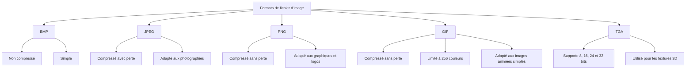

[← Bases des mathématiques](02-bases-des-mathematiques.md) · [↑ Sommaire](../README.md#table-des-matières) · [Éclairage et ombres →](04-eclairage-et-ombres.md)

# 3. Graphiques informatiques

En informatique graphique, les graphiques informatiques constituent une partie non négligeable, souvent traduite par la notion d'**image numérique**.

### Graphiques vectoriels et bitmap

Bien que les images puissent être représentées de différentes manières (matricielles, HDR — *High Dynamic Range*, panoramiques, etc.), les deux méthodes les plus courantes dans le domaine des jeux vidéo sont les **graphiques vectoriels** et les **graphiques bitmap**.

#### Graphiques vectoriels

Contrairement aux images bitmap, qui sont composées de pixels individuels, les images vectorielles sont constituées de **courbes**, de **lignes** et de **formes géométriques**.

Ce sont donc des images créées à partir de **formules mathématiques** décrivant les différentes formes et couleurs de l'image.

Lorsque l'image est agrandie ou réduite, ces formes sont simplement recalculées en fonction de la nouvelle taille de l'image, garantissant ainsi que l'image conserve une qualité élevée — à l'instar des bitmaps qui étirent les pixels affichés et les « dégradent ».

##### Fonctionnement (vectoriel)

Les images vectorielles sont constituées de formes géométriques décrites mathématiquement par des équations.

Chaque forme est représentée par un ensemble de **points**, de **lignes** et de **courbes** qui sont reliés les uns aux autres pour créer la forme souhaitée.

Les formes géométriques peuvent être de différentes sortes : des lignes droites, des **courbes de Bézier**, des cercles, des ellipses, des polygones, etc.

##### Exemple

**Exemple.** Prenons un cercle de rayon $r$ centré en $(x_c, y_c)$ sur un plan cartésien. Sa représentation mathématique est donnée par l'équation suivante :

```math
(x - x_c)^2 + (y - y_c)^2 = r^2
```

Pour représenter ce cercle dans une image vectorielle, on utilise une équation paramétrique qui décrit chaque point $(x, y)$ de la forme comme une fonction de son angle $\theta$ :

```math
x = x_c + r \cos \theta, \quad y = y_c + r \sin \theta
```

On peut ensuite relier ces points par des segments de ligne pour créer le cercle dans l'image vectorielle.

Ainsi, pour un cercle de rayon $3$ centré en $(2, 2)$, l'équation mathématique est $(x - 2)^2 + (y - 2)^2 = 9$ et son équation paramétrique :

```math
x = 2 + 3 \cos \theta
```

```math
y = 2 + 3 \sin \theta
```

> $\cos$ et $\sin$ de $\theta$ sont utilisés ici, dans le cas du cercle, pour obtenir les valeurs $x$ et $y$ correspondant à chaque angle $\theta$ donné.

où $\theta$ est l'angle par rapport à l'origine du cercle.

En prenant des valeurs différentes de $\theta$ (par exemple $\theta = 0, \pi/4, \pi/2, 3\pi/4, \pi, \ldots$), on calcule les coordonnées correspondantes $(x, y)$ et on relie ces points par des segments de ligne pour créer le cercle dans l'image vectorielle.

#### Bitmap

Les **graphiques bitmap**, également appelés images matricielles, sont créés en utilisant une grille de pixels de différentes couleurs.

##### Fonctionnement (bitmap)

Les images bitmap sont stockées sous forme de **matrice de pixels**, où chaque pixel est représenté par une valeur de couleur. Pour comprendre comment cela fonctionne, considérons un exemple simple : une image bitmap en noir et blanc de taille 4×4.

Nous pouvons stocker cette image sous forme de matrice de pixels 4×4 où chaque pixel est représenté par un nombre binaire indiquant s'il est blanc ($0$) ou noir ($1$) :

```math
\begin{pmatrix} 0 & 1 & 0 & 1 \\ 1 & 0 & 1 & 0 \\ 0 & 1 & 0 & 1 \\ 1 & 0 & 1 & 0 \end{pmatrix}
```

Plus la résolution de l'image est élevée, plus la taille de la matrice de pixels est grande et plus l'image est détaillée.

Pour stocker des images en couleur, nous pouvons utiliser une matrice de pixels **tridimensionnelle** où chaque pixel est représenté par une valeur de couleur RVB (rouge, vert, bleu) ou CMJN (cyan, magenta, jaune, noir).

La valeur de chaque canal de couleur est généralement stockée dans un octet (8 bits), ce qui signifie qu'il y a 256 niveaux de chaque couleur (de 0 à 255).

### Résolution et profondeur de couleur

La résolution et la profondeur de couleur sont deux concepts étroitement liés qui déterminent la **qualité visuelle** et la **taille des données** d'une image numérique.

#### Résolution

La résolution d'une image est définie par le nombre de pixels qu'elle contient horizontalement et verticalement, généralement noté $W \times H$ (par exemple, 800×600, signifiant 800 pixels de large pour 600 pixels de haut).

La résolution a des implications importantes sur la quantité de données requises pour stocker une image. Pour une image fixe avec une profondeur de couleur constante $b$, le nombre total de bits requis est donné par :

```math
N_\text{bits} = W \times H \times b
```

où $W$ est la largeur, $H$ la hauteur et $b$ la profondeur de couleur en bits.

La résolution a également un impact sur la **bande passante** requise pour transmettre des images en temps réel, comme c'est le cas dans les jeux vidéo : une résolution plus élevée nécessite plus de bande passante.

#### Profondeur de couleur

La profondeur de couleur, également appelée *bit depth*, représente le nombre de bits utilisés pour décrire la couleur d'un pixel, généralement noté $b$.

Une profondeur de couleur plus élevée permet de représenter un plus grand nombre de couleurs $C = 2^b$, rendant les transitions entre les couleurs plus douces et permettant des images plus réalistes.

Supposons que nous utilisions un espace de couleur RVB. La profondeur de couleur est divisée également entre les composantes rouge, verte et bleue, chacune ayant $b_\text{RGB} = b/3$ bits. Alors, le nombre de valeurs possibles pour chaque composante est $2^{b_\text{RGB}}$. Par conséquent, le nombre total de couleurs différentes pouvant être représentées est :

```math
C = (2^{b_\text{RGB}})^3 = 2^b
```

### Espaces de couleur

> **Qu'est-ce qu'un espace de couleur ?** Une **convention** qui dit comment encoder une couleur en chiffres : combien de composantes (rouge/vert/bleu, ou cyan/magenta/jaune…), sur quelle plage (0-255, 0.0-1.0…) et selon quelle transformation. Deux images peuvent contenir les "mêmes" pixels physiques mais avec des chiffres totalement différents si elles utilisent des espaces différents.

Les images bitmap peuvent être stockées en utilisant différents espaces de couleur. Les plus courants :

- **RVB** (Rouge, Vert, Bleu) : chaque pixel est représenté par trois valeurs pour les composantes rouge, verte et bleue. Format dominant en jeu vidéo et en infographie. Mathématiquement : un triplet $(R, G, B)$.
- **RVBA** : RVB + un canal **alpha** (transparence). Alpha = 0 totalement transparent, alpha = 1 totalement opaque.
- **CMJN** (Cyan, Magenta, Jaune, Noir) : utilisé en impression. Soustractif au lieu d'additif.
- **HSL / HSV** (Teinte, Saturation, Luminosité / Valeur) : reprise des coordonnées RVB sous forme circulaire, pratique pour la manipulation artistique des couleurs (un curseur de "teinte" plutôt que trois sliders R/G/B).
- **YUV / YCbCr** : utilisé en compression vidéo (JPEG, MPEG, H.264). Sépare la luminance (Y) des composantes de chrominance (U/V), ce qui permet de compresser plus agressivement la chrominance, à laquelle l'œil est moins sensible.

#### Linéaire vs sRGB : *le* piège que tout le monde rencontre

Quand vous voyez une couleur `(0.5, 0.5, 0.5)` stockée dans une texture, à quoi correspond-elle physiquement ? À 50 % de la lumière émise par un pixel blanc ? Ou à 50 % de "l'éclat perçu" par l'œil ? Les deux sont **complètement différents** parce que :

1. L'œil humain est **non-linéaire** : il distingue mieux les nuances dans les sombres que dans les clairs. Une valeur numérique à 50 % de l'éclat perçu par l'œil ne correspond qu'à environ 22 % de l'éclat physique réel émis.
2. L'espace **sRGB** encode les couleurs selon cette perception non-linéaire : la relation $C_\text{linéaire} \approx C_\text{sRGB}^{2{,}2}$ est une **approximation** commode. La vraie courbe sRGB est définie par morceaux, avec un segment **linéaire** près de zéro (voir ci-dessous).

```math
C_\text{linéaire} \approx C_\text{sRGB}^{2.2}
\qquad
C_\text{sRGB} \approx C_\text{linéaire}^{1/2.2}
```

(ces formules sont pratiques pour les shaders, mais ne correspondent pas exactement à la norme sRGB.)

##### La courbe sRGB exacte (norme IEC 61966-2-1)

L'approximation $\gamma = 2{,}2$ est en fait une simplification d'une courbe **par morceaux** qui ajoute un segment **linéaire** près de zéro pour éviter une dérivée infinie en $C = 0$ (numériquement fâcheuse pour la quantification 8 bits). De **sRGB vers linéaire** :

```math
C_\text{linéaire} = \begin{cases} \dfrac{C_\text{sRGB}}{12{,}92} & \text{si } C_\text{sRGB} \le 0{,}04045 \\[6pt] \left(\dfrac{C_\text{sRGB} + 0{,}055}{1{,}055}\right)^{2{,}4} & \text{sinon} \end{cases}
```

et **dans l'autre sens** (linéaire vers sRGB, donc gamma sur écriture finale dans le framebuffer) :

```math
C_\text{sRGB} = \begin{cases} 12{,}92\,C_\text{lin} & \text{si } C_\text{lin} \le 0{,}0031308 \\[4pt] 1{,}055\,C_\text{lin}^{1/2{,}4} - 0{,}055 & \text{sinon} \end{cases}
```

L'exposant effectif global ($\approx 2{,}4$ avec offset) revient à un gamma moyen de $\approx 2{,}2$ — d'où l'approximation usuelle. Le matériel GPU (les samplers `*_SRGB` et les cibles de rendu ou *render target*, voir définition ci-dessous, `RGBA8_SRGB`) implémente la version **exacte** en hardware, donc on ne paie aucun cycle pour la conversion correcte.

> **Vocabulaire express du pipeline d'image.**
>
> - **Albedo** : la couleur de base d'un matériau, indépendamment de tout éclairage (un mur peint en rouge a un albedo rouge, qu'il fasse jour ou nuit).
> - **Roughness** (rugosité) : à quel point la surface est mate (1) ou lisse comme un miroir (0).
> - **Metallic** : 0 pour un matériau diélectrique (peau, plastique, bois), 1 pour un métal pur ; les valeurs intermédiaires servent surtout à mélanger entre métal sale et oxydation.
> - **Normal map** : texture qui encode une normale à la surface en chaque texel (pixel de texture), pour simuler du relief sans ajouter de polygones.
> - **Framebuffer** : la mémoire dans laquelle le GPU écrit le résultat final d'une frame avant qu'il soit envoyé à l'écran.
> - **Swap chain** : la file d'attente de framebuffers que le système d'affichage présente au moniteur. La *swap chain* contient typiquement 2 ou 3 images (double / triple buffering) qui permutent à chaque frame.
> - **Render target** : un framebuffer particulier dans lequel un *draw call* va écrire (ce n'est pas forcément le framebuffer final affiché à l'écran ; on peut rendre dans une texture intermédiaire pour faire ensuite du *post-process*, du *bloom* ou un *picking*).
> - **Bloom** : effet visuel qui simule le débordement lumineux des sources très brillantes (halo autour d'un soleil, d'une lampe). On extrait la part « haute lumière » du framebuffer, on la floute, et on la rajoute sur l'image finale.
> - **Exposition** : un facteur multiplicatif sur l'image HDR avant tonemapping, qui simule l'iris de l'œil ou le diaphragme de l'appareil photo. Une scène plongée dans le noir va « surexposer » progressivement pour révéler les détails.

La règle pratique à retenir pour tout jeu moderne est donc :

1. **Linéariser à la lecture** des textures *color* (albedo, ambient occlusion baked dans une texture couleur). Les textures **non-color** (normal map, roughness, metallic, masque) sont stockées et lues **linéaire brut** — leur appliquer une courbe gamma fausserait les calculs.
2. **Tous les calculs** (éclairage, alpha-blending, post-process) en linéaire.
3. **Gamma-correction à l'écriture** finale dans le framebuffer (ou laisser le format `*_SRGB` du *swap chain* le faire).

**Pourquoi ça compte ?** Les calculs d'éclairage (Phong, Lambert, PBR — voir plus bas) **doivent** se faire en **espace linéaire**, où l'addition de deux faisceaux de lumière correspond à `C_a + C_b`. Si vous ajoutez deux couleurs sRGB sans conversion préalable, vous obtenez un résultat **délavé**, gris-jaunâtre, qui ne ressemble à rien de réaliste.

**Workflow correct dans un jeu moderne :**

1. **Texture.png** est stockée en sRGB → marquer la sampler `SRGB` à la création (Unity : "sRGB (Color Texture)" coché ; Vulkan : `VK_FORMAT_R8G8B8A8_SRGB`).
2. Lors du sample dans le shader, le GPU **convertit automatiquement** sRGB → linéaire avant calcul.
3. Tous les calculs d'éclairage, alpha-blending, post-process, se font en linéaire.
4. Le pipeline final convertit linéaire → sRGB juste avant l'écriture dans le framebuffer.

> **Le bug classique.** Une texture d'albedo déclarée en `RGBA8_UNORM` au lieu de `RGBA8_SRGB` : le shader croit lire du linéaire, fait ses calculs sur des chiffres déjà gamma-corrigés, et le résultat est trop sombre dans les ombres et trop saturé dans les *highlights*. C'est typiquement ce qu'on voyait sur certains jeux de la fin des années 2000 dont les textures n'étaient pas correctement marquées dans le pipeline.
>
> **Qu'est-ce que le HDR (*High Dynamic Range*) ?** Plage dynamique étendue : on stocke des composantes au-delà de `[0, 1]` (un soleil peut faire `(50, 50, 50)`). Cela ouvre la porte au *bloom*, à l'*exposition*, et au **tonemapping** — courbe de compression $f : \mathbb{R}^+ \to [0, 1]$ qui ramène la scène HDR dans la plage affichable par l'écran. Les deux opérateurs vedettes sont **Reinhard** ($f(x) = x/(1+x)$, simple et doux) et **ACES** (*Academy Color Encoding System*, courbe en S inspirée du cinéma, plus filmique — c'est l'opérateur par défaut d'Unreal et de plus en plus de jeux AAA). Indispensable en PBR.

### Formats de fichier d'image

Les formats de fichier d'image déterminent la manière dont les données d'image sont organisées et stockées. Plusieurs formats sont couramment utilisés dans les jeux vidéo et les applications graphiques :

- **BMP** (Bitmap) : format non compressé développé par Microsoft. Il stocke les données pixel par pixel, sans compression, ce qui peut entraîner des fichiers volumineux.
- **JPEG** (*Joint Photographic Experts Group*) : format compressé avec **perte** qui utilise la compression DCT (*Discrete Cosine Transform*) pour réduire la taille des fichiers. Bien adapté aux images photographiques avec de nombreux détails et variations de couleur.
- **PNG** (*Portable Network Graphics*) : format compressé **sans perte** qui utilise la compression DEFLATE. Bien adapté aux images avec des zones de couleur uniforme et des bords nets, comme des graphiques ou des logos.
- **GIF** (*Graphics Interchange Format*) : format compressé sans perte développé par CompuServe. Limité à une palette de 256 couleurs, principalement utilisé pour les images animées simples et les graphiques avec des zones de couleur uniforme.
- **TGA** (Targa) : format développé par Truevision qui prend en charge les images en couleur 8, 16, 24 et 32 bits. Souvent utilisé dans les jeux vidéo et les applications de rendu 3D pour stocker des **textures**.

#### Schéma comparatif



[ Retour en haut de page](#table-des-matières)

---

---

[← Bases des mathématiques](02-bases-des-mathematiques.md) · [↑ Sommaire](../README.md#table-des-matières) · [Éclairage et ombres →](04-eclairage-et-ombres.md)
