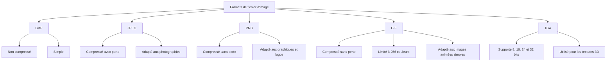

[← Bases des mathématiques](02-bases-des-mathematiques.md) · [↑ Sommaire](../README.md#table-des-matières) · [Éclairage et ombres →](04-eclairage-et-ombres.md)

# 3. Graphiques informatiques

Une **image numérique** est une image fabriquée et stockée par un ordinateur sous forme de chiffres. Avant qu'un jeu puisse l'afficher, il faut décider comment la décrire avec des nombres. Il existe deux grandes façons de faire, et elles ne se ressemblent pas du tout.

> **Que veut dire « numérique » ?** Cela signifie « fait de chiffres ». Un thermomètre numérique affiche un nombre ( 21 degrés ) , au lieu d'une aiguille. Une image numérique, c'est pareil : elle est entièrement décrite par des nombres rangés dans la mémoire de l'ordinateur.

### Graphiques vectoriels et bitmap

Une image peut être décrite de plusieurs manières. Les deux plus utilisées dans les jeux vidéo sont les **graphiques vectoriels** et les **graphiques bitmap**. Il en existe d'autres, plus rares ( les images HDR, qui gardent des lumières très intenses, ou les images panoramiques à 360 degrés ) , mais commençons par les deux grandes familles.

> **Que veut dire « bitmap » ?** Mot anglais qui veut dire « carte de bits ». Imaginez une feuille de papier quadrillé : chaque petite case reçoit une couleur. L'image est alors la carte ( la liste ) de toutes ces cases coloriées. C'est exactement une photo d'appareil photo.

> **Que veut dire « vectoriel » ?** Au lieu de colorier des cases, on garde la **recette** pour redessiner l'image : « trace un cercle ici, un trait là ». L'ordinateur suit la recette à chaque affichage. C'est comme la différence entre une photo d'un gâteau ( bitmap ) et la recette écrite du gâteau ( vectoriel ) .

#### Graphiques vectoriels

Une image bitmap est faite de **pixels**, posés un par un. Une image vectorielle, elle, est faite de **courbes**, de **lignes** et de **formes géométriques**.

> **Que veut dire « pixel » ?** C'est le plus petit point coloré d'un écran, une seule case du papier quadrillé. Le mot vient de l'anglais *picture element*, « élément d'image ». Approchez votre nez d'un écran : vous verrez plein de minuscules carrés, ce sont les pixels.

Une image vectorielle est donc créée à partir de **formules mathématiques** qui décrivent ses formes et ses couleurs.

> **Que veut dire « formule mathématique » ?** C'est une phrase écrite avec des chiffres et des symboles, qui dit comment calculer quelque chose. Par exemple « périmètre = côté + côté + côté + côté » est la formule du périmètre d'un carré. Ici, la formule décrit où passe une courbe.

Quand on agrandit ou rétrécit l'image, ces formes sont tout simplement recalculées à la nouvelle taille. L'image garde donc une qualité parfaite, alors qu'une image bitmap, elle, doit étirer ses petits carrés, qui deviennent gros et flous ( on dit qu'elle « se dégrade » ) . La raison est simple : recalculer un cercle bien rond à la bonne taille donne toujours un cercle bien rond, tandis qu'agrandir une grille de cases ne fait qu'agrandir les cases.

##### Fonctionnement (vectoriel)

Les images vectorielles sont faites de formes géométriques décrites par des **équations**.

> **Que veut dire « équation » ?** C'est une égalité, c'est-à-dire deux choses séparées par un signe « = » qui valent la même chose, comme « 3 + 4 = 7 ». En géométrie, une équation peut dire quels points appartiennent à une forme.

Chaque forme est représentée par un ensemble de **points**, de **lignes** et de **courbes** reliés entre eux pour dessiner la forme voulue.

Ces formes peuvent être de toutes sortes : des lignes droites, des **courbes de Bézier**, des cercles, des ellipses, des polygones, etc.

> **Que veut dire « courbe de Bézier » ?** C'est une courbe lisse que l'on plie en tirant sur quelques points de contrôle, un peu comme on courbe une tige souple en appuyant dessus à deux ou trois endroits. C'est l'outil que tous les logiciels de dessin utilisent pour faire des courbes douces. Le chapitre sur les courbes y revient en détail.

> **Que veut dire « polygone » ?** C'est une forme plate fermée bordée uniquement de segments droits : un triangle, un carré, un pentagone sont des polygones. Le mot vient du grec et veut dire « plusieurs angles ».

##### Exemple

Prenons un cercle pour voir comment une formule remplace un dessin. Notre cercle a un **rayon** $`r`$ et son **centre** se trouve au point $`(x_c, y_c)`$, posé sur un **plan cartésien**.

> **Le symbole $`r`$.** C'est le **rayon** du cercle, c'est-à-dire la distance entre le centre et le bord. Sur une roue de vélo, c'est la longueur d'un rayon métallique, du moyeu jusqu'au pneu. La lettre $`r`$ est juste l'initiale de « rayon ».

> **Que veut dire « plan cartésien » ?** C'est une feuille plate quadrillée munie de deux règles graduées : une horizontale et une verticale. Grâce à elles, chaque point a une « adresse » faite de deux nombres, comme aux échecs ou à la bataille navale. On note cette adresse $`(x, y)`$ : $`x`$ dit de combien on va vers la droite, $`y`$ de combien on monte. L'indice « c » dans $`(x_c, y_c)`$ rappelle simplement qu'il s'agit du **c**entre.

La règle qui décide quels points sont sur le cercle s'écrit ainsi :

```math
(x - x_c)^2 + (y - y_c)^2 = r^2
```

> **Pourquoi cette formule ?** Elle dit juste « tous les points qui sont à la distance $`r`$ du centre ». La distance d'un point au centre se calcule avec le théorème de Pythagore ( vu au chapitre précédent ) : on prend l'écart horizontal $`x - x_c`$, l'écart vertical $`y - y_c`$, on les met au carré, on les additionne. Si la somme vaut $`r^2`$, le point est pile sur le cercle.

> **Le petit $`^2`$.** Il veut dire « au carré », c'est-à-dire « multiplié par lui-même ». Ainsi $`5^2 = 5 \times 5 = 25`$. On l'utilise ici parce que Pythagore travaille avec des carrés.

Cette formule sait dire si un point appartient au cercle, mais pour le **dessiner** il faut produire des points un par un. On se sert alors d'une **équation paramétrique**, qui donne directement les coordonnées $`(x, y)`$ d'un point à partir de son **angle** $`\theta`$ :

> **Que veut dire « équation paramétrique » ?** C'est une équation pilotée par une « manette » : on tourne la manette, et le point se déplace le long de la forme. Ici la manette est l'angle $`\theta`$. Pour chaque valeur de la manette, on obtient un point précis. C'est très pratique pour fabriquer la liste de points à relier.

> **Le symbole $`\theta`$.** C'est une lettre grecque qui se lit « thêta ». Les mathématiciens s'en servent presque toujours pour désigner un **angle**. Ici, $`\theta`$ indique de combien on a tourné autour du centre, comme l'aiguille d'une horloge qui balaie le cadran.

```math
x = x_c + r \cos \theta, \quad y = y_c + r \sin \theta
```

> **Les symboles $`\cos`$ et $`\sin`$.** Ce sont le **cosinus** et le **sinus** de l'angle, deux machines à transformer un angle en un nombre entre $`-1`$ et $`1`$. Imaginez l'aiguille d'une horloge de longueur 1 : $`\cos \theta`$ donne sa position horizontale ( gauche-droite ) et $`\sin \theta`$ sa position verticale ( bas-haut ) . En les multipliant par le rayon $`r`$ et en partant du centre, on obtient donc le point du cercle qui correspond à l'angle $`\theta`$. Le chapitre sur la trigonométrie détaille ces deux fonctions.

Il ne reste plus qu'à relier ces points par de petits segments de droite pour tracer le cercle dans l'image vectorielle.

Prenons un cas concret : un cercle de rayon $`3`$ centré en $`(2, 2)`$. Sa règle d'appartenance est $`(x - 2)^2 + (y - 2)^2 = 9`$ ( car $`3^2 = 9`$ ) , et son équation paramétrique devient :

```math
x = 2 + 3 \cos \theta
```

```math
y = 2 + 3 \sin \theta
```

On choisit alors plusieurs valeurs de l'angle $`\theta`$, par exemple $`\theta = 0,\ \pi/4,\ \pi/2,\ 3\pi/4,\ \pi,\ \ldots`$, on calcule pour chacune les coordonnées $`(x, y)`$, et on relie les points obtenus.

> **Le symbole $`\pi`$.** C'est une lettre grecque qui se lit « pi » et qui vaut environ $`3{,}14`$. C'est un nombre fixe, toujours le même, lié aux cercles : faire un tour complet correspond à un angle de $`2\pi`$. Donc $`\pi`$ est un demi-tour, $`\pi/2`$ un quart de tour, et ainsi de suite. C'est juste une autre façon de mesurer les angles, à la place des degrés.

#### Bitmap

Les **graphiques bitmap**, aussi appelés images matricielles, sont faits d'une grille de pixels de différentes couleurs, exactement comme notre papier quadrillé colorié.

##### Fonctionnement (bitmap)

Une image bitmap est rangée sous forme de **matrice de pixels** : chaque case porte une valeur de couleur.

> **Que veut dire « matrice » ?** C'est juste un tableau de nombres rangés en lignes et en colonnes, comme une grille de mots croisés ou un tableur. Le mot « matriciel » veut dire « rangé en tableau ». Le chapitre sur les bases des mathématiques présente les matrices plus en détail.

Pour bien comprendre, prenons l'exemple le plus simple possible : une petite image en noir et blanc de taille 4×4, c'est-à-dire 4 cases de large sur 4 cases de haut.

On peut la ranger dans une matrice 4×4 où chaque case contient un nombre **binaire** disant si le pixel est blanc ( $`0`$ ) ou noir ( $`1`$ ) :

> **Que veut dire « binaire » ?** C'est compter avec seulement deux chiffres, $`0`$ et $`1`$, au lieu de dix. C'est la langue maternelle des ordinateurs, parce qu'à l'intérieur tout est « courant qui passe » ou « courant qui ne passe pas ». Ici, $`0`$ veut dire « éteint, donc blanc » et $`1`$ veut dire « allumé, donc noir ».

```math
\begin{pmatrix} 0 & 1 & 0 & 1 \\ 1 & 0 & 1 & 0 \\ 0 & 1 & 0 & 1 \\ 1 & 0 & 1 & 0 \end{pmatrix}
```

Plus la **résolution** de l'image est grande ( c'est-à-dire plus elle contient de pixels ) , plus la matrice est grande et plus l'image est fine et détaillée. C'est logique : avec plus de petites cases, on dessine des contours plus précis, comme une mosaïque faite de tessons minuscules est plus nette qu'une mosaïque à grosses tuiles.

Pour stocker des images en couleur, on utilise une matrice de pixels **tridimensionnelle** ( à trois dimensions ) : à chaque case, au lieu d'un seul nombre, on range plusieurs nombres décrivant la couleur, par exemple en **RVB** ( rouge, vert, bleu ) ou en **CMJN** ( cyan, magenta, jaune, noir ) .

> **Que veut dire « tridimensionnelle » ?** Une matrice ordinaire a deux directions : les lignes et les colonnes. Ici on ajoute une troisième direction « en profondeur » : derrière chaque pixel, on empile par exemple ses trois quantités de rouge, de vert et de bleu. Imaginez, sous chaque case du quadrillage, une petite pile de trois jetons.

> **Que veulent dire « RVB » et « CMJN » ?** Ce sont deux façons de fabriquer une couleur en en mélangeant d'autres. **RVB** mélange de la lumière rouge, verte et bleue ( c'est ce que fait un écran ) . **CMJN** mélange des encres cyan, magenta, jaune et noire ( c'est ce que fait une imprimante ) . L'espace de couleur est expliqué un peu plus bas.

La quantité de chaque couleur primaire est en général stockée dans un **octet**, ce qui donne 256 niveaux possibles ( de 0 à 255 ) .

> **Que veulent dire « bit » et « octet » ?** Un **bit** est la plus petite information possible : un seul $`0`$ ou un seul $`1`$. Un **octet** est un paquet de 8 bits. Avec 8 bits, on peut écrire $`2^8 = 256`$ combinaisons différentes, d'où les 256 niveaux de couleur, numérotés de 0 à 255.

### Résolution et profondeur de couleur

Deux nombres décident à eux seuls à quel point une image est belle et combien de place elle occupe : la **résolution** ( combien de pixels ) et la **profondeur de couleur** ( combien de couleurs possibles par pixel ) .

#### Résolution

La résolution d'une image, c'est le nombre de pixels qu'elle contient en largeur et en hauteur. On la note $`W \times H`$, par exemple 800×600, ce qui veut dire 800 pixels de large pour 600 pixels de haut.

> **Les symboles $`W`$ et $`H`$.** Ce sont les initiales anglaises de *width* ( largeur ) et *height* ( hauteur ) . $`W`$ compte les pixels d'une ligne, $`H`$ compte les lignes.

La résolution change beaucoup la place que prend l'image. Pour une image fixe dont chaque pixel coûte le même nombre de bits, noté $`b`$, le nombre total de bits nécessaires est :

```math
N_\text{bits} = W \times H \times b
```

> **Pourquoi cette multiplication ?** Le nombre total de pixels est « largeur fois hauteur », exactement comme on compte les cases d'un quadrillage ( $`W \times H`$ ) . Et comme chaque pixel coûte $`b`$ bits, on multiplie encore par $`b`$. Le symbole $`N_\text{bits}`$ se lit simplement « nombre de bits ».

La résolution joue aussi sur la **bande passante** nécessaire pour envoyer des images en direct, comme dans un jeu vidéo : plus l'image est grande, plus il faut de bande passante.

> **Que veut dire « bande passante » ?** C'est la quantité de données qu'un tuyau ( câble, wifi, connexion Internet ) peut transporter en une seconde. Comme un tuyau d'eau : plus il est large, plus il laisse passer de litres par seconde. Une grande image, c'est beaucoup de données, donc il faut un tuyau plus large pour l'envoyer à temps.

#### Profondeur de couleur

La profondeur de couleur ( en anglais *bit depth* ) , c'est le nombre de bits utilisés pour décrire la couleur d'un seul pixel. On la note $`b`$.

Plus elle est grande, plus on peut représenter de couleurs différentes, exactement $`C = 2^b`$. Les dégradés deviennent alors plus doux et les images plus réalistes.

> **Pourquoi $`C = 2^b`$ ?** Le symbole $`C`$ désigne le nombre de couleurs possibles. Chaque bit est un interrupteur qui a 2 positions. Avec un interrupteur on a 2 choix, avec deux interrupteurs $`2 \times 2 = 4`$ choix, avec trois $`2 \times 2 \times 2 = 8`$ choix... Avec $`b`$ interrupteurs, on a $`2`$ multiplié par lui-même $`b`$ fois, ce qui s'écrit $`2^b`$.

Vérifions sur un exemple en couleurs RVB. On partage équitablement les $`b`$ bits entre le rouge, le vert et le bleu : chaque composante reçoit $`b_\text{RGB} = b/3`$ bits. Chaque composante a donc $`2^{b_\text{RGB}}`$ niveaux possibles. Comme on choisit librement le rouge, **puis** le vert, **puis** le bleu, on multiplie les trois nombres de choix entre eux :

```math
C = (2^{b_\text{RGB}})^3 = 2^b
```

> **Comment passe-t-on de $`(2^{b_\text{RGB}})^3`$ à $`2^b`$ ?** Élever une puissance à une autre puissance revient à multiplier les exposants. Or $`b_\text{RGB} = b/3`$, donc $`b_\text{RGB} \times 3 = b`$. On retrouve bien $`2^b`$ : que l'on compte les couleurs d'un coup ou composante par composante, le total est identique, ce qui est rassurant.

### Espaces de couleur

> **Qu'est-ce qu'un espace de couleur ?** C'est une **convention**, c'est-à-dire un accord, sur la façon d'écrire une couleur en chiffres : combien de composantes ( rouge, vert, bleu, ou cyan, magenta, jaune... ) , entre quelles bornes ( de 0 à 255, ou de 0 à 1... ) et selon quelle recette de calcul. C'est comme noter une recette : un même plat peut s'écrire en grammes ou en cuillères. Deux images peuvent montrer la même couleur réelle tout en utilisant des chiffres très différents si leurs espaces ne sont pas les mêmes.

Les images bitmap peuvent être rangées dans différents espaces de couleur. Voici les plus courants.

- **RVB** ( Rouge, Vert, Bleu ) : chaque pixel est décrit par trois nombres, un par composante. C'est le format roi en jeu vidéo et en image de synthèse. En notation mathématique, c'est un triplet $`(R, G, B)`$.
- **RVBA** : c'est du RVB auquel on ajoute un canal **alpha**, qui gère la transparence. Un alpha de 0 rend le pixel totalement transparent ( invisible ) , un alpha de 1 le rend totalement opaque ( bien plein ) .
- **CMJN** ( Cyan, Magenta, Jaune, Noir ) : utilisé pour l'impression. Il est **soustractif** au lieu d'**additif**.
- **HSL / HSV** ( Teinte, Saturation, Luminosité ou Valeur ) : c'est le RVB réarrangé sous forme de roue, plus pratique pour un artiste, qui tourne un seul bouton « teinte » au lieu de régler trois quantités rouge, vert et bleu.
- **YUV / YCbCr** : utilisé pour compresser la vidéo ( JPEG, MPEG, H.264 ) . Il sépare la **luminance** ( la lumière, notée Y ) de la **chrominance** ( la couleur, notée U et V ) . Comme l'œil voit moins bien les détails de couleur que les détails de lumière, on peut comprimer la couleur plus fort sans que cela se remarque.

> **Que veut dire « triplet » ?** C'est simplement un groupe de trois nombres rangés dans l'ordre, écrit entre parenthèses, comme $`(255, 0, 0)`$ pour un rouge vif. L'ordre compte : le premier est le rouge, le deuxième le vert, le troisième le bleu.

> **Que veut dire « canal alpha » ?** Un **canal** est l'une des « pistes » d'une couleur, comme les pistes son d'une chanson. Le canal **alpha** est la piste « transparence » : il dit à quel point on voit au travers du pixel, comme du verre plus ou moins teinté.

> **« Additif » contre « soustractif ».** En **additif**, on part du noir et on **ajoute** de la lumière colorée ; mélanger toutes les lumières donne du blanc ( c'est ce que fait un écran ) . En **soustractif**, on part du blanc d'une feuille et chaque encre **enlève** de la lumière ; mélanger toutes les encres donne du noir ( c'est ce que fait une imprimante ) . D'où deux jeux de couleurs primaires différents.

#### Linéaire vs sRGB : *le* piège que tout le monde rencontre

Voici un piège dans lequel presque tous les débutants tombent. Quand une couleur `(0.5, 0.5, 0.5)` est rangée dans une **texture**, que vaut-elle vraiment ? Est-ce 50 % de la lumière qu'enverrait un pixel blanc ? Ou 50 % de l'éclat que l'œil **croit** voir ? Les deux ne sont pas du tout la même chose, pour deux raisons.

> **Que veut dire « texture » ?** En jeu vidéo, une texture est une image que l'on colle sur la surface d'un objet 3D, comme un papier peint collé sur un mur ou un autocollant sur une figurine. C'est elle qui donne sa couleur et ses motifs à l'objet.

1. L'œil humain est **non-linéaire** : il voit mieux les différences dans les zones sombres que dans les zones claires. Du coup, une valeur affichée à 50 % de l'éclat **perçu** ne correspond qu'à environ 22 % de l'éclat **physique** réellement émis.
2. L'espace **sRGB** range les couleurs en suivant justement cette vision déformée de l'œil. La relation $`C_\text{linéaire} \approx C_\text{sRGB}^{2{,}2}`$ en est une **approximation** bien pratique. La vraie courbe sRGB est un peu plus compliquée ( faite de morceaux, voir plus bas ) .

> **Que veut dire « linéaire » et « non-linéaire » ?** « Linéaire » veut dire « proportionnel, qui avance par pas réguliers » : si je double la quantité de lumière, le chiffre double aussi. « Non-linéaire », c'est le contraire : les pas ne sont pas réguliers. L'œil est non-linéaire, comme une oreille qui entend une différence énorme entre le silence et un murmure, mais une petite différence entre deux concerts pourtant bien plus forts.

> **Le symbole $`C`$ avec un indice.** $`C`$ veut dire « couleur » ( une valeur entre 0 et 1 ) . L'indice précise dans quel espace : $`C_\text{linéaire}`$ est la couleur « physique vraie », $`C_\text{sRGB}`$ est la couleur « telle qu'on la stocke pour l'œil ». Le petit nombre en exposant ( ici $`2{,}2`$ ) est une **puissance** : élever à la puissance $`2{,}2`$ assombrit les valeurs moyennes, ce qui imite la vision de l'œil.

```math
C_\text{linéaire} \approx C_\text{sRGB}^{2{,}2}
\qquad
C_\text{sRGB} \approx C_\text{linéaire}^{1/2{,}2}
```

> **Pourquoi deux formules ?** La première traduit du « pour l'œil » vers le « physique vrai », la seconde fait le chemin inverse. Élever à la puissance $`2{,}2`$ puis à la puissance $`1/2{,}2`$ se compense, comme multiplier par 3 puis diviser par 3 : on revient au point de départ.

Ces deux formules sont pratiques pour programmer ( voir le mot **shader** plus bas ) , mais elles ne collent pas exactement à la norme officielle sRGB.

##### La courbe sRGB exacte (norme IEC 61966-2-1)

L'approximation « puissance $`\gamma = 2{,}2`$ » est en réalité une version simplifiée d'une courbe **définie par morceaux**, qui colle un petit segment **droit** tout près de zéro.

> **Le symbole $`\gamma`$.** C'est la lettre grecque « gamma ». On l'utilise pour nommer la puissance qui assombrit ou éclaircit les valeurs moyennes d'une image. Dire « gamma 2,2 », c'est dire « on élève à la puissance 2,2 ». C'est le réglage caché derrière le mot « luminosité de l'écran ».

> **Que veut dire « définie par morceaux » ?** Cela veut dire qu'on utilise une règle de calcul différente selon la zone où l'on se trouve, comme un tarif de bus « gratuit avant 4 ans, demi-tarif jusqu'à 12 ans, plein tarif ensuite ». Ici, une règle pour les couleurs très sombres, une autre pour le reste.

Pourquoi ce petit morceau droit près de zéro ? Parce que la courbe à puissance seule deviendrait « infiniment raide » juste au-dessus de zéro ( sa **pente** y deviendrait infinie ) , ce qui pose des problèmes de calcul quand on n'a que 256 niveaux pour ranger les valeurs ( la **quantification** sur 8 bits ) . Le petit segment droit évite cette pente folle. Voici la conversion de **sRGB vers linéaire** :

> **Que veut dire « pente infinie » ?** La pente, c'est l'inclinaison d'une courbe, comme la raideur d'une route de montagne. Une pente infinie, c'est un mur vertical : impossible à gravir proprement. Le segment droit remplace ce mur par une rampe douce.

> **Que veut dire « quantification » ?** C'est le fait de devoir arrondir des valeurs continues à un nombre limité de marches, ici 256 ( 8 bits ) . Comme arrondir un prix au centime près : on ne peut pas payer un tiers de centime. Près d'une pente infinie, ces arrondis créeraient de vilaines marches visibles.

```math
C_\text{linéaire} = \begin{cases} \dfrac{C_\text{sRGB}}{12{,}92} & \text{si } C_\text{sRGB} \le 0{,}04045 \\[6pt] \left(\dfrac{C_\text{sRGB} + 0{,}055}{1{,}055}\right)^{2{,}4} & \text{sinon} \end{cases}
```

> **Comment lire cette grande accolade ?** L'accolade `{` signifie « choisir une seule des deux lignes ». On regarde la condition écrite après « si » : si la couleur est très faible ( inférieure à $`0{,}04045`$ ) , on applique la première ligne ( la simple division ) ; **sinon**, on applique la deuxième ligne ( la puissance ) . C'est un aiguillage : une seule voie est empruntée à la fois.

Et **dans l'autre sens** ( de linéaire vers sRGB, c'est-à-dire la correction de gamma appliquée tout à la fin, au moment d'écrire l'image dans le framebuffer ) :

```math
C_\text{sRGB} = \begin{cases} 12{,}92\,C_\text{lin} & \text{si } C_\text{lin} \le 0{,}0031308 \\[4pt] 1{,}055\,C_\text{lin}^{1/2{,}4} - 0{,}055 & \text{sinon} \end{cases}
```

Si l'on regarde l'effet d'ensemble, cette courbe se comporte à peu près comme une puissance $`2{,}4`$, ce qui revient en moyenne à un gamma d'environ $`2{,}2`$ : voilà pourquoi l'approximation simple marche bien. Bonne nouvelle : la **carte graphique** ( **GPU** ) sait faire cette conversion exacte toute seule, gratuitement.

> **Que veulent dire « GPU », « sampler » et « hardware » ?** Le **GPU** ( de l'anglais *Graphics Processing Unit* ) est la puce de l'ordinateur spécialisée dans les images, le moteur graphique de la machine. Un **sampler** est le petit lecteur qui va « piocher » une couleur dans une texture. **Hardware** veut dire « matériel », par opposition au logiciel : quand une opération est faite « en hardware », c'est le circuit électronique lui-même qui s'en charge, donc instantanément et sans ralentir le jeu. Quand on choisit un format marqué `*_SRGB` ( par exemple `RGBA8_SRGB` ) , le GPU applique la bonne courbe automatiquement.

Voici maintenant un petit dictionnaire des mots qui reviennent sans cesse dans la fabrication d'une image. Pas besoin de tout retenir d'un coup : revenez-y quand un mot vous échappe.

> **Que veut dire « pipeline » ?** C'est la chaîne d'étapes par lesquelles passe une image avant d'apparaître à l'écran, comme une chaîne de montage dans une usine : chaque poste fait une opération et passe le résultat au suivant.

> **Que veut dire « frame » ?** C'est une image unique parmi celles qui défilent. Un jeu affiche souvent 60 frames par seconde, comme un dessin animé est fait d'images fixes qui s'enchaînent très vite pour donner l'illusion du mouvement.

> **Que veut dire « normale » ( à une surface ) ?** C'est une petite flèche qui sort d'une surface en lui étant perpendiculaire, comme un mât planté tout droit sur un toit. Elle indique « vers où regarde » la surface, ce qui est essentiel pour calculer l'éclairage. Le chapitre sur l'éclairage la réutilise beaucoup.

> **Vocabulaire express du pipeline d'image.**
>
> - **Albedo** : la couleur de base d'un matériau, sans aucun éclairage ( un mur peint en rouge a un albedo rouge, qu'il fasse jour ou nuit ) .
> - **Roughness** ( rugosité ) : à quel point la surface est mate ( valeur 1 ) ou lisse comme un miroir ( valeur 0 ) .
> - **Metallic** ( métallicité ) : 0 pour un matériau non métallique ( peau, plastique, bois ) , 1 pour un métal pur ; les valeurs intermédiaires servent surtout à représenter du métal sale ou rouillé.
> - **Normal map** ( carte de normales ) : une texture qui range, en chaque texel, la direction de la normale de la surface, pour faire croire à du relief sans ajouter de polygones.
> - **Texel** : un pixel de **tex**ture ( le mot mélange « texture » et « élément » ) , c'est-à-dire une case de l'image que l'on plaque sur l'objet.
> - **Framebuffer** ( tampon d'image ) : la zone de mémoire où le GPU écrit l'image finale d'une frame avant de l'envoyer à l'écran. Une sorte de page de brouillon où l'on dessine avant de montrer.
> - **Swap chain** ( chaîne d'échange ) : la petite file d'attente de framebuffers que l'on présente tour à tour au moniteur. Elle contient en général 2 ou 3 images qui se relaient à chaque frame, comme deux peintres qui montrent une toile pendant que l'autre prépare la suivante.
> - **Render target** ( cible de rendu ) : un framebuffer particulier où l'on dessine. Ce n'est pas forcément l'image finale affichée : on peut dessiner dans une image intermédiaire pour la retravailler ensuite ( ajouter des effets, par exemple ) .
> - **Bloom** ( débordement lumineux ) : l'effet de halo autour des sources très brillantes ( le flou éclatant autour d'un soleil ou d'une lampe ) . On prélève les zones très lumineuses, on les rend floues, et on les rajoute sur l'image.
> - **Exposition** : un réglage qui éclaircit ou assombrit toute l'image HDR avant l'affichage, exactement comme l'iris de l'œil qui se ferme en plein soleil et s'ouvre dans le noir. Une scène sombre s'éclaircit peu à peu pour révéler ses détails.

La règle pratique à retenir pour tout jeu moderne tient en trois points.

1. **Linéariser à la lecture** des textures de **couleur** ( comme l'albedo ) . En revanche, les textures qui ne décrivent **pas** une couleur ( carte de normales, rugosité, métallicité, masque ) sont rangées et lues **telles quelles**, sans correction : leur appliquer une courbe gamma fausserait les calculs, car leurs nombres ne sont pas des couleurs.
2. **Faire tous les calculs en linéaire** ( éclairage, fusion des transparences, effets de fin d'image ) .
3. **Corriger le gamma à la toute fin**, au moment d'écrire dans le framebuffer ( ou laisser le format `*_SRGB` s'en charger ) .

> **Que veut dire « linéariser » ?** C'est convertir une couleur rangée « pour l'œil » ( sRGB ) en sa valeur « physique vraie » ( linéaire ) , en lui appliquant la formule vue plus haut. On « remet à plat » les chiffres avant de calculer avec.

**Pourquoi cela compte tellement ?** Parce que les calculs d'éclairage **doivent** se faire en espace linéaire. Dans cet espace, additionner deux rayons de lumière revient simplement à additionner leurs valeurs, `C_a + C_b`, exactement comme deux lampes qui éclairent ensemble une table. La raison profonde : la lumière s'additionne vraiment dans la réalité, et seul l'espace linéaire respecte cette addition honnête. Si vous additionnez deux couleurs sRGB sans les convertir d'abord, le résultat est **délavé**, terne et grisâtre, sans aucun réalisme, parce que vous avez additionné des chiffres déformés par l'œil.

> **Que veulent dire « Phong », « Lambert » et « PBR » ?** Ce sont trois recettes de calcul de la lumière sur une surface, de la plus simple à la plus réaliste. **Lambert** gère la lumière diffuse d'une surface mate, **Phong** y ajoute les reflets brillants, et **PBR** ( de l'anglais *Physically Based Rendering*, « rendu basé sur la physique » ) imite vraiment le comportement physique de la lumière. Le chapitre sur l'éclairage les détaille.

Voilà donc le bon enchaînement dans un jeu moderne.

> **Que veut dire « shader » ?** C'est un petit programme exécuté par la carte graphique pour décider de la couleur de chaque pixel. C'est le « peintre minuscule » du GPU : on lui donne les règles, et il les applique à des millions de pixels en même temps.

1. **Texture.png** est rangée en sRGB. On le signale en marquant la texture `SRGB` au moment de la créer ( dans Unity, on coche « sRGB (Color Texture) » ; avec Vulkan, on choisit le format `VK_FORMAT_R8G8B8A8_SRGB` ) .
2. Quand le shader va piocher une couleur dans la texture, le GPU la **convertit tout seul** de sRGB vers linéaire avant le calcul.
3. Tous les calculs ( éclairage, fusion des transparences, effets de fin d'image ) se font en linéaire.
4. Tout à la fin, le pipeline reconvertit de linéaire vers sRGB, juste avant d'écrire l'image dans le framebuffer.

> **Que sont Unity et Vulkan ?** Ce sont des outils de programmation de jeux. **Unity** est un moteur de jeu complet ( un atelier tout équipé pour fabriquer un jeu ) , **Vulkan** est une bibliothèque plus bas niveau pour parler directement à la carte graphique. Les noms de réglages cités ne sont là qu'à titre d'exemple concret.

> **Le bug classique.** Si une texture d'albedo est déclarée par erreur en `RGBA8_UNORM` au lieu de `RGBA8_SRGB`, le shader croit lire des valeurs linéaires et calcule sur des chiffres déjà tordus par le gamma. Résultat : des ombres trop sombres et des zones très claires trop criardes ( les **highlights**, c'est-à-dire les reflets les plus brillants ) . C'est exactement le défaut que l'on voyait sur certains jeux de la fin des années 2000.
>
> **Qu'est-ce que le HDR ( *High Dynamic Range*, « grande plage dynamique » ) ?** C'est le fait d'autoriser des couleurs plus brillantes que le maximum habituel : au lieu de se limiter à des valeurs entre 0 et 1, un soleil peut valoir $`(50, 50, 50)`$. Cela permet le bloom, l'exposition et le **tonemapping**. Le tonemapping est une courbe qui comprime ces lumières énormes pour les ramener dans ce qu'un écran sait afficher ( de 0 à 1 ) , un peu comme on baisse le volume d'un son trop fort pour qu'il tienne dans les enceintes. Deux recettes sont célèbres : **Reinhard** ( la formule $`f(x) = x/(1+x)`$, simple et douce ) et **ACES** ( une courbe en S venue du cinéma, plus « film » ; c'est le réglage par défaut du moteur Unreal et de beaucoup de gros jeux ) . Le tonemapping est indispensable dès qu'on travaille en PBR.

> **Comment lire $`f : \mathbb{R}^+ \to [0, 1]`$ et $`f(x) = x/(1+x)`$ ?** $`f`$ est une **fonction**, c'est-à-dire une machine qui prend un nombre et en ressort un autre. L'écriture $`\mathbb{R}^+ \to [0, 1]`$ dit « elle accepte n'importe quel nombre positif et rend toujours un résultat entre 0 et 1 » : le symbole $`\mathbb{R}^+`$ désigne les nombres positifs, la flèche $`\to`$ se lit « va vers ». La règle $`f(x) = x/(1+x)`$ dit comment calculer le résultat : on divise le nombre par lui-même augmenté de 1. Plus $`x`$ devient grand, plus le résultat s'approche de 1 sans jamais le dépasser, ce qui ramène bien toute lumière, même énorme, sous la barre du 1.

### Formats de fichier d'image

Un format de fichier décide comment les nombres d'une image sont rangés dans le fichier. Voici les plus utilisés en jeu vidéo et en graphisme.

> **Que veut dire « compression » ?** C'est l'art de ranger une image en prenant moins de place, comme on plie soigneusement des vêtements pour qu'ils tiennent dans une petite valise. Il y a deux manières de faire. **Sans perte** : on retrouve l'image d'origine au pixel près, exactement ( comme une valise que l'on rouvre intacte ) . **Avec perte** : on jette quelques détails que l'œil remarque à peine, pour gagner beaucoup de place ( comme laisser quelques affaires pour fermer la valise plus facilement ) .

> **Que veut dire « palette » ?** C'est une petite liste de couleurs autorisées, comme la boîte de crayons d'un peintre. Une palette de 256 couleurs signifie que l'image ne peut utiliser que 256 teintes choisies, pas une de plus.

- **BMP** ( Bitmap ) : format **non compressé** créé par Microsoft. Il range chaque pixel l'un après l'autre, sans rien plier, ce qui donne des fichiers très lourds.
- **JPEG** ( *Joint Photographic Experts Group*, du nom du groupe d'experts qui l'a inventé ) : format compressé **avec perte**. Bien adapté aux photos, riches en détails et en nuances de couleur.
- **PNG** ( *Portable Network Graphics* ) : format compressé **sans perte**. Bien adapté aux images à grandes zones de couleur unie et à bords nets, comme les dessins ou les logos.
- **GIF** ( *Graphics Interchange Format* ) : format compressé sans perte créé par CompuServe. Limité à une palette de 256 couleurs, surtout utilisé pour les petites animations simples.
- **TGA** ( Targa ) : format de Truevision qui accepte des couleurs sur 8, 16, 24 ou 32 bits. Très utilisé en jeu vidéo et en image 3D pour ranger des **textures**.

> **Que veulent dire « DCT » et « DEFLATE » ?** Ce sont les deux méthodes de compression employées ci-dessus. La **DCT** ( *Discrete Cosine Transform*, « transformée en cosinus discrète » ) , utilisée par le JPEG, repère les détails fins que l'œil voit mal et les efface en douceur. **DEFLATE**, utilisée par le PNG, remplace les répétitions par des raccourcis, comme noter « 100 cases bleues » au lieu de réécrire « bleu » cent fois. La première perd un peu de qualité, la seconde non.

#### Schéma comparatif



[ Retour en haut de page](#table-des-matières)

---

---

[← Bases des mathématiques](02-bases-des-mathematiques.md) · [↑ Sommaire](../README.md#table-des-matières) · [Éclairage et ombres →](04-eclairage-et-ombres.md)
