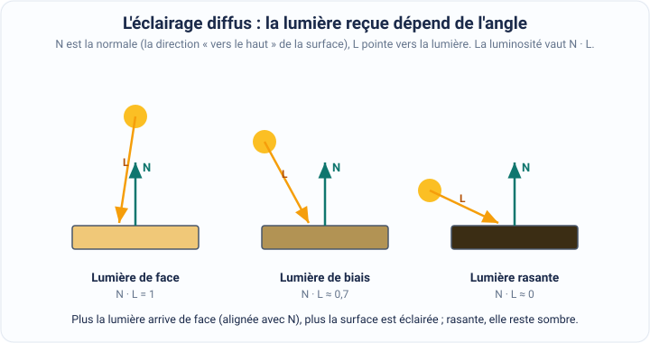

[← Graphiques informatiques](03-graphiques-informatiques.md) · [↑ Sommaire](../README.md#table-des-matières) · [Texture et mappage UV →](05-texture-et-mappage-uv.md)

# 4. Éclairage et ombres

Un objet dans un jeu vidéo n'est qu'une coquille de triangles : une forme vide, sans relief perçu, tant qu'on ne lui jette pas de la lumière dessus. C'est l'éclairage qui donne le volume, la matière (du métal ? du bois ? de la peau ?) et l'ambiance (un cachot ne se calcule pas comme une plage en plein midi). Et c'est l'ombre, c'est-à-dire l'absence de lumière, qui ancre les objets au sol et indique où ils se trouvent les uns par rapport aux autres.

> **Que veut dire « simuler » ?** Imiter quelque chose de réel avec des calculs, sans que ce soit vraiment ce phénomène. Quand la machine **simule** la lumière, elle ne fabrique pas de vrais photons : elle calcule, pour chaque point coloré de l'image, quelle quantité de lumière il devrait renvoyer, en suivant des formules qui copient la nature. Comme une recette de cuisine copie le goût d'un plat sans être le plat lui-même.

> **Que veut dire « une scène » ?** En jeu vidéo, c'est le petit monde qu'on est en train de montrer à l'écran : les objets, les personnages, le décor, et les lumières qui les éclairent, tous placés ensemble dans un même espace. Comme la scène d'un théâtre, avec ses décors et ses projecteurs.

Tout ce chapitre tourne donc autour d'une seule question : **combien de lumière repart de ce point de la surface vers l'œil du joueur ?** On va voir d'où vient la lumière (les sources), comment chaque petit bout de surface la renvoie (les modèles d'éclairage), et comment calculer les zones que la lumière n'atteint pas (les ombres).

### Sources de lumière

Une **source de lumière** est, dans la scène, l'endroit d'où part la lumière, comme une ampoule, le soleil ou une bougie. Avant de calculer comment une surface est éclairée, il faut savoir d'où arrive la lumière et de quelle façon. Les trois sources que l'on retrouve presque partout en jeu vidéo et en images de synthèse sont les suivantes.

> **Que veut dire « 3D » et « graphiques 3D » ?** « 3D » veut dire « en trois dimensions » : qui possède une largeur, une hauteur **et** une profondeur, comme un vrai objet qu'on pourrait prendre dans la main, par opposition à un dessin tout plat (en 2D, à plat sur la feuille). Les **graphiques 3D**, ce sont les images d'objets en relief calculées par la machine, comme dans la plupart des jeux modernes.

1. **Lumière directionnelle** : représente une source si éloignée qu'on la considère comme infiniment loin, comme le soleil. Tous les rayons lumineux arrivent **parallèles** (ils filent tous dans la même direction, sans jamais se croiser, comme les barreaux d'une échelle) et avec la même **intensité** partout. Elle sert surtout à simuler la lumière du jour.

> **Que veut dire « une distance infinie » ?** Une distance tellement grande qu'on fait comme si elle n'avait pas de fin. Le soleil est à 150 millions de kilomètres : par rapport à ce nombre énorme, deux objets distants de quelques mètres dans le jeu sont, à toutes fins utiles, à la même distance du soleil. C'est pourquoi on traite tous ses rayons comme parallèles et de même force : la différence serait invisible.

> **Que veut dire « l'intensité » d'une lumière ?** C'est sa force, sa quantité : une lumière intense est forte (un projecteur de stade), une lumière de faible intensité est faible (une bougie). En clair, c'est ce qui fait qu'une surface paraît plus ou moins éclairée.

2. **Lumière ponctuelle** : émet de la lumière dans **toutes** les directions à partir d'un seul point de l'espace, comme une ampoule nue suspendue au milieu d'une pièce. Plus on s'éloigne de l'ampoule, plus c'est sombre : son intensité diminue avec la distance, selon une règle appelée l'**inverse du carré de la distance**.

> **Que veut dire « ponctuelle » ?** Qui se résume à un point, c'est-à-dire à un endroit minuscule sans taille, comme la pointe d'une aiguille. La lumière est censée jaillir de ce point unique dans toutes les directions à la fois.

> **Que veut dire « l'inverse du carré de la distance » ?** Le **carré** d'un nombre, c'est ce nombre multiplié par lui-même ($`2`$ au carré vaut $`2 \times 2 = 4`$, $`3`$ au carré vaut $`3 \times 3 = 9`$). L'**inverse** d'un nombre, c'est $`1`$ divisé par ce nombre (l'inverse de $`4`$ vaut $`\tfrac{1}{4}`$). « L'inverse du carré de la distance » signifie donc : on prend la distance, on la met au carré, et l'intensité est divisée par ce résultat. Si on note $`d`$ la distance à l'ampoule et $`I_0`$ son intensité de départ, l'intensité reçue $`I`$ vaut :

```math
I = \frac{I_0}{d^2}
```

> **Le symbole $`d^2`$.** Le petit $`2`$ écrit en haut à droite veut dire « au carré », c'est-à-dire « multiplié une fois par lui-même » : $`d^2 = d \times d`$. Ici $`d`$ est la distance.

**Pourquoi diviser par le carré, et pas juste par la distance ?** Parce que la lumière part dans toutes les directions et se répand sur une sphère (une boule) de plus en plus grande au fur et à mesure qu'elle s'éloigne. Or la surface d'une sphère grandit comme le carré de son rayon. Donc à deux fois plus loin, la même lumière doit couvrir une surface **quatre** fois plus grande (et non deux fois) : chaque petit morceau de surface n'en reçoit donc plus que le quart. C'est exactement ce que dit la division par $`d^2`$.

3. **Lumière spot** (ou « projecteur ») : émet de la lumière depuis un point, mais seulement dans un **cône**, une direction en forme d'entonnoir, et pas tout autour. Elle sert à simuler les projecteurs de spectacle ou les lampes torches : un rond de lumière, net au centre, qui s'éteint sur les bords.

> **Que veut dire « conique » / « un cône » ?** Un cône, c'est la forme d'un cornet de glace ou d'un chapeau de magicien : une pointe d'où part un faisceau qui s'élargit en s'éloignant. La lumière spot n'éclaire que ce qui tombe à l'intérieur de ce cône.

### Modèles d'éclairage

Un **modèle d'éclairage** est une recette de calcul qui dit, pour un point d'une surface, quelle couleur il doit avoir une fois éclairé. On lui donne en entrée la position de la lumière, l'orientation de la surface et la position de l'œil ; il ressort une couleur. Tous les modèles ci-dessous reposent sur trois ingrédients que l'on va définir un par un : la **normale** de la surface, la **direction de la lumière** et la **direction de la caméra**.

> **Que veut dire « une surface » ?** C'est la peau d'un objet, sa face extérieure, l'endroit visible que la lumière vient frapper : le dessus d'une table, la coque d'une voiture, la joue d'un personnage. On ne calcule l'éclairage que sur ces faces visibles.

> **Que veut dire « la normale » d'une surface ?** C'est la **flèche perpendiculaire** à la surface en un point, celle qui pointe « droit dehors », comme un cure-dent planté tout droit dans une pomme. Elle indique dans quelle direction la surface « regarde ». On la note $`\mathbf{N}`$. Connaître cette direction est indispensable : une surface qui fait face à la lumière reçoit beaucoup de clarté, alors que la même surface tournée de côté n'en reçoit presque rien, même éclairée par la même ampoule.

> **Que veut dire « perpendiculaire » ?** Qui forme un angle bien droit (un angle de coin de feuille, $`90`$ degrés) avec quelque chose. Un poteau planté tout droit est perpendiculaire au sol.

> **Que veut dire « un angle » ?** C'est la mesure de l'écart entre deux directions, c'est-à-dire de quelle « ouverture » elles s'écartent l'une de l'autre. Deux directions identiques font un angle de $`0`$ ; deux directions opposées font un angle large. On mesure les angles en degrés (le tour complet fait $`360`$ degrés) ou en radians (le tour complet fait $`2\pi`$).

Voici les trois modèles les plus utilisés.

#### Le modèle de Phong

Le **modèle de Phong** additionne trois lumières de natures différentes pour obtenir la couleur finale d'un point : la lumière **ambiante**, la lumière **diffuse** et la lumière **spéculaire**. L'idée géniale est que ces trois bouts, mis bout à bout, suffisent à donner l'illusion convaincante d'un objet réel.

> **Que veut dire « une composante » ?** C'est l'un des morceaux qui s'additionnent pour former un tout, comme les ingrédients d'un gâteau. Ici, la couleur éclairée est la **somme** de trois composantes ; on les calcule séparément, puis on les ajoute.

**La composante ambiante.** C'est une petite quantité de lumière constante ajoutée partout, dans tous les coins, même ceux qu'aucune lampe n'atteint directement.

> **Que veut dire « ambiant » ?** Qui baigne tout l'environnement de façon uniforme, sans venir d'un endroit précis. Dans une vraie pièce, même un recoin à l'ombre n'est jamais totalement noir : la lumière a rebondi sur les murs, le plafond, le sol, et un peu de clarté traîne partout. La composante ambiante imite ce fond de clarté d'un seul chiffre, sans le calculer en détail (ce serait beaucoup trop coûteux).

On l'écrit comme la couleur de l'objet $`k_a`$ multipliée par une intensité ambiante $`I_a`$ :

```math
I_{\text{ambiant}} = k_a \, I_a
```

> **Le symbole $`k_a`$.** La lettre $`k`$ (avec un petit $`a`$ en bas pour « ambiant ») est une **constante**, c'est-à-dire un nombre fixé d'avance qui ne change pas pendant le calcul. Ici $`k_a`$ représente la part de lumière ambiante que ce matériau renvoie. Le petit $`a`$ écrit en bas s'appelle un **indice** : c'est une étiquette qui sert juste à distinguer plusieurs grandeurs qui se ressemblent ($`k_a`$ pour l'ambiant, plus loin $`k_d`$ pour le diffus, $`k_s`$ pour le spéculaire).

**La composante diffuse.** C'est la lumière qu'une surface mate renvoie dans toutes les directions de façon égale. Plus la surface fait face à la lumière, plus elle est éclairée.

> **Que veut dire « diffus » ?** Qui se disperse dans toutes les directions de manière égale, sans renvoyer d'image. Une feuille de papier, un mur peint, un tee-shirt en coton sont des surfaces diffuses : peu importe d'où on les regarde, leur teinte paraît la même. Elles « éparpillent » la lumière au lieu de la renvoyer comme un miroir.

Pour mesurer « à quel point la surface fait face à la lumière », on compare deux flèches : la normale $`\mathbf{N}`$ (la direction vers laquelle la surface regarde) et la direction $`\mathbf{L}`$ qui va du point vers la lumière. L'outil mathématique fait pour cela est le **produit scalaire**.

> **Que veut dire « le produit scalaire » ?** C'est une opération qui prend deux flèches (deux vecteurs) et rend un seul nombre mesurant à quel point elles pointent dans la même direction. Si elles pointent pile dans le même sens, le résultat est grand ; si elles sont perpendiculaires (en angle droit), il vaut $`0`$ ; si elles pointent en sens contraires, il devient négatif. On le note avec un point au milieu : $`\mathbf{N} \cdot \mathbf{L}`$. (Il est détaillé au chapitre des bases mathématiques.)

> **Que veut dire « un vecteur » ?** C'est une flèche : une direction (où l'on pointe) accompagnée d'une longueur. On le note d'ordinaire avec une lettre en gras, comme $`\mathbf{N}`$ ou $`\mathbf{L}`$. Quand sa longueur vaut exactement $`1`$, on dit qu'il est **unitaire** : il ne sert alors qu'à indiquer une direction, sans ajouter de « force » au calcul.

La composante diffuse vaut donc la couleur diffuse $`k_d`$ de l'objet, multipliée par l'intensité de la lumière $`I_d`$, multipliée par ce produit scalaire :

```math
I_{\text{diffus}} = k_d \, I_d \, \max(0,\ \mathbf{N} \cdot \mathbf{L})
```

> **Le symbole $`\max(0,\ \dots)`$.** $`\max`$ veut dire « le plus grand des deux nombres entre parenthèses ». Écrire $`\max(0,\ x)`$ signifie donc : « garde $`x`$ s'il est positif, sinon remplace-le par $`0`$ ». On s'en sert ici pour empêcher une lumière **négative**, qui n'aurait aucun sens : quand la surface tourne le dos à la lumière, le produit scalaire devient négatif, et on le ramène simplement à $`0`$ (la face est dans le noir, pas « éclairée en moins »).

C'est la **loi du cosinus de Lambert** : quand la surface fait pile face à la lumière, $`\mathbf{N} \cdot \mathbf{L}`$ vaut $`1`$ et l'éclairage est maximal ; quand elle se tourne progressivement de côté, ce nombre descend doucement vers $`0`$ et la surface s'assombrit. C'est exactement ce qu'on observe sur une boule éclairée par le soleil : un côté bien clair, l'autre dans la pénombre, avec un dégradé entre les deux.

**La composante spéculaire.** C'est le petit **point brillant** qui apparaît sur les objets lisses, le reflet vif de la source de lumière elle-même : l'éclat sur une pomme cirée, la tache lumineuse sur un casque ou sur l'eau.

> **Que veut dire « spéculaire » ?** Qui se comporte comme un miroir. Le mot vient du latin *speculum*, « miroir ». Une surface spéculaire renvoie la lumière dans une direction précise (comme un miroir renvoie votre reflet), au lieu de l'éparpiller partout comme le fait une surface diffuse. C'est ce qui crée les reflets brillants.

Ce reflet n'est visible que si l'œil se trouve dans la bonne direction : là où la lumière « rebondit » sur la surface. Phong calcule donc la direction $`\mathbf{R}`$ que prendrait la lumière en rebondissant (sa **réflexion**), puis la compare à la direction $`\mathbf{V}`$ qui va du point vers l'œil (la caméra). Plus ces deux flèches s'alignent, plus le reflet est vif :

```math
I_{\text{spéculaire}} = k_s \, I_s \, \max(0,\ \mathbf{R} \cdot \mathbf{V})^{\,n}
```

> **Que veut dire « la réflexion » de la lumière (le vecteur $`\mathbf{R}`$) ?** C'est la direction que prend un rayon de lumière après avoir rebondi sur une surface, exactement comme une balle qui ricoche sur un mur repart de l'autre côté avec le même angle. $`\mathbf{R}`$ est cette direction de rebond.

> **Que veut dire « la caméra » ?** C'est l'œil virtuel par lequel le joueur voit la scène, le point de vue depuis lequel l'image est calculée. La direction $`\mathbf{V}`$ (pour *view*, « vue » en anglais) va du point de la surface jusqu'à cet œil.

> **Le symbole $`(\dots)^{\,n}`$ : l'exposant de brillance.** L'exposant $`n`$ (un nombre, par exemple $`8`$, $`50`$ ou $`200`$) contrôle la **taille** du point brillant. Un petit $`n`$ donne une tache large et floue (surface un peu satinée) ; un grand $`n`$ donne un point minuscule et très net (surface très polie, presque un miroir). Élever un nombre compris entre $`0`$ et $`1`$ à une grande puissance le rapproche très vite de $`0`$ : c'est pourquoi le reflet se concentre en un point d'autant plus serré que $`n`$ est grand.

**Le résultat final.** On additionne simplement les trois composantes :

```math
I_{\text{Phong}} = \underbrace{k_a I_a}_{\text{ambiant}} + \underbrace{k_d I_d \max(0,\ \mathbf{N} \cdot \mathbf{L})}_{\text{diffus}} + \underbrace{k_s I_s \max(0,\ \mathbf{R} \cdot \mathbf{V})^{\,n}}_{\text{spéculaire}}
```

> **Que veut dire le symbole $`\underbrace{\ \ }`$ ?** C'est juste une accolade décorative placée **sous** un morceau de formule, avec une étiquette en dessous, pour annoncer « voici à quoi sert ce bout-là ». Elle ne change rien au calcul ; elle aide seulement à lire la formule.

#### Le modèle de Lambert

Le **modèle de Lambert** est plus ancien et plus simple que celui de Phong : il garde seulement les composantes **ambiante** et **diffuse**, et laisse tomber la spéculaire. Autrement dit, il sait éclairer une surface mate, mais il ne fabrique aucun reflet brillant.

```math
I_{\text{Lambert}} = k_a I_a + k_d I_d \max(0,\ \mathbf{N} \cdot \mathbf{L})
```



Il est donc moins réaliste (pas d'éclat sur le métal ou l'eau), mais **plus rapide** à calculer, puisqu'il économise tout le travail du reflet. C'est un choix raisonnable pour les objets mats, ou pour les machines à faible puissance de calcul (un vieux téléphone, par exemple), où chaque économie compte.

> **Que veut dire « la puissance de calcul » ?** C'est la vitesse à laquelle une machine est capable d'enchaîner des calculs : une grosse machine en fait énormément par seconde, une petite beaucoup moins. Un jeu doit recalculer toute l'image des dizaines de fois par seconde ; sur une machine lente, il faut donc choisir les formules les plus économiques, sous peine de saccades.

#### Le modèle de Blinn-Phong

Le **modèle de Blinn-Phong** est une variante astucieuse de Phong qui calcule le reflet d'une manière moins coûteuse. Plutôt que de calculer la direction de rebond exacte $`\mathbf{R}`$ (un calcul un peu lourd), il introduit un raccourci : le **vecteur médian** $`\mathbf{H}`$ (souvent appelé *half-vector* en anglais).

> **Que veut dire « le vecteur médian » (*half-vector*, $`\mathbf{H}`$) ?** C'est la flèche pile **au milieu**, à mi-chemin entre la direction de la lumière $`\mathbf{L}`$ et la direction de l'œil $`\mathbf{V}`$. Pour l'obtenir, on additionne les deux flèches et on ramène le résultat à une longueur de $`1`$. Comparer cette flèche du milieu à la normale revient, en gros, à se demander si l'œil est bien placé pour voir le reflet, mais en évitant le calcul plus lourd du rebond exact.

```math
\mathbf{H} = \frac{\mathbf{L} + \mathbf{V}}{\|\mathbf{L} + \mathbf{V}\|}
\qquad
I_{\text{spéculaire}} = k_s \, I_s \, \max(0,\ \mathbf{N} \cdot \mathbf{H})^{\,n}
```

> **Le symbole $`\|\,\mathbf{L} + \mathbf{V}\,\|`$.** Les deux barres verticales autour d'un vecteur désignent sa **longueur** (sa « norme »). Diviser le vecteur $`\mathbf{L} + \mathbf{V}`$ par sa propre longueur le ramène à une longueur de $`1`$ : on garde sa direction, mais on lui retire sa « force ». On appelle cela **normaliser** un vecteur.

Le reflet obtenu est légèrement différent de celui de Phong, mais l'œil n'y voit le plus souvent que du feu. Comme il coûte moins cher, **Blinn-Phong est longtemps resté le modèle de reflet préféré des jeux vidéo**, et il sert encore de référence dans beaucoup de moteurs.

### Ombres

Une **ombre** est une zone où la lumière n'arrive pas parce qu'un objet lui barre le passage. Sans ombres, les objets semblent flotter, décollés du sol, sans poids ni position claire. Avec elles, le cerveau comprend tout de suite où chaque chose se trouve : une balle juste posée sur une table projette une ombre serrée, la même balle en l'air projette une ombre lointaine. L'ombre donne donc à la fois de la **profondeur** (la sensation de relief, de distances entre les objets) et du **réalisme** (la ressemblance avec le monde réel).

> **Que veut dire « le rendu » ?** C'est le moment où la machine transforme toute la description de la scène (objets, lumières, matières) en l'image finale de pixels affichée à l'écran. « Lors du rendu » veut dire « au moment où l'on fabrique l'image ».

> **Que veut dire « un pixel » ?** C'est l'un des minuscules carrés de couleur qui, mis côte à côte par milliers, forment l'image à l'écran. De près on les distingue ; de loin ils se fondent en une image continue. Calculer l'éclairage, c'est au fond choisir la couleur de chaque pixel.

Voici les techniques d'ombres les plus répandues.

1. **Ombres portées** (en anglais *shadow mapping*, « cartographie d'ombre ») : c'est la méthode la plus courante. L'idée est de regarder la scène **depuis la lampe** pour noter ce qu'elle voit, puis de s'en servir pour savoir qui est éclairé et qui est caché.

> **Que veut dire « une ombre portée » ?** C'est l'ombre qu'un objet projette sur ce qui l'entoure (le sol, un mur, un autre objet), par opposition à la simple pénombre sur sa propre face cachée. L'ombre de votre corps étalée sur le trottoir au soleil est une ombre portée.

La méthode se déroule en deux temps. **Premier temps :** on dessine la scène vue depuis la lampe et, pour chaque direction, on retient uniquement **la distance de l'objet le plus proche** de la lampe. On range toutes ces distances dans une image spéciale appelée **carte des profondeurs** (en anglais *depth map*).

> **Que veut dire « une carte des profondeurs » (*depth map*) ?** C'est une image qui, à la place d'une couleur, stocke en chaque point une **distance** : à quelle distance se trouve le premier objet rencontré dans cette direction. C'est comme une carte au trésor qui, au lieu de dessiner le paysage, noterait à chaque endroit « ici, l'objet le plus proche est à tant de mètres ». Vue depuis la lampe, elle dit donc jusqu'où la lumière voyage avant de heurter quelque chose.

> **Que veut dire « la perspective de la lampe » / regarder « depuis » la lampe ?** C'est se mettre à la place de la lampe et imaginer ce qu'elle voit, comme si on collait son œil dessus. Ce qu'elle voit en premier est éclairé ; ce qui est caché derrière est dans l'ombre. C'est exactement ce point de vue qu'on enregistre dans la carte des profondeurs.

**Deuxième temps :** au moment de fabriquer l'image vue par le joueur, on examine chaque point de surface et on se pose une question simple. On calcule sa distance à la lampe, et on la compare à la distance rangée dans la carte des profondeurs pour cette direction :

- si les deux distances sont (à peu près) **égales**, c'est que ce point est bien le premier rencontré par la lampe : il est donc **éclairé** ;
- si le point est **plus loin** que ce qu'indique la carte, c'est qu'un autre objet, plus proche, a déjà arrêté la lumière avant lui : ce point est donc **dans l'ombre**.

> **Que veut dire « le point courant » ?** C'est simplement « le point qu'on est en train d'examiner en ce moment ». Quand la machine traite l'image, elle s'occupe des points l'un après l'autre ; celui sur lequel elle travaille à l'instant est le point courant.
2. **Ombres volumétriques** (en anglais *volumetric shadows*) : elles simulent les ombres à l'intérieur de matières que la lumière peut traverser un peu, comme la fumée ou la brume. On voit alors des rayons et des traînées d'ombre dessinés dans l'air lui-même, et non plus seulement posés sur le sol.

> **Que veut dire « volumétrique » ?** Qui occupe tout un volume, tout un espace en relief, et pas seulement une surface plate. Une ombre volumétrique ne se contente pas de noircir le sol : elle existe dans l'épaisseur de l'air rempli de fumée, là où l'on voit des « colonnes » de lumière traverser un brouillard.

> **Que veut dire « semi-transparent » ?** À moitié transparent : qui laisse passer une partie de la lumière, mais pas toute. Une vitre dépolie, un voilage, de la fumée sont semi-transparents : on devine ce qu'il y a derrière, en plus flou et plus sombre.

> **Que veut dire « l'atténuation » de la lumière ?** C'est l'affaiblissement progressif de la lumière, qui perd de sa force au fur et à mesure qu'elle avance. En traversant de la fumée, la lumière est peu à peu absorbée : plus elle parcourt de fumée, plus elle s'éteint. Calculer cet affaiblissement le long du trajet donne les belles colonnes lumineuses des sous-bois ou des halls poussiéreux.

> **Que veut dire « des particules en suspension dans l'air » ?** Ce sont de minuscules grains (poussière, gouttelettes, fumée) si légers qu'ils flottent dans l'air au lieu de tomber. C'est sur eux que la lumière rebondit pour devenir visible : c'est ce qui rend un rayon de soleil « palpable » quand il traverse une pièce poussiéreuse.

3. **Ombres douces** (en anglais *soft shadows*) : ce sont des ombres aux bords **flous**, qui s'estompent progressivement au lieu de s'arrêter net. C'est ce qu'on observe dans la réalité : le contour de votre ombre est net près de vos pieds, puis de plus en plus flou en s'éloignant.

> **Que veut dire « un flou progressif » ?** Un passage en douceur, sans cassure, entre une zone et une autre : ici, du noir de l'ombre vers la pleine lumière, par un dégradé graduel plutôt que par une frontière brutale. C'est l'inverse d'un bord net.

> **Pourquoi les vraies ombres ont-elles des bords flous ?** Parce qu'une vraie source de lumière (le soleil, une fenêtre, un plafonnier) n'est jamais un point minuscule : elle a une certaine **taille**. Depuis le bord de l'ombre, on voit donc la source en partie cachée, en partie visible : ni tout à fait dans le noir, ni en pleine lumière, mais entre les deux. Cette zone de transition s'appelle la pénombre. Pour l'imiter, on fait comme s'il y avait plusieurs petites lumières voisines au lieu d'une seule, ou bien on **floute** exprès le bord des ombres portées avec une technique de filtrage.

> **Que veut dire « une technique de filtrage » ?** C'est une méthode qui consiste à mélanger un point avec ses voisins pour adoucir l'image, comme passer une éponge sur un dessin au fusain pour estomper les traits. Appliqué au bord d'une ombre, ce mélange remplace la cassure nette par un dégradé doux.

4. **Ray tracing** (« tracé de rayons ») : c'est une technique de rendu très réaliste qui suit le trajet de la lumière comme dans la vraie vie. Pour chaque pixel, on lance une ligne imaginaire (un **rayon**) depuis l'œil, on regarde quel objet elle touche, puis on suit la lumière de rebond en rebond jusqu'aux sources.

> **Que veut dire « tracer un rayon » ?** C'est suivre, pas à pas, le chemin d'une ligne droite imaginaire lancée depuis un point dans une direction, et regarder ce qu'elle rencontre. On « trace » donc le voyage de la lumière comme on suivrait du doigt le trajet d'un laser à travers une pièce.

> **Que veut dire « une réflexion » ?** C'est le renvoi de la lumière par une surface, comme un miroir renvoie une image, ou comme l'eau calme d'un lac renvoie le ciel. C'est ce qui permet de voir le reflet d'un objet **dans** un autre.

> **Que veut dire « une réfraction » ?** C'est la **déviation** de la lumière quand elle change de milieu, par exemple en passant de l'air dans l'eau ou dans le verre. C'est pour cela qu'une paille plongée dans un verre d'eau paraît « cassée » à la surface : la lumière a tourné en entrant dans l'eau.

> **Que veut dire « la lumière globale » ?** C'est la prise en compte de **tous** les rebonds de la lumière, et pas seulement du premier. Dans la réalité, la lumière rebondit partout : un mur rouge éclairé teinte légèrement de rouge le sol voisin. Simuler ces rebonds entre objets s'appelle la lumière globale (en anglais *global illumination*), et c'est elle qui rend les scènes vraiment crédibles.

Le ray tracing produit des ombres, des reflets et une lumière globale superbes, mais il est **coûteux en temps de calcul** : suivre tous ces rayons et leurs rebonds demande énormément d'opérations. Longtemps réservé au cinéma, il devient peu à peu jouable en temps réel dans les jeux, grâce aux progrès des cartes graphiques et des algorithmes.

> **Que veut dire « une carte graphique » ?** C'est la pièce de la machine spécialisée dans le calcul des images (on dit aussi GPU). Elle est capable de faire un nombre colossal de petits calculs en même temps, ce qui est exactement ce dont l'éclairage a besoin : la même formule appliquée à des millions de pixels d'un coup.

> **Que veut dire « un algorithme » ?** C'est une suite d'étapes précises à suivre pour résoudre un problème, comme une recette de cuisine ou une notice de montage. Un « algorithme de rendu » est la marche à suivre que l'ordinateur applique pour transformer la scène en image.

[ Retour en haut de page](#table-des-matières)

---

---

[← Graphiques informatiques](03-graphiques-informatiques.md) · [↑ Sommaire](../README.md#table-des-matières) · [Texture et mappage UV →](05-texture-et-mappage-uv.md)
