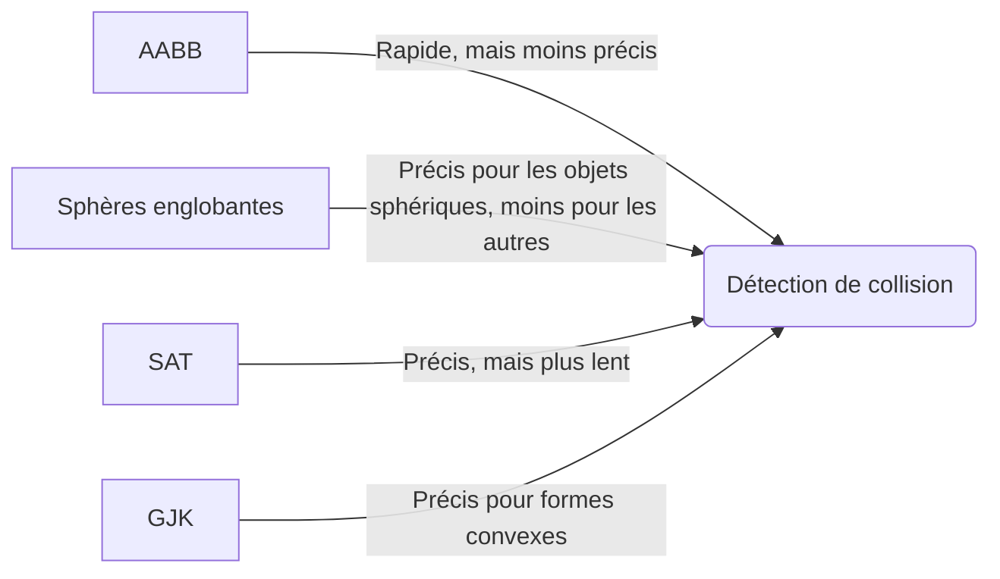
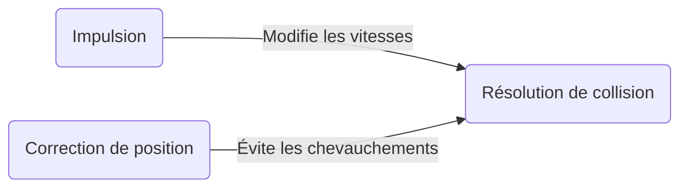

[← Animation](06-animation.md) · [↑ Sommaire](../README.md#table-des-matières) · [Intelligence artificielle →](08-intelligence-artificielle.md)

# 7. Physique des jeux

La **physique des jeux** est un élément clé pour créer des environnements interactifs et réalistes dans les jeux vidéo. Elle comprend la **simulation de mouvements**, de **forces** et de **collisions** entre objets dans un monde virtuel.

Les principales composantes de la physique des jeux incluent la simulation physique, la détection de collision et la résolution de collision.

### Simulation physique

La simulation physique calcule les **forces** appliquées aux corps et en déduit leurs **mouvements**. Le point de départ reste la **deuxième loi de Newton** :

```math
\mathbf{F} = m\,\mathbf{a}
```

où $\mathbf{F}$ est la résultante des forces (vecteur), $m$ la masse de l'objet (scalaire) et $\mathbf{a}$ son accélération (vecteur). Les forces peuvent inclure la gravité, les forces de contact, le frottement et d'autres forces externes. L'accélération résultante s'obtient en les sommant :

```math
\mathbf{a} = \frac{1}{m}\sum_i \mathbf{F}_i
```

Position et vitesse sont ensuite intégrées dans le temps. La méthode la plus simple, l'**Euler explicite**, s'écrit :

```math
\mathbf{v}_{t+1} = \mathbf{v}_t + \mathbf{a}\,\Delta t
```

```math
\mathbf{p}_{t+1} = \mathbf{p}_t + \mathbf{v}_t\,\Delta t
```

où $\Delta t$ est le pas de temps. La position est mise à jour avec la vitesse **avant** la mise à jour (c'est ce qui définit l'Euler explicite). Euler explicite gagne en simplicité ce qu'il perd en stabilité : sur de longues simulations, il introduit une dérive énergétique (les ressorts gagnent de l'énergie, les orbites s'écartent). On lui préfère :

- **Euler semi-implicite** (*symplectic Euler*) : on met à jour la vitesse **avant** la position — et on utilise la nouvelle vitesse $\mathbf{v}_{t+1}$ pour mettre à jour la position — ce qui en fait un *intégrateur symplectique*.

```math
\mathbf{v}_{t+1} = \mathbf{v}_t + \mathbf{a}(\mathbf{p}_t)\,\Delta t, \qquad \mathbf{p}_{t+1} = \mathbf{p}_t + \mathbf{v}_{t+1}\,\Delta t
```

  - *Avantages* : l'erreur d'énergie reste bornée sur la durée (pas de dérive séculaire) ; simple à implémenter ; **l'intégrateur par défaut** dans la plupart des moteurs de jeu (Box2D, Bullet, PhysX).
  - *Inconvénients* : même ordre de précision locale (ordre 1) qu'Euler explicite, donc pas plus précis sur un seul pas ; pas adapté aux contraintes d'angle complexes.

- **Verlet de position** (Verlet, 1967) : on ne stocke pas la vitesse explicitement, on la déduit des deux dernières positions.

```math
\mathbf{p}_{t+1} = 2\,\mathbf{p}_t - \mathbf{p}_{t-1} + \mathbf{a}(\mathbf{p}_t)\,\Delta t^2
```

  - *Avantages* : élégant pour les systèmes contraints (*Position-Based Dynamics*, ragdolls de *Hitman*) ; bonne conservation de l'énergie.
  - *Inconvénients* : nécessite de conserver deux états consécutifs ; la vitesse n'est disponible qu'a posteriori (précision réduite lors d'une application de force instantanée).

- **Velocity Verlet** : variante qui maintient explicitement la vitesse.

```math
\mathbf{p}_{t+1} = \mathbf{p}_t + \mathbf{v}_t\,\Delta t + \tfrac{1}{2}\,\mathbf{a}(\mathbf{p}_t)\,\Delta t^2, \qquad \mathbf{v}_{t+1} = \mathbf{v}_t + \tfrac{1}{2}\big[\mathbf{a}(\mathbf{p}_t) + \mathbf{a}(\mathbf{p}_{t+1})\big]\,\Delta t
```

  - *Avantages* : exacte à l'ordre 2 sur la position et la vitesse ; très bonne conservation de l'énergie ; utilisée par les moteurs de cloth, de soft-body et de simulation moléculaire.
  - *Inconvénients* : requiert deux évaluations de l'accélération par pas (légèrement plus coûteux que le semi-implicite).

- **Runge-Kutta 4 (RK4)** : méthode à quatre étages, très précise (erreur en $O(\Delta t^5)$). Pour un système $\dot{\mathbf{y}} = f(\mathbf{y})$ :

```math
\begin{aligned}
\mathbf{k}_1 &= f(\mathbf{y}_t) \\
\mathbf{k}_2 &= f(\mathbf{y}_t + \tfrac{\Delta t}{2}\,\mathbf{k}_1) \\
\mathbf{k}_3 &= f(\mathbf{y}_t + \tfrac{\Delta t}{2}\,\mathbf{k}_2) \\
\mathbf{k}_4 &= f(\mathbf{y}_t + \Delta t\,\mathbf{k}_3) \\
\mathbf{y}_{t+1} &= \mathbf{y}_t + \tfrac{\Delta t}{6}\,(\mathbf{k}_1 + 2\,\mathbf{k}_2 + 2\,\mathbf{k}_3 + \mathbf{k}_4)
\end{aligned}
```

  - *Avantages* : très haute précision par pas ($O(\Delta t^5)$) ; idéal pour les simulations aérospatiales, de trajectoire balistique et les démos physiques éducatives.
  - *Inconvénients* : quatre évaluations de la dérivée par pas (4× plus coûteux qu'Euler) ; **non symplectique** — l'énergie dérive lentement sur les longues simulations malgré sa précision locale ; rarement utilisé dans les jeux temps réel.

> **Pourquoi les moteurs de jeu privilégient le semi-implicite et le Verlet plutôt que RK4.** Dans un jeu, on simule presque toujours pendant des minutes ou des heures sans interruption, donc la stabilité énergétique sur la durée compte plus que la précision instantanée. Une dérive lente d'un canon en orbite finit par se voir au bout de quelques dizaines de secondes ; en revanche, une erreur de quelques centimètres sur la trajectoire d'un obus qui parcourt cent mètres reste totalement invisible. C'est pour cette raison que les moteurs de physique grand public (Box2D, Bullet, PhysX) choisissent par défaut un intégrateur symplectique, et que les moteurs de tissu reposent sur du Verlet : on préfère un comportement qui ne s'emballe jamais à un comportement très précis sur un pas mais instable sur la durée.

#### Le pas de simulation n'est pas le pas de rendu

C'est l'un des pièges les plus courants du game-dev débutant : faire l'intégration physique avec le `Δt` de la frame courante, qui varie selon la charge machine. Cela entraîne trois problèmes distincts :

1. **Comportement non déterministe** : le même replay donne des résultats différents sur deux machines parce que les `dt` ne sont pas identiques.
2. **Tunneling** : un objet rapide traverse un mur si la frame est lente, parce que `position += velocity * dt` saute par-dessus la collision.
3. **Instabilité numérique** : les ressorts et contraintes de constantes physiques calculées pour un `dt = 16ms` explosent quand la frame chute à `60ms`.

La solution canonique (Glenn Fiedler, [*"Fix Your Timestep"*](https://gafferongames.com/post/fix_your_timestep/)) :

```text
fixedDt     = 1/60             // pas de simulation, constant (ex. : 60 Hz)
accumulator = 0.0              // temps accumulé non encore simulé (initialisé à 0)

// — boucle principale, appelée à chaque frame —
dt          = frameDelta       // temps réel écoulé depuis la dernière frame
accumulator += dt
while accumulator >= fixedDt:
 physicsStep(fixedDt)       // itération à pas constant, déterministe
 accumulator -= fixedDt
alpha = accumulator / fixedDt
render(state, alpha)           // interpolation visuelle pour la fluidité
```

C'est ce schéma qui se cache derrière le `FixedUpdate` d'Unity, le `PhysicsTickRate` d'Unreal ou le `_physics_process` de Godot : le rendu peut tourner à 144 Hz pendant que la physique reste cadencée à 60 Hz fixe.

### Détection de collision

La **détection de collision** est le processus par lequel on détermine si deux objets se touchent ou se croisent. Il existe de nombreuses techniques pour détecter les collisions :

- les tests de **boîtes englobantes** (**AABB** — *Axis-Aligned Bounding Box* : un parallélépipède rectangle dont les faces sont alignées sur les axes du monde, défini par seulement deux points min/max — c'est le test le plus rapide possible, "deux objets se chevauchent ssi leurs intervalles se chevauchent sur les trois axes") ;
- les tests de **sphères englobantes** (un seul point + un rayon, encore plus rapide qu'AABB mais plus lâche) ;
- les tests de **séparation d'axes** (**SAT** — *Separating Axis Theorem* : deux convexes ne se touchent pas s'il existe **un seul axe** sur lequel leurs projections ne se chevauchent pas — il suffit de tester un nombre fini d'axes "candidats" tirés des normales aux faces et arêtes) ;
- l'algorithme **GJK** (*Gilbert-Johnson-Keerthi*, 1988 — résout la collision entre deux formes convexes en cherchant le point le plus proche de l'origine dans la **différence de Minkowski** $A \ominus B = \{a - b \mid a \in A,\, b \in B\}$ ; collision $\Leftrightarrow$ origine $\in A \ominus B$. Standard dans Bullet, Box2D, PhysX).

Chaque technique a ses avantages et ses inconvénients en termes de **précision** et de **performances**.



### Résolution de collision

La **résolution de collision** est le processus par lequel on modifie les positions, les vitesses et les forces des objets en collision pour éviter qu'ils ne se chevauchent ou ne traversent les autres objets.

La résolution de collision peut être basée sur des principes de mécanique classique, comme la conservation de l'**énergie cinétique** et de la **quantité de mouvement**, ou sur des techniques heuristiques pour simplifier les calculs et améliorer les performances.

La résolution de collision implique généralement l'application d'une **force d'impulsion** aux objets en collision pour les séparer :

```math
J = \frac{-(1 + e)\,(\mathbf{v}_{A_t} - \mathbf{v}_{B_t}) \cdot \mathbf{n}}{\dfrac{1}{m_A} + \dfrac{1}{m_B}}
```

où $J$ est l'impulsion (scalaire), $e$ est le coefficient de **restitution** (élasticité, $0$ = parfaitement inélastique, $1$ = parfaitement élastique), $\mathbf{v}_{A_t}$ et $\mathbf{v}_{B_t}$ sont les vitesses vectorielles des objets $A$ et $B$ avant la collision, $m_A$ et $m_B$ sont les masses des objets, et $\mathbf{n}$ est le vecteur unitaire normal à la surface de contact.

Ensuite, les vitesses des objets après la collision sont mises à jour en fonction de l'impulsion appliquée :

```math
\mathbf{v}_{A_{t+1}} = \mathbf{v}_{A_t} + \frac{J}{m_A}\,\mathbf{n}
```

```math
\mathbf{v}_{B_{t+1}} = \mathbf{v}_{B_t} - \frac{J}{m_B}\,\mathbf{n}
```

La position des objets peut également être corrigée pour éviter les chevauchements en déplaçant les objets en fonction de la profondeur de pénétration $P$ et d'un facteur de correction :

```math
\mathbf{p}_{A_{t+1}} = \mathbf{p}_{A_t} - \frac{m_B}{m_A + m_B}\,P\,\mathbf{n}
```

```math
\mathbf{p}_{B_{t+1}} = \mathbf{p}_{B_t} + \frac{m_A}{m_A + m_B}\,P\,\mathbf{n}
```

où $P$ est la profondeur de pénétration et $\mathbf{n}$ est le vecteur unitaire normal à la surface de contact. Le facteur $m_B/(m_A + m_B)$ (resp. $m_A/(m_A + m_B)$) répartit la correction en proportion inverse des masses : un objet plus lourd se déplace moins.



[ Retour en haut de page](#table-des-matières)

---

---

[← Animation](06-animation.md) · [↑ Sommaire](../README.md#table-des-matières) · [Intelligence artificielle →](08-intelligence-artificielle.md)
