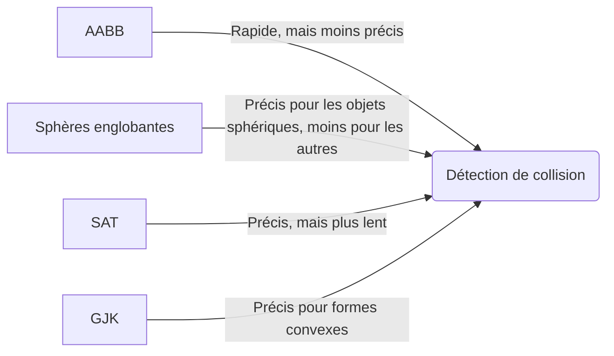
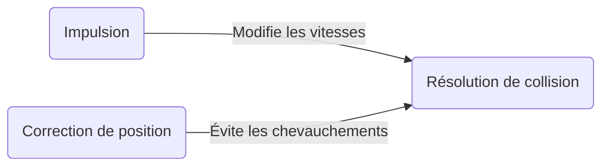

[← Animation](06-animation.md) · [↑ Sommaire](../README.md#table-des-matières) · [Intelligence artificielle →](08-intelligence-artificielle.md)

# 7. Physique des jeux

Quand une caisse tombe d'une étagère, glisse sur le sol, rebondit contre un mur et finit par s'immobiliser, tout cela obéit à des règles. Dans la vraie vie, ces règles sont celles de la nature. Dans un jeu vidéo, c'est l'ordinateur qui doit les rejouer, image après image, pour que la caisse tombe « comme une vraie caisse ». C'est exactement ce travail que l'on appelle la physique des jeux.

> **Que veut dire « physique des jeux » ?** C'est l'ensemble des calculs qui font bouger les objets d'un jeu de façon crédible : une balle qui tombe, deux voitures qui s'entrechoquent, un drapeau qui flotte. L'ordinateur ne « voit » rien : il connaît seulement des nombres (où est l'objet, à quelle vitesse il va) et il les met à jour très souvent pour donner l'illusion du mouvement.

Le travail se découpe naturellement en trois grandes questions. D'abord : comment un objet bouge-t-il quand des forces agissent sur lui (la **simulation physique**) ? Ensuite : comment savoir si deux objets se touchent (la **détection de collision**) ? Enfin : que faire quand ils se touchent, pour qu'ils ne se traversent pas comme des fantômes (la **résolution de collision**) ? Les trois sections qui suivent répondent à ces questions dans l'ordre.

### Simulation physique

Simuler la physique, c'est partir des **forces** qui poussent ou tirent un objet, et en déduire son **mouvement**.

> **Que veut dire « force » ?** Une force, c'est tout ce qui pousse ou tire un objet : la main qui pousse une caisse, la corde qui tire un seau, le poids qui attire une pomme vers le sol. Plus la force est grande, plus elle change le mouvement de l'objet.

Le point de départ de tout ce chapitre est une règle découverte il y a plus de trois siècles, la **deuxième loi de Newton**.

> **Que veut dire « deuxième loi de Newton » ?** C'est la phrase « force égale masse fois accélération », trouvée par le savant anglais Isaac Newton. Elle dit, en clair, qu'un objet lourd est plus difficile à faire accélérer qu'un objet léger : poussez de la même force un caddie vide et un caddie plein, le caddie plein démarre bien plus lentement.

```math
\mathbf{F} = m\,\mathbf{a}
```

> **Le symbole $`\mathbf{F}`$.** Il représente la force totale qui s'applique sur l'objet. La lettre est en gras pour rappeler que ce n'est pas un simple nombre : une force a une intensité (combien elle pousse) mais aussi une direction (vers où elle pousse). Un nombre accompagné d'une direction s'appelle un vecteur.

> **Que veut dire « vecteur » ?** C'est une flèche : elle a une longueur (sa force) et une direction (vers où elle pointe). « Va à 5 km/h vers le nord » est un vecteur ; « va à 5 km/h » tout court n'en est pas un, car on ne sait pas où. Dans un jeu, la position, la vitesse et les forces sont presque toujours des vecteurs.

> **Le symbole $`m`$.** Il représente la masse de l'objet, c'est-à-dire la quantité de matière qu'il contient (en gros, son « poids »). La lettre n'est pas en gras parce que la masse est un simple nombre, sans direction : on dit que c'est un scalaire.

> **Que veut dire « scalaire » ?** C'est un nombre tout simple, sans direction : une température, un âge, une masse. On l'oppose au vecteur, qui lui possède une direction. Retenez : scalaire = un seul nombre ; vecteur = une flèche.

> **Le symbole $`\mathbf{a}`$.** Il représente l'accélération de l'objet, c'est-à-dire la façon dont sa vitesse change. En gras, là encore, car accélérer se fait dans une direction donnée.

> **Que veut dire « accélération » ?** C'est le changement de vitesse au fil du temps. Quand une voiture passe de l'arrêt à toute allure, elle accélère ; quand elle freine, elle accélère « à l'envers » (elle ralentit). Ce n'est donc pas la vitesse, mais la manière dont la vitesse augmente ou diminue.

La formule se lit donc ainsi : la force appliquée est égale à la masse multipliée par l'accélération. Plusieurs forces agissent souvent en même temps sur un objet (la gravité qui l'attire vers le bas, le sol qui le soutient, le frottement qui le freine). Pour connaître leur effet combiné, on les additionne toutes, puis on en déduit l'accélération.

> **Que veut dire « gravité » ?** C'est la force qui attire tout objet vers le bas, vers le centre de la Terre. C'est elle qui fait tomber une pomme et retomber une balle qu'on lance en l'air.

> **Que veut dire « frottement » ?** C'est la force qui s'oppose au glissement, comme quand on freine en frottant les mains contre une table. C'est le frottement qui finit par arrêter une bille lancée sur le sol.

L'accélération s'obtient en sommant les forces, puis en divisant par la masse :

```math
\mathbf{a} = \frac{1}{m}\sum_i \mathbf{F}_i
```

> **Le symbole $`\sum`$.** C'est un grand S, la lettre grecque sigma, qui veut dire « additionne tout ». $`\sum_i \mathbf{F}_i`$ se lit « additionne toutes les forces $`\mathbf{F}_i`$, une par une ». L'indice $`i`$ est juste un compteur : la force numéro 1, la force numéro 2, et ainsi de suite. C'est une façon courte d'écrire « force 1 + force 2 + force 3 + ... » sans tout recopier.

La formule dit donc : additionnez toutes les forces, divisez par la masse, et vous obtenez l'accélération. C'est exactement la deuxième loi de Newton réécrite « à l'envers » pour isoler $`\mathbf{a}`$.

Une fois l'accélération connue, il reste à savoir où se trouvera l'objet et à quelle vitesse il ira à l'instant suivant. Pour cela, on avance le temps par toutes petites tranches et on met à jour la vitesse puis la position à chaque tranche. Ce procédé, qui consiste à reconstruire le mouvement pas à pas, s'appelle l'intégration.

> **Que veut dire « intégrer » (le mouvement) ?** C'est reconstruire petit bout par petit bout. Si vous connaissez votre vitesse à chaque seconde, vous pouvez deviner la distance parcourue en additionnant tous ces petits déplacements. Intégrer, c'est faire cette addition de tous les petits morceaux pour retrouver le mouvement complet.

La méthode la plus simple porte le nom du mathématicien Leonhard Euler ; on l'appelle l'**Euler explicite**. Elle s'écrit ainsi :

```math
\mathbf{v}_{t+1} = \mathbf{v}_t + \mathbf{a}\,\Delta t
```

```math
\mathbf{p}_{t+1} = \mathbf{p}_t + \mathbf{v}_t\,\Delta t
```

> **Le symbole $`\mathbf{v}`$.** C'est la vitesse de l'objet (en gras, car elle a une direction). $`\mathbf{p}`$, lui, désigne la position : l'endroit où se trouve l'objet.

> **Les indices $`t`$ et $`t+1`$.** Ils repèrent le moment. $`\mathbf{v}_t`$ est la vitesse à l'instant présent, $`\mathbf{v}_{t+1}`$ la vitesse au tout petit instant suivant. C'est comme une photo « maintenant » et une photo « juste après ».

> **Le symbole $`\Delta t`$.** Le triangle $`\Delta`$ (la lettre grecque delta) veut dire « petite quantité de ». Donc $`\Delta t`$ se lit « un petit bout de temps » : la durée d'une toute petite tranche, par exemple un soixantième de seconde. C'est le pas de temps, l'épaisseur de chaque morceau.

Ces deux lignes se lisent simplement. La première : la nouvelle vitesse, c'est l'ancienne plus l'accélération multipliée par le petit temps écoulé (logique, puisque accélérer pendant un instant ajoute un peu de vitesse). La seconde : la nouvelle position, c'est l'ancienne plus la vitesse multipliée par le petit temps écoulé (logique aussi, puisque avancer à une certaine vitesse pendant un instant fait parcourir une petite distance).

Le détail important est que la position est mise à jour avec l'ancienne vitesse, celle d'avant la mise à jour. C'est précisément ce choix qui définit l'Euler explicite. Cette méthode est très simple à programmer, mais elle a un défaut : sur de longues durées, elle accumule une petite erreur qui fausse l'énergie du système.

> **Que veut dire « dérive énergétique » ?** L'énergie, c'est la « réserve de mouvement » d'un objet. Normalement, sans cause extérieure, elle ne devrait ni apparaître ni disparaître toute seule. Une dérive énergétique, c'est quand le calcul triche un peu sans le vouloir : un ressort se met à rebondir de plus en plus fort tout seul, une planète tourne en s'éloignant peu à peu. Le mouvement devient faux à la longue.

Pour éviter ce défaut, on préfère souvent d'autres méthodes :

- **Euler semi-implicite** (aussi appelé *Euler symplectique*) : on met à jour la vitesse d'abord, la position ensuite, et surtout on calcule la nouvelle position avec la nouvelle vitesse $`\mathbf{v}_{t+1}`$. Ce minuscule changement d'ordre suffit à rendre la méthode bien plus stable.

```math
\mathbf{v}_{t+1} = \mathbf{v}_t + \mathbf{a}(\mathbf{p}_t)\,\Delta t, \qquad \mathbf{p}_{t+1} = \mathbf{p}_t + \mathbf{v}_{t+1}\,\Delta t
```

> **L'écriture $`\mathbf{a}(\mathbf{p}_t)`$.** Quand on écrit $`\mathbf{a}(\mathbf{p}_t)`$, cela veut dire « l'accélération calculée à partir de la position $`\mathbf{p}_t`$ ». C'est normal : les forces dépendent souvent de l'endroit où se trouve l'objet (un ressort tire d'autant plus fort qu'il est étiré, donc selon sa position). Les parenthèses se lisent ici « en fonction de » : l'accélération en fonction de la position.

> **Que veut dire « intégrateur symplectique » ?** Symplectique est un mot savant qui veut simplement dire : « qui ne laisse pas l'énergie partir en vrille ». Un intégrateur, c'est la méthode de calcul qui avance le mouvement pas à pas. Un intégrateur symplectique est donc une méthode qui garde l'énergie sous contrôle, même après des heures de simulation. Pourquoi ce changement d'ordre y suffit ? Parce qu'en utilisant la vitesse déjà corrigée pour déplacer l'objet, l'erreur faite sur la vitesse et l'erreur faite sur la position se compensent en grande partie, au lieu de s'additionner comme dans l'Euler explicite.

  - *Avantages* : l'erreur d'énergie reste sous contrôle sur toute la durée (elle ne grandit pas sans fin) ; très simple à programmer ; c'est la méthode choisie par défaut dans la plupart des moteurs de jeu (Box2D, Bullet, PhysX, des outils utilisés dans des milliers de jeux).
  - *Inconvénients* : sur un seul pas, elle n'est pas plus précise que l'Euler explicite ; elle convient mal aux objets qui tournent de façon compliquée.

> **Que veut dire « moteur de physique » (comme Box2D, Bullet, PhysX) ?** C'est une bibliothèque de calcul toute prête, une sorte de boîte à outils, que les créateurs de jeux réutilisent pour ne pas reprogrammer la physique de zéro. Box2D gère les mondes plats (en deux dimensions), Bullet et PhysX gèrent les mondes en relief (en trois dimensions).

- **Verlet de position** (inventée par le physicien Loup Verlet en 1967) : son idée maligne est de ne pas mémoriser la vitesse du tout. Au lieu de cela, elle regarde les deux dernières positions de l'objet et en déduit où il va.

```math
\mathbf{p}_{t+1} = 2\,\mathbf{p}_t - \mathbf{p}_{t-1} + \mathbf{a}(\mathbf{p}_t)\,\Delta t^2
```

> **Comment lire cette formule ?** $`\mathbf{p}_{t-1}`$ est la position d'avant-hier, $`\mathbf{p}_t`$ celle d'aujourd'hui, $`\mathbf{p}_{t+1}`$ celle de demain. L'astuce : la différence entre la position d'aujourd'hui et celle d'hier raconte déjà dans quelle direction et à quelle allure l'objet se déplaçait, donc on n'a pas besoin de garder la vitesse à part. On prolonge ce mouvement, puis on le courbe un peu avec l'accélération.

> **Le symbole $`\Delta t^2`$.** C'est $`\Delta t`$ multiplié par lui-même (le petit « 2 » en haut veut dire « au carré », c'est-à-dire « fois lui-même »). On le retrouve parce que l'accélération agit deux fois de suite sur le temps : une fois pour modifier la vitesse, une fois pour modifier la position.

  - *Avantages* : très pratique pour les objets reliés entre eux par des liens (cordes, tissus, pantins articulés, par exemple les corps désarticulés du jeu *Hitman*) ; conserve bien l'énergie.
  - *Inconvénients* : il faut mémoriser deux positions au lieu d'une ; la vitesse n'est pas connue directement, ce qui pose problème quand on veut donner un coup brusque à l'objet.

> **Que veut dire « ragdoll » (corps désarticulé) ?** C'est un personnage qui s'effondre comme une poupée de chiffon (ragdoll, en anglais) au lieu de jouer une animation toute faite. Chaque membre est relié aux autres par des liens, et la physique se charge de les faire retomber de façon réaliste. La méthode de Verlet, justement faite pour les objets reliés, est idéale pour cela.

- **Verlet en vitesse** (*Velocity Verlet*) : une variante de la précédente qui, cette fois, garde bien la vitesse en mémoire.

```math
\mathbf{p}_{t+1} = \mathbf{p}_t + \mathbf{v}_t\,\Delta t + \tfrac{1}{2}\,\mathbf{a}(\mathbf{p}_t)\,\Delta t^2, \qquad \mathbf{v}_{t+1} = \mathbf{v}_t + \tfrac{1}{2}\big[\mathbf{a}(\mathbf{p}_t) + \mathbf{a}(\mathbf{p}_{t+1})\big]\,\Delta t
```

> **Comment lire cette formule ?** Pour la vitesse, au lieu d'utiliser l'accélération d'un seul instant, on prend la moyenne entre l'accélération d'avant et celle d'après (le $`\tfrac{1}{2}`$ devant le crochet, c'est justement « la moitié de la somme », autrement dit la moyenne). Faire une moyenne donne un résultat plus juste, comme on estime mieux sa vitesse moyenne en voiture en regardant le compteur au départ et à l'arrivée plutôt qu'une seule fois.

  - *Avantages* : très précise, à la fois sur la position et la vitesse ; conserve très bien l'énergie ; employée dans les moteurs de tissu, de corps mous et même en chimie pour simuler les molécules.
  - *Inconvénients* : il faut calculer l'accélération deux fois par tranche de temps, donc un peu plus de travail pour l'ordinateur que l'Euler semi-implicite.

> **Que veulent dire « tissu » (cloth) et « corps mou » (soft-body) ?** Un tissu (cloth) est une étoffe simulée : une cape, un drapeau, un rideau qui ondule. Un corps mou (soft-body) est un objet déformable qui n'est ni dur ni liquide : un coussin, une balle en mousse, un personnage en gelée. Ces objets sont faits de plein de petits points reliés, ce qui demande une méthode à la fois précise et stable, d'où le recours au Verlet en vitesse.

> **Que veut dire « précise à l'ordre 2 » ?** C'est une façon de mesurer la qualité d'une méthode de calcul. Plus l'ordre est élevé, plus l'erreur devient minuscule quand on réduit la taille des tranches de temps. Avec l'ordre 2, si vous divisez la tranche par deux, l'erreur est divisée par environ quatre. L'Euler simple, lui, n'est que d'ordre 1 : diviser la tranche par deux ne divise l'erreur que par deux. L'ordre 2 progresse donc beaucoup plus vite vers le bon résultat.

- **Runge-Kutta 4 (RK4)** : nommée d'après deux mathématiciens allemands, c'est une méthode très précise qui, au lieu de deviner le mouvement en un seul coup, fait quatre essais avant de trancher.

> **Comment fonctionne l'idée ?** Pour avancer d'une tranche de temps, RK4 teste la pente du mouvement à quatre endroits : au départ, deux fois au milieu, et à l'arrivée. Puis elle combine ces quatre essais en donnant plus d'importance à ceux du milieu. C'est comme demander la route à quatre personnes le long du chemin plutôt qu'à une seule au départ : on tombe bien plus juste.

> **La notation $`\dot{\mathbf{y}} = f(\mathbf{y})`$.** La lettre $`\mathbf{y}`$ rassemble tout ce qui décrit l'objet (sa position et sa vitesse réunies). Le petit point au-dessus, $`\dot{\mathbf{y}}`$, veut dire « la vitesse à laquelle $`\mathbf{y}`$ change ». Et $`f`$ est la règle qui donne ce changement : « connaissant l'état actuel, voici comment il évolue ». En clair : « dis-moi où j'en suis, je te dis dans quel sens je file ».

```math
\begin{aligned}
\mathbf{k}_1 &= f(\mathbf{y}_t) \\
\mathbf{k}_2 &= f(\mathbf{y}_t + \tfrac{\Delta t}{2}\,\mathbf{k}_1) \\
\mathbf{k}_3 &= f(\mathbf{y}_t + \tfrac{\Delta t}{2}\,\mathbf{k}_2) \\
\mathbf{k}_4 &= f(\mathbf{y}_t + \Delta t\,\mathbf{k}_3) \\
\mathbf{y}_{t+1} &= \mathbf{y}_t + \tfrac{\Delta t}{6}\,(\mathbf{k}_1 + 2\,\mathbf{k}_2 + 2\,\mathbf{k}_3 + \mathbf{k}_4)
\end{aligned}
```

> **Que sont les $`\mathbf{k}_1, \mathbf{k}_2, \mathbf{k}_3, \mathbf{k}_4`$ ?** Ce sont les quatre essais de pente. $`\mathbf{k}_1`$ est la pente au point de départ. $`\mathbf{k}_2`$ et $`\mathbf{k}_3`$ sont deux estimations au milieu de la tranche. $`\mathbf{k}_4`$ est la pente vers l'arrivée. La dernière ligne mélange les quatre : les essais du milieu comptent double (le 2 devant $`\mathbf{k}_2`$ et $`\mathbf{k}_3`$) parce qu'ils représentent le mieux l'ensemble du trajet.

  - *Avantages* : extrêmement précise à chaque tranche ; parfaite pour calculer la trajectoire d'une fusée, d'un boulet de canon, ou pour des démonstrations de physique en classe.
  - *Inconvénients* : elle calcule la règle quatre fois par tranche, donc quatre fois plus de travail que l'Euler simple ; surtout, elle n'est pas symplectique, ce qui veut dire que malgré sa précision, son énergie finit par dériver lentement sur de très longues durées. On l'utilise donc rarement dans les jeux qui tournent en continu.

> **Que veut dire $`O(\Delta t^5)`$ ?** C'est une mesure de l'erreur commise à chaque tranche. Le grand $`O`$ se lit « de l'ordre de ». Ici, l'erreur est de l'ordre de $`\Delta t`$ multiplié cinq fois par lui-même. Comme $`\Delta t`$ est un tout petit nombre (par exemple un soixantième de seconde), le multiplier cinq fois donne un nombre minuscule : l'erreur est donc vraiment infime. C'est ce qui rend RK4 si précise sur un seul pas.

> **Pourquoi les moteurs de jeu préfèrent le semi-implicite et le Verlet plutôt que RK4.** Dans un jeu, la simulation tourne presque toujours pendant des minutes ou des heures sans s'arrêter. Ce qui compte le plus n'est donc pas d'être ultra-précis sur une seule tranche, mais de ne jamais s'emballer sur la durée. Une petite dérive sur une planète qui tourne en boucle finit par sauter aux yeux après quelques dizaines de secondes ; à l'inverse, une erreur de quelques centimètres sur un boulet de canon qui parcourt cent mètres ne se voit jamais à l'écran. Voilà pourquoi les moteurs grand public (Box2D, Bullet, PhysX) choisissent par défaut une méthode symplectique, et pourquoi les simulations de tissu reposent sur le Verlet : entre un calcul qui ne déraille jamais et un calcul très précis sur un instant mais instable à la longue, le jeu choisit toujours le premier.

#### Le pas de simulation n'est pas le pas de rendu

Un piège attend tous les débutants : utiliser, pour faire avancer la physique, la durée de l'image en cours d'affichage. Or cette durée n'est pas fixe ; elle dépend de la puissance de l'ordinateur sur le moment.

> **Que veut dire « image » (frame) et « affichage » (rendu) ?** Un jeu, comme un dessin animé, montre une suite d'images très rapprochées. Chaque image s'appelle une frame, et le fait de la dessiner à l'écran s'appelle le rendu. Si l'ordinateur peine, il met plus de temps à dessiner chaque image, donc les images sont plus espacées dans le temps.

Mélanger la durée variable des images et le calcul de la physique provoque trois ennuis bien distincts.

1. **Résultats imprévisibles** : la même partie rejouée donne des résultats différents d'un ordinateur à l'autre, simplement parce que la durée des images n'est jamais exactement la même.

> **Que veut dire « imprévisible » (non déterministe) ?** Un calcul est prévisible (déterministe) quand, à partir des mêmes données de départ, il donne toujours exactement le même résultat. S'il dépend de la vitesse de la machine, il devient imprévisible : impossible de garantir le même déroulé deux fois de suite. C'est gênant, par exemple, pour rejouer fidèlement une partie enregistrée.

2. **Traversée de mur** (*tunneling*) : un objet très rapide peut passer au travers d'un mur si l'image dure trop longtemps. En une seule grande tranche de temps, il « saute » d'un côté à l'autre du mur sans jamais être pile dedans, donc la collision n'est pas vue.

> **Que veut dire « traversée de mur » (tunneling) ?** C'est quand un objet trop rapide franchit un obstacle sans le toucher, comme s'il creusait un tunnel à travers. Imaginez une photo prise toutes les secondes d'une balle très rapide : sur une photo elle est devant le mur, sur la suivante derrière, et on ne l'a jamais vue au contact. L'ordinateur conclut, à tort, qu'il n'y a pas eu de choc.

3. **Calculs qui s'emballent** : des éléments comme les ressorts sont réglés pour une certaine durée de tranche. Si cette durée change brutalement parce que l'image rame, les nombres grandissent de façon incontrôlée et la simulation explose (les objets partent dans tous les sens).

La solution classique, popularisée par le développeur Glenn Fiedler dans son article [*"Fix Your Timestep"*](https://gafferongames.com/post/fix_your_timestep/) (« réparez votre pas de temps »), consiste à séparer complètement le rythme du calcul et le rythme de l'affichage :

```text
fixedDt     = 1/60             // pas de simulation, constant (ex. : 60 Hz)
accumulator = 0.0              // temps accumulé non encore simulé (initialisé à 0)

// boucle principale, appelée à chaque frame
dt          = frameDelta       // temps réel écoulé depuis la dernière frame
accumulator += dt
while accumulator >= fixedDt:
 physicsStep(fixedDt)       // itération à pas constant, déterministe
 accumulator -= fixedDt
alpha = accumulator / fixedDt
render(state, alpha)           // interpolation visuelle pour la fluidité
```

L'idée est la suivante : la physique avance toujours par tranches de durée fixe (ici, un soixantième de seconde), et un compteur, l'accumulateur, mémorise le temps réel qui s'est écoulé mais n'a pas encore été simulé. Tant que l'accumulateur contient au moins une tranche complète, on fait avancer la physique d'une tranche et on retire ce temps du compteur. Comme les tranches sont toujours identiques, le résultat est parfaitement prévisible, sur n'importe quelle machine.

> **Que veut dire « Hz » (hertz) ?** C'est le nombre de fois par seconde. 60 Hz veut dire « soixante fois par seconde », 144 Hz « cent quarante-quatre fois par seconde ». Le mot vient du physicien Heinrich Hertz.

Ce procédé se cache derrière des outils que les créateurs de jeux connaissent bien : le `FixedUpdate` du moteur Unity, le `PhysicsTickRate` du moteur Unreal ou le `_physics_process` du moteur Godot. Grâce à lui, l'affichage peut filer à 144 images par seconde sur un bel écran pendant que la physique, elle, reste sagement calculée 60 fois par seconde. Les deux rythmes ne se gênent plus.

### Détection de collision

Une fois que les objets bougent, il faut savoir quand deux d'entre eux se rencontrent. C'est le rôle de la **détection de collision** : repérer si deux objets se touchent ou se traversent.

> **Que veut dire « collision » ?** C'est le moment où deux objets se rencontrent ou se chevauchent : une balle qui heurte un mur, deux billes qui s'entrechoquent, un personnage qui pose le pied sur le sol. Sans détection de collision, les objets se traverseraient comme des fantômes.

Il existe plusieurs façons de détecter une collision, de la plus rapide et grossière à la plus lente et précise.

- Le test des **boîtes englobantes** (en anglais AABB). On enferme chaque objet dans une boîte rectangulaire toute simple, puis on regarde si les deux boîtes se chevauchent.

> **Que veut dire « boîte englobante » (AABB) ?** AABB veut dire « boîte alignée sur les axes » (Axis-Aligned Bounding Box). C'est une boîte rectangulaire bien droite, jamais penchée, qui entoure l'objet, comme le carton dans lequel on rangerait un jouet. On la décrit avec seulement deux coins (un en bas à gauche, un en haut à droite), ce qui la rend ultra-rapide à comparer. La règle est simple : deux boîtes se touchent seulement si elles se chevauchent en même temps de gauche à droite, de bas en haut et d'avant en arrière. Avantage : c'est le test le plus rapide possible. Défaut : la boîte est plus grosse que l'objet, donc on peut croire à un choc qui n'a pas vraiment eu lieu.

- Le test des **sphères englobantes**. Même idée, mais avec une bulle ronde autour de l'objet au lieu d'une boîte.

> **Que veut dire « sphère englobante » ?** C'est une bulle (une sphère) qui entoure l'objet, décrite par son centre et son rayon (la distance du centre au bord). Deux bulles se touchent si la distance entre leurs centres est plus petite que la somme de leurs rayons : encore plus rapide à tester qu'une boîte, mais encore plus grossier pour un objet qui n'est pas rond.

- Le test de **séparation d'axes** (en anglais SAT). Plus précis, il cherche s'il existe une direction qui sépare nettement les deux objets.

> **Que veut dire « séparation d'axes » (SAT) ?** SAT veut dire « théorème de l'axe séparateur » (Separating Axis Theorem). L'idée : si l'on peut glisser une planche plate entre deux objets sans en toucher aucun, c'est qu'ils ne se touchent pas. La méthode teste plusieurs directions ; s'il en existe ne serait-ce qu'une où les deux objets ne se recouvrent pas, c'est gagné, ils sont séparés. On n'a besoin d'essayer qu'un petit nombre de directions bien choisies, tirées de l'orientation des faces des objets.

> **Que veut dire « convexe » ?** Une forme est convexe quand elle n'a aucun creux ni renfoncement : un ballon, un dé, une boîte sont convexes ; une étoile ou un croissant de lune ne le sont pas (ils ont des creux). Les méthodes SAT et GJK ne fonctionnent que sur des formes convexes, car ce sont les seules où une simple planche séparatrice suffit à décider.

- L'algorithme **GJK** (du nom de ses trois inventeurs, Gilbert, Johnson et Keerthi, en 1988). C'est la méthode de référence pour les formes en relief, utilisée dans les grands moteurs (Bullet, Box2D, PhysX).

> **Que veut dire « algorithme » ?** C'est une recette de calcul : une suite d'étapes précises à suivre dans l'ordre pour obtenir un résultat, comme une recette de cuisine mène à un gâteau. GJK est donc une recette qui répond à la question « ces deux formes se touchent-elles ? ».

> **Comment GJK décide-t-il ?** Il s'appuie sur une astuce nommée différence de Minkowski. On fabrique une nouvelle forme en prenant chaque point du premier objet et en lui retirant chaque point du second. Le résultat a une propriété magique : les deux objets se touchent exactement lorsque cette nouvelle forme contient le point zéro (l'origine). GJK n'a donc plus qu'à vérifier une seule chose, « le zéro est-il à l'intérieur ? », ce qu'il fait très efficacement.

> **La formule $`A \ominus B = \{a - b \mid a \in A,\, b \in B\}`$.** Elle décrit cette différence de Minkowski. Le symbole $`\in`$ se lit « appartient à » ou « est un point de ». Les accolades $`\{\dots\}`$ veulent dire « l'ensemble de tous les ». La barre $`\mid`$ se lit « tels que ». La ligne entière se lit donc : « l'ensemble de tous les $`a - b`$, où $`a`$ est un point de l'objet $`A`$ et $`b`$ un point de l'objet $`B`$ ». Et $`\Leftrightarrow`$ (la double flèche) se lit « si et seulement si » : il y a collision si et seulement si l'origine appartient à cette forme.

Chaque méthode est un compromis entre **précision** (à quel point le résultat est exact) et **rapidité** (combien de calcul cela demande à l'ordinateur). En pratique, on combine souvent les deux : un test grossier et rapide pour écarter d'emblée les objets très éloignés, puis un test précis et lent seulement pour les rares paires qui restent en lice.



### Résolution de collision

Savoir que deux objets se touchent ne suffit pas : il faut encore décider de ce qui arrive ensuite. C'est la **résolution de collision**. Elle corrige les positions et les vitesses des objets pour qu'ils ne restent pas l'un dans l'autre et qu'ils réagissent comme dans la réalité : ils rebondissent, se repoussent ou s'arrêtent.

Pour rester crédible, ce calcul s'appuie sur des règles de la nature, notamment la conservation de l'**énergie cinétique** et de la **quantité de mouvement**.

> **Que veut dire « conservation » ?** Conserver une quantité, c'est garder le même total avant et après. Si vous partagez dix billes entre deux amis, vous aurez toujours dix billes en tout, peu importe le partage : le total est conservé. Lors d'un choc, certaines quantités physiques se conservent de la même façon.

> **Que veut dire « énergie cinétique » ?** C'est l'énergie que possède un objet à cause de son mouvement. Une voiture lancée a beaucoup d'énergie cinétique, une voiture à l'arrêt n'en a aucune. Plus un objet est lourd et plus il va vite, plus son énergie cinétique est grande, c'est pourquoi un choc à grande vitesse fait beaucoup plus de dégâts.

> **Que veut dire « quantité de mouvement » ?** C'est la masse multipliée par la vitesse : une mesure de « l'élan » d'un objet. Un camion lent et une moto rapide peuvent avoir le même élan. Lors d'un choc, l'élan total des deux objets réunis reste le même avant et après : c'est ce qui permet de calculer comment ils repartent.

Parfois, plutôt que de respecter ces lois à la lettre, on emploie des raccourcis astucieux pour calculer plus vite.

> **Que veut dire « heuristique » ?** C'est un raccourci, une astuce qui donne un résultat « assez bon » sans tout calculer en détail. Dans un jeu, un résultat presque exact obtenu instantanément vaut mieux qu'un résultat parfait qui arriverait trop tard. On accepte donc une petite approximation pour gagner en rapidité.

Concrètement, pour séparer deux objets qui viennent de se heurter, on leur applique une **impulsion**.

> **Que veut dire « impulsion » ?** C'est un coup bref et fort, comme un coup de raquette qui change d'un coup la trajectoire d'une balle. Au lieu de pousser doucement et longtemps, on donne une petite secousse instantanée qui modifie aussitôt la vitesse des objets pour les faire repartir chacun de leur côté.

```math
J = \frac{-(1 + e)\,(\mathbf{v}_{A_t} - \mathbf{v}_{B_t}) \cdot \mathbf{n}}{\dfrac{1}{m_A} + \dfrac{1}{m_B}}
```

Cette formule semble impressionnante, mais chaque morceau a un rôle simple. Voici les symboles, un par un.

> **Le symbole $`J`$.** C'est la force de l'impulsion à appliquer, autrement dit l'intensité de la secousse. C'est un simple nombre (un scalaire) ; sa direction sera donnée plus loin par le vecteur $`\mathbf{n}`$.

> **Le symbole $`e`$ (coefficient de restitution).** C'est le « rebond » du choc, un nombre entre 0 et 1. À 0, les objets ne rebondissent pas du tout et restent collés (comme deux boules de pâte à modeler qui s'écrasent) : on dit le choc inélastique. À 1, ils rebondissent parfaitement sans rien perdre (comme une balle super-rebondissante) : on dit le choc élastique. Entre les deux, ils rebondissent un peu, comme une vraie balle.

> **Les symboles $`\mathbf{v}_{A_t}`$ et $`\mathbf{v}_{B_t}`$.** Ce sont les vitesses des deux objets, appelés $`A`$ et $`B`$, juste avant le choc. La différence $`\mathbf{v}_{A_t} - \mathbf{v}_{B_t}`$ représente la vitesse à laquelle ils se rapprochent l'un de l'autre.

> **Le symbole $`\mathbf{n}`$ (la normale).** C'est une flèche qui pointe « droit perpendiculaire » à la surface de contact, comme un clou planté bien droit dans un mur pointe vers vous. Elle indique la direction dans laquelle les objets doivent se repousser. On la prend de longueur 1 (on dit qu'elle est unitaire) : elle ne sert qu'à donner la direction, pas la force.

> **Que veut dire « unitaire » ?** Un vecteur unitaire est une flèche de longueur exactement 1. On s'en sert comme d'une boussole : elle montre une direction sans imposer de distance. Pour obtenir un vecteur unitaire, on divise une flèche par sa propre longueur.

> **Le symbole $`\cdot`$ (produit scalaire).** Placé entre deux flèches, le point veut dire « produit scalaire ». Il mesure à quel point deux flèches pointent dans la même direction et renvoie un simple nombre. Ici, $`(\mathbf{v}_{A_t} - \mathbf{v}_{B_t}) \cdot \mathbf{n}`$ calcule à quelle vitesse les objets se rapprochent dans la direction du choc : c'est cette vitesse-là, et pas le reste du mouvement, qui compte pour le rebond.

> **Les symboles $`m_A`$ et $`m_B`$ et le bas de la fraction.** Ce sont les masses des deux objets. Le dénominateur $`\frac{1}{m_A} + \frac{1}{m_B}`$ fait que plus les objets sont lourds, plus la secousse calculée est grande, ce qui est logique : il faut un coup plus fort pour faire repartir des objets massifs.

En résumé, la formule dit : prends la vitesse à laquelle les deux objets foncent l'un vers l'autre, multiplie-la par le rebond souhaité, et ajuste selon leurs masses. Le résultat $`J`$ est la secousse à donner.

Une fois $`J`$ connu, on met à jour la vitesse de chaque objet : l'un est poussé dans le sens de la normale, l'autre dans le sens opposé (d'où le signe moins), chacun d'autant plus que sa masse est faible.

```math
\mathbf{v}_{A_{t+1}} = \mathbf{v}_{A_t} + \frac{J}{m_A}\,\mathbf{n}
```

```math
\mathbf{v}_{B_{t+1}} = \mathbf{v}_{B_t} - \frac{J}{m_B}\,\mathbf{n}
```

Changer la vitesse ne suffit pas toujours : au moment où on détecte le choc, les deux objets se chevauchent déjà un peu, l'un mordant dans l'autre. Il faut donc aussi les écarter pour qu'ils ne restent pas emboîtés. On les déplace selon la **profondeur de pénétration**.

> **Que veut dire « profondeur de pénétration » ?** C'est de combien les deux objets se chevauchent, à quel point l'un entre dans l'autre. Si une caisse s'enfonce de trois centimètres dans le sol, la profondeur de pénétration vaut trois centimètres. Pour les séparer, il faut donc les écarter au total de cette distance.

```math
\mathbf{p}_{A_{t+1}} = \mathbf{p}_{A_t} - \frac{m_B}{m_A + m_B}\,P\,\mathbf{n}
```

```math
\mathbf{p}_{B_{t+1}} = \mathbf{p}_{B_t} + \frac{m_A}{m_A + m_B}\,P\,\mathbf{n}
```

> **Le symbole $`P`$.** C'est cette profondeur de pénétration, c'est-à-dire la distance totale de chevauchement à corriger. On la répartit entre les deux objets, l'un reculant dans le sens de la normale $`\mathbf{n}`$, l'autre avançant dans le sens opposé.

Le partage de cette distance n'est pas égal : il se fait à l'inverse des masses. Regardez bien : l'objet $`A`$ est déplacé d'une part proportionnelle à $`m_B`$ (la masse de l'autre), et l'objet $`B`$ d'une part proportionnelle à $`m_A`$. Autrement dit, l'objet le plus lourd bouge le moins. C'est exactement ce qu'on observe dans la réalité : si un ballon heurte un mur, c'est le ballon qui recule, pas le mur, parce que le mur est bien plus lourd.



[ Retour en haut de page](#table-des-matières)

---

---

[← Animation](06-animation.md) · [↑ Sommaire](../README.md#table-des-matières) · [Intelligence artificielle →](08-intelligence-artificielle.md)
