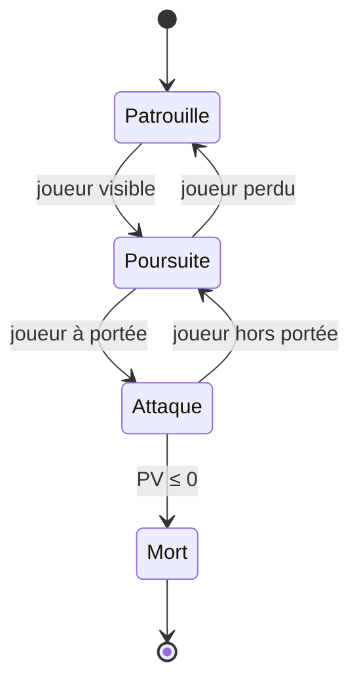
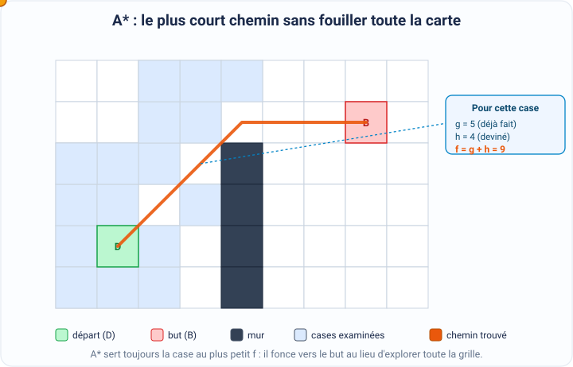

[← Physique des jeux](07-physique-des-jeux.md) · [↑ Sommaire](../README.md#table-des-matières) · [Réseau et multijoueur →](09-reseau-et-multijoueur.md)

# 8. Intelligence artificielle

Dans un jeu vidéo, vous tenez la manette d'un seul personnage. Tous les autres, les ennemis qui vous poursuivent, le marchand qui vous vend une potion, le coéquipier qui vous couvre, bougent tout seuls. C'est un programme qui décide, à chaque instant, ce qu'ils font. Ce programme, on l'appelle l'**intelligence artificielle** du jeu, ou **IA** en abrégé.

> **Que veut dire « intelligence artificielle » ?** C'est un ensemble de règles écrites par les programmeurs pour qu'une machine prenne des décisions qui ressemblent à celles d'un être vivant. « Artificielle » veut dire « fabriquée par l'humain », par opposition à l'intelligence naturelle d'une vraie personne. Dans un jeu, l'IA n'est pas magique : c'est juste du code qui regarde la situation et choisit quoi faire.

Les personnages contrôlés par cette IA s'appellent des **PNJ**.

> **Que veut dire « PNJ » ?** Cela signifie **Personnage Non Joueur**. C'est tout ce qui bouge à l'écran sans que vous teniez la manette : ennemis, alliés, marchands, passants. Le « non joueur » sert à les distinguer du personnage que vous, le joueur, dirigez.

### Comportement de base

Pour décider ce que fait un PNJ, les programmeurs ont inventé plusieurs grandes méthodes. Nous allons les voir de la plus simple à la plus astucieuse. Chacune est une façon différente de répondre à la question : « à cet instant précis, ce personnage doit faire quoi ? »

#### Machines à états finis (FSM)

L'idée la plus simple : le personnage est toujours dans **un seul état d'esprit** à la fois, par exemple « je patrouille », « je poursuis » ou « j'attaque ». Et il passe d'un état à un autre quand il se produit quelque chose de précis. On appelle cela une **machine à états finis**, ou **FSM**.

> **Que veut dire « machine à états finis » ?** « FSM » vient de l'anglais *Finite State Machine*. « Fini » veut dire qu'il y a un nombre limité d'états possibles, qu'on peut compter sur ses doigts. C'est comme un personnage de jeu de société qui ne peut être que sur une seule case à la fois.

> **Que veut dire « état » ?** Un état, c'est la situation dans laquelle se trouve le personnage en ce moment, ce qu'il est en train de faire. « Patrouille », « poursuite » et « attaque » sont trois états. À tout moment, le personnage en a exactement un.

> **Que veut dire « transition » ?** C'est le passage d'un état à un autre, déclenché par un événement précis. Par exemple, l'événement « j'ai vu le joueur » fait passer le garde de l'état « patrouille » à l'état « poursuite ». La transition, c'est la flèche qui relie deux états.

> **Que veut dire « tick » ?** Un jeu se redessine très souvent, par exemple soixante fois par seconde. Chacun de ces tout petits instants où le jeu se met à jour s'appelle un tick, comme le tic-tac d'une horloge très rapide. À chaque tick, on regarde l'état courant du personnage, on exécute ce qu'il doit faire, puis on vérifie si un événement déclenche une transition.



**Avantages** : c'est très facile à programmer, c'est **déterministe** et c'est **débogable**.

> **Que veut dire « déterministe » ?** Cela veut dire « sans hasard » : dans la même situation, le personnage réagit toujours exactement de la même façon. C'est rassurant, parce qu'on sait toujours d'avance ce qui va se passer.

> **Que veut dire « débogable » ?** Un « bogue » (en anglais *bug*) est une erreur dans un programme. « Débogable » signifie qu'il est facile de trouver et de corriger ces erreurs, parce qu'on peut suivre le personnage état par état et voir exactement où il s'est trompé.

**Limites** : le nombre d'états explose dès que le personnage doit gérer plusieurs choses **indépendantes** en même temps. Imaginez un garde qui a, en parallèle, un état d'arme (épée rangée ou sortie), un état de déplacement (à l'arrêt, en marche, en course) et un état d'humeur (calme, méfiant, en colère). Pour couvrir toutes les combinaisons, il faut multiplier le nombre de possibilités de chaque catégorie.

> **Le symbole $`\times`$.** C'est le signe de la multiplication, le même que celui que vous connaissez à l'école. Ici on l'utilise pour compter les combinaisons : s'il y a $`n_1`$ états d'arme, $`n_2`$ états de déplacement et $`n_3`$ états d'humeur, le nombre total de situations distinctes est leur produit.

```math
n_1 \times n_2 \times n_3
```

> **Que veut dire $`n_1`$, $`n_2`$, $`n_3`$ ?** Ce sont juste trois nombres avec une petite étiquette en bas (qu'on appelle un indice) pour ne pas les confondre : $`n_1`$ se lit « n indice 1 ». Par exemple, avec 2 états d'arme, 3 de déplacement et 3 d'humeur, cela fait $`2 \times 3 \times 3 = 18`$ états à écrire à la main. Au-delà d'une dizaine d'états, plus personne ne s'y retrouve : la machine devient illisible.

#### Arbres de comportement (Behavior Trees)

Pour éviter cette explosion, on a inventé les **arbres de comportement**, en anglais **Behavior Trees** (souvent abrégé BT). Cette idée vient au départ de la robotique, et le jeu vidéo l'a popularisée avec *Halo 2* en 2004, puis *Spore*. Au lieu de relier chaque état à tous les autres par des flèches, on range les comportements dans un **arbre** que l'on parcourt en entier à chaque tick.

> **Que veut dire « arbre » ici ?** En informatique, un arbre est une façon de ranger des éléments du général au particulier, comme un arbre généalogique : une racine tout en haut, qui se divise en branches, qui se divisent en branches plus petites, jusqu'aux feuilles tout en bas. On dit que cette structure est **hiérarchique**, c'est-à-dire organisée par niveaux du plus important au plus détaillé.

> **Que veut dire « nœud » ?** Un nœud est un point de l'arbre, un endroit où l'on prend une décision ou où l'on agit. Comme dans un arbre généalogique, chaque nœud peut avoir des **enfants**, les nœuds juste en dessous de lui. On lit le mot « nœud » comme « neu ».

Il existe trois sortes de nœuds :

- **Sequence** (le nœud « séquence »), noté par une flèche $`\rightarrow`$ : il fait faire ses enfants **l'un après l'autre, dans l'ordre**. Il **réussit** seulement si tous réussissent, et il s'arrête en échec dès que l'un échoue. C'est le « ET » logique : pour réussir il faut faire ceci ET cela ET cela.
- **Selector** (le nœud « sélecteur »), noté par un point d'interrogation $`?`$ : il essaie ses enfants l'un après l'autre et **réussit dès que l'un réussit** ; il n'échoue que si tous échouent. C'est le « OU » logique : il suffit de réussir ceci OU cela.
- **Leaf** (la « feuille ») : c'est le bout de l'arbre, une action concrète (`MoveTo` pour se déplacer, `Attack` pour attaquer, `Wait(2s)` pour attendre 2 secondes) ou une question à laquelle on répond par oui ou non (`PlayerVisible?`, « est-ce que je vois le joueur ? »).

> **Le symbole $`\rightarrow`$.** C'est une flèche vers la droite. Ici elle ne veut pas dire « va à droite » : elle est juste le dessin habituel pour représenter un nœud Sequence, qui enchaîne ses enfants dans l'ordre, de gauche à droite.

> **Que veulent dire « ET » et « OU » logiques ?** En logique, « A ET B » n'est vrai que si A et B sont vrais tous les deux (il faut tout réussir). « A OU B » est vrai dès que l'un des deux est vrai (il suffit d'en réussir un). C'est exactement le rôle de Sequence (tout réussir) et de Selector (en réussir au moins un).

Exemple : un garde qui « patrouille, et attaque s'il voit quelqu'un » :

```text
Selector (?)
├── Sequence (→)        # priorité 1 : combat
│   ├── PlayerVisible?
│   ├── MoveTo(player)
│   └── Attack(player)
└── Sequence (→)        # priorité 2 : patrouille
 ├── PickRandomWaypoint
 └── MoveTo(waypoint)
```

Le gros avantage de cette méthode est sa **composabilité**.

> **Que veut dire « composabilité » ?** C'est la possibilité d'assembler des morceaux comme des briques de construction, et d'en remplacer un sans casser les autres. Par exemple, on peut remplacer la feuille `Attack` par un petit sous-arbre `[Selector : ShootIfRanged, MeleeIfClose]` (« tirer si l'ennemi est loin, ou frapper s'il est proche ») sans rien toucher dans le reste de l'arbre.

C'est justement cette facilité d'assemblage qui explique pourquoi les moteurs de jeu grand public l'utilisent autant : le moteur Unreal fournit directement un outil `BehaviorTree`, et le moteur Unity propose le module `Behavior Designer` disponible sur sa boutique d'extensions.

> **Que veut dire « moteur de jeu » ?** C'est une grande boîte à outils logicielle toute prête (Unreal, Unity, etc.) qui gère le dessin à l'écran, les sons, la physique, etc., pour éviter aux créateurs de tout reprogrammer à zéro à chaque nouveau jeu.

#### Utility AI

Encore une autre approche : au lieu de fixer à l'avance des règles rigides, l'**Utility AI** donne une **note** à chaque action possible, puis choisit l'action qui a la meilleure note. C'est un peu comme un menu où le personnage choisit le plat le mieux noté selon son envie du moment.

> **Que veut dire « Utility AI » ?** Le mot anglais *utility* veut dire « utilité ». L'idée est de mesurer, par un nombre, à quel point chaque action serait utile dans la situation présente, et de garder la plus utile.

> **Que veut dire « fonction de score » ?** Une fonction, en mathématiques, est une machine qui prend une information en entrée et ressort un nombre en sortie. Ici, la fonction de score prend une action et la situation, et ressort sa note. Plus la note est haute, plus l'action est jugée pertinente.

On calcule la note d'une action en multipliant entre elles plusieurs petites notes, une par critère que l'on juge important :

```math
\mathrm{score}(action) = \prod_{i} f_i(\text{contexte})
```

> **Le symbole $`\prod`$.** C'est un grand « Pi » grec. Il veut dire « multiplie tout ce qui suit ». De la même façon qu'on a un symbole pour additionner une longue liste de nombres, celui-ci sert à les multiplier tous d'un coup. Le petit $`i`$ en dessous est un compteur : il prend les valeurs 1, 2, 3... pour passer en revue chaque critère. Donc $`\prod_{i} f_i`$ se lit « multiplie ensemble $`f_1`$, $`f_2`$, $`f_3`$... ».

> **Que veut dire « contexte » ?** C'est tout ce que le personnage sait de la situation à cet instant : où est le joueur, combien il lui reste de vie, s'il a un abri à proximité, etc.

Chaque $`f_i`$ est une **considération**, c'est-à-dire un critère que l'IA prend en compte (la distance au joueur, le niveau de points de vie, la présence d'un abri...).

> **Que veut dire $`f_i \in [0, 1]`$ ?** Le symbole $`\in`$ se lit « appartient à », « est dans ». Et $`[0, 1]`$ désigne tous les nombres entre 0 et 1, bornes comprises (0 ; 0,3 ; 0,75 ; 1...). Donc chaque petite note vaut entre 0 (« ce critère dit non, surtout pas ») et 1 (« ce critère dit oui à fond »). Comme on les multiplie, il suffit qu'un seul critère soit à 0 pour que toute l'action tombe à une note de 0 : c'est une façon élégante de dire « si une seule raison interdit cette action, on l'oublie ».

On retrouve cette technique par exemple dans la série *The Sims*. Elle donne souvent des comportements plus **naturels** que les arbres de comportement, parce que le personnage pèse finement plusieurs envies à la fois. En revanche, elle est plus difficile à déboguer : quand une note vient d'une multiplication de plusieurs nombres qui varient en douceur, il devient compliqué de comprendre pourquoi le personnage a finalement choisi telle action plutôt qu'une autre.

#### GOAP : Goal-Oriented Action Planning

Pour des comportements vraiment futés (le jeu *F.E.A.R.* de 2005 reste une référence), l'IA fait carrément de la **planification**. « GOAP » vient de l'anglais *Goal-Oriented Action Planning*, ce qui signifie « planification d'actions orientée vers un but ».

> **Que veut dire « planification » ?** C'est le fait de réfléchir à l'avance à une suite d'étapes pour atteindre un objectif, exactement comme vous planifiez « mettre mes chaussures, puis prendre mon cartable, puis sortir » avant d'aller à l'école. L'IA ne réagit plus seulement à l'instant : elle construit tout un plan.

On donne à l'IA trois choses : la situation de départ (l'**état initial**), le résultat visé (l'**état but**, par exemple « le joueur est éliminé »), et une liste d'actions possibles. Chaque action est décrite par ses **préconditions** et ses **effets**.

> **Que veut dire « précondition » ?** C'est la condition à remplir **avant** de pouvoir faire une action. Pour l'action « tirer », une précondition est « avoir une arme chargée ». Sans elle, l'action est impossible.

> **Que veut dire « effet » ?** C'est ce que l'action change dans le monde une fois réalisée. L'effet de « recharger » est « mon arme est de nouveau chargée ».

À partir de là, GOAP cherche tout seul la **meilleure suite d'actions** pour passer de l'état initial à l'état but. Et pour mener cette recherche, il utilise justement l'algorithme **A\*** (présenté juste après) appliqué non pas à une carte, mais à l'**espace des états**.

> **Que veut dire « espace des états » ?** C'est l'ensemble de toutes les situations imaginables du jeu (chaque combinaison « arme chargée ou non, joueur vu ou non, porte ouverte ou non... »). Chaque action fait passer d'une situation à une autre. Chercher un plan revient alors à trouver un chemin à travers ce gigantesque réseau de situations, exactement comme on cherche un chemin sur une carte.

### Navigation

Savoir quoi faire, c'est bien ; encore faut-il que le personnage sache **comment se déplacer** d'un endroit à un autre sans foncer dans les murs. C'est le rôle de la **navigation**.

> **Que veut dire « naviguer » ici ?** C'est trouver son chemin sur la carte du jeu, comme un GPS qui calcule la route entre votre maison et l'école en contournant les rivières et les bâtiments. Le personnage doit **planifier un chemin** entre deux points tout en évitant les obstacles.

L'outil de référence pour cela s'appelle **A\***, que l'on lit « A étoile ». Il a été publié par trois chercheurs, Hart, Nilsson et Raphael, en 1968, et il est encore aujourd'hui au cœur des jeux modernes, souvent accompagné d'astuces d'accélération (HPA\*, JPS...) décrites plus loin.

> **Que veut dire « algorithme » ?** C'est une recette précise, une suite d'étapes à suivre dans l'ordre pour résoudre un problème à coup sûr, comme une recette de cuisine. A\* est la recette qui calcule le plus court chemin.

#### A\* : la fonction d'évaluation

A\* explore un **graphe** en attribuant une valeur à chaque nœud qu'il rencontre.

> **Que veut dire « graphe » ?** Ce n'est pas une courbe de mathématiques ! En informatique, un graphe est simplement un ensemble de points (les **nœuds**) reliés par des traits (les **arêtes**). Pensez à une carte de métro : les stations sont les nœuds, les lignes entre elles sont les arêtes. Le graphe peut représenter les cases d'une grille, les sommets d'un **navmesh**, ou même l'espace des états d'un plan GOAP vu plus haut.

> **Que veut dire « navmesh » ?** C'est l'abréviation de l'anglais *navigation mesh*, qu'on pourrait traduire par « maillage de navigation ». C'est la zone de sol découpée en grands triangles ou polygones sur lesquels les personnages ont le droit de marcher. Plutôt que de quadriller tout le niveau en petites cases, on pose ce maillage uniquement là où l'on peut se déplacer.

Pour chaque nœud $`n`$, A\* calcule un score :

```math
f(n) = g(n) + h(n)
```

> **Que veut dire $`f(n)`$ ?** La lettre $`n`$ désigne un nœud quelconque (comme une station de métro). L'écriture $`f(n)`$ se lit « f de n » et veut dire « le score que la fonction $`f`$ donne au nœud $`n`$ ». Ce score est la somme de deux morceaux, $`g(n)`$ et $`h(n)`$, que voici.

- $`g(n)`$ est le **coût réel** déjà dépensé pour aller du point de départ jusqu'au nœud $`n`$. C'est la distance vraiment parcourue, obtenue en additionnant la longueur de chaque arête empruntée depuis le départ.
- $`h(n)`$ est une **heuristique** : une *estimation* de ce qu'il reste à parcourir entre $`n`$ et l'arrivée.

> **Que veut dire « heuristique » ?** C'est une devinette astucieuse, une estimation rapide « à vue de nez ». On ne connaît pas encore le vrai coût restant (sinon le problème serait déjà résolu), alors on le devine. Par exemple, « à vol d'oiseau, il reste environ 300 mètres » est une heuristique : c'est probablement moins que la vraie distance par les routes, mais c'est une bonne estimation pour se diriger.

L'idée géniale de A\* est d'additionner ces deux morceaux : « le chemin déjà fait » plus « ce qu'il reste à faire d'après ma devinette ». Le nœud avec le plus petit total $`f`$ est le plus prometteur. À chaque tour, A\* sort de la **file de priorité** le nœud de plus petit $`f`$, l'**étend** (en anglais *expand*), puis enregistre tous ses voisins pour les examiner plus tard.

> **Que veut dire « file de priorité » ?** Une file est une file d'attente, comme à la boulangerie. Mais dans une file de priorité, ce n'est pas le premier arrivé qui passe : c'est le plus prioritaire, ici le nœud avec le plus petit score $`f`$, donc le plus prometteur. A\* sert toujours en premier le candidat qui semble le plus proche du but.

> **Que veut dire « étendre » un nœud ?** Cela veut dire « regarder ses voisins » : une fois qu'on examine un nœud, on note tous les nœuds reliés à lui, pour pouvoir continuer le chemin par l'un d'eux. On dit aussi « développer » ce nœud.



#### Pourquoi l'admissibilité de l'heuristique compte

Tout repose sur une qualité de l'heuristique : elle doit être **admissible**.

> **Que veut dire « heuristique admissible » ?** Cela veut dire qu'elle ne **surestime jamais** la distance qui reste. Autrement dit, sa devinette est toujours inférieure ou égale à la vraie distance restante. C'est comme un ami prudent qui annonce toujours un temps de trajet égal ou plus court que le vrai : il ne ment jamais en gonflant la durée. On l'écrit ainsi : $`h(n) \le h^\ast(n)`$ pour tout nœud $`n`$.

> **Le symbole $`\le`$.** Il se lit « inférieur ou égal à ». $`a \le b`$ veut dire que $`a`$ est plus petit que $`b`$, ou alors exactement égal à $`b`$.

> **Que veut dire $`h^\ast(n)`$ ?** La petite étoile $`\ast`$ en haut signifie « la vraie valeur, la valeur optimale ». Donc $`h^\ast(n)`$ (lu « h étoile de n ») est le **vrai** coût le plus court entre le nœud $`n`$ et le but, celui qu'on ne connaît pas encore mais que l'heuristique $`h(n)`$ essaie de deviner sans jamais le dépasser.

Cette propriété est si importante qu'elle se démontre. Voici le résultat.

> **Que veut dire « théorème » ?** En mathématiques, un théorème est une affirmation dont on est sûr parce qu'on peut la **prouver**, c'est-à-dire la démontrer logiquement à partir de choses déjà admises. Ce n'est pas une opinion : une fois prouvé, c'est vrai pour toujours.

**Théorème** : si l'heuristique $`h`$ est admissible, alors A\* trouve **toujours** le chemin le plus court (le chemin optimal).

> **Que veut dire « consistante » ?** C'est une qualité un peu plus forte que l'admissibilité. Une heuristique est consistante si, à chaque pas, sa devinette ne baisse jamais de plus que le coût du pas réellement fait. En formule : $`h(n) \le c(n, n') + h(n')`$, où $`c(n, n')`$ est le coût pour aller du nœud $`n`$ au nœud voisin $`n'`$. En pratique, dès qu'une heuristique est consistante, A\* n'a jamais besoin de revenir en arrière sur un nœud déjà traité.

*Idée de la preuve.* On va raisonner **par l'absurde**.

> **Que veut dire « raisonner par l'absurde » ?** C'est une astuce classique : on suppose le contraire de ce qu'on veut montrer, puis on déroule la logique jusqu'à tomber sur une situation impossible, qui se contredit elle-même. Comme cette absurdité vient forcément de notre fausse supposition de départ, c'est que le contraire était vrai. C'est comme dire « si j'avais oublié mes clés, la porte serait fermée ; or elle est ouverte, donc je ne les ai pas oubliées ».

Supposons donc le contraire de ce qu'on veut prouver : A\* s'arrête en renvoyant un but $`G`$ **trop long**, c'est-à-dire un chemin dont le coût $`g(G)`$ dépasse le coût optimal, que l'on note $`C^\ast`$.

> **Que veut dire $`C^\ast`$ ?** C'est le coût du **meilleur** chemin possible, le plus court de tous (l'étoile rappelle encore « la valeur optimale »). On le lit « C étoile ».

> **Les symboles $`>`$ et $`<`$.** $`a > b`$ se lit « $`a`$ est strictement plus grand que $`b`$ », et $`a < b`$ « $`a`$ est strictement plus petit que $`b`$ ». La pointe du chevron est toujours tournée vers le plus petit nombre. Dire que le chemin trouvé est trop long s'écrit donc $`g(G) > C^\ast`$.

Considérons maintenant un vrai chemin le plus court, du départ jusqu'au but. Le long de ce chemin idéal, prenons $`n^\ast`$, le **premier** nœud que A\* n'a pas encore étendu. (Un tel nœud existe forcément : si A\* avait déjà étendu tout le chemin idéal, il aurait trouvé le coût optimal $`C^\ast`$ et ne renverrait pas un chemin trop long.) Comme $`n^\ast`$ est posé sur le chemin idéal, on a $`g(n^\ast) + h^\ast(n^\ast) = C^\ast`$ : « le bout déjà fait » plus « le bout idéal restant » donne le coût optimal. Et comme l'heuristique est admissible, $`h(n^\ast) \le h^\ast(n^\ast)`$. En mettant tout bout à bout :

```math
f(n^\ast) = g(n^\ast) + h(n^\ast) \le g(n^\ast) + h^\ast(n^\ast) = C^\ast < g(G) = f(G)
```

(la toute dernière égalité vient du fait que, sur un nœud but, il ne reste plus rien à parcourir, donc $`h(G) = 0`$ et $`f(G) = g(G)`$). Le bilan est clair : $`f(n^\ast) < f(G)`$. Or A\* sort toujours de sa file le nœud de **plus petit** score $`f`$. Puisque $`n^\ast`$ est dans la file avec un score plus petit que celui de $`G`$, A\* aurait dû l'étendre **avant** de s'occuper de $`G`$. C'est impossible, puisqu'on a supposé que $`G`$ a été traité en premier : voilà notre contradiction. La supposition de départ était donc fausse, et A\* renvoie bien le chemin optimal. $`\blacksquare`$

> **Le symbole $`\blacksquare`$.** Ce petit carré noir marque la **fin d'une preuve**. C'est une convention des mathématiciens pour dire « c'est démontré, point final ».

> **Note technique.** Si $`h`$ est seulement admissible mais pas consistante, la preuve ci-dessus reste valable à condition d'autoriser A\* à rouvrir un nœud déjà traité quand on lui découvre un meilleur coût $`g`$. La consistance, plus exigeante que l'admissibilité, garantit qu'aucun nœud n'a jamais besoin d'être rouvert (résultat de Hart, Nilsson et Raphael, 1968). Bonne nouvelle : toutes les heuristiques classiques sur grille présentées juste après (Manhattan, Chebyshev, Octile, Euclidienne) sont consistantes dès que les coûts des arêtes respectent l'**inégalité triangulaire**, ce qui est presque toujours le cas dans la pratique.

> **Que veut dire « inégalité triangulaire » ?** C'est une règle de bon sens sur les distances : aller directement d'un point à un autre n'est jamais plus long que d'y aller en faisant un détour par un troisième point. Dans un triangle, un côté est toujours plus court que la somme des deux autres. Le chemin direct est le plus court : c'est exactement ce que dit cette inégalité.

Concrètement, sur une carte quadrillée en cases, comment fabriquer une bonne heuristique, c'est-à-dire une bonne estimation de la distance restante ? Voici les quatre recettes classiques. Avant de lire le tableau, quelques symboles.

> **Le symbole $`\Delta`$.** C'est la lettre grecque « delta » majuscule. En mathématiques, elle veut dire « écart » ou « différence ». Donc $`\Delta x`$ est l'écart horizontal entre le départ et l'arrivée (combien de cases à droite ou à gauche), et $`\Delta y`$ l'écart vertical (combien de cases en haut ou en bas).

> **Le symbole $`\lvert \; \rvert`$ (les deux barres droites).** Elles veulent dire « valeur absolue », c'est-à-dire « la valeur sans son signe ». $`\lvert -3 \rvert = 3`$ et $`\lvert 3 \rvert = 3`$. On s'en sert ici parce qu'un écart de 3 cases vers la gauche compte autant qu'un écart de 3 cases vers la droite : seule la grandeur du déplacement compte, pas sa direction.

> **Le symbole $`\max`$.** Il veut dire « le plus grand des deux ». $`\max(4, 7) = 7`$. À l'inverse, on rencontrera $`\Delta_\text{min}`$, qui désigne le plus petit des deux écarts, et $`\Delta_\text{max}`$ le plus grand.

> **Le symbole $`\sqrt{\;}`$.** C'est la racine carrée. $`\sqrt{9} = 3`$ parce que $`3 \times 3 = 9`$. Elle sert à mesurer une diagonale : un déplacement en diagonale d'une case est plus long qu'un pas droit, et vaut exactement $`\sqrt{2}`$, soit environ $`1{,}41`$.

> **Que veulent dire « 4-connexe » et « 8-connexe » ?** Cela décrit dans combien de directions on a le droit de bouger depuis une case. En 4-connexe, on ne peut aller que dans 4 directions (haut, bas, gauche, droite), comme une tour aux échecs sur un seul pas. En 8-connexe, on ajoute les 4 diagonales, comme une reine sur un seul pas : 8 directions en tout.

**Heuristiques classiques sur grille** :

| Distance        | Formule                                                 | Admissible si déplacement                       |
| --------------- | ------------------------------------------------------- | ----------------------------------------------- |
| **Manhattan**   | $`\lvert\Delta x\rvert + \lvert\Delta y\rvert`$           | 4-connexe (haut/bas/gauche/droite uniquement)   |
| **Chebyshev**   | $`\max(\lvert\Delta x\rvert, \lvert\Delta y\rvert)`$      | 8-connexe avec coût uniforme                    |
| **Octile**      | $`\Delta_\text{max} + (\sqrt{2} - 1)\,\Delta_\text{min}`$ | 8-connexe avec coût $`\sqrt{2}`$ en diagonal      |
| **Euclidienne** | $`\sqrt{\Delta x^2 + \Delta y^2}`$                        | toujours (sous-estime sur graphe discret)       |

> **Que se passe-t-il avec une heuristique inadmissible ?** Si l'heuristique surestime parfois la distance restante, A\* **trouve quand même un chemin** (s'il en existe un), mais ce ne sera pas forcément le plus court. Curieusement, c'est parfois voulu : en exagérant un peu la distance qui reste, on pousse A\* à foncer vers le but et donc à examiner beaucoup moins de cases. On gagne en rapidité ce qu'on perd en perfection. Cette variante volontairement gourmande s'appelle *Weighted A\** (« A étoile pondéré »).

#### Optimisations courantes

Sur de très grandes cartes, A\* peut devenir lent. On l'accélère avec quelques astuces.

- **Hierarchical Pathfinding (HPA\*)**, en français « recherche de chemin hiérarchique » : on prépare à l'avance une carte simplifiée, où les cases sont regroupées en gros blocs (des **clusters**). On calcule d'abord un chemin grossier de bloc en bloc, puis on le précise case par case seulement sur la portion qu'on est en train de traverser. C'est comme planifier un voyage en choisissant d'abord les villes, et seulement ensuite les rues. Indispensable au-delà de 1000 sur 1000 cases.
- **Jump Point Search (JPS)**, « recherche par points de saut » : sur une grille régulière en 8 directions, au lieu d'avancer case par case, on saute directement jusqu'aux endroits où une vraie décision se présente (un coin, un obstacle). Cela divise par 10 à 100 le nombre de cases à examiner.
- **Theta\*** : une variante qui autorise les chemins **en ligne droite sous n'importe quel angle** (en anglais *any-angle*), au lieu de zigzaguer le long de la grille. Le résultat ressemble bien plus à la trajectoire naturelle d'un humain qu'à un escalier de marches.

#### MCTS : Monte Carlo Tree Search

Dans certains jeux, le nombre de coups possibles est si énorme qu'aucun ordinateur ne peut tous les examiner. Au jeu de **Go**, par exemple, il y a plus de positions possibles que d'atomes dans l'univers. Là, A\* est dépassé. On utilise alors **MCTS**.

> **Que veut dire « Go » et « RTS » ?** Le Go est un très ancien jeu de plateau asiatique, réputé pour son nombre vertigineux de coups possibles. « RTS » vient de l'anglais *Real-Time Strategy*, « stratégie en temps réel » : ce sont les jeux où l'on commande des armées qui bougent toutes en même temps, sans attendre son tour.

> **Que veut dire « arborescence » ?** C'est l'ensemble de tous les coups possibles, puis de toutes les réponses possibles à ces coups, et ainsi de suite, qui forment un arbre géant de scénarios. Plus le jeu offre de choix, plus cet arbre est large et profond.

> **Que veut dire « MCTS » ?** Cela vient de l'anglais *Monte Carlo Tree Search*, « recherche arborescente de Monte-Carlo ». « Monte-Carlo » est le nom d'une ville réputée pour ses casinos : en mathématiques, on l'emploie pour toute méthode qui s'appuie sur le **hasard**, comme un jeu de dés. L'idée de MCTS est justement de jouer un grand nombre de parties au hasard pour deviner quels coups sont les meilleurs.

Inventé en 2006, MCTS répète sans cesse quatre étapes.

- **Sélection.** On part de la racine de l'arbre et on descend, en choisissant à chaque embranchement l'enfant qui obtient le meilleur score d'après une formule appelée **UCB1** (de l'anglais *Upper Confidence Bound*, « borne de confiance supérieure ») :

```math
UCB1(n) = \frac{w_n}{v_n} + c\sqrt{\frac{\ln V_p}{v_n}}
```

> **Le symbole de la barre de fraction.** Une écriture comme $`\frac{w_n}{v_n}`$ est une division : le nombre du haut divisé par le nombre du bas, ici « le nombre de victoires divisé par le nombre de visites ». C'est donc le **taux de victoire** du coup. Le petit $`n`$ en bas des lettres ($`w_n`$, $`v_n`$) est un indice qui veut dire « pour le nœud $`n`$ ».

> **Que veulent dire $`w_n`$, $`v_n`$ et $`V_p`$ ?** $`w_n`$ est le nombre de parties **gagnées** (en anglais *wins*) en passant par le coup $`n`$. $`v_n`$ est le nombre de fois où on a **essayé** ce coup (en anglais *visits*). Et $`V_p`$ est le nombre d'essais du **parent**, c'est-à-dire du coup juste au-dessus.

> **Le symbole $`\ln`$.** C'est le « logarithme naturel ». Sans entrer dans les détails, retenez que c'est une fonction qui grandit, mais de plus en plus lentement : elle calme la croissance d'un nombre. Ici, elle sert à ne pas trop s'emballer quand un coup a été essayé énormément de fois.

> **Que fait cette formule, en clair ?** Elle additionne deux envies opposées. À gauche, le taux de victoire $`\frac{w_n}{v_n}`$ pousse à rejouer le coup qui a déjà bien marché : c'est l'**exploitation** (profiter de ce qu'on sait). À droite, le terme $`c\sqrt{\dfrac{\ln V_p}{v_n}}`$ devient grand quand un coup a été peu essayé, ce qui pousse à tester les coups encore mal connus : c'est l'**exploration** (aller voir ailleurs). Le nombre $`c`$, voisin de $`\sqrt{2}`$, règle l'équilibre entre ces deux envies. La double flèche $`\leftrightarrow`$ illustre ce va-et-vient exploration $`\leftrightarrow`$ exploitation.

- **Expansion.** Si le coup choisi ne termine pas la partie, on lui ajoute un nouvel enfant : un coup possible qu'on n'avait encore jamais essayé.
- **Simulation** (en anglais *rollout*, « déroulé »). À partir de là, on joue la partie jusqu'au bout au hasard (ou avec une stratégie très simple), juste pour voir qui gagne.
- **Rétropropagation.** On fait remonter le résultat (gagné ou perdu) le long du chemin parcouru, en mettant à jour le compteur de victoires $`w`$ et le compteur de visites $`v`$ de chaque nœud traversé.

> **Que veut dire « rétropropagation » ?** « Rétro » veut dire « vers l'arrière ». On remonte donc l'information de la fin de la partie jusqu'à la racine, en sens inverse de la descente, pour que chaque coup testé apprenne de ce qui s'est passé après lui.

En répétant ces quatre étapes des milliers de fois, les bons coups accumulent des victoires et finissent par se distinguer. C'est cet algorithme, marié à un **réseau de neurones** capable de juger une position d'un coup d'œil, que le programme **AlphaGo** a utilisé pour battre le champion Lee Sedol en 2016.

### Apprentissage automatique

Jusqu'ici, un humain écrivait toutes les règles du comportement. Avec l'**apprentissage automatique** (en anglais *machine learning*), on change d'approche : au lieu de dicter les règles, on montre des exemples à la machine et on la laisse trouver les règles toute seule, un peu comme un enfant qui apprend à reconnaître un chat à force d'en voir, sans qu'on lui récite la définition d'un chat.

L'outil principal de cet apprentissage est le **réseau de neurones**.

> **Que veut dire « réseau de neurones » ?** C'est un programme très vaguement inspiré du cerveau (« NN » vient de l'anglais *Neural Network*). Il est fait de petites unités de calcul, appelées **neurones**, rangées en **couches** successives : l'information entre par la première couche, est transformée de couche en couche, et ressort par la dernière. Chaque neurone reçoit des nombres, les combine, et passe le résultat aux neurones de la couche suivante.

> **Que veut dire « combinaison linéaire pondérée » ?** « Pondérée » veut dire « avec des poids ». Chaque neurone multiplie chacune de ses entrées par un nombre, son **poids** (qui dit à quel point cette entrée est importante), puis additionne le tout. « Combinaison linéaire » est juste le nom savant de cette opération « multiplier puis additionner ».

> **Que veut dire « poids » ?** Un poids est un réglage : un nombre qui mesure l'importance d'une connexion entre deux neurones. Apprendre, pour le réseau, c'est trouver les bons poids. Au début ils sont au hasard et le réseau se trompe ; à force d'exemples, ils s'ajustent jusqu'à ce que le réseau donne de bonnes réponses.

> **Que veut dire « fonction d'activation » ?** Après avoir combiné ses entrées, chaque neurone passe le résultat dans une petite fonction, par exemple **ReLU** (qui remplace les nombres négatifs par zéro) ou **sigmoïde** (qui écrase tout entre 0 et 1). Sans cette étape, empiler des couches ne servirait à rien : c'est elle qui permet au réseau d'apprendre des choses compliquées, et pas seulement des lignes droites. On dit qu'elle est « non linéaire », c'est-à-dire qu'elle introduit des courbes.

> **Que veut dire « rétropropagation du gradient » ?** C'est la méthode qui ajuste les poids. Quand le réseau se trompe, on mesure l'erreur, puis on calcule, pour chaque poids, dans quel sens le bouger pour réduire cette erreur : cette direction d'amélioration s'appelle le **gradient**. On corrige les poids un tout petit peu dans le bon sens, en remontant de la sortie vers l'entrée (d'où « rétro », vers l'arrière). En répétant des millions de fois, le réseau s'améliore. C'est comme descendre une colline dans le brouillard en tâtant du pied la pente la plus forte vers le bas.

En jeu vidéo, on rencontre trois grandes familles d'apprentissage.

- **Apprentissage supervisé** : on entraîne le réseau à imiter une bonne réponse connue d'avance. On lui montre des milliers d'exemples accompagnés de la réponse attendue, et il apprend à reproduire le lien. On s'en sert pour reconnaître des gestes (par exemple la caméra Kinect de Microsoft) ou pour transcrire la parole en texte dans la discussion en jeu.

> **Que veut dire « supervisé » ?** Cela veut dire « avec un correcteur ». Pour chaque exemple, on connaît la bonne réponse, donc on peut montrer au réseau la réponse qu'il aurait dû donner, comme un professeur qui corrige une dictée. C'est ce corrigé qui guide l'apprentissage.

- **Apprentissage par renforcement (RL)** : ici, personne ne donne la bonne réponse. L'agent essaie des actions, reçoit des récompenses ou des punitions, et apprend tout seul la stratégie qui rapporte le plus, comme un animal qu'on dresse avec des friandises. Sa stratégie s'appelle une **politique**, notée $`\pi(s) \to a`$, et son but est de récolter la plus grosse **récompense cumulée**, notée $`\sum_t \gamma^t r_t`$. Les algorithmes connus sont Q-learning, **DQN** (l'équipe DeepMind l'a fait jouer aux jeux Atari en 2015), **PPO** (de l'anglais *Proximal Policy Optimization*, par Schulman et son équipe en 2017, employé notamment par OpenAI Five sur le jeu Dota 2 en 2018 et 2019) et **AlphaZero** (DeepMind, qui maîtrise les échecs, le Go et le shogi, en 2017).

> **Que veut dire « RL » ?** Cela vient de l'anglais *Reinforcement Learning*, « apprentissage par renforcement ». « Renforcer » un comportement, c'est le rendre plus fréquent en le récompensant, exactement comme on renforce une bonne habitude en se félicitant.

> **Que veut dire $`\pi(s) \to a`$ ?** La lettre grecque $`\pi`$ (« pi ») désigne ici la politique, c'est-à-dire la stratégie de l'agent. La flèche $`\to`$ se lit « donne » : à partir d'un état $`s`$ (la situation actuelle), la politique donne une action $`a`$ à faire. En clair : « dans cette situation, fais ça. »

> **Que veut dire la récompense cumulée $`\sum_t \gamma^t r_t`$ ?** Décortiquons chaque morceau.
>
> - Le grand symbole $`\sum`$ est un « Sigma » grec : il veut dire « additionne tout ce qui suit ». Le petit $`t`$ en dessous est le numéro du pas de temps (instant 0, instant 1, instant 2...). On additionne donc les récompenses de tous les instants.
> - $`r_t`$ est la récompense reçue à l'instant $`t`$.
> - $`\gamma^t`$ (« gamma puissance t ») fait diminuer le poids des récompenses lointaines. Le petit $`t`$ en haut est un exposant : multiplier $`\gamma`$ par lui-même $`t`$ fois. Comme $`\gamma`$ est inférieur à 1, plus une récompense arrive tard, plus elle est rabotée.
>
> En résumé, l'agent ne cherche pas à gagner une seule récompense, mais à maximiser la somme de toutes ses récompenses futures, en accordant plus d'importance aux proches qu'aux lointaines.

> **Que veut dire $`\gamma \in [0, 1[`$ et « facteur d'actualisation » ?** $`\gamma`$ (« gamma ») est le **facteur d'actualisation** : un nombre entre 0 et 1 qui décide à quel point on dévalue les récompenses futures. L'écriture $`[0, 1[`$ désigne les nombres entre 0 et 1, le 0 étant inclus (le crochet est tourné vers l'intérieur) mais le 1 étant exclu (le crochet est tourné vers l'extérieur). Un $`\gamma`$ proche de 1 rend l'agent patient (il vise loin) ; un $`\gamma`$ proche de 0 le rend impatient (il ne pense qu'à la récompense immédiate). On le compare souvent au fait qu'un bonbon tout de suite vaut mieux qu'un bonbon promis dans un an.

- **Modèles génératifs** : au lieu de classer ou de décider, ces réseaux **créent** du contenu nouveau, comme des dialogues, des quêtes ou des textures, à la volée pendant la partie. C'est encore expérimental dans les jeux réellement publiés, mais très prometteur pour fabriquer automatiquement des histoires (*AI Dungeon*, ou *Inworld AI* dans le jeu *Mecha BREAK*).

> **Que veut dire « modèle génératif » ?** « Générer » veut dire « créer, produire ». Un modèle génératif est un réseau entraîné à inventer des choses nouvelles qui ressemblent à ses exemples d'apprentissage. Les **LLM** (de l'anglais *Large Language Models*, « grands modèles de langage ») génèrent du texte, et les modèles de **diffusion** génèrent des images en partant d'une bouillie de points aléatoires qu'ils nettoient peu à peu jusqu'à obtenir une image nette.

> **Que veut dire « procédural » ?** Cela veut dire « fabriqué automatiquement par un programme » plutôt que dessiné à la main par un artiste. Du contenu procédural narratif, ce sont des histoires que le jeu invente tout seul au fil de la partie.

> **Vocabulaire express du RL** (*Reinforcement Learning*, apprentissage par renforcement).
>
> - **Agent** : celui qui décide et agit (le PNJ, le robot logiciel, le pilote virtuel). Un « bot » est justement un joueur tenu par l'ordinateur, du mot anglais *robot*.
> - **Environnement** : tout le reste, c'est-à-dire le monde simulé qui réagit aux actions de l'agent et lui renvoie ce qu'il peut observer.
> - **État** $`s`$ : la photo instantanée du monde vue par l'agent à un moment donné (positions, points de vie, objets en poche...). La lettre $`s`$ vient de l'anglais *state*, « état ».
> - **Action** $`a`$ : une décision possible (aller à gauche, à droite, tirer, attendre). La lettre $`a`$ vient de *action*.
> - **Récompense** $`r`$ : un nombre renvoyé par l'environnement à chaque pas, qui indique si l'agent va dans la bonne direction (par exemple $`+1`$ quand il élimine un ennemi, $`-100`$ quand il meurt). La lettre $`r`$ vient de *reward*, « récompense ».
> - **Politique** $`\pi(s) \to a`$ : la stratégie de l'agent, la fonction qui, à partir d'un état, choisit l'action à faire.
> - **Q-fonction** $`Q(s, a)`$ : elle répond à la question « quelle récompense totale puis-je espérer si, dans l'état $`s`$, je fais l'action $`a`$, puis je joue parfaitement ensuite ? ». C'est la **valeur d'une action**, et c'est elle que le RL cherche à apprendre.
> - **DQN** (de l'anglais *Deep Q-Network*) : un réseau de neurones qui **estime** la Q-fonction $`Q(s, a)`$ même quand il y a un nombre gigantesque d'états possibles (par exemple tous les pixels d'un écran de jeu Atari).
> - **AlphaGo** (DeepMind, 2016) : le programme qui a battu les meilleurs joueurs humains de Go en combinant la recherche MCTS et des réseaux de neurones.

Comment l'agent met-il à jour sa Q-fonction au fil de l'expérience ? Avec cette règle, appelée mise à jour de Bellman :

```math
Q(s, a) \leftarrow Q(s, a) + \alpha\,\Big[r + \gamma \max_{a'} Q(s', a') - Q(s, a)\Big]
\quad\text{(mise à jour de Bellman, Q-learning)}
```

> **Le symbole $`\leftarrow`$.** Cette flèche vers la gauche n'est pas un signe « égal ». Elle veut dire « devient » ou « reçoit une nouvelle valeur ». $`Q(s, a) \leftarrow \ldots`$ se lit « la valeur $`Q(s, a)`$ est remplacée par le résultat du calcul de droite ». C'est comme verser un nouveau contenu dans un verre déjà utilisé.

> **Que veulent dire $`s'`$ et $`a'`$ ?** Le petit trait $`'`$ se lit « prime » et signifie ici « d'après », « suivant ». Donc $`s'`$ (« s prime ») est l'état dans lequel on arrive après avoir agi, et $`a'`$ (« a prime ») une action possible depuis ce nouvel état.

> **Le symbole $`\max_{a'}`$.** On a déjà vu que $`\max`$ veut dire « le plus grand ». Ici, $`\max_{a'} Q(s', a')`$ veut dire « la meilleure valeur possible dans le nouvel état, en choisissant la meilleure action $`a'`$ ». Autrement dit : « en supposant que je joue au mieux à partir de maintenant. »

> **Le symbole $`\alpha`$.** C'est la lettre grecque « alpha ». C'est le **pas d'apprentissage** : un petit nombre qui décide de quelle ampleur on corrige l'estimation à chaque essai. Trop grand, l'agent change d'avis trop brutalement ; trop petit, il apprend trop lentement. C'est le dosage de la correction.

> **L'équation de Bellman** (du mathématicien Richard Bellman, 1957) est le cœur du RL. Elle dit une chose simple : la valeur d'une situation, c'est la récompense que l'on touche tout de suite, **plus** la valeur de la meilleure situation suivante (rabotée par $`\gamma`$, parce qu'elle arrive plus tard). La règle ci-dessus rapproche, à chaque essai, l'estimation actuelle $`Q(s, a)`$ de cette cible idéale. La partie entre crochets est l'**erreur** : l'écart entre ce qu'on espérait et ce qu'on a réellement obtenu. On corrige d'une fraction $`\alpha`$ de cette erreur, encore et encore, jusqu'à ce que les estimations deviennent justes.
>
> **Là où le RL est efficace, et là où il l'est moins.** Le RL brille quand on peut simuler le monde du jeu à volonté et rejouer des millions de parties d'entraînement (chaque partie complète s'appelle un **épisode**). En revanche, dans un jeu multijoueur en ligne, on évite de faire tourner du RL en direct pendant la partie. Pourquoi ? Parce que le coût d'**inférence** devient gênant, et qu'un comportement bizarre peut gâcher une partie classée (une partie qui compte pour le classement des joueurs).
>
> **Que veut dire « inférence » ?** C'est le moment où l'on **utilise** le réseau déjà entraîné pour qu'il donne une réponse. À distinguer de l'entraînement (où il apprend). Faire tourner le réseau à chaque décision, plusieurs fois par seconde et pour chaque personnage, coûte du temps de calcul.
>
> La solution habituelle est d'entraîner les stratégies **hors ligne** (en anglais *offline*, c'est-à-dire à l'avance, pas pendant la vraie partie), puis de les **distiller**.
>
> **Que veut dire « distiller » ?** Comme on distille un parfum pour n'en garder que l'essentiel, on remplace le gros réseau lent par une version beaucoup plus légère et rapide (un réseau plus petit, un arbre de décision, ou une simple **table de correspondance** qui range à l'avance la bonne action pour chaque situation) qui imite ses réponses. On garde le comportement, on jette le poids. C'est par exemple la technique retenue pour les *drivatars*, les pilotes automatiques du jeu de course *Forza Motorsport*.

[ Retour en haut de page](#table-des-matières)

---

---

[← Physique des jeux](07-physique-des-jeux.md) · [↑ Sommaire](../README.md#table-des-matières) · [Réseau et multijoueur →](09-reseau-et-multijoueur.md)
