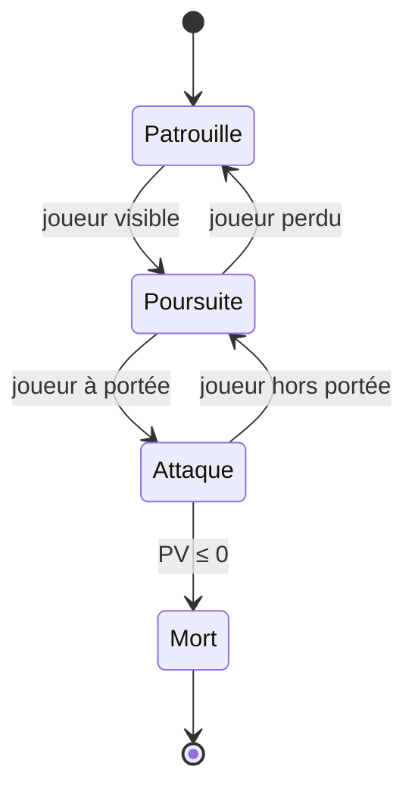

[← Physique des jeux](07-physique-des-jeux.md) · [↑ Sommaire](../README.md#table-des-matières) · [Réseau et multijoueur →](09-reseau-et-multijoueur.md)

# 8. Intelligence artificielle

Les jeux vidéo utilisent souvent l'**intelligence artificielle** (IA) pour contrôler les **personnages non joueurs** (PNJ).

### Comportement de base

> **PNJ** = *Personnage Non Joueur*. Tout ce qui bouge à l'écran sans que vous teniez la manette : ennemis, alliés, marchands, civils. Le code qui décide ce qu'ils font à chaque instant, c'est l'IA du jeu.

Les comportements de base des PNJ peuvent être modélisés via plusieurs paradigmes, du plus simple au plus expressif :

#### Machines à états finis (FSM)

> **FSM** = *Finite State Machine* — machine à états finis. Le PNJ a un état courant (ex. *patrouille*, *poursuite*, *attaque*) et des **transitions** déclenchées par des événements (*"j'ai vu le joueur"*, *"j'ai perdu de vue le joueur"*). À chaque tick, on exécute le code de l'état courant, et on évalue les transitions.



**Avantages** : trivial à implémenter, déterministe, débogable.

**Limites** : explosion combinatoire dès qu'on a plusieurs orthogonalités (état d'arme × état de mouvement × état d'humeur = $`n_1 \times n_2 \times n_3`$ états explicites). Au-delà de ~10 états, les FSM deviennent illisibles.

#### Arbres de comportement (Behavior Trees)

Popularisés dans le jeu vidéo avec *Halo 2* (2004) puis *Spore*, les **Behavior Trees** (BT) — issus à l'origine de la robotique — remplacent les transitions explicites par une **structure hiérarchique** que l'on parcourt à chaque tick. Trois types de nœuds :

- **Sequence** ($`\rightarrow`$) : exécute les enfants en ordre, **réussit** si tous réussissent, échoue dès qu'un échoue. Équivalent du *AND* logique.
- **Selector** ($`?`$) : exécute les enfants en ordre, **réussit** dès qu'un réussit, échoue si tous échouent. Équivalent du *OR*.
- **Leaf** : action concrète (`MoveTo`, `Attack`, `Wait(2s)`) ou condition (`PlayerVisible?`).

Exemple — un garde "patrouille, et attaque s'il voit quelqu'un" :

```text
Selector (?)
├── Sequence (→)        # priorité 1 : combat
│   ├── PlayerVisible?
│   ├── MoveTo(player)
│   └── Attack(player)
└── Sequence (→)        # priorité 2 : patrouille
 ├── PickRandomWaypoint
 └── MoveTo(waypoint)
```

L'avantage est la **composabilité** : on remplace `Attack` par `[Selector: ShootIfRanged, MeleeIfClose]` sans rien changer ailleurs. C'est ce qui explique sa popularité dans les moteurs grand public — Unreal le fournit directement via son `BehaviorTree` natif, Unity via l'asset tiers `Behavior Designer` (disponible sur l'Asset Store).

#### Utility AI

Plutôt que de coder en dur des transitions, l'**Utility AI** assigne une **fonction de score** à chaque action possible et choisit l'action de score maximal :

```math
\mathrm{score}(action) = \prod_{i} f_i(\text{contexte})
```

où chaque $`f_i \in [0, 1]`$ est une **considération** (distance au joueur, niveau de PV, présence de couvert…). On retrouve cette approche par exemple dans la série *The Sims*. Elle donne souvent des comportements plus organiques que les *behavior trees*, au prix d'une difficulté de débogage plus élevée (il est plus dur de comprendre pourquoi un agent a choisi telle action quand le score résulte d'un produit de fonctions continues).

#### GOAP — Goal-Oriented Action Planning

Pour les comportements vraiment intelligents (*F.E.A.R.* en 2005, encore référence), l'IA fait littéralement de la **planification** : étant donné un état initial, un état but (« joueur mort »), et un catalogue d'actions avec **préconditions** et **effets**, GOAP cherche la séquence d'actions optimale via… **A\*** sur l'espace des états (voir section suivante).

### Navigation

La **navigation** des PNJ nécessite de **planifier un chemin** entre deux points en évitant les obstacles. L'algorithme de référence est **A\*** (« A étoile »), publié par Hart, Nilsson et Raphael en 1968, et toujours au cœur des moteurs modernes — souvent accompagné d'optimisations (HPA\*, JPS…) décrites plus bas.

#### A\* — la fonction d'évaluation

A\* explore un graphe (cases d'une grille, sommets d'un *navmesh*, voire espace des états d'un planificateur GOAP — cf. plus haut) en évaluant à chaque nœud :

```math
f(n) = g(n) + h(n)
```

où :

- $`g(n)`$ est le **coût réel** déjà parcouru pour aller du départ à $`n`$ (somme des poids d'arêtes).
- $`h(n)`$ est une **heuristique** : une *estimation* du coût restant entre $`n`$ et le but.

À chaque itération, A\* sort de la file de priorité le nœud de plus petit $`f`$, l'*étend* (*expand*), et enregistre ses voisins.

#### Pourquoi l'admissibilité de l'heuristique compte

> **Heuristique admissible** : qui ne **surestime jamais** le coût réel restant. Formellement : $`h(n) \le h^\ast(n)`$ pour tout $`n`$, où $`h^\ast(n)`$ est le coût optimal réel entre $`n`$ et le but.

**Théorème** : si $`h`$ est admissible, A\* (avec *tree-search* ou avec une liste fermée et $`h`$ **consistante**, c'est-à-dire vérifiant $`h(n) \le c(n, n') + h(n')`$ pour toute arête) trouve **toujours** le chemin optimal.

*Idée de preuve*. Supposons par l'absurde qu'A\* termine en renvoyant un nœud-but $`G`$ sous-optimal, c'est-à-dire avec $`g(G) > C^\ast`$ où $`C^\ast`$ est le coût du chemin optimal. À cet instant, considérons un chemin optimal de la racine au but ; soit $`n^\ast`$ le **premier** nœud de ce chemin qui n'a pas encore été *expand* (il existe : sinon le chemin optimal aurait déjà été reconstitué et A\* aurait renvoyé $`C^\ast`$). Comme $`n^\ast`$ est sur le chemin optimal, $`g(n^\ast) + h^\ast(n^\ast) = C^\ast`$. Par admissibilité, $`h(n^\ast) \le h^\ast(n^\ast)`$, donc :

```math
f(n^\ast) = g(n^\ast) + h(n^\ast) \le g(n^\ast) + h^\ast(n^\ast) = C^\ast < g(G) = f(G)
```

(la dernière égalité utilise $`h(G) = 0`$ pour un nœud-but). Or A\* extrait toujours de la file le nœud de **plus petit** $`f`$. Comme $`n^\ast`$ est dans la file ouverte avec $`f(n^\ast) < f(G)`$, A\* aurait dû étendre (*expand*) $`n^\ast`$ avant de tester $`G`$ — contradiction. ∎

> **Note technique**. Si $`h`$ est seulement admissible (pas consistante), la preuve ci-dessus marche pour A\* en *tree-search* (sans liste fermée) ou exige de ré-ouvrir un nœud quand on découvre un meilleur $`g`$. La consistance — plus forte que l'admissibilité — garantit qu'aucun nœud n'a besoin d'être ré-ouvert (Hart, Nilsson, Raphael, 1968). Toutes les heuristiques classiques sur grille (Manhattan, Chebyshev, Octile, Euclidienne) sont **consistantes** dès que les coûts d'arête respectent l'inégalité triangulaire — ce qui est quasi toujours le cas en pratique.

**Heuristiques classiques sur grille** :

| Distance        | Formule                                                 | Admissible si déplacement                       |
| --------------- | ------------------------------------------------------- | ----------------------------------------------- |
| **Manhattan**   | $`\lvert\Delta x\rvert + \lvert\Delta y\rvert`$           | 4-connexe (haut/bas/gauche/droite uniquement)   |
| **Chebyshev**   | $`\max(\lvert\Delta x\rvert, \lvert\Delta y\rvert)`$      | 8-connexe avec coût uniforme                    |
| **Octile**      | $`\Delta_\text{max} + (\sqrt{2} - 1)\,\Delta_\text{min}`$ | 8-connexe avec coût $`\sqrt{2}`$ en diagonal      |
| **Euclidienne** | $`\sqrt{\Delta x^2 + \Delta y^2}`$                        | toujours (sous-estime sur graphe discret)       |

> **Heuristique inadmissible** : A\* **trouve toujours** un chemin (s'il existe), mais pas forcément l'optimal. Volontairement, on utilise parfois une heuristique légèrement sur-estimante pour **accélérer** A\* au prix d'un peu d'optimalité — c'est *Weighted A\**.

#### Optimisations courantes

- **Hierarchical Pathfinding (HPA\*)** : on précalcule un graphe coarse (clusters de cases). On planifie d'abord à gros grain, puis on raffine à grain fin sur le segment courant. Indispensable au-delà de 1000×1000 cases.
- **Jump Point Search (JPS)** : sur une grille uniforme 8-connexe, on saute directement aux points "intéressants", divisant le nombre de nœuds explorés par 10-100×.
- **Theta\*** : variante qui autorise à "couper les coins" (any-angle), résultats visuellement plus naturels que les chemins en escalier.

#### MCTS — Monte Carlo Tree Search

Pour les jeux à grande arborescence (Go, certains RTS), A\* sur l'espace des états est impraticable en temps réel. **MCTS** (*Monte Carlo Tree Search*, 2006) explore l'arbre en quatre phases répétées :

- **Selection.** On descend dans l'arbre depuis la racine en choisissant à chaque pas l'enfant qui maximise la formule **UCB1** (*Upper Confidence Bound*) :

```math
UCB1(n) = \frac{w_n}{v_n} + c\sqrt{\frac{\ln V_p}{v_n}}
```

 où $`w_n`$ est le nombre de victoires depuis le nœud $`n`$, $`v_n`$ le nombre de visites, $`V_p`$ les visites du parent, et $`c \approx \sqrt{2}`$ règle l'arbitrage exploration ↔ exploitation.

- **Expansion.** Si le nœud sélectionné n'est pas terminal, on ajoute un nouvel enfant non encore exploré.
- **Simulation** (*rollout*). On joue ensuite la partie aléatoirement (ou avec une politique légère) jusqu'à la fin pour obtenir un résultat.
- **Backpropagation.** On remonte le résultat dans l'arbre, mettant à jour $`w`$ et $`v`$ sur tous les nœuds visités.

C'est cet algorithme, combiné à un réseau de neurones d'évaluation de position, que **AlphaGo** a utilisé pour battre Lee Sedol en 2016.

### Apprentissage automatique

> **Réseau de neurones (NN)** : un graphe de calcul composé de **couches** d'unités élémentaires (neurones) qui transforment leurs entrées via une combinaison linéaire pondérée suivie d'une **fonction d'activation** non-linéaire (ReLU, sigmoid…). Les **poids** des connexions sont appris à partir de données par **rétropropagation du gradient**.

Trois grands paradigmes en jeu vidéo :

- **Apprentissage supervisé** : on entraîne le réseau à imiter une cible. Utilisé pour la reconnaissance de gestes (ex. Kinect de Microsoft), la transcription de la parole en texte (*speech-to-text*) dans le chat en jeu.
- **Apprentissage par renforcement (RL)** : l'agent apprend une **politique** $`\pi(s) \to a`$ qui maximise une **récompense cumulée** $`\sum_t \gamma^t r_t`$. Algorithmes connus : Q-learning, **DQN** (DeepMind sur Atari, 2015), **PPO** (*Proximal Policy Optimization*, Schulman et al., 2017 — utilisé notamment par OpenAI Five sur Dota 2 en 2018-2019), **AlphaZero** (DeepMind, échecs/Go/shogi, 2017). $`\gamma \in [0, 1[`$ est le **facteur d'actualisation** : il pénalise les récompenses lointaines pour les rendre comparables.
- **Modèles génératifs** (LLM, diffusion) : génération de dialogues, de quêtes ou de textures à la volée. Encore expérimental côté production, prometteur pour le contenu procédural narratif (*AI Dungeon*, *Inworld AI* dans *Mecha BREAK*).

> **Vocabulaire express du RL** (*Reinforcement Learning*).
>
> - **Agent** : l'entité qui décide et agit (le PNJ, le bot, le pilote virtuel).
> - **Environnement** : tout le reste — le monde simulé qui réagit aux actions et renvoie des observations.
> - **État** $`s`$ : la photo instantanée du monde vue par l'agent (positions, vies, inventaire…).
> - **Action** $`a`$ : une décision possible (gauche, droite, tirer, attendre).
> - **Récompense** $`r`$ : un nombre réel renvoyé par l'environnement à chaque pas, qui dit si l'agent va dans la "bonne direction" (+1 pour un kill, -100 pour une mort).
> - **Politique** $`\pi(s) \to a`$ : la stratégie de l'agent — la fonction qui, étant donné un état, décide quelle action prendre.
> - **Q-fonction** $`Q(s, a)`$ : *quelle récompense cumulée espère-t-on en partant de l'état $`s`$, en faisant l'action $`a`$, puis en suivant la meilleure politique ensuite ?* C'est la **valeur d'action** que le RL cherche à apprendre.
> - **DQN** = *Deep Q-Network* : un réseau de neurones qui approxime $`Q(s, a)`$ pour des espaces d'états énormes (les pixels d'un écran Atari).
> - **AlphaGo** (DeepMind, 2016) : programme qui a battu les meilleurs humains au Go en combinant MCTS + réseaux de neurones d'évaluation/politique.

```math
Q(s, a) \leftarrow Q(s, a) + \alpha\,\Big[r + \gamma \max_{a'} Q(s', a') - Q(s, a)\Big]
\quad\text{(mise à jour de Bellman, Q-learning)}
```

> **L'équation de Bellman** (Richard Bellman, 1957) est le cœur du RL : elle exprime la valeur d'un état comme la récompense immédiate **plus** la valeur (actualisée par $`\gamma`$) du meilleur état suivant. La règle de mise à jour ci-dessus pousse à chaque pas la valeur estimée $`Q(s, a)`$ vers cette cible idéale, $`\alpha`$ étant le pas d'apprentissage.
>
> **Là où le RL est efficace en pratique, et là où il l'est moins.** Le RL donne de très bons résultats quand l'environnement est entièrement simulable et qu'on peut générer des millions d'épisodes. À l'inverse, dans un jeu multijoueur en ligne, on évite généralement de faire tourner du RL en temps réel : le coût d'**inférence** (l'évaluation du réseau de neurones à chaque décision) devient gênant, et un comportement aberrant peut gâcher une partie classée. La pratique courante est d'entraîner les politiques *offline* puis de les **distiller** : on remplace le gros réseau entraîné par une représentation plus légère (un réseau plus petit, un arbre de décision ou une table de *lookup* indexée par l'état) qui imite ses sorties. C'est par exemple la technique retenue pour les *drivatars* de *Forza Motorsport*.

[ Retour en haut de page](#table-des-matières)

---

---

[← Physique des jeux](07-physique-des-jeux.md) · [↑ Sommaire](../README.md#table-des-matières) · [Réseau et multijoueur →](09-reseau-et-multijoueur.md)
