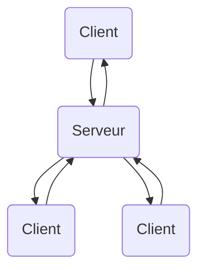
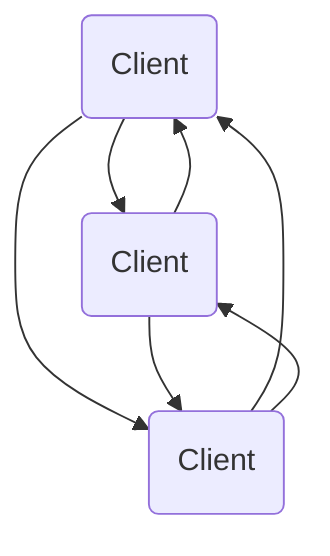

[← Intelligence artificielle](08-intelligence-artificielle.md) · [↑ Sommaire](../README.md#table-des-matières) · [Techniques avancées →](10-techniques-avancees.md)

# 9. Réseau et multijoueur

Le **réseau** et le **multijoueur** introduisent une dimension supplémentaire dans les jeux vidéo : la **synchronisation** d'un état partagé entre plusieurs machines, malgré la latence et la perte de paquets. Cette section présente les modèles d'architecture, les protocoles utilisés et les principaux défis de la programmation multijoueur.

### Modèles de réseau

Les jeux multijoueurs en réseau reposent sur différentes architectures pour synchroniser les données entre les joueurs. Les deux modèles principaux sont le modèle **client-serveur** et le modèle **peer-to-peer** (P2P).

- **Client-serveur** : un serveur central gère l'état du jeu et communique avec les clients (les joueurs). Les clients envoient des informations sur leurs actions au serveur, qui met à jour l'état du jeu et envoie des mises à jour aux clients. Le serveur est responsable de la synchronisation des données et de la gestion des conflits entre les clients. C'est le modèle dominant pour les jeux compétitifs (il facilite l'**autorité serveur** et la lutte anti-triche).



- **Peer-to-peer** : les joueurs se connectent directement les uns aux autres sans passer par un serveur central. Chaque joueur est responsable de la synchronisation de son propre état de jeu avec les autres joueurs. Ce modèle peut être plus efficace en termes de bande passante et de latence, mais il peut également être plus complexe à mettre en œuvre, en particulier pour les jeux avec un grand nombre de joueurs.



### Protocoles de communication

Les jeux en réseau utilisent différents protocoles de communication pour échanger des données entre les joueurs. Les deux protocoles les plus courants sont :

- **UDP** (*User Datagram Protocol*) : protocole de communication **sans connexion** et **sans garantie** de livraison. Généralement utilisé dans les jeux en temps réel en raison de sa faible **latence**. Cependant, les paquets de données peuvent être perdus ou arriver dans le désordre, ce qui nécessite une gestion supplémentaire (numéros de séquence, retransmissions sélectives) de la part du programme de jeu.
- **TCP** (*Transmission Control Protocol*) : protocole de communication **orienté connexion** avec **garantie** de livraison. Il garantit que les paquets de données sont livrés dans l'ordre et sans erreurs. Généralement utilisé pour les communications non critiques pour le temps, telles que le chat en jeu, la mise à jour des classements ou le téléchargement d'assets.

> De plus en plus de jeux modernes utilisent **WebRTC** ou **QUIC** (basés sur UDP), qui combinent fiabilité, faible latence et chiffrement.
>
> - **WebRTC** (*Web Real-Time Communication*) : pile P2P standardisée par le W3C, conçue à l'origine pour la visio dans le navigateur (Google Meet, Discord). Inclut une **traversée de NAT** (technique pour permettre à deux machines situées chacune derrière un routeur domestique de se parler directement, normalement bloquées par la translation d'adresses) via les protocoles **STUN** (découverte de l'IP publique), **TURN** (relais quand la connexion directe échoue) et **ICE** (algorithme qui choisit le meilleur chemin parmi les candidats), un chiffrement par **DTLS** (variante de TLS pour UDP) et un canal de données fiable ou non au choix (*data channels*). De plus en plus utilisée par les jeux web (*.io games*, *Krunker*).
> - **QUIC** (Google, repris par l'IETF en 2021) : protocole de transport au-dessus d'UDP qui combine TCP + TLS + multiplexage HTTP/2 dans une seule poignée de main. Beaucoup moins d'allers-retours à la connexion (le mode **0-RTT** permet même d'envoyer la première requête sans attendre la réponse du serveur), pas de **head-of-line blocking** (avec TCP, un seul paquet perdu bloque toute la livraison ; QUIC sépare les flux pour qu'un blocage n'affecte que le flux concerné), chiffrement obligatoire. C'est la base de **HTTP/3** et un candidat sérieux pour remplacer TCP même en jeu (Riot, Epic l'utilisent côté backend).

#### Synchronisation et latence

 **Vocabulaire de base :**

- **RTT** (*Round-Trip Time*) : temps aller-retour d'un paquet entre client et serveur (typiquement 30-150 ms en jeu compétitif).
- **Tick rate** : fréquence à laquelle le serveur calcule un nouvel état (Counter-Strike 2 = 64 Hz, Valorant = 128 Hz).
- **Snapshot** : un état complet du monde envoyé du serveur aux clients à chaque tick (positions, animations, vies…).
- **Input** : action du joueur (déplacement, tir) envoyée du client au serveur, à chaque frame.

Un jeu multijoueur typique tourne avec un client à 144 Hz qui parle à un serveur à 64 Hz, sur un réseau qui ajoute 50 ms de latence et perd 1 % des paquets. Naïvement, ça produit un jeu injouable. Quatre techniques essentielles le rendent fluide :

##### 1. Snapshot interpolation (côté client, pour les autres joueurs)

Le client n'affiche **pas** la dernière position reçue : il **retarde volontairement** son rendu de quelques snapshots et **interpole** entre deux snapshots passés. Cela donne un mouvement fluide même quand un paquet manque.

```math
S(t) = (1 - \alpha)\,S_0 + \alpha\,S_1
\qquad
\alpha = \frac{t - t_0}{t_1 - t_0}
```

où $S_0, S_1$ sont les deux snapshots qui encadrent le temps $t$. La règle pratique est de retarder le rendu d'environ **deux fois la période du tick rate** : sur un serveur 64 Hz, on affiche les autres joueurs avec un peu plus de 30 ms de retard. C'est l'approche standard des FPS compétitifs (*Counter-Strike*, *Valorant*, *Overwatch* l'appliquent tous, à quelques millisecondes près).

> **Pourquoi exactement 2× la période ?** Soit $T = 1/\text{tickRate}$ la période entre deux snapshots et $J$ la *jitter* réseau (variation du délai d'arrivée). Pour qu'à tout instant on dispose d'au moins **deux** snapshots autour du temps de rendu (l'un derrière, l'un devant) il faut un *buffer* d'au moins $T$ ; pour absorber la *jitter* sans interruption il faut **un autre** $T$ de marge. Total : $2T$. Avec moins, un paquet retardé fait dégénérer en **extrapolation** (deviner le futur), ce qui produit le tristement célèbre *rubber-banding*. Avec plus, on accumule un *input lag* visible. Pour les jeux compétitifs très tendus (*VALORANT*, *Counter-Strike 2*), on baisse à $\sim 1{,}5\,T$ et on assume une perte occasionnelle au profit de la réactivité.

##### 2. Client-side prediction (côté client, pour soi-même)

On ne peut pas attendre l'aller-retour serveur pour bouger son propre personnage : à 100 ms RTT, ça donnerait l'impression d'un input lag insupportable. La technique :

1. Le client **simule immédiatement** l'effet de son input.
2. Il **mémorise l'input avec son numéro de séquence** $n$.
3. Quand le serveur renvoie son state autoritaire avec le numéro $n$, le client **compare** :
 - Si l'état serveur correspond, RAS.
 - Sinon (ping-pong, collision contestée), le client **corrige sa position** et **rejoue tous les inputs postérieurs** $n+1, n+2, \dots$ — c'est la **reconciliation**.

```python
# Pseudocode côté client
inputs = []   # historique des inputs envoyés
for input_n at tick t:
 state.apply(input_n)         # prédiction immédiate
 inputs.append((t, input_n))
 send_to_server(t, input_n)

on receive (server_state, server_acked_tick):
 state = server_state          # rebase sur l'état autoritaire
 for (t, i) in inputs if t > server_acked_tick:
 state.apply(i)             # rejouer la queue
 inputs = inputs[server_acked_tick+1:]
```

C'est la technique fondatrice de *QuakeWorld* (1996, John Carmack), et elle reste utilisée aujourd'hui dans les FPS modernes avec très peu de modifications.

##### 3. Lag compensation (côté serveur, pour les hits)

Quand un joueur tire, le serveur reçoit l'input avec un délai $\Delta = \text{RTT}/2 + t_\text{interp}$. Si le serveur valide le tir contre les positions actuelles, le joueur a déjà raté la cible (la cible a bougé pendant $\Delta$). Solution : le serveur **rembobine** le monde de $\Delta$ et vérifie le hit dans le passé.

```math
\Delta_\text{rewind} = \frac{\text{RTT}_\text{client}}{2} + t_\text{interpolation}
```

Le serveur garde un buffer circulaire des dernières snapshots (typiquement une seconde d'historique). De là vient l'effet bien connu où l'on se fait tuer alors qu'on s'estime déjà à couvert : du point de vue du tireur, à l'instant où il a appuyé, sa cible était encore exposée.

##### 4. Lockstep déterministe (alternative aux snapshots)

Pour les RTS (*Age of Empires*, *StarCraft*, *Factorio*), envoyer 200 unités de positions à chaque tick est trop cher. À la place :

- Tous les clients démarrent avec la **même seed** et le **même état initial**.
- À chaque tick, tous les clients reçoivent **uniquement les inputs de tous les joueurs** (volume négligeable).
- Chaque client simule la totalité de la partie de manière **bit-exact**.

Pour que ça marche, **toute** la simulation doit être déterministe : pas de `Random` non-seedé, pas de comparaison d'adresses mémoire, pas d'arithmétique flottante non-déterministe (selon l'ordre d'exécution). Les RTS modernes (*Factorio*, *Age of Empires II Definitive*) utilisent même de l'**arithmétique en virgule fixe** pour éviter les divergences entre CPUs.

> **Le piège du flottant en lockstep.** L'instruction `x87` du x86 vs SSE vs ARM ne donnent pas les mêmes derniers bits sur `sin()`, `sqrt()`. Sur un FPS classique on s'en fiche. En lockstep, deux clients divergent en quelques minutes et la partie devient injouable. Solution : compiler avec `--ffast-math` désactivé, utiliser une lib math soft-float croisée comme `softfloat`, ou rester en virgule fixe.

### Programmation de jeu multijoueur

La programmation de jeu multijoueur implique la gestion de la **synchronisation** des données entre les joueurs, la **détection** et la **résolution des conflits**, et la **gestion des erreurs** de réseau. Les développeurs de jeux doivent également prendre en compte des problèmes tels que la **latence**, la **bande passante** et la **sécurité**.

Pour gérer ces problèmes, les développeurs peuvent utiliser des bibliothèques de réseau spécifiques au jeu (comme **ENet**, **yojimbo** ou **GameNetworkingSockets**) ou des moteurs de jeu intégrant des fonctionnalités réseau (Unity Netcode, Unreal Replication, Godot High-Level Multiplayer, Photon, Mirror, etc.).

Les développeurs doivent également implémenter des mécanismes pour gérer les **déconnexions** de joueurs, les **tricheurs** et les **attaques par déni de service**.

> **Lecture obligatoire** : ["What Every Programmer Needs To Know About Game Networking"](https://gafferongames.com/post/what_every_programmer_needs_to_know_about_game_networking/) de Glenn Fiedler. Court, dense, applicable.

[ Retour en haut de page](#table-des-matières)

---

---

[← Intelligence artificielle](08-intelligence-artificielle.md) · [↑ Sommaire](../README.md#table-des-matières) · [Techniques avancées →](10-techniques-avancees.md)
