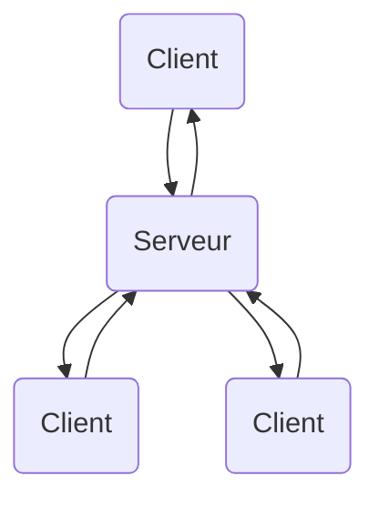
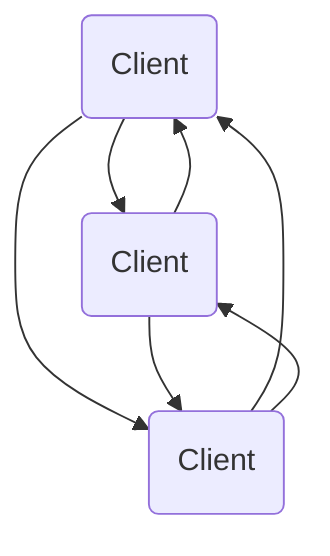

[← Intelligence artificielle](08-intelligence-artificielle.md) · [↑ Sommaire](../README.md#table-des-matières) · [Techniques avancées →](10-techniques-avancees.md)

# 9. Réseau et multijoueur

Quand vous jouez tout seul, votre console ou votre ordinateur sait tout : où sont les ennemis, combien de vies il vous reste, quelle porte est ouverte. Dès que vous jouez **à plusieurs sur des machines différentes**, chaque machine ne voit que sa moitié de l'histoire et doit se mettre d'accord avec les autres sur ce qui se passe vraiment. Faire en sorte que tous les joueurs voient à peu près la même partie au même moment, c'est tout le métier du **réseau** dans les jeux vidéo. La difficulté vient de deux ennemis : les messages mettent du temps à voyager, et certains se perdent en route.

> **Que veut dire « réseau » ?** Un réseau, c'est l'ensemble des câbles, des ondes et des règles qui permettent à plusieurs machines de s'envoyer des messages, exactement comme la poste permet à des gens d'échanger des lettres. Internet est le plus grand réseau du monde.

> **Que veut dire « multijoueur » ?** Cela désigne un jeu où plusieurs personnes jouent ensemble en même temps, chacune sur sa propre machine. Le contraire, où l'on joue tout seul contre l'ordinateur, s'appelle le « solo ».

> **Que veut dire « synchroniser » ?** Synchroniser, c'est mettre plusieurs choses « à la même heure », faire qu'elles restent d'accord entre elles. Quand deux danseurs bougent en même temps, ils sont synchronisés. Dans un jeu, synchroniser veut dire que toutes les machines partagent la même vision de la partie.

> **Que veut dire « latence » ?** La latence, c'est le temps que met un message pour aller d'une machine à l'autre. Même la lumière n'est pas instantanée, alors un message qui traverse la planète prend quelques centièmes de seconde. C'est comme le délai entre le moment où vous criez dans une vallée et celui où l'écho revient.

### Modèles de réseau

Pour que plusieurs joueurs partagent la même partie, il faut décider **qui parle à qui**. C'est ce qu'on appelle l'**architecture** du réseau : la façon dont les machines sont reliées et se répartissent le travail. Il en existe deux grandes familles, le modèle **client-serveur** et le modèle **pair à pair** (en anglais *peer-to-peer*, abrégé P2P).

> **Que veut dire « architecture » ici ?** C'est le plan d'organisation, la façon dont les pièces sont agencées, comme le plan d'une maison décide où sont les murs et les portes. L'architecture réseau décide quelles machines sont reliées et qui commande.

- **Client-serveur** : une machine centrale, le **serveur**, détient la version officielle de la partie. Toutes les autres machines, les **clients** (une par joueur), lui envoient ce que fait leur joueur. Le serveur met la partie à jour, tranche les désaccords, puis renvoie à chacun la nouvelle situation. C'est le modèle qui domine dans les jeux de compétition, car une seule machine fait foi : cela facilite l'**autorité serveur** et la lutte contre la triche.

> **Que veut dire « serveur » ?** Un serveur est une machine dont le rôle est de servir les autres, de leur rendre un service. Comme un serveur de restaurant qui prend les commandes de toutes les tables et apporte les plats, le serveur de jeu reçoit les actions de tous les joueurs et leur renvoie le résultat.

> **Que veut dire « client » ?** Dans ce langage, un client est une machine qui demande un service à un serveur. C'est le pendant du client de restaurant : il passe commande (« je tire », « j'avance ») et attend qu'on le serve. Ici, chaque joueur est un client.

> **Que veut dire « autorité serveur » ?** L'autorité, c'est le pouvoir de décider qui a raison. Dire que le serveur a l'autorité, c'est dire que c'est lui, et lui seul, qui décide de ce qui est vrai dans la partie. Comme un arbitre au football : même si un joueur jure qu'il a marqué, c'est l'arbitre qui tranche. Cela empêche un joueur malhonnête de faire croire n'importe quoi à sa propre machine pour tricher.



- **Pair à pair** : ici, pas de chef. Les machines des joueurs se parlent **directement entre elles**, sans passer par une machine centrale. Chacune doit alors se débrouiller pour rester d'accord avec toutes les autres. Ce modèle peut consommer moins de **bande passante** et réduire la latence, parce qu'on évite le détour par le serveur, mais il devient vite compliqué quand les joueurs sont nombreux : si tout le monde doit parler à tout le monde, le nombre de conversations explose.

> **Que veut dire « pair à pair » ?** Un « pair », c'est un égal, quelqu'un du même rang que vous (vos camarades de classe sont vos pairs). « Pair à pair » veut donc dire que toutes les machines sont sur un pied d'égalité, sans aucune machine-chef au-dessus. C'est comme une conversation entre amis où personne ne commande, par opposition à une classe où le professeur dirige.

> **Que veut dire « bande passante » ?** C'est la quantité d'informations qu'un tuyau réseau peut faire passer en une seconde, un peu comme le diamètre d'un tuyau d'eau décide du débit. Une grosse bande passante laisse passer beaucoup de données à la fois ; une petite, peu. Envoyer moins de données économise la bande passante.



### Protocoles de communication

Quand deux machines s'envoient des données, elles doivent d'abord se mettre d'accord sur des règles communes : comment découper le message, dans quel ordre, comment savoir s'il est bien arrivé. Cet ensemble de règles s'appelle un **protocole**. Les jeux en réseau en utilisent surtout deux, qui font des choix opposés.

> **Que veut dire « protocole » ?** Un protocole, c'est une liste de règles que tout le monde respecte pour se comprendre, comme les règles de politesse au téléphone : « allô », on attend que l'autre réponde, on dit « au revoir » avant de raccrocher. Sans règles communes, deux machines parleraient en même temps sans rien comprendre.

> **Que veut dire « paquet » ?** Sur un réseau, un gros message n'est jamais envoyé d'un coup : il est découpé en petits morceaux appelés paquets, envoyés séparément, puis recollés à l'arrivée. C'est comme expédier un meuble en kit dans plusieurs cartons numérotés plutôt qu'en un seul colis énorme.

- **UDP** (*User Datagram Protocol*) : ce protocole envoie les paquets **sans prévenir** et **sans vérifier** qu'ils arrivent. Il ne s'embarrasse de rien, donc il est très rapide, c'est-à-dire à faible latence, ce qui le rend idéal pour les jeux en temps réel. La contrepartie, c'est que des paquets peuvent se perdre ou arriver dans le désordre ; c'est alors au programme du jeu de gérer ces ratés (en numérotant les paquets, en renvoyant ceux qui manquent vraiment).

> **Que veut dire « en temps réel » ?** Cela veut dire « tout de suite, sans attendre », au rythme de l'action qui se déroule sous vos yeux. Un jeu de tir où il faut viser à l'instant est en temps réel ; un jeu où l'on peut réfléchir des heures avant de jouer son coup ne l'est pas.

- **TCP** (*Transmission Control Protocol*) : ce protocole fait l'inverse. Il établit d'abord une vraie liaison entre les deux machines, puis **garantit** que chaque paquet arrive, dans le bon ordre et sans erreur, en renvoyant tout seul ce qui s'est perdu. Cette sécurité a un prix : c'est plus lent. On le réserve donc à ce qui peut attendre une fraction de seconde sans gêner : la discussion écrite entre joueurs, la mise à jour des classements, ou le téléchargement de fichiers du jeu.

> **Pourquoi deux protocoles opposés ?** Parce qu'on ne peut pas avoir à la fois le plus rapide et le plus sûr : vérifier que tout arrive, renvoyer les pertes et tout remettre dans l'ordre prend forcément du temps. UDP choisit la vitesse en acceptant des ratés, TCP choisit la fiabilité en acceptant la lenteur. Un jeu utilise souvent les deux à la fois : UDP pour les mouvements (où une vieille position perdue n'a aucun intérêt, la suivante arrive déjà) et TCP pour le reste.

UDP et TCP sont les deux ancêtres, mais ils ont des descendants plus malins. De plus en plus de jeux modernes s'appuient sur **WebRTC** ou **QUIC**, deux protocoles bâtis au-dessus d'UDP qui réussissent à combiner trois qualités d'habitude difficiles à réunir : la fiabilité, la faible latence et le **chiffrement**.

> **Que veut dire « chiffrement » ?** Chiffrer un message, c'est le brouiller selon un secret pour que seul le destinataire puisse le relire, comme écrire en code secret. Ainsi, même si quelqu'un intercepte les paquets en chemin, il ne voit qu'une bouillie incompréhensible. C'est ce qui protège vos données quand elles voyagent sur Internet.

#### WebRTC

**WebRTC** (*Web Real-Time Communication*) est une boîte à outils de communication en pair à pair, normalisée pour fonctionner dans tous les navigateurs web. Elle a d'abord été créée pour la visioconférence (Google Meet, Discord), puis les jeux web s'en sont emparés (les petits jeux en `.io`, *Krunker*). Son grand mérite est de savoir établir une connexion directe entre deux machines même quand chacune se cache derrière la box Internet de la maison, ce qu'on appelle la **traversée de NAT**.

> **Que veut dire « NAT » et sa « traversée » ?** Chez vous, la box Internet partage une seule adresse publique entre tous vos appareils, en leur donnant à chacun une adresse privée invisible de l'extérieur : c'est le NAT (*Network Address Translation*, « traduction d'adresses »). C'est comme un immeuble qui n'a qu'une seule adresse postale dans la rue : le facteur ne sait pas livrer directement l'appartement du 4e. La « traversée de NAT » est l'ensemble des astuces qui permettent quand même à deux machines cachées derrière leur box de se parler en direct.

Pour réussir cette traversée, WebRTC s'appuie sur trois petits protocoles complémentaires :

- **STUN** : il sert à découvrir sa propre adresse publique, celle que le reste d'Internet voit. C'est comme demander à un ami « de l'extérieur, mon immeuble, c'est quelle adresse ? ».
- **TURN** : quand la connexion directe est impossible, il fait office de relais qui transmet les messages entre les deux machines. C'est le service de réexpédition du courrier quand on n'arrive pas à se livrer directement.
- **ICE** : c'est la méthode qui essaie tous les chemins possibles et garde le meilleur. Comme un GPS qui teste plusieurs routes et choisit la plus rapide.

S'ajoutent un chiffrement obligatoire (par un mécanisme nommé **DTLS**, une version de la sécurité du web adaptée à UDP) et des **canaux de données** que l'on peut régler au choix en mode fiable (comme TCP) ou rapide (comme UDP), selon ce qu'on transporte.

#### QUIC

**QUIC** a été inventé par Google et confié en 2021 à l'organisme qui standardise Internet. C'est un protocole de transport posé sur UDP qui réunit dans une seule étape de mise en relation ce que TCP, le chiffrement et le web moderne faisaient chacun de leur côté. Résultat : il faut beaucoup moins d'allers-retours pour démarrer une connexion.

> **Que veut dire « aller-retour » (et le mode « 0-RTT ») ?** Un aller-retour, c'est un message envoyé puis sa réponse revenue : à chaque fois, on paie le temps de latence. Moins on en fait, plus c'est rapide. Le mode **0-RTT** (« zéro aller-retour ») de QUIC permet même d'envoyer sa première vraie demande tout de suite, sans attendre la réponse du serveur, en se souvenant d'une connexion précédente. C'est comme entrer chez un commerçant qu'on connaît déjà et commander direct, sans repasser par les présentations.

QUIC évite aussi un défaut bien connu de TCP, le **blocage en tête de file**.

> **Que veut dire « blocage en tête de file » ?** Avec TCP, les paquets doivent être livrés dans l'ordre : si le premier de la file se perd, tous ceux qui suivent attendent qu'il soit renvoyé, même s'ils sont déjà arrivés. C'est comme une caisse de supermarché bloquée par le premier client : tout le monde derrière patiente. QUIC range les données en plusieurs files séparées, si bien qu'un bouchon dans une file ne bloque pas les autres.

Le chiffrement y est obligatoire. QUIC sert de fondation à **HTTP/3**, la version la plus récente du langage du web, et il est un sérieux candidat pour remplacer TCP, y compris dans les jeux (Riot et Epic l'utilisent déjà côté serveurs).

#### Synchronisation et latence

Avant d'attaquer les techniques, voici les quatre mots que tout le reste va réutiliser sans arrêt. Prenez le temps de bien les avoir en tête.

> **Que veut dire « RTT » ?** « RTT » vient de l'anglais *Round-Trip Time*, le « temps d'aller-retour ». C'est le temps que met un message pour aller du client au serveur **et** revenir, comme le temps entre le moment où vous lancez une balle contre un mur et celui où elle vous revient. En jeu de compétition, il est typiquement de 30 à 150 millisecondes.

> **Que veut dire « milliseconde » (ms) ?** Une milliseconde, écrite « ms », est un millième de seconde : il en faut mille pour faire une seconde. C'est très court, mais en jeu rapide, quelques dizaines de millisecondes suffisent à décider qui touche l'autre en premier.

> **Que veut dire « tick rate » ?** C'est le nombre de fois par seconde où le serveur recalcule la situation de la partie. Chacun de ces petits instants de calcul s'appelle un **tick**, comme le tic-tac d'une horloge. *Counter-Strike 2* fait 64 ticks par seconde, *Valorant* en fait 128. Plus le tick rate est élevé, plus la partie est calculée finement, mais plus cela coûte de puissance et de réseau.

> **Que veut dire « hertz » (Hz) ?** Le hertz, écrit « Hz », compte un nombre d'événements par seconde. « 64 Hz » se lit « 64 fois par seconde ». C'est l'unité qu'on emploie pour les fréquences, ici la cadence des calculs du serveur ou des images de l'écran.

> **Que veut dire « snapshot » ?** Un snapshot (mot anglais pour « photo instantanée ») est une photo complète de la partie à un instant donné : la position de chaque joueur, leurs animations, leurs points de vie, etc. Le serveur prend une telle photo à chaque tick et l'envoie aux clients pour qu'ils sachent où en est le monde.

> **Que veut dire « input » ?** Un input (mot anglais pour « entrée ») est une action commandée par le joueur : avancer, sauter, tirer. Le client envoie ces actions au serveur. C'est l'inverse du snapshot : le snapshot descend du serveur vers le joueur, l'input remonte du joueur vers le serveur.

> **Que veut dire « frame » ?** Une frame (mot anglais pour « image ») est une seule image affichée à l'écran. Un jeu en affiche des dizaines par seconde pour donner l'illusion du mouvement, comme les pages d'un folioscope qu'on feuillette vite. À chaque frame, le client peut envoyer un nouvel input.

Mettons maintenant des chiffres réalistes. Un jeu multijoueur courant fait tourner le client à 144 images par seconde face à un serveur qui calcule 64 fois par seconde, sur un réseau qui ajoute 50 millisecondes de latence et perd 1 paquet sur 100. Si on programmait cela sans précaution, le résultat serait injouable : les autres joueurs sauteraient d'un endroit à l'autre, et le moindre paquet perdu provoquerait un à-coup. Quatre techniques, que nous détaillons maintenant, transforment ce chaos en une partie fluide.

##### 1. Interpolation des snapshots (côté client, pour les autres joueurs)

Première idée, pour afficher les **autres** joueurs en douceur. Le bon réflexe serait d'afficher tout de suite la dernière position reçue ; c'est pourtant une mauvaise idée, parce que les snapshots arrivent par à-coups (64 par seconde, et parfois un manque). Le client fait donc l'inverse : il **prend volontairement un peu de retard**, garde sous le coude quelques snapshots déjà arrivés, et **interpole** entre les deux derniers. Le mouvement paraît alors lisse, même quand un paquet se perd, car on dessine toujours entre deux photos qu'on possède déjà.

> **Que veut dire « interpoler » ?** Interpoler, c'est calculer une valeur intermédiaire entre deux valeurs connues, fabriquer les images manquantes entre deux photos. Si vous savez qu'un personnage était à gauche à un instant et au milieu à l'instant suivant, interpoler à mi-chemin le place au quart du trajet. C'est ce que fait un dessinateur quand il ajoute des dessins entre deux poses clés pour rendre l'animation fluide.

La position affichée, notée $`S(t)`$, se calcule ainsi :

```math
S(t) = (1 - \alpha)\,S_0 + \alpha\,S_1
\qquad
\alpha = \frac{t - t_0}{t_1 - t_0}
```

> **Que veulent dire $`S_0`$ et $`S_1`$ ?** Ce sont les deux snapshots qui encadrent l'instant $`t`$ que l'on veut afficher : $`S_0`$ est la photo juste avant, $`S_1`$ la photo juste après. Le petit chiffre en bas, l'indice, sert juste à les distinguer : $`S_0`$ se lit « S indice zéro ». De même $`t_0`$ et $`t_1`$ sont les instants où ces deux photos ont été prises.

> **Que veut dire le symbole $`\alpha`$ ?** C'est la lettre grecque « alpha ». Ici elle représente un curseur entre 0 et 1 qui dit où l'on se trouve entre les deux photos : $`\alpha = 0`$ veut dire « pile sur la première », $`\alpha = 1`$ « pile sur la seconde », $`\alpha = 0{,}5`$ « pile au milieu ». La formule $`\alpha = \frac{t - t_0}{t_1 - t_0}`$ mesure simplement quelle fraction du chemin entre les deux instants on a déjà parcourue.

> **Comment lire la formule de $`S(t)`$ ?** Elle fait une moyenne pesée des deux positions. Plus $`\alpha`$ est proche de 1, plus on tire le résultat vers $`S_1`$ ; plus il est proche de 0, plus on reste près de $`S_0`$. Quand $`\alpha = 0{,}25`$, on est au quart : un peu plus près du départ que de l'arrivée. C'est la recette de base pour glisser doucement d'un point à un autre.

La règle pratique est de retarder l'affichage d'environ **deux fois la durée entre deux snapshots**. Sur un serveur à 64 Hz, cela revient à montrer les autres joueurs avec un peu plus de 30 millisecondes de retard. Tous les jeux de tir de compétition font ainsi (*Counter-Strike*, *Valorant*, *Overwatch*), à quelques millisecondes près.

> **Que veut dire « FPS » (le genre de jeu) ?** « FPS » vient de l'anglais *First-Person Shooter*, « jeu de tir à la première personne » : un jeu de tir où l'on voit l'action par les yeux du personnage, comme si on tenait l'arme soi-même. Attention, ces trois mêmes lettres servent aussi pour *frames per second* (images par seconde) ; le contexte indique lequel on veut dire.

> **Pourquoi exactement deux fois la durée entre snapshots ?** Appelons $`T`$ cette durée (sur un serveur 64 Hz, $`T`$ vaut un soixante-quatrième de seconde). Pour pouvoir interpoler, il faut à tout instant disposer d'au moins **deux** snapshots autour du moment qu'on affiche, un derrière et un devant : cela impose déjà de prendre $`T`$ de retard. Mais le réseau n'est pas régulier : les paquets arrivent un peu en avance ou en retard, ce qu'on appelle la **gigue**. Pour absorber ces variations sans jamais tomber à court de photos, on ajoute **une seconde** marge de $`T`$. Total : $`2T`$. Si l'on prend moins de retard, un paquet en retard force le client à **extrapoler**, c'est-à-dire à deviner le futur ; et quand la vraie position arrive, le personnage se téléporte brutalement pour corriger l'erreur, l'effet d'élastique tristement célèbre. Si l'on prend plus de retard, le jeu devient mou, car on voit tout avec un décalage perceptible. Les jeux de compétition les plus nerveux (*Valorant*, *Counter-Strike 2*) descendent vers $`1{,}5\,T`$ et acceptent un raté de temps en temps pour gagner en réactivité.

> **Que veut dire « gigue » (en anglais *jitter*) ?** C'est l'irrégularité des délais : un paquet met 48 millisecondes, le suivant 55, le suivant 50. Le délai moyen est stable, mais il « tremble » autour de cette moyenne. C'est comme un bus censé passer toutes les dix minutes mais qui arrive parfois avec deux minutes d'avance, parfois trois de retard.

> **Que veut dire « extrapoler » ?** C'est l'inverse d'interpoler : au lieu de calculer entre deux valeurs connues, on prolonge au-delà de la dernière connue pour deviner ce qui vient. Si un personnage avançait tout droit, extrapoler suppose qu'il continue tout droit. C'est risqué, car s'il a tourné entre-temps, on se trompe.

> **Que veut dire « effet d'élastique » (en anglais *rubber-banding*) ?** C'est ce moment où un personnage semble brusquement aspiré en arrière ou téléporté, comme tiré par un élastique. Cela arrive quand le jeu avait deviné une position, puis reçoit la vraie et doit corriger d'un coup.

##### 2. Prédiction côté client (pour son propre personnage)

L'interpolation marche pour les autres, mais pas pour vous. Pour votre propre personnage, attendre l'aller-retour du serveur avant de bouger serait insupportable : avec un RTT de 100 millisecondes, vous appuieriez sur une touche et le personnage ne réagirait qu'un dixième de seconde plus tard, comme une manette qui répond en retard. On appelle ce décalage entre l'appui et la réaction l'**input lag**, et il faut l'éliminer. L'astuce s'appelle la **prédiction côté client** : le client ne demande pas la permission, il **devine** le résultat de son action et l'affiche tout de suite, quitte à se corriger après.

> **Que veut dire « input lag » ?** C'est le retard entre le moment où l'on commande une action et le moment où on la voit à l'écran (« lag » est l'anglais pour « retard »). Un grand input lag donne l'impression de piloter dans la mélasse ; un petit input lag donne une commande nette et immédiate.

> **Que veut dire « simuler » ?** Simuler, c'est calculer à l'avance ce qui devrait se passer, jouer la suite dans sa tête comme on imagine où va tomber une balle avant qu'elle ne tombe. Le client simule son input en calculant lui-même où son personnage arriverait, sans attendre la réponse du serveur.

La technique se déroule en trois temps :

1. Le client **simule tout de suite** l'effet de son input : il affiche son personnage là où il devrait arriver, sans attendre.
2. Il **range l'input dans un carnet, accompagné d'un numéro de séquence** noté $`n`$.
3. Quand le serveur lui renvoie sa version officielle, marquée du même numéro $`n`$, le client **compare** sa prédiction avec la réalité :
   - Si les deux concordent, parfait, il n'y a rien à faire.
   - Sinon (une collision contestée, une bousculade), le client **replace son personnage à la position officielle**, puis **rejoue dans l'ordre tous les inputs plus récents** ($`n+1`$, $`n+2`$, et les suivants) pour rattraper le présent. Cette remise d'accord s'appelle la **réconciliation**.

> **Que veut dire « numéro de séquence » ?** C'est un numéro d'ordre collé à chaque input, comme on numérote les pages d'un cahier : input numéro 1, numéro 2, numéro 3. Grâce à ce numéro, quand le serveur répond, le client sait exactement de quelle action il parle et lesquelles sont arrivées après.

> **Que veulent dire $`n`$, $`n+1`$, $`n+2`$ ?** $`n`$ est simplement un nom donné à un numéro quelconque (le numéro de l'input dont parle le serveur). $`n+1`$ est l'input juste après, $`n+2`$ celui d'encore après, et ainsi de suite. C'est la même idée que « la page $`n`$ et les pages suivantes ».

> **Que veut dire « réconciliation » ?** Réconcilier, c'est remettre d'accord deux choses qui s'étaient écartées, comme deux amis brouillés qu'on rapproche. Ici, la prédiction du client et la décision du serveur ont divergé ; la réconciliation corrige le client pour le réaligner sur le serveur, sans pour autant annuler les actions que le joueur a faites depuis.

```python
# Pseudocode côté client
inputs = []   # historique des inputs envoyés
for input_n at tick t:
 state.apply(input_n)         # prédiction immédiate
 inputs.append((t, input_n))
 send_to_server(t, input_n)

on receive (server_state, server_acked_tick):
 state = server_state          # rebase sur l'état autoritaire
 for (t, i) in inputs if t > server_acked_tick:
 state.apply(i)             # rejouer la queue
 inputs = inputs[server_acked_tick+1:]
```

C'est la technique fondatrice de *QuakeWorld* (1996, John Carmack), et elle reste utilisée aujourd'hui dans les FPS modernes avec très peu de modifications.

##### 3. Compensation de latence (côté serveur, pour valider les tirs)

Voici le problème inverse, vu cette fois depuis le serveur. Quand vous tirez, vous visez la cible **telle que votre écran vous la montre**, c'est-à-dire avec le retard d'affichage des deux techniques précédentes. Votre tir met ensuite du temps à remonter jusqu'au serveur. Au total, votre commande de tir arrive au serveur avec un retard que l'on note $`\Delta`$.

> **Que veut dire le symbole $`\Delta`$ ?** C'est la lettre grecque « delta » majuscule. En mathématiques, elle désigne très souvent un écart, une différence ou un retard. Ici, $`\Delta`$ est le retard total entre l'instant où vous voyiez la cible et l'instant où le serveur reçoit votre tir.

Si le serveur jugeait votre tir d'après la position **actuelle** de la cible, vous l'auriez forcément manquée, car pendant ce retard $`\Delta`$ la cible a continué de bouger. Ce serait injuste : vous visiez juste, sur votre écran. La solution s'appelle la **compensation de latence** : le serveur **rembobine** le monde de $`\Delta`$, le remet dans l'état où il était quand vous avez tiré, et vérifie là, dans le passé, si le tir touchait.

> **Que veut dire « rembobiner » ?** C'est revenir en arrière dans le temps, comme on rembobinait une cassette pour revoir une scène. Le serveur garde en mémoire les positions récentes de tout le monde ; rembobiner, c'est consulter ces vieilles positions pour rejuger le tir au bon moment.

La durée de rembobinage se calcule en additionnant les deux retards en cause :

```math
\Delta_\text{rewind} = \frac{\text{RTT}_\text{client}}{2} + t_\text{interpolation}
```

> **Comment lire cette formule ?** Elle dit : durée à rembobiner = la moitié de l'aller-retour réseau, plus le retard d'affichage. On prend la **moitié** du RTT parce que le tir ne fait qu'un seul trajet (du client vers le serveur), alors que le RTT mesure l'aller **et** le retour. On y ajoute $`t_\text{interpolation}`$, le retard que le client s'était volontairement imposé dans la technique 1 pour lisser l'affichage. La somme des deux donne exactement de combien le serveur doit reculer dans le temps.

Pour pouvoir regarder dans le passé, le serveur conserve les dernières photos du monde dans un **tampon circulaire**, en général une seconde d'historique.

> **Que veut dire « tampon circulaire » ?** Un tampon (en anglais *buffer*) est une zone de mémoire qui sert de réserve temporaire. « Circulaire » veut dire qu'une fois plein, on réécrit par-dessus le plus ancien, comme un tableau à craie où, quand il n'y a plus de place, on efface le coin le plus vieux pour réécrire. Ainsi le serveur garde toujours la dernière seconde, sans jamais saturer.

C'est de cette technique que vient un effet bien connu et un peu frustrant : se faire tuer alors qu'on se croyait déjà à l'abri derrière un mur. Du point de vue du tireur, à l'instant où il a appuyé sur la détente, vous étiez encore à découvert sur son écran ; le serveur lui a donné raison en rembobinant.

##### 4. Pas synchronisé déterministe (une autre approche, sans snapshots)

Les trois premières techniques supposent que le serveur envoie sans cesse des photos du monde. Mais pour un jeu de stratégie en temps réel, ou **RTS** (*Age of Empires*, *StarCraft*, *Factorio*), où l'écran peut contenir des centaines d'unités, envoyer la position de 200 unités à chaque tick coûterait bien trop cher en réseau. On change alors complètement de stratégie, avec ce qu'on appelle le **pas synchronisé** (en anglais *lockstep*).

> **Que veut dire « RTS » ?** « RTS » vient de l'anglais *Real-Time Strategy*, « stratégie en temps réel ». Ce sont des jeux où l'on commande des armées entières qui bougent toutes en même temps, sans tour par tour, comme dans une vraie bataille qui se déroule sous vos yeux.

> **Que veut dire « pas synchronisé » (*lockstep*) ?** L'expression anglaise *lockstep* décrit des soldats qui marchent au pas, tous le même pied au même instant. Appliqué au jeu, cela veut dire que toutes les machines avancent leur simulation exactement au même rythme et calculent la même chose au même moment, comme une troupe parfaitement synchronisée.

L'idée tient en trois points :

- Toutes les machines démarrent avec la **même graine de hasard** et le **même état de départ** : la partie commence donc rigoureusement identique partout.
- À chaque tick, chaque machine ne reçoit que **les inputs de tous les joueurs** (avancer ici, construire là), ce qui représente très peu de données.
- À partir de ces inputs, chaque machine recalcule toute la partie dans son coin, **au bit près**.

> **Que veut dire « graine de hasard » (en anglais *seed*) ?** Le hasard d'un ordinateur n'est pas vraiment du hasard : c'est une suite de nombres calculée à partir d'un nombre de départ, la graine. Avec la même graine, on obtient toujours exactement la même suite « au hasard », comme une recette qui, suivie à l'identique, donne toujours le même gâteau. C'est indispensable ici : si deux machines tiraient des hasards différents, elles ne verraient plus la même partie.

> **Que veut dire « au bit près » (en anglais *bit-exact*) ?** Un bit est le plus petit grain d'information dans un ordinateur, un 0 ou un 1. « Au bit près » signifie identique jusqu'au dernier petit chiffre, sans la moindre différence, même invisible. Les machines ne doivent pas obtenir « à peu près » la même chose, mais exactement la même, jusqu'au dernier bit.

Pour que cela tienne, **toute** la simulation doit être **déterministe**, c'est-à-dire produire toujours le même résultat à partir des mêmes données.

> **Que veut dire « déterministe » ?** Cela veut dire « sans la moindre part de hasard ni d'imprévu » : à entrées identiques, sortie identique, à tous les coups. C'est comme une calculatrice qui, à la même opération, donne toujours la même réponse. Si la simulation n'était pas déterministe, deux machines finiraient par voir des parties différentes.

Concrètement, il faut bannir tout ce qui pourrait varier d'une machine à l'autre : un hasard sans graine fixée (`Random` non initialisé), une comparaison d'adresses mémoire (qui changent d'une machine à l'autre), ou des calculs à virgule flottante dont le résultat dépend de l'ordre des opérations. Les RTS modernes (*Factorio*, *Age of Empires II Definitive*) vont jusqu'à remplacer les nombres à virgule flottante par de l'**arithmétique en virgule fixe** pour empêcher tout désaccord entre processeurs.

> **Que veut dire « nombre à virgule flottante » ?** C'est la façon habituelle dont un ordinateur stocke les nombres à virgule (comme 3,14159). On l'appelle « flottante » parce que la virgule peut se déplacer pour représenter aussi bien de très grands que de très petits nombres. Son défaut : deux machines différentes peuvent donner un résultat très légèrement différent sur le dernier chiffre.

> **Que veut dire « arithmétique en virgule fixe » ?** C'est une autre façon de stocker les nombres à virgule, où la virgule reste toujours à la même place. C'est moins souple, mais le calcul donne exactement le même résultat partout, ce qui est précisément ce qu'il faut pour le pas synchronisé. C'est comme si tout le monde comptait en centimes entiers plutôt qu'en euros à virgule : aucune ambiguïté.

> **Que veut dire « processeur » (en anglais *CPU*) ?** Le processeur, ou CPU (*Central Processing Unit*, « unité centrale de traitement »), est la puce qui fait les calculs dans un ordinateur, son cerveau. Or tous les cerveaux ne calculent pas la virgule flottante exactement pareil, d'où les désaccords que la virgule fixe vient supprimer.

> **Le piège des nombres à virgule flottante en pas synchronisé.** Selon le type de processeur (les anciennes instructions `x87` des puces Intel, les instructions `SSE`, ou les puces `ARM` des téléphones), des fonctions comme `sin()` ou `sqrt()` ne renvoient pas exactement les mêmes derniers chiffres. Dans un jeu de tir classique, cela n'a aucune importance. En pas synchronisé, ces minuscules écarts s'accumulent : en quelques minutes, deux machines voient des parties qui ont divergé, et la partie devient injouable. Les remèdes : désactiver les optimisations mathématiques agressives du compilateur (l'option `--ffast-math`), utiliser une bibliothèque de calcul logicielle identique sur toutes les machines (comme `softfloat`), ou rester en virgule fixe.

> **Que veut dire « compilateur » ?** Un compilateur est le programme qui traduit le code écrit par les humains en instructions que la machine sait exécuter. Selon ses réglages, il peut réorganiser les calculs pour aller plus vite, ce qui, ici, risquerait justement de casser le « au bit près ».

### Programmation de jeu multijoueur

En pratique, écrire la partie réseau d'un jeu revient à jongler avec tout ce qu'on vient de voir en même temps : garder les machines synchronisées, repérer quand deux joueurs prétendent des choses contradictoires, trancher ces désaccords, et survivre aux pannes du réseau (paquets perdus, joueurs qui se déconnectent). À cela s'ajoutent trois soucis permanents : la latence, la bande passante et la **sécurité**.

> **Que veut dire « conflit » ici ?** Un conflit, c'est quand deux machines ne sont pas d'accord sur ce qui s'est passé : par exemple, deux joueurs croient chacun avoir ramassé le même objet en premier. Il faut alors une règle pour décider qui a raison, sinon les parties divergent. Dans le modèle client-serveur, c'est l'autorité serveur qui tranche.

> **Que veut dire « sécurité » ici ?** C'est l'ensemble des protections contre ceux qui veulent abuser du jeu : tricheurs qui modifient leur client, espions qui lisent les données des autres, attaquants qui essaient de faire planter le serveur. Sécuriser un jeu, c'est rendre toutes ces attaques difficiles ou inutiles.

Heureusement, personne ne réécrit tout cela à la main. Les créateurs s'appuient sur des **bibliothèques** réseau prêtes à l'emploi (comme `ENet`, `yojimbo` ou `GameNetworkingSockets`) ou sur des **moteurs de jeu** qui intègrent déjà le réseau (Unity Netcode, Unreal Replication, Godot High-Level Multiplayer, Photon, Mirror, et d'autres).

> **Que veut dire « bibliothèque » (en programmation) ?** C'est un ensemble de morceaux de code tout faits que d'autres ont écrits et testés, et qu'on réutilise dans son propre programme, comme on emprunte des livres dans une bibliothèque plutôt que de tout réécrire soi-même. Cela évite de réinventer ce qui existe déjà.

> **Que veut dire « moteur de jeu » ?** C'est une grande boîte à outils logicielle toute prête (Unity, Unreal, Godot, etc.) qui gère le dessin à l'écran, les sons, la physique et, ici, le réseau, pour éviter aux créateurs de tout reprogrammer à zéro à chaque nouveau jeu.

Enfin, un jeu en ligne doit prévoir les cas pénibles mais inévitables : les joueurs qui se **déconnectent** en plein milieu (il faut continuer la partie sans eux), les **tricheurs** (que l'autorité serveur aide à contrer), et les **attaques par déni de service**.

> **Que veut dire « attaque par déni de service » ?** C'est une attaque qui consiste à noyer un serveur sous une avalanche de fausses demandes, jusqu'à ce qu'il soit trop occupé pour répondre aux vrais joueurs. C'est comme une foule qui bloquerait l'entrée d'un magasin sans rien acheter, juste pour empêcher les vrais clients d'entrer. Le serveur ne « tombe en panne » pas vraiment : il est simplement débordé.

> **Lecture obligatoire** : ["What Every Programmer Needs To Know About Game Networking"](https://gafferongames.com/post/what_every_programmer_needs_to_know_about_game_networking/) de Glenn Fiedler. Court, dense, applicable.

[ Retour en haut de page](#table-des-matières)

---

---

[← Intelligence artificielle](08-intelligence-artificielle.md) · [↑ Sommaire](../README.md#table-des-matières) · [Techniques avancées →](10-techniques-avancees.md)
