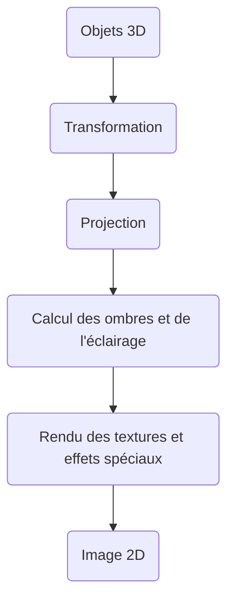
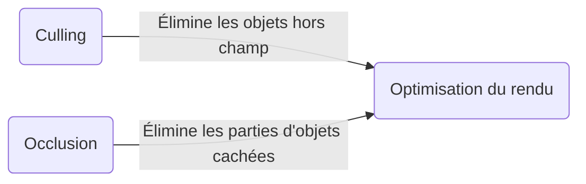
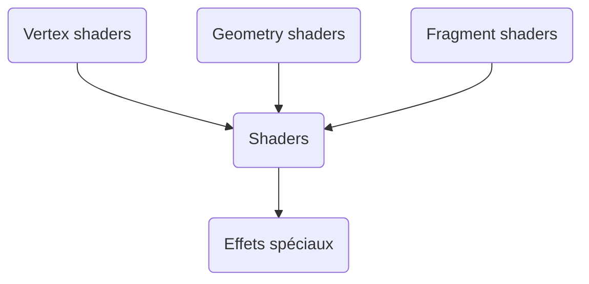

[← Techniques avancées](10-techniques-avancees.md) · [↑ Sommaire](../README.md#table-des-matières)

# 11. Pipeline de rendu

Un écran d'ordinateur, c'est juste une grille de petits points colorés, comme une feuille de papier quadrillé géante où chaque carreau ne peut afficher qu'une seule couleur. Un jeu vidéo, lui, raisonne en monde imaginaire : il y a un personnage, des arbres, des montagnes, posés quelque part dans un espace à trois dimensions. Le travail du **pipeline de rendu** est de partir de ce monde imaginaire en relief et d'en remplir, des millions de fois par seconde, chacun de ces petits carreaux de couleur.

> **Que veut dire « pipeline de rendu » ?** « Rendre » (en anglais *render*), c'est fabriquer l'image finale à partir de la description d'une scène. Un « pipeline » est une chaîne d'étapes qui se suivent toujours dans le même ordre, comme les postes d'une chaîne de montage dans une usine de voitures : un poste pose les roues, le suivant peint la carrosserie, et ainsi de suite. Le pipeline de rendu est donc la chaîne de montage qui transforme un décor en relief en une image plate prête à afficher.

> **Que veut dire « 3D » et « 2D » ?** « D » veut dire « dimension », c'est-à-dire une direction dans laquelle on peut se déplacer. En **2D** (deux dimensions), on ne peut bouger que sur une feuille de papier : à gauche/droite et en haut/bas. En **3D** (trois dimensions), on peut en plus avancer ou reculer en profondeur, comme dans la vraie vie. Le monde du jeu est en 3D ; l'écran, lui, est une surface plate en 2D.

> **Que veut dire « texture » ?** Une texture est une image plate que l'on colle sur un objet 3D pour lui donner son aspect, exactement comme on collerait du papier peint à motifs sur un mur tout gris. C'est ce qui fait qu'un mur de briques ressemble à des briques sans qu'on ait à modeler chaque brique en relief.

Ce chapitre suit la scène depuis sa description en relief jusqu'au moment où chaque carreau de l'écran reçoit sa couleur définitive.

### Étapes du pipeline



Ce premier schéma montre l'idée générale. Dans une vraie carte graphique moderne, la chaîne est plus fine et ressemble plutôt à ceci.

> **Que veut dire « GPU » ?** GPU est l'abréviation anglaise de *Graphics Processing Unit*, qu'on peut traduire par « processeur graphique ». C'est une puce spécialisée dans la fabrication d'images. Là où le cerveau habituel de l'ordinateur (le processeur, ou CPU) fait les tâches une par une mais très vite, le GPU est une armée de milliers de petits calculateurs qui travaillent tous en même temps, ce qui est parfait pour colorier des millions de carreaux à la fois.


Chaque case de ce schéma porte un nom technique. Voici à quoi sert chacune, dans l'ordre où la carte graphique les traverse.

> **Les étapes de la chaîne, en une phrase chacune.**
>
> - **Vertex shader** : place chaque coin des objets au bon endroit dans l'image. (Détaillé plus bas.)
> - **Tessellation** (lu « tesselation ») : découpe les grandes surfaces en plus petits triangles pour ajouter du détail, comme on couperait une grande dalle en plein de petits carreaux de mosaïque.
> - **Geometry shader** : peut créer de la nouvelle géométrie à la volée, par exemple transformer un simple point en plusieurs triangles. (Détaillé plus bas.)
> - **Rasterization** : décide quels carreaux de l'écran sont recouverts par chaque triangle. (Définie juste après.)
> - **Fragment shader** : calcule la couleur de chacun de ces carreaux. (Détaillé plus bas.)
> - **Output merger** (« fusionneur de sortie ») : décide, quand plusieurs objets se disputent le même carreau, lequel l'emporte et avec quelle couleur finale on écrit dans l'image.

> **Que veut dire « géométrie » ici ?** En jeu vidéo, la « géométrie » d'un objet, ce n'est pas la matière scolaire : c'est l'ensemble des points, des arêtes et des triangles qui décrivent sa forme, un peu comme le squelette en fil de fer d'une statue avant qu'on ne la recouvre.

### Culling et occlusion

Dessiner coûte du temps de calcul. La règle d'or, donc, est simple : la chose la plus rapide à dessiner est celle qu'on ne dessine pas du tout. Le **culling** et l'**occlusion** servent exactement à cela : repérer ce qui ne se verra pas à l'écran et l'écarter avant de gaspiller le moindre effort dessus.

> **Que veut dire « culling » ?** *Culling* vient d'un verbe anglais qui signifie « trier pour écarter », comme un jardinier qui retire les fruits abîmés d'un panier. Ici, écarter veut dire : ne même pas essayer de dessiner cet objet.

> **Que veut dire « occlusion » ?** Une occlusion, c'est le fait d'être caché par autre chose. Quand quelqu'un passe devant vous au cinéma, sa tête « occulte » une partie de l'écran : vous ne voyez plus ce qu'il y a derrière. En jeu vidéo, un objet caché derrière un mur est occulté, donc inutile à dessiner.

> **Que veut dire « caméra » ?** La caméra est l'œil imaginaire à travers lequel le joueur regarde la scène. Elle a une position (où elle se trouve) et une direction (de quel côté elle regarde). L'image affichée est exactement ce que cet œil verrait.

La différence entre les deux tient à ce qu'on écarte : des objets entiers, ou seulement des morceaux.

- Le **culling** se concentre sur l'élimination des **objets entiers** qui sont soit en dehors du champ de vision de la caméra (le *frustum culling*), soit tournés de l'autre côté (le *backface culling*).
- L'**occlusion** élimine les **parties d'objets** qui sont cachées derrière d'autres objets, grâce à des techniques comme l'*occlusion culling*, le *Z-buffer* ou le *Hi-Z*.

> **Que veut dire « frustum culling » ?** Le *frustum* est le volume que la caméra voit réellement (il est défini juste après). Le *frustum culling* consiste à jeter d'emblée tout objet situé hors de ce volume : pas la peine de dessiner ce qui est derrière la caméra ou complètement sur le côté.

> **Que veut dire « backface culling » ?** *Backface* signifie « face arrière ». Un objet fermé, comme un ballon, a des faces tournées vers vous et des faces tournées dans le sens opposé, de l'autre côté de l'objet. Comme on ne peut pas voir l'intérieur d'un ballon opaque, on jette d'office les faces qui nous tournent le dos : c'est le *backface culling*, et il supprime à lui seul environ la moitié des triangles.

> **Que veut dire « Hi-Z » ?** *Hi-Z* est l'abréviation de *Hierarchical-Z*, qu'on peut traduire par « profondeur en pyramide ». L'idée est de ranger les profondeurs de l'écran (la lettre Z désigne la profondeur, voir le Z-buffer plus bas) en plusieurs niveaux empilés comme une pyramide. Chaque niveau supérieur regroupe un bloc de $`2 \times 2`$ pixels du niveau inférieur et n'en retient que la profondeur la plus lointaine.
>
> L'intérêt est le suivant : si même le point le plus lointain d'un bloc est déjà caché, alors tout le bloc est caché, et on peut rejeter une tuile entière d'un coup au lieu de tester ses pixels un par un. C'est la même astuce qu'un surveillant qui, en voyant que la rangée du fond est pleine, sait qu'il est inutile d'aller vérifier chaque siège de la rangée.

> **Le symbole $`\times`$.** C'est le signe de la multiplication. Ici $`2 \times 2`$ se lit « deux fois deux » et désigne un petit carré de pixels de 2 de large sur 2 de haut, soit 4 pixels en tout.

Plusieurs mots vont revenir sans arrêt dans la suite. Les voici regroupés une bonne fois, avec une image simple pour chacun.

> **Que veut dire « frustum » ?** Le frustum (qui se prononce « frustomme ») est le volume que la caméra voit vraiment. Il a la forme d'une pyramide dont on aurait coupé la pointe : pointe du côté de la caméra, large au loin. Il est borné devant par un mur invisible proche (le *near plane*) et derrière par un mur invisible lointain (le *far plane*). Tout ce qui est à l'extérieur de cette forme peut être écarté.
>
> Pensez à la lumière d'une lampe torche : elle éclaire un cône qui s'élargit en s'éloignant, et tout ce qui est hors du faisceau reste dans le noir.

> **Que veut dire « plane » (near plane, far plane) ?** *Plane* est l'anglais pour « plan », c'est-à-dire une surface parfaitement plate et infinie, comme un mur sans bord. Le *near plane* est le mur le plus proche de la caméra, en deçà duquel rien n'est dessiné ; le *far plane* est le mur le plus lointain, au-delà duquel on ne dessine plus rien non plus.

> **Que veut dire « rasterization » ?** En français on dit *rastérisation* ou *matricage*. C'est l'étape qui regarde un triangle posé sur l'écran et répond à la question : « quels carreaux de la grille ce triangle recouvre-t-il ? » Cela revient à colorier une forme sur du papier quadrillé en noircissant chaque carreau touché. La pièce de la carte graphique qui fait ce travail s'appelle le *rasterizer*.

> **Que veut dire « fragment » ?** Un fragment est un candidat-pixel : c'est le petit morceau produit quand un triangle recouvre un carreau de l'écran. Il porte tout ce qu'il faut pour calculer une couleur (sa profondeur, sa position, etc.). Plusieurs fragments peuvent viser le même carreau (par exemple quand deux objets se chevauchent) ; après tri, un seul donnera le pixel finalement affiché.

> **Que veut dire « Z-buffer » ?** On l'appelle aussi *depth buffer*, ou « tampon de profondeur ». C'est un tableau de la même taille que l'écran qui retient, pour chaque carreau, la distance du point le plus proche déjà dessiné à cet endroit. Avant d'écrire un nouveau fragment, la carte graphique compare sa distance à celle stockée : si le nouveau venu est plus loin, il est caché par ce qui est devant, donc on le jette.
>
> C'est comme empiler des photos découpées sur une table : seule celle du dessus reste visible à chaque endroit. Cette méthode est la solution standard au problème de l'occlusion depuis qu'Edwin Catmull l'a proposée en 1974.

> **Que veut dire « buffer » ?** Un *buffer* (en français « tampon » ou « mémoire tampon ») est simplement une zone de mémoire qui sert de cahier de brouillon : on y range des valeurs en attendant de s'en servir. Le Z-buffer est le cahier où l'on note les profondeurs.

> **Que veut dire « texel » ?** *Texel* est la contraction de *texture pixel* : c'est un point d'une texture, à ne pas confondre avec un pixel de l'écran. Pour habiller un triangle avec une image, la carte graphique va lire un ou plusieurs texels dans la texture et les mélanger. La façon de les mélanger s'appelle le mode de filtrage (par exemple : *nearest*, *bilinear*, *trilinear*, anisotrope), du plus brut au plus lissé.

> **Que veut dire « coordonnées homogènes » ?** C'est une astuce de calcul, détaillée dans la partie sur la translation plus bas. Elle consiste à ajouter une quatrième valeur, notée $`w`$, à côté des trois habituelles, de sorte que tous les déplacements et déformations d'un objet (y compris le simple décalage) se calculent par une même opération : la multiplication par un tableau de nombres de 4 lignes sur 4 colonnes.

> **Que veut dire « coordonnées barycentriques » ?** C'est une autre astuce, détaillée dans la partie *Fragment shader*. Trois nombres, notés $`(\alpha, \beta, \gamma)`$, indiquent où se trouve un point à l'intérieur d'un triangle en donnant le « poids » de chacun des trois coins. Ils servent à étaler en douceur, sur tout l'intérieur du triangle, des valeurs définies seulement aux coins (la couleur, les coordonnées de texture, la normale).



### Shaders

Les **shaders** sont de petits programmes que l'on confie à la carte graphique pour décider de l'apparence des objets : leur position, leur couleur, leur brillance. Ce sont eux qui font la décoration de la scène.

> **Que veut dire « shader » ?** Le mot vient de l'anglais *shade*, « nuance » ou « ombrage », car au départ ces programmes servaient surtout à calculer comment la lumière nuance les surfaces. Aujourd'hui un shader est, plus largement, une petite recette de calcul que la carte graphique applique en parallèle à chaque coin ou à chaque carreau. On peut le voir comme une consigne qu'on donne à toute une équipe de coloriages : « voici comment chacun de vous doit calculer sa propre couleur ».

> **Que veut dire « programme » ?** Un programme est une suite d'instructions précises que la machine exécute, comme une recette de cuisine indique étape par étape quoi faire. Un shader est donc une recette adressée à la carte graphique.

On écrit les shaders dans des langages faits exprès pour la carte graphique, par exemple **GLSL**, **HLSL** ou **WGSL**. Grâce à eux, on obtient des effets visuels comme les reflets, les ombres ou les textures qui s'animent.

> **Que veut dire « GLSL », « HLSL », « WGSL » ?** Ce sont trois langages pour écrire des shaders, chacun lié à une grande technologie graphique. GLSL veut dire *OpenGL Shading Language* (le langage d'OpenGL), HLSL veut dire *High-Level Shading Language* (celui de DirectX, la technologie graphique de Windows), et WGSL veut dire *WebGPU Shading Language* (celui qui sert à faire de la 3D dans un navigateur web). Ce sont comme trois langues humaines différentes qui expriment les mêmes idées : on choisit selon le pays, c'est-à-dire ici selon la plateforme visée.

> Pour fixer les idées : un effet de brouillard est un shader qui repère les carreaux les plus éloignés de la caméra et les noie peu à peu dans une couleur uniforme, comme un paysage qui se perd dans la brume au loin.

En résumé, un shader sert à personnaliser l'apparence des objets à l'écran. Trois familles vont nous occuper : les vertex shaders, les geometry shaders et les fragment shaders.



#### Vertex shaders

Les [vertex](https://github.com/tanguychenier/Terminal_3DEngine) shaders sont des programmes qui s'exécutent sur chaque coin des objets. Leur rôle est de placer ces coins au bon endroit, en appliquant aux nombres qui décrivent leur position des opérations bien réglées.

> **Que veut dire « vertex » ou « sommet » ?** Un *vertex* (au pluriel *vertices*), qu'on traduit par « sommet », est un coin de la forme d'un objet, un point précis repéré par ses coordonnées. Reliez les coins d'un cube et vous retrouvez ses 8 sommets. C'est la brique de base de toute forme 3D.

> **Que veut dire « transformation linéaire » ?** Une transformation, c'est une façon de bouger ou de déformer une forme : la déplacer, la faire tourner, l'agrandir. On la dit « linéaire » quand elle est régulière et prévisible, sans tordre ni plier : les lignes droites restent droites et les parallèles restent parallèles. Étirer une photo en tirant uniformément sur ses bords est linéaire ; la froisser ne l'est pas.

> Un objet 3D est décrit par une collection de **sommets**, reliés deux à deux par des **arêtes** pour former des **polygones**, le plus souvent des triangles ou des quadrilatères.
>
> Le vertex shader passe sur chacun de ces sommets, l'un après l'autre, pour calculer où il atterrira finalement dans l'image.

> **Que veut dire « arête » ?** Une arête est le segment de droite qui relie deux sommets voisins, comme l'une des barres d'une cage à grimper. Les arêtes dessinent le contour des faces.

> **Que veut dire « polygone » ?** Un polygone est une figure plate fermée par des segments droits : un triangle (3 côtés), un quadrilatère (4 côtés), et ainsi de suite. En 3D, on recouvre la surface des objets par une multitude de petits polygones, comme un ballon de football est fait de petits morceaux cousus ensemble.

##### Fonctionnement du vertex shader

Chaque sommet est décrit par sa position, c'est-à-dire une liste de nombres qui dit où il se trouve. On note cette position $`\mathbf{v}_h`$. Le vertex shader la transforme en une nouvelle position $`\mathbf{v}'_h`$ en la faisant passer à travers un tableau de nombres $`M_{VS}`$ qui contient, sous forme de chiffres, la consigne de déplacement :

```math
\mathbf{v}'_h = M_{VS} \, \mathbf{v}_h
```

> **Que veut dire « vecteur » ?** Un vecteur est une liste ordonnée de nombres, chacun donnant une mesure dans une direction. La position d'un point dans l'espace est un vecteur de trois nombres : combien à droite, combien en haut, combien en profondeur. On peut le voir comme une flèche partant de l'origine et pointant jusqu'au point.

> **Le symbole $`\mathbf{v}_h`$.** La lettre $`\mathbf{v}`$ (en gras pour rappeler que c'est un vecteur, pas un simple nombre) désigne une position. Le petit $`h`$ en bas, dit « indice », précise qu'il s'agit de la version « homogène » de cette position, c'est-à-dire celle qui a reçu sa quatrième valeur supplémentaire (l'astuce expliquée plus haut, détaillée juste après pour la translation).

> **Le symbole $`'`$ (la « prime »).** Le petit trait dans $`\mathbf{v}'_h`$ se lit « v prime ». C'est une convention pour dire « la version d'après » d'une quantité : $`\mathbf{v}'_h`$ est ce que devient $`\mathbf{v}_h`$ une fois la transformation appliquée. C'est comme appeler « Léa » la personne et « Léa après le voyage » la même personne plus tard.

> **Que veut dire « matrice » ?** Une matrice est un tableau de nombres rangés en lignes et en colonnes, comme une grille de mots croisés remplie de chiffres. En multipliant une position par la bonne matrice, on la déplace, la fait tourner ou l'agrandit d'un seul coup de calcul. La matrice est donc la « consigne de mouvement » écrite en chiffres, et $`M_{VS}`$ est celle du vertex shader.

> **Que veut dire « multiplier une matrice par un vecteur » ?** C'est une opération bien précise (notée par la simple juxtaposition $`M_{VS} \, \mathbf{v}_h`$) qui combine la grille de nombres avec la liste de nombres pour en produire une nouvelle liste : la position transformée. L'important à retenir ici n'est pas la mécanique du calcul, mais l'idée : « appliquer la consigne $`M_{VS}`$ au point $`\mathbf{v}_h`$ ».

Cette grille $`M_{VS}`$ se fabrique en mettant bout à bout plusieurs transformations simples : un déplacement (translation), une rotation, un changement de taille (mise à l'échelle). Chacune s'écrit comme un tableau de 4 lignes sur 4 colonnes.

> **Que veut dire « translation », « rotation », « mise à l'échelle » ?** Ce sont les trois mouvements de base d'un objet. La **translation** le déplace sans le tourner, comme glisser un livre sur une table. La **rotation** le fait pivoter autour d'un axe, comme une toupie. La **mise à l'échelle** l'agrandit ou le rétrécit, comme un zoom.

Par exemple, pour déplacer un objet de $`\mathbf{t} = (t_x, t_y, t_z)`$ (autrement dit : de $`t_x`$ vers la droite, $`t_y`$ vers le haut, $`t_z`$ en profondeur), on utilise la matrice de translation $`T`$ :

```math
T = \begin{pmatrix} 1 & 0 & 0 & t_x \\ 0 & 1 & 0 & t_y \\ 0 & 0 & 1 & t_z \\ 0 & 0 & 0 & 1 \end{pmatrix}
```

> **Comment lire les indices $`t_x`$, $`t_y`$, $`t_z`$ ?** Le grand $`T`$ est le nom de la matrice (T comme *translation*). Les petits $`t_x`$, $`t_y`$, $`t_z`$ sont les trois composantes du déplacement, une par direction : $`t_x`$ le long de l'axe des x (la droite), $`t_y`$ le long de l'axe des y (le haut), $`t_z`$ le long de l'axe des z (la profondeur).

> **Pourquoi cette quatrième ligne et cette quatrième colonne ?** Sans la quatrième valeur, on saurait faire tourner et agrandir un objet, mais pas simplement le déplacer par une multiplication. C'est tout l'intérêt des coordonnées homogènes : le déplacement $`(t_x, t_y, t_z)`$ se loge dans la dernière colonne, et la multiplication d'une position par $`T`$ revient alors à lui ajouter ce déplacement. On gagne ainsi de pouvoir traiter déplacement, rotation et zoom avec le même outil unique.

On enchaîne ensuite plusieurs transformations en multipliant leurs matrices entre elles. Par exemple, pour déplacer un objet puis le faire pivoter autour de l'axe vertical (l'axe des $`y`$) d'un angle $`\theta`$ :

```math
M_{VS} = R_y(\theta) \cdot T
```

où $`R_y(\theta)`$ est la matrice qui fait tourner autour de l'axe des $`y`$.

> **Le symbole $`\theta`$.** C'est une lettre grecque qui se lit « thêta ». En mathématiques, on s'en sert très souvent pour désigner un angle, c'est-à-dire une quantité de rotation, mesurée par exemple en degrés (un quart de tour vaut 90 degrés).

> **Pourquoi écrit-on la rotation à gauche et la translation à droite ?** Avec ces matrices, l'opération écrite le plus à droite est appliquée la première. Dans $`R_y(\theta) \cdot T`$, on déplace donc d'abord (le $`T`$), puis on fait tourner (le $`R_y`$). L'ordre compte : tourner puis avancer ne mène pas au même endroit qu'avancer puis tourner, exactement comme faire trois pas puis un quart de tour ne vous laisse pas où vous seriez en faisant le quart de tour d'abord.

##### Pipeline de données


Au-delà du placement des sommets, le vertex shader peut faire d'autres choses : préparer l'application des textures, calculer des coordonnées de texture, ou transmettre des informations supplémentaires aux étapes suivantes (geometry shader et fragment shader). Le langage employé (GLSL, HLSL, WGSL, etc.) dépend du moteur de jeu et de la machine visée.

#### Geometry shaders

Placé entre le vertex shader et le fragment shader, le **geometry shader** (« shader de géométrie ») a un pouvoir particulier : il peut **créer de la nouvelle géométrie**, c'est-à-dire fabriquer des points, des lignes ou des triangles qui n'existaient pas dans les données de départ.

> **Que veut dire « primitive » ?** En graphisme 3D, une primitive est une forme élémentaire que la carte graphique sait dessiner directement : un point, un segment de ligne, ou un triangle. Tout le reste est construit à partir de ces briques de base, comme une maison en Lego est faite de quelques formes de briques standard. Les primitives « d'entrée » sont celles que le geometry shader reçoit avant de pouvoir en produire d'autres.

Cette étape est facultative. On l'emploie pour des effets plus avancés : déplacer des sommets, fabriquer de la géométrie à la volée, ou créer des ombres en volume.

> **Que veut dire « génération procédurale » ?** « Procédural » signifie « fabriqué automatiquement par une règle de calcul », au lieu d'être dessiné à la main. Au lieu de stocker une forme toute faite, on stocke la recette qui la construit. C'est comme la différence entre garder une photo d'un flocon de neige et garder la règle qui permet d'en dessiner une infinité, tous différents.

> Un cas concret est la **modélisation procédurale** d'un personnage : on génère ou on modifie sa forme en direct pendant le jeu, par exemple pour lui ajouter des détails ou changer son allure selon ce qui se passe dans la partie.

##### Fonctionnement du geometry shader

Prenons un exemple concret. On part d'un simple trait, défini par ses deux extrémités $`A`$ et $`B`$, et on veut l'**extruder** pour en faire un tube (un cylindre) de rayon $`r`$. Le geometry shader va fabriquer la nuée de triangles qui forment la paroi de ce tube.

> **Que veut dire « extruder » ?** Extruder, c'est donner de l'épaisseur à une forme en la poussant dans une direction, comme la machine à pâtes qui transforme une boule de pâte en spaghetti, ou comme on ferait sortir un boudin de dentifrice d'un tube. Ici, on part d'un trait et on le « gonfle » en cylindre.

> **Que veut dire « rayon » ?** Le rayon d'un cercle (ou d'un tube) est la distance entre son centre et son bord. Plus le rayon $`r`$ est grand, plus le tube est épais.

> **Le symbole $`A`$ et $`B`$.** Ce sont juste des noms donnés à deux points, comme on nommerait deux villes sur une carte pour parler du trajet de l'une à l'autre.

On note $`\vec{AB} = \vec{B} - \vec{A}`$ la flèche qui va de $`A`$ vers $`B`$, c'est-à-dire la direction et la longueur du trait. On cherche d'abord une direction $`\vec{u}`$ perpendiculaire à ce trait :

```math
\vec{u} = \begin{cases}
(\vec{AB}_y, -\vec{AB}_x, 0) & \text{si } \vec{AB}_z = 0 \\
(-\vec{AB}_z, 0, \vec{AB}_x) & \text{sinon}
\end{cases}
```

> **Le symbole $`\vec{AB}`$ (la flèche au-dessus).** La petite flèche signifie « vecteur ». $`\vec{AB}`$ se lit « vecteur A B » et désigne le déplacement pour aller du point $`A`$ au point $`B`$ : son orientation est celle du trait, sa longueur est celle du trait. On l'obtient en faisant $`\vec{B} - \vec{A}`$, c'est-à-dire en soustrayant les coordonnées de $`A`$ à celles de $`B`$, exactement comme on calcule une différence d'altitude en faisant « arrivée moins départ ».

> **Que veut dire « orthogonal » ou « perpendiculaire » ?** Deux directions sont orthogonales quand elles forment un angle droit, comme le bord vertical et le bord horizontal d'une feuille, ou comme un poteau bien droit planté dans un sol bien plat.

> **Comment lire cette accolade $`\begin{cases} \dots \end{cases}`$ ?** La grande accolade signifie « selon le cas ». Elle propose deux recettes et une condition pour choisir : si la troisième composante du trait (notée $`\vec{AB}_z`$, sa part en profondeur) est nulle, on prend la première ligne ; sinon, on prend la seconde. Les indices $`x`$, $`y`$, $`z`$ désignent les trois composantes du vecteur (droite, haut, profondeur). On a besoin de deux recettes pour éviter de tomber par malchance sur une direction nulle, qui ne donnerait aucune perpendiculaire utilisable.

Il nous faut ensuite une deuxième direction $`\vec{v}`$, perpendiculaire à la fois au trait $`\vec{AB}`$ et à la première direction $`\vec{u}`$. On l'obtient avec le produit vectoriel :

```math
\vec{v} = \vec{AB} \times \vec{u}
```

> **Que veut dire « produit vectoriel » ?** Le produit vectoriel (noté ici par le signe $`\times`$ entre deux vecteurs) est une opération qui prend deux directions et en fabrique une troisième, automatiquement perpendiculaire aux deux premières. Pointez l'index dans une direction et le majeur dans une autre : le pouce dressé donne le produit vectoriel. C'est l'outil idéal pour trouver une direction « qui sort » d'une surface.

À ce stade $`\vec{u}`$ et $`\vec{v}`$ ont la bonne orientation mais pas forcément la bonne longueur. On les **normalise**, c'est-à-dire qu'on les ramène à une longueur de 1 :

```math
\hat{u} = \frac{\vec{u}}{\|\vec{u}\|}, \quad \hat{v} = \frac{\vec{v}}{\|\vec{v}\|}
```

> **Que veut dire « normaliser » un vecteur ?** Normaliser, c'est garder la direction d'une flèche mais ramener sa longueur à 1. On obtient un vecteur « unitaire » qui ne sert qu'à indiquer un cap, sans imposer de distance, comme l'aiguille d'une boussole. C'est pratique quand on veut multiplier soi-même par la distance voulue (ici le rayon $`r`$).

> **Le symbole $`\|\vec{u}\|`$ (les doubles barres).** Les deux barres verticales autour d'un vecteur désignent sa **longueur** (on dit aussi sa « norme »), c'est-à-dire la distance du début à la fin de la flèche. Diviser un vecteur par sa propre longueur, $`\frac{\vec{u}}{\|\vec{u}\|}`$, le ramène donc à une longueur de 1.

> **Le symbole $`\hat{u}`$ (le petit chapeau).** Le chapeau au-dessus d'une lettre, $`\hat{u}`$, se lit « u chapeau ». C'est la convention pour dire « ce vecteur a été normalisé », autrement dit « sa longueur vaut 1 ». C'est juste une étiquette qui rappelle qu'on a affaire à une simple direction.

On choisit alors $`N`$, le nombre de petits segments qui vont approcher le cercle du tube : plus $`N`$ est grand, plus le tube paraît rond. Autour de chaque extrémité $`A`$ et $`B`$, on place $`N`$ points, appelés $`C_i`$ et $`D_i`$ :

> **Le symbole $`N`$.** C'est un nombre entier qu'on choisit, le nombre de côtés du polygone qui imite le cercle. Avec $`N`$ grand, le contour est presque rond ; avec $`N`$ petit, on voit les facettes. Un vrai cercle parfait demanderait une infinité de points, donc on se contente d'une bonne approximation.

> **Que veut dire « approximer » ?** Approximer, c'est remplacer une chose exacte mais compliquée par une chose presque pareille mais plus simple à manipuler. Un cercle vu de loin et un polygone à beaucoup de côtés se ressemblent : le polygone est une approximation du cercle.

> **Comment lire l'indice $`i`$ dans $`C_i`$ et $`D_i`$ ?** Le petit $`i`$ est un compteur qui prend les valeurs $`0, 1, 2, \dots`$ jusqu'à $`N-1`$. $`C_0`$ est le premier point, $`C_1`$ le deuxième, et ainsi de suite : c'est une façon de numéroter une série de points sans leur donner un nom différent à chacun, comme « siège n° 1, siège n° 2 » dans une rangée.

```math
C_i = \vec{A} + r \cos \frac{2 \pi i}{N} \hat{u} + r \sin \frac{2 \pi i}{N} \hat{v}, \quad i = 0, 1, \dots, N-1
```

```math
D_i = \vec{B} + r \cos \frac{2 \pi i}{N} \hat{u} + r \sin \frac{2 \pi i}{N} \hat{v}, \quad i = 0, 1, \dots, N-1
```

Lisons cette formule tranquillement. On part du centre $`\vec{A}`$, puis on fait un pas de longueur $`r`$ dans la direction $`\hat{u}`$ et un autre dans la direction $`\hat{v}`$ ; en dosant ces deux pas par le cosinus et le sinus d'un angle qui tourne, le point décrit un cercle de rayon $`r`$ autour de $`A`$. Les points $`D_i`$ font exactement pareil autour de $`B`$.

> **Que veulent dire « cosinus » ($`\cos`$) et « sinus » ($`\sin`$) ?** Ce sont deux fonctions qui décrivent la position d'un point qui tourne sur un cercle. Imaginez une grande roue de fête foraine et une nacelle qui tourne : le cosinus donne, à chaque instant, son décalage horizontal par rapport au centre, et le sinus son décalage vertical. En les combinant, on parcourt tout le tour du cercle. C'est exactement ce qui répartit nos points autour de l'axe du tube.

> **Le symbole $`\pi`$ (« pi »).** C'est une lettre grecque qui désigne un nombre fixe, environ $`3{,}14`$, lié au cercle : faire un tour complet correspond à un angle de $`2\pi`$ dans l'unité utilisée ici (le radian). Donc $`\frac{2\pi i}{N}`$ découpe le tour complet en $`N`$ parts égales et donne l'angle du $`i`$-ème point : pour $`i = 0`$ on est au départ, et au fil des $`i`$ on avance régulièrement autour du cercle.

> **Le symbole $`r`$ devant $`\cos`$ et $`\sin`$.** C'est le rayon : il fixe la taille des pas, donc le rayon du cercle de points. Multiplier la direction $`\hat{u}`$ (de longueur 1) par $`r`$ donne un déplacement de longueur $`r`$, ce qui place les points pile à la distance voulue de l'axe.

Une fois ces points en place, on tisse les triangles qui forment la paroi du tube. Pour chaque paire de points voisins $`C_i`$, $`C_{i+1}`$, $`D_i`$ et $`D_{i+1}`$, on découpe le petit rectangle qu'ils dessinent en deux triangles : $`(C_i, D_i, C_{i+1})`$ et $`(C_{i+1}, D_i, D_{i+1})`$. Il faut enfin recoller la dernière tranche à la première (le cas $`i = N-1`$) en reliant $`C_0`$, $`C_{N-1}`$, $`D_0`$ et $`D_{N-1}`$, sinon le tube resterait fendu sur sa longueur.

> **Pourquoi deux triangles pour relier les points ?** Quatre points voisins forment un petit quadrilatère (le carreau de paroi entre une tranche et la suivante). Or la carte graphique ne sait dessiner que des triangles. On coupe donc chaque carreau en deux triangles, comme on couperait une feuille rectangulaire en deux le long d'une diagonale.

##### Démonstration

Affirmer qu'on obtient un tube, c'est bien, mais une affirmation se prouve. Pour être sûrs que cette construction donne bel et bien un tube régulier autour du trait $`AB`$, deux choses sont à vérifier : que chaque point $`C_i`$ ou $`D_i`$ est exactement à la distance $`r`$ de l'axe, et que les triangles forment une paroi sans trou.

> **Que veut dire « démontrer » ?** Démontrer, c'est prouver qu'une affirmation est forcément vraie, par un raisonnement que personne ne peut contester, et non pas seulement « parce que ça en a l'air ». C'est la différence entre dire « le tube semble rond » et expliquer pourquoi il l'est obligatoirement.

###### Étape 1 : La distance entre chaque point $`C_i`$ et la ligne $`AB`$

Appelons $`M_i`$ le point de l'axe $`AB`$ le plus proche de $`C_i`$ : c'est le pied de la perpendiculaire qui descend de $`C_i`$ sur l'axe. La flèche $`\vec{M_i C_i}`$ qui va de l'axe jusqu'au point forme alors un angle droit avec l'axe. Or, quand deux flèches sont perpendiculaires, leur produit scalaire vaut zéro :

```math
\vec{AB} \cdot \vec{M_i C_i} = 0
```

> **Que veut dire « produit scalaire » ?** Le produit scalaire (noté ici par le point $`\cdot`$ entre deux vecteurs) est une opération qui mesure à quel point deux flèches pointent dans la même direction. Il est grand quand elles vont dans le même sens, et il vaut exactement zéro quand elles sont perpendiculaires. C'est précisément cette propriété (perpendiculaire $`\Leftrightarrow`$ produit scalaire nul) qui sert de point de départ à la preuve.

> **Le symbole $`M_i`$.** C'est juste le nom donné au point de l'axe situé pile en face de $`C_i`$, le plus proche de lui. Le petit $`i`$ rappelle qu'il y en a un par point $`C_i`$.

Remplaçons maintenant $`C_i`$ par sa définition. Comme $`M_i`$ se trouve sur l'axe partant de $`A`$, le déplacement $`\vec{M_i C_i}`$ ne contient que les parts qui s'écartent de l'axe :

```math
\vec{AB} \cdot \left(\vec{A} + r \cos \frac{2 \pi i}{N} \hat{u} + r \sin \frac{2 \pi i}{N} \hat{v} - \vec{A}\right) = 0
```

```math
\vec{AB} \cdot \left(r \cos \frac{2 \pi i}{N} \hat{u} + r \sin \frac{2 \pi i}{N} \hat{v}\right) = 0
```

Pourquoi cette dernière égalité est-elle vraie ? Le déplacement entre parenthèses n'est fait que des deux directions $`\hat{u}`$ et $`\hat{v}`$, et nous les avons justement choisies perpendiculaires à $`\vec{AB}`$. Le produit scalaire de $`\vec{AB}`$ avec chacune vaut donc zéro, et la somme aussi. L'égalité est satisfaite : la flèche qui mène de l'axe à $`C_i`$ est bien perpendiculaire à l'axe, et sa longueur, fixée à $`r`$ par construction, est donc la distance de $`C_i`$ à l'axe. Chaque point est à la distance $`r`$ : premier point établi.

###### Étape 2 : La continuité du tube

Il reste à vérifier l'absence de trou. Les triangles relient chaque groupe de points voisins $`C_i`$, $`C_{i+1}`$, $`D_i`$ et $`D_{i+1}`$. Puisque les points sont disposés tout autour d'un cercle à chaque extrémité, ces triangles se touchent bord à bord et recouvrent toute la surface, comme les lattes d'un tonneau placées côte à côte. Le cas $`i = N-1`$, qui recolle la dernière latte à la première, referme la boucle : aucune fente ne subsiste.

En conclusion, la construction décrite forme bien un tube de rayon $`r`$ autour du trait $`AB`$, et sa paroi de triangles est continue. Les deux points étant établis, l'affirmation est prouvée. ∎

> **Le symbole $`\blacksquare`$ (le petit carré plein).** Ce carré noir en fin de raisonnement signifie « fin de la démonstration ». C'est la façon traditionnelle des mathématiciens de dire « voilà, c'est prouvé », comme un point final un peu solennel.

#### Fragment shaders

Le **fragment shader** est l'étape qui décide de la **couleur définitive** de chaque carreau de l'écran, en tenant compte de la matière de l'objet, de l'éclairage, des textures et d'autres ingrédients. C'est lui le peintre final de la chaîne.

> **Que veut dire « matériau » ou « propriétés des matériaux » ?** Le matériau d'un objet décrit de quoi il a l'air : sa couleur de base, s'il est brillant comme du métal ou mat comme du carton, s'il est transparent ou non. Deux objets de même forme mais de matériaux différents (un en bois, un en verre) n'auront pas du tout le même rendu.

> Les *fragments* sont produits par la rasterization, l'étape qui découpe la géométrie en carreaux d'écran. Chaque carreau reçoit un ou plusieurs fragments, et le fragment shader les examine pour fixer la couleur du carreau.
>
> Ce programme calcule donc, fragment par fragment, une couleur à partir de la matière, de l'éclairage et des textures, avant que tous ces fragments ne soient assemblés en l'image finale.

##### 1. Interpolation des attributs de sommet

Chaque sommet ne transporte pas que sa position : il porte aussi des informations annexes, ses **attributs**, comme une couleur, des coordonnées de texture ou une normale. Le souci est qu'on connaît ces valeurs seulement aux trois coins du triangle, alors qu'il faut une valeur en chacun des nombreux carreaux à l'intérieur. La solution est d'**interpoler**.

> **Que veut dire « attribut » ?** Un attribut, c'est une information attachée à un sommet, en plus de sa position. Pensez à une étiquette accrochée à chaque coin : « ici la couleur est rouge », « ici la texture se lit à tel endroit ». Le triangle traîne ainsi avec lui ces étiquettes.

> **Que veut dire « normale » ?** La normale d'une surface est la direction qui en sort perpendiculairement, comme un clou planté tout droit dans une planche. Elle indique « de quel côté regarde » la surface à cet endroit, ce qui est indispensable pour calculer la lumière : une face tournée vers la lampe est éclairée, une face tournée à l'opposé reste dans l'ombre.

> **Que veut dire « interpoler » ?** Interpoler, c'est deviner les valeurs intermédiaires entre des valeurs connues, en supposant une variation régulière. Si le coin gauche est rouge et le coin droit jaune, un point au milieu sera orange : on a interpolé la couleur. C'est comme un dégradé peint en douceur entre deux teintes.

Notons $`A`$, $`B`$ et $`C`$ les trois sommets du triangle, avec leurs attributs $`A_a`$, $`B_a`$ et $`C_a`$. Pour un fragment $`F`$ situé à l'intérieur, l'attribut interpolé $`F_a`$ se calcule grâce aux **coordonnées barycentriques** $`\alpha`$, $`\beta`$ et $`\gamma`$ :

```math
F_a = \alpha A_a + \beta B_a + \gamma C_a
```

avec $`\alpha + \beta + \gamma = 1`$ et $`0 \leq \alpha, \beta, \gamma \leq 1`$.

> **Les symboles $`\alpha`$, $`\beta`$, $`\gamma`$.** Ce sont les trois premières lettres de l'alphabet grec : alpha, bêta, gamma (l'équivalent de a, b, c). Ici, chacune mesure l'influence d'un coin sur le point : $`\alpha`$ le poids du sommet $`A`$, $`\beta`$ celui de $`B`$, $`\gamma`$ celui de $`C`$. Près de $`A`$, $`\alpha`$ est grand et la couleur de $`F`$ ressemble surtout à celle de $`A`$.

> **Comment lire l'indice $`a`$ dans $`A_a`$ ?** Le grand $`A`$ est le sommet, le petit $`a`$ rappelle qu'on parle de son **attribut** (sa couleur, par exemple), pas de sa position. $`A_a`$ se lit donc « l'attribut du sommet A ».

> **Pourquoi exiger $`\alpha + \beta + \gamma = 1`$ ?** Ces trois poids se partagent un gâteau entier : ensemble, ils doivent faire 1, c'est-à-dire 100 %. Cela garantit une vraie moyenne, ni trop claire ni trop foncée. Et comme chacun reste entre 0 et 1, le point ne déborde jamais hors du triangle.

> **Les symboles $`\leq`$ et $`0 \leq \alpha`$.** Le signe $`\leq`$ se lit « inférieur ou égal à ». L'écriture $`0 \leq \alpha, \beta, \gamma \leq 1`$ veut dire que chacun des trois poids est compris entre 0 et 1, bornes incluses : aucun ne peut être négatif ni dépasser 1.

##### 2. Calcul de l'éclairage

La couleur ne dépend pas que de la peinture de l'objet : elle dépend aussi de la lumière. Une pomme rouge paraît presque noire dans le noir, vive en plein soleil, et présente parfois un petit point blanc brillant là où la lampe se reflète. Le fragment shader doit reproduire cela. Pour le décrire, on a besoin de trois directions à l'endroit du fragment : $`L`$ vers la lampe, $`N`$ la normale (le « droit devant » de la surface) et $`V`$ vers la caméra (l'œil du joueur).

> **Les symboles $`L`$, $`N`$, $`V`$.** Ce sont trois flèches partant du point de la surface qu'on éclaire. $`L`$ (comme *light*, lumière) pointe vers la source de lumière. $`N`$ (comme normale) sort perpendiculairement de la surface. $`V`$ (comme *view*, vue) pointe vers la caméra. Toutes les trois sont normalisées, c'est-à-dire de longueur 1, car seule leur direction compte.

L'**équation de Phong** combine trois sortes d'éclairage pour obtenir la couleur $`C_f`$ : une lumière de fond, la lumière directe qui éclaire la matière, et le reflet brillant.

```math
C_f = k_a I_a + k_d \max(N \cdot L,\, 0)\, I_d + k_s \max(R \cdot V,\, 0)^n I_s
```

La formule a l'air longue, mais c'est simplement la somme de trois morceaux, un par sorte d'éclairage. Voici ce que chacun veut dire.

> **Que veut dire « équation de Phong » ?** C'est une recette classique (inventée par Bui Tuong Phong en 1975) pour calculer l'éclairage d'un point. Elle additionne trois effets : la lumière ambiante (un fond général qui empêche les zones d'ombre d'être totalement noires), la lumière diffuse (la matière éclairée par la lampe, plus claire face à elle), et la lumière spéculaire (le petit éclat brillant du reflet).

> **Premier morceau, $`k_a I_a`$ (la lumière ambiante).** C'est un éclairage de fond, le même partout, qui représente la lumière qui rebondit un peu de tous les côtés dans une pièce. Il évite que les coins non éclairés soient d'un noir total. Il ne dépend ni de la lampe ni de la caméra.

> **Deuxième morceau, $`k_d \max(N \cdot L,\, 0)\, I_d`$ (la lumière diffuse).** C'est la lumière de la lampe qui frappe la surface. Le produit scalaire $`N \cdot L`$ mesure à quel point la surface fait face à la lampe : il vaut 1 quand elle lui fait pile face (pleine lumière) et 0 quand la lumière arrive de côté (surface peu éclairée). C'est pourquoi le sommet d'une colline est plus clair que son flanc.

> **Troisième morceau, $`k_s \max(R \cdot V,\, 0)^n I_s`$ (la lumière spéculaire).** C'est le reflet brillant, ce point lumineux qui glisse sur un objet ciré quand on bouge la tête. Il est intense seulement quand la direction du rebond de la lumière $`R`$ coïncide avec la direction de l'œil $`V`$. La puissance $`n`$ resserre cet éclat : grand $`n`$, petit point net (surface très lisse) ; petit $`n`$, tache large et floue.

Dans cette formule :

- $`k_a`$, $`k_d`$, $`k_s`$ règlent la quantité de chaque effet pour ce matériau (combien d'ambiant, combien de diffus, combien de reflet) ;
- $`I_a`$, $`I_d`$, $`I_s`$ sont les intensités des trois lumières correspondantes (à quel point elles brillent) ;
- $`R`$ est la direction du rebond de la lumière sur la surface, comme une balle qui ricoche : c'est $`L`$ renvoyée en miroir par rapport à la normale $`N`$ ;
- $`n`$ est l'**exposant de brillance** (en anglais *shininess*), qui contrôle la taille du reflet ;
- le $`\max(\dots,\, 0)`$ remplace par zéro toute valeur négative, pour qu'une lampe placée derrière la surface n'aille pas, absurdement, la rendre plus sombre.

> **Comment lire les indices de $`k_a`$, $`I_d`$, etc. ?** La lettre principale dit la nature (un $`k`$ est un réglage du matériau, un $`I`$ est l'intensité d'une lumière), et le petit indice dit lequel des trois effets : $`a`$ pour ambiant, $`d`$ pour diffus (*diffuse*), $`s`$ pour spéculaire (*specular*). Ainsi $`k_d`$ se lit « le réglage diffus du matériau » et $`I_s`$ « l'intensité de la lumière spéculaire ».

> **Que veut dire « élever à la puissance $`n`$ » (le petit $`n`$ en exposant) ?** Mettre un nombre à la puissance $`n`$, c'est le multiplier $`n`$ fois par lui-même. Comme le nombre $`R \cdot V`$ est ici entre 0 et 1, l'élever à une grande puissance le fait chuter très vite dès qu'il s'éloigne de 1 : seul reste lumineux le tout petit endroit où le reflet est presque parfait, d'où un point brillant net.

> **Que veut dire « clamp » ?** *To clamp* en anglais veut dire « brider, plaquer contre une limite ». Ici, le $`\max(\dots, 0)`$ « clampe » la valeur à zéro par le bas : tout ce qui voudrait passer en négatif est ramené à zéro. C'est un garde-fou contre les valeurs qui n'auraient pas de sens physique.

##### 3. Application des textures

Le fragment shader peut aussi aller chercher une couleur dans une texture, pour habiller l'objet d'un motif. On note $`T(u, v)`$ la couleur lue dans l'image de texture à l'emplacement repéré par les coordonnées $`(u, v)`$. La couleur du fragment $`C_t`$ s'obtient en mariant la couleur déjà interpolée $`F_a`$ avec cette couleur de texture :

```math
C_t = F_a \odot T(u, v)
```

où $`\odot`$ représente le **produit terme à terme**, c'est-à-dire la multiplication des couleurs canal par canal (le rouge avec le rouge, le vert avec le vert, le bleu avec le bleu).

> **Que veulent dire les coordonnées $`(u, v)`$ ?** Une texture est une image plate, et $`(u, v)`$ sont les deux coordonnées qui repèrent un point dessus, comme une colonne et une ligne sur une carte. On les note $`u`$ et $`v`$ (plutôt que $`x`$ et $`y`$) pour bien les distinguer des coordonnées de l'espace 3D. $`T(u, v)`$ se lit donc « la couleur de la texture au point $`(u, v)`$ ».

> **Le symbole $`\odot`$ (le rond pointé).** Ce signe désigne la multiplication terme à terme de deux couleurs. Une couleur est un trio de nombres (rouge, vert, bleu) ; $`\odot`$ multiplie chaque nombre du premier trio par le nombre correspondant du second. Cela revient à teinter une couleur par une autre, comme regarder une lampe blanche à travers un filtre coloré.

> **Pourquoi multiplier la texture par la couleur interpolée ?** Multiplier par une valeur entre 0 et 1 ne fait que foncer ou laisser passer. Ainsi la couleur calculée par l'éclairage agit comme un voile qui assombrit le motif dans les zones d'ombre et le laisse éclatant en pleine lumière. C'est ce qui fait qu'un mur de briques texturé paraît sombre du côté à l'ombre.

##### 4. Combinaison des couleurs

Pour finir, on réunit la couleur venue de l'éclairage et celle venue de la texture en une seule :

```math
C_{\text{final}} = C_f \odot C_t
```

> **Comment lire $`C_{\text{final}}`$, $`C_f`$, $`C_t`$ ?** La lettre $`C`$ veut dire « couleur » (en anglais *color*) ; l'indice précise laquelle : $`C_f`$ la couleur issue de l'éclairage (le $`f`$ du fragment), $`C_t`$ celle issue de la texture, $`C_{\text{final}}`$ le résultat de leur fusion. C'est cette dernière qui donnera la teinte affichée à l'écran.

##### 5. Transparence

Le fragment shader sait aussi gérer la **transparence**, pour les objets à travers lesquels on voit, comme une vitre ou un fantôme. À chaque fragment, on attache une valeur **alpha** qui dit à quel point il est opaque. On mélange alors la couleur du fragment $`C_f`$ avec la couleur de ce qui est derrière, $`C_b`$, en dosant selon l'alpha $`a`$ :

```math
C_{\text{pixel}} = a\,C_f + (1 - a)\,C_b
```

> **Que veut dire « alpha » et « opacité » ?** L'opacité dit à quel point un objet bouche la vue. La valeur alpha, notée $`a`$, la mesure entre 0 et 1 : $`a = 1`$ pour un objet parfaitement opaque (on ne voit rien derrière), $`a = 0`$ pour un objet totalement transparent (invisible), et entre les deux pour un objet plus ou moins translucide, comme un verre teinté.

> **Comment lire cette formule de mélange ?** Elle prend une part $`a`$ de la couleur de l'objet et une part $`1 - a`$ (le reste pour faire un tout) de la couleur du fond $`C_b`$ (le $`b`$ vient de *background*, l'arrière-plan). Si $`a = 0{,}3`$, le résultat est 30 % la couleur de l'objet et 70 % celle du fond : on aperçoit largement ce qu'il y a derrière. C'est exactement le principe d'un calque semi-transparent posé sur une image.

##### 6. Effets spéciaux

Le fragment shader sert enfin à fabriquer toutes sortes d'effets : ombres, reflets, flous, déformations de l'image. L'idée commune est de retoucher la couleur du fragment d'une manière particulière.

Par exemple, une ombre s'obtient en multipliant la couleur par un facteur inférieur à 1, ce qui l'assombrit. Un flou, lui, s'obtient en remplaçant la couleur d'un carreau par une moyenne des couleurs de ses voisins, ce qui efface les contours nets.

###### Flou gaussien

Pour flouter proprement, on calcule la couleur d'un carreau comme une **somme pondérée** des couleurs des carreaux alentour : chaque voisin participe, mais d'autant moins qu'il est loin du centre.

> **Que veut dire « somme pondérée » ?** C'est une somme où chaque terme compte plus ou moins selon un poids qu'on lui donne, au lieu de compter tous pareil. Une moyenne de notes où le grand contrôle compte double est une somme pondérée. Ici, on mélange des couleurs (chacune étant un trio de nombres) en donnant plus d'importance aux voisins proches.

```math
C_f(x, y) = \sum_{i=-k}^{k} \sum_{j=-k}^{k} G(i, j;\,\sigma) \cdot C(x+i, y+j)
\qquad \text{où} \qquad
G(i, j;\,\sigma) = \frac{1}{2\pi\sigma^2}\,e^{-\frac{i^2+j^2}{2\sigma^2}}
```

où $`\sigma`$ règle la largeur du flou, $`k`$ fixe la portée du voisinage pris en compte, et $`G(i, j;\,\sigma)`$ est le poids accordé au voisin décalé de $`i`$ et $`j`$. En pratique, on calcule ces poids une fois pour toutes et on les ajuste pour que leur total fasse exactement 1, afin que l'image ne devienne ni plus claire ni plus sombre.

> **Le symbole $`\sum`$ (la grande lettre « somme »).** Ce grand signe, le sigma grec majuscule, veut dire « additionne tout ». Les indications en bas et en haut disent de quelle valeur à quelle valeur on fait courir le compteur. Ici, $`\sum_{i=-k}^{k} \sum_{j=-k}^{k}`$ dit : « parcours tous les voisins, de $`-k`$ à $`+k`$ vers la gauche/droite et de $`-k`$ à $`+k`$ vers le haut/bas, et additionne leurs contributions ». Deux sommes imbriquées balaient donc un petit carré de voisins autour du carreau.

> **Comment lire $`C(x+i, y+j)`$ ?** $`C`$ est la couleur, et $`(x, y)`$ repère le carreau qu'on traite. En ajoutant $`i`$ et $`j`$, on vise un voisin légèrement décalé : $`C(x+i, y+j)`$ est donc la couleur du voisin situé $`i`$ cases à côté et $`j`$ cases plus haut ou plus bas. Quand $`i = j = 0`$, on est sur le carreau central lui-même.

> **Le symbole $`\sigma`$ (« sigma »).** C'est la lettre grecque sigma (en minuscule). Elle mesure ici l'étalement du flou : petit $`\sigma`$, flou léger qui n'emprunte qu'aux voisins immédiats ; grand $`\sigma`$, flou prononcé qui mélange large. On l'appelle l'« écart-type », un mot qui dit simplement « de combien les valeurs s'écartent en moyenne du centre ».

> **Que veut dire « gaussien » et la fonction $`G`$ ?** Une courbe gaussienne est la fameuse courbe « en cloche » : haute au milieu, qui redescend doucement des deux côtés. La fonction $`G(i, j;\,\sigma)`$ donne le poids de chaque voisin selon cette cloche : le centre pèse le plus, et le poids s'amenuise en s'éloignant. C'est ce qui rend le flou doux et naturel, sans cassure.

> **Le symbole $`e`$ et l'écriture $`e^{-\dots}`$.** La lettre $`e`$ désigne un nombre fixe particulier (environ $`2{,}718`$), très commode pour décrire ce qui décroît en douceur. L'expression $`e^{-\frac{i^2+j^2}{2\sigma^2}}`$ fabrique justement la forme en cloche : la quantité $`i^2 + j^2`$ est le carré de la distance du voisin au centre, et plus cette distance grandit, plus le résultat se rapproche de zéro. D'où des voisins lointains presque ignorés.

> **Le symbole $`[-k, k]^2`$.** Cette notation désigne le carré de voisins examiné : toutes les positions dont le décalage, horizontal comme vertical, va de $`-k`$ à $`+k`$. Le petit $`2`$ en exposant rappelle qu'on travaille sur deux directions à la fois (largeur et hauteur), donc sur une zone carrée.

##### Exemple complet : un fragment shader Phong en GLSL

Voici, pour donner corps à tout ce qui précède, un vrai fragment shader écrit en **GLSL** (version 330). Il rassemble plusieurs idées vues plus haut : l'interpolation des attributs (fournie automatiquement par le rasterizer), l'application d'une texture, et un éclairage de la famille Phong avec un affaiblissement de la lumière selon la distance. Avant le code, deux mots de vocabulaire qui y reviennent.

> **Que veut dire « Blinn-Phong » ?** C'est une variante de l'équation de Phong vue plus haut, légèrement modifiée par Jim Blinn pour calculer le reflet plus efficacement. Au lieu de comparer la direction de l'œil au rebond exact de la lumière, elle compare la normale à une direction « à mi-chemin » entre la lampe et l'œil. Le résultat est très proche, mais moins coûteux à calculer.

> **Que veut dire « atténuation selon la distance » ?** Atténuer, c'est affaiblir. Une lampe éclaire fort tout près et de plus en plus faiblement au loin : c'est l'atténuation. Le code la reproduit pour qu'un objet proche de la lumière soit plus lumineux qu'un objet éloigné, comme dans la réalité.

```glsl
#version 330 core

in vec3 vWorldPos;     // position du fragment, espace monde
in vec3 vNormal;       // normale interpolée
in vec2 vUV;           // coordonnées de texture interpolées
out vec4 oColor;

uniform sampler2D uAlbedo;       // texture color, échantillonnée en sRGB → linéaire par le sampler
uniform vec3      uLightPos;     // position de la lumière (espace monde)
uniform vec3      uLightColor;   // intensité lumineuse linéaire (peut être > 1.0 en HDR)
uniform vec3      uViewPos;      // position de la caméra
uniform float     uShininess;    // exposant de brillance (Blinn-Phong)

void main() {
 // Lecture de l'albedo (déjà linéarisé par le format SRGB du sampler)
 vec3 albedo = texture(uAlbedo, vUV).rgb;

 // Vecteurs unitaires nécessaires
 vec3 N = normalize(vNormal);
 vec3 L = uLightPos - vWorldPos;
 float distance = length(L);
 L /= distance;                                  // direction lumière normalisée
 vec3 V = normalize(uViewPos - vWorldPos);       // direction caméra
 vec3 H = normalize(L + V);                      // half-vector (Blinn)

 // Atténuation physique en 1/r^2 (lumière ponctuelle)
 float attenuation = 1.0 / (distance * distance);

 // Composantes de Blinn-Phong
 float ambient  = 0.03;
 float diffuse  = max(dot(N, L), 0.0);
 float specular = pow(max(dot(N, H), 0.0), uShininess);

 vec3 color = albedo * (ambient + diffuse * uLightColor * attenuation)
            + uLightColor * specular * attenuation;

 // Pas de gamma manuel ici : le framebuffer est en RGBA8_SRGB,
 // le GPU appliquera la conversion linéaire → sRGB en hardware à l'écriture.
 oColor = vec4(color, 1.0);
}
```

Ce code marque une époque. Pour bien le situer, il faut comprendre comment on faisait avant et ce qui a changé.

> **Que veut dire « fixed-function pipeline » ?** C'est l'ancienne façon de faire de la 3D, qu'on peut traduire par « chaîne à fonctions figées ». La carte graphique proposait alors un menu fixe d'effets tout prêts (un éclairage, un brouillard, etc.) qu'on activait sans pouvoir le modifier en profondeur, comme un appareil photo entièrement automatique sans réglage manuel. La méthode moderne, à l'inverse, laisse tout programmer soi-même via des shaders.

> **Que veut dire « CPU » ?** CPU est l'abréviation de *Central Processing Unit*, le « processeur central », c'est-à-dire le cerveau principal de l'ordinateur. Il prépare le travail (par exemple les matrices) puis l'envoie à la carte graphique (le GPU) qui l'exécute en masse. C'est la répartition cuisine (le CPU dresse le plan) et salle (le GPU sert tous les clients à la fois).

> **Que veut dire « uniform » ?** Dans un shader, un *uniform* est une valeur fournie de l'extérieur (par le CPU) qui reste la même pour tous les fragments d'un même rendu, par exemple la position de la lampe. Le mot vient de « uniforme » : identique pour tout le monde, par opposition aux attributs qui changent d'un sommet à l'autre.

Trois changements majeurs sautent aux yeux par rapport à cette ancienne méthode.

1. Tout passe désormais par des **matrices et des uniforms fournis explicitement** par le CPU. Les vieilles commandes toutes faites (`glLoadMatrix`, `glLight`, le couple `glBegin`/`glEnd`) ont disparu : elles ont été retirées d'OpenGL en 2008. Autrement dit, on ne coche plus des options, on écrit soi-même le calcul.
2. La **chaîne programmable** est obligatoire : rien ne s'affiche sans au moins un vertex shader **et** un fragment shader écrits, compilés et reliés ensemble. Les réglages d'effets qui étaient autrefois des options de l'ancien système sont aujourd'hui de simples lignes de code dans le shader.
3. Les **conversions de couleur sRGB se font toutes seules** quand on a bien déclaré les formats des textures et de l'image de sortie.

> **Que veut dire « sRGB » et « conversion de couleur » ?** Nos écrans n'affichent pas les couleurs de façon parfaitement régulière : ils suivent un standard appelé sRGB, qui « tasse » certaines teintes. Or les calculs d'éclairage, eux, supposent des couleurs régulières. Il faut donc convertir d'un système à l'autre avant et après le calcul, un peu comme convertir des euros en dollars puis revenir. La carte graphique sait faire cette conversion automatiquement si on lui a bien dit quels formats on utilise.

> **Que veut dire « framebuffer » ?** Le *framebuffer* (« tampon d'image ») est la zone de mémoire où l'image en cours de fabrication est écrite, carreau par carreau, avant d'être montrée à l'écran. C'est la toile sur laquelle la carte graphique peint avant d'accrocher le tableau au mur.

##### 7. Optimisations

Une image doit être recalculée des dizaines de fois par seconde pour que le jeu reste fluide. Il faut donc ruser pour en faire le moins possible sans que cela se voie. Voici quatre astuces classiques, qui reposent toutes sur la même idée que tout à l'heure : ne pas calculer ce qui ne se verra pas, ou pas de près.

- **Culling** : on évite carrément de dessiner ce qui est invisible. Si un objet est entièrement caché par un autre, inutile de le peindre : on épargne ainsi du travail à la carte graphique.
- **Discarding** : c'est la même idée, mais au niveau des carreaux. Si seule une partie d'un objet est cachée, on garde les carreaux visibles et on jette (« *discard* ») les autres, ce qui allège le calcul.
- **Simplification de la géométrie** (en anglais *Level of Detail*, abrégé LOD) : on diminue le nombre de triangles d'un objet quand il est loin. De loin, personne ne distingue les petits détails ; on remplace donc le modèle détaillé par une version plus grossière sans perte visible.
- **Mipmapping** : on prépare à l'avance des copies rétrécies de chaque texture, et on utilise la plus adaptée selon la distance de l'objet. Cela va plus vite et évite le *aliasing*.

> **Que veut dire « niveau de détail » (LOD) ?** Le LOD est l'idée de garder plusieurs versions d'un même objet, de la plus fine à la plus simple, et de choisir la bonne selon la distance. C'est comme une carte routière : on n'affiche pas toutes les ruelles d'une ville quand on regarde le pays entier, seulement les grands axes.

> **Que veut dire « mipmapping » ?** C'est le fait de stocker une texture en plusieurs tailles déjà réduites (pleine taille, moitié, quart, etc.) et de piocher la plus proche du besoin réel. Comme l'objet lointain n'occupe que quelques carreaux, lire directement une mini-version évite de parcourir l'énorme image d'origine, et le rendu est plus net.

> **Que veut dire « aliasing » ?** L'aliasing (en français « crénelage ») est ce vilain effet d'escalier ou de scintillement qui apparaît quand on essaie d'afficher trop de détails sur trop peu de carreaux : les fines lignes se mettent à clignoter ou à dessiner des marches d'escalier. Réduire la texture à l'avance, comme le fait le mipmapping, calme ce scintillement.

[ Retour en haut de page](#table-des-matières)

---

---

[← Techniques avancées](10-techniques-avancees.md) · [↑ Sommaire](../README.md#table-des-matières)
