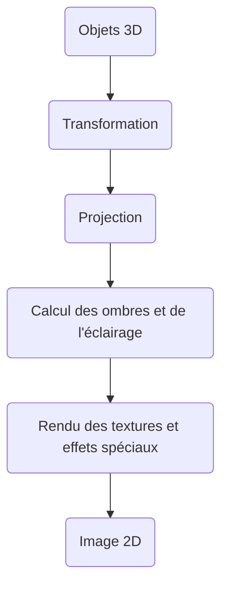
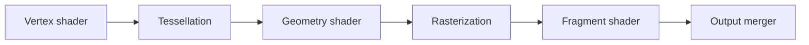
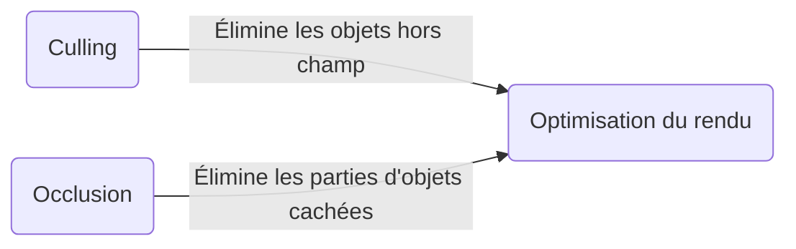
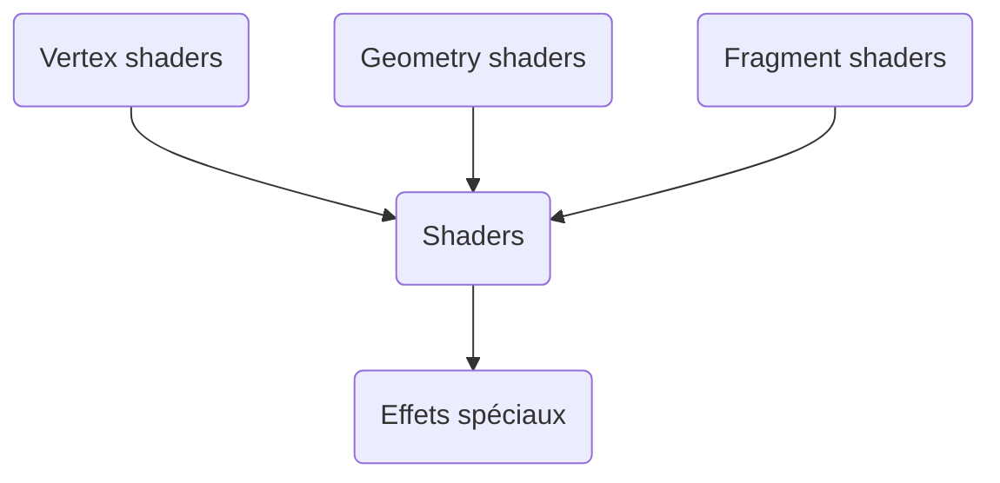
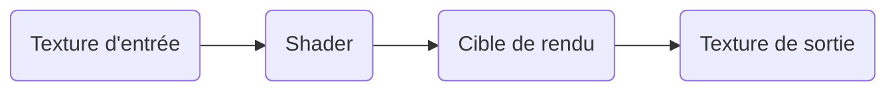

[← Techniques avancées](10-techniques-avancees.md) · [↑ Sommaire](../README.md#table-des-matières)

# 11. Pipeline de rendu

Le **pipeline de rendu** est un processus séquentiel qui convertit les objets 3D et les textures du jeu en images 2D affichées à l'écran. Il comprend plusieurs étapes — depuis la transformation des objets 3D dans le repère du monde jusqu'à l'affichage final.

### Étapes du pipeline



À un niveau plus détaillé, le pipeline d'un GPU moderne ressemble à :



### Culling et occlusion

Le **culling** et l'**occlusion** sont des techniques utilisées pour optimiser le rendu graphique en éliminant les objets ou les parties d'objets qui ne sont pas visibles à l'écran.

- Le **culling** se concentre sur l'élimination des **objets entiers** qui sont en dehors du champ de vision de la caméra (*frustum culling*) ou orientés à l'opposé (*backface culling*).
- L'**occlusion** élimine les **parties d'objets** qui sont cachées derrière d'autres objets (*occlusion culling*, *Z-buffer*, *Hi-Z* — pour *Hierarchical-Z*, version pyramide du Z-buffer où chaque niveau garde la profondeur la plus lointaine d'un bloc de $2 \times 2$ pixels du niveau inférieur, ce qui permet de rejeter une tuile entière sans tester chaque pixel).

> **Vocabulaire indispensable du pipeline.**
>
> - **Frustum** (lu "frustomme") : le volume tronc-de-pyramide délimité par la caméra, le *near plane* et le *far plane* — ce que la caméra "voit" effectivement. Tout ce qui est en dehors peut être culled.
> - **Rasterization** (français : *rastérisation*, *matricage*) : étape qui convertit les triangles 3D projetés en pixels (plus précisément en *fragments*) sur la grille de l'écran. Le matériel qui s'en charge sur le GPU s'appelle le **rasterizer**.
> - **Z-buffer** (alias **depth buffer**, tampon de profondeur) : tableau de la même taille que l'écran qui stocke, pour chaque pixel, la profondeur du fragment le plus proche déjà dessiné. Avant d'écrire un nouveau fragment, le GPU compare sa profondeur au Z-buffer ; s'il est plus loin, il est rejeté. C'est la solution standard au problème de l'**occlusion** depuis Edwin Catmull (1974).
> - **Texel** (*texture pixel*) : un pixel d'une **texture** (par opposition à un pixel d'écran). Pour appliquer une texture sur un triangle, le sampler GPU lit un ou plusieurs texels et les combine selon le mode de filtrage (nearest, bilinear, trilinear, anisotrope).
> - **Coordonnées homogènes** : voir la section sur la translation — astuce qui ajoute une 4ᵉ composante $w$ pour que **toutes** les transformations affines (translation incluse) s'expriment comme un produit matrice 4×4.
> - **Coordonnées barycentriques** : voir la section *Fragment shader* — un triplet $(\alpha, \beta, \gamma)$ avec $\alpha + \beta + \gamma = 1$ qui repère un point à l'intérieur d'un triangle par son poids relatif sur les trois sommets ; c'est ce qui permet d'**interpoler** les attributs (couleur, UV, normale) à l'intérieur du triangle.



### Shaders

Les **shaders** sont des programmes qui sont exécutés sur les **unités de traitement graphique** (GPU) pour déterminer les caractéristiques visuelles des objets affichés à l'écran.

Généralement écrits dans des langages spécifiques au GPU, tels que **GLSL** (*OpenGL Shading Language*), **HLSL** (*High-Level Shading Language*) ou **WGSL** (*WebGPU Shading Language*), ils permettent de créer des effets spéciaux, tels que les **réflexions**, les **ombres** et les **animations de texture**.

> Exemple : un effet de brouillard, où le shader applique un effet de flou et de couleur uniforme sur les pixels les plus éloignés de la caméra.

En somme, le but d'un shader est de **personnaliser l'apparence visuelle** des objets à l'écran. Nous allons ici aborder les vertex shaders, geometry shaders et les fragment shaders.



#### Vertex shaders

Les [vertex](https://github.com/tanguychenier/Terminal_3DEngine) shaders sont des programmes exécutés sur **chaque sommet** des objets lors de leur rendu. Ils sont utilisés pour transformer les positions des sommets, en appliquant des transformations linéaires sur les coordonnées des sommets.

> Les objets 3D sont généralement définis par un ensemble de **sommets**, qui sont reliés entre eux par des **arêtes** pour former des polygones, tels que des triangles ou des quadrilatères.
>
> Les vertex shaders sont appliqués à chaque sommet de ces polygones lors du rendu, pour déterminer la position finale de chaque sommet dans l'image affichée à l'écran.

##### Fonctionnement du vertex shader

Chaque sommet est représenté par un vecteur de position homogène $\mathbf{v}_h$, qui peut être transformé en un nouveau vecteur de position homogène $\mathbf{v}'_h$ par l'application d'une matrice de transformation homogène $M_{VS}$ représentant le vertex shader :

```math
\mathbf{v}'_h = M_{VS} \, \mathbf{v}_h
```

La matrice de transformation $M_{VS}$ peut être construite en combinant plusieurs types de transformations linéaires, telles que la translation, la rotation et la mise à l'échelle. Ces transformations peuvent être représentées par des matrices de transformation homogène 4×4.

Par exemple, pour effectuer une translation de vecteur $\mathbf{t} = (t_x, t_y, t_z)$, on peut construire la matrice de translation homogène $T$ :

```math
T = \begin{pmatrix} 1 & 0 & 0 & t_x \\ 0 & 1 & 0 & t_y \\ 0 & 0 & 1 & t_z \\ 0 & 0 & 0 & 1 \end{pmatrix}
```

On peut ensuite combiner plusieurs transformations en multipliant les matrices correspondantes. Par exemple, pour effectuer une translation suivie d'une rotation autour de l'axe des $y$ d'un angle $\theta$ :

```math
M_{VS} = R_y(\theta) \cdot T
```

où $R_y(\theta)$ est la matrice de rotation homogène autour de l'axe des $y$.

##### Pipeline de données



En plus de transformer les positions des sommets, les vertex shaders peuvent également effectuer d'autres opérations : application de textures, génération de coordonnées de texture, ou envoi de données supplémentaires aux shaders de géométrie et de fragment. Le choix du langage (GLSL, HLSL, WGSL...) dépend du moteur et de la plateforme cible.

#### Geometry shaders

Étape de traitement intermédiaire entre les vertex shaders et les fragment shaders dans le pipeline de rendu graphique, les **shaders de géométrie** offrent la possibilité de **générer de nouveaux éléments graphiques**, tels que des points, des lignes ou des triangles, à partir des primitives d'entrée.

Cette étape est facultative et peut être utilisée pour réaliser des effets complexes : déplacement de sommets, génération de géométrie procédurale, création d'ombres volumétriques, etc.

> Un cas concret pourrait être par exemple la **modélisation procédurale** pour générer ou modifier la géométrie d'un personnage en temps réel — créer des détails supplémentaires ou modifier la forme du personnage selon certaines conditions du jeu.

##### Fonctionnement du geometry shader

Considérons un exemple simple pour illustrer le fonctionnement des geometry shaders. Soit une ligne définie par deux points $A$ et $B$. Nous souhaitons **extruder** cette ligne pour former un tube de rayon $r$. Le geometry shader va générer un ensemble de triangles formant le tube.

Soit $\vec{AB} = \vec{B} - \vec{A}$. Nous commençons par calculer un vecteur $\vec{u}$ orthogonal à $\vec{AB}$ :

```math
\vec{u} = \begin{cases}
(\vec{AB}_y, -\vec{AB}_x, 0) & \text{si } \vec{AB}_z = 0 \\
(-\vec{AB}_z, 0, \vec{AB}_x) & \text{sinon}
\end{cases}
```

Ensuite, nous calculons un vecteur $\vec{v}$ orthogonal à $\vec{AB}$ et $\vec{u}$ en utilisant le produit vectoriel :

```math
\vec{v} = \vec{AB} \times \vec{u}
```

Nous normalisons les vecteurs $\vec{u}$ et $\vec{v}$ :

```math
\hat{u} = \frac{\vec{u}}{\|\vec{u}\|}, \quad \hat{v} = \frac{\vec{v}}{\|\vec{v}\|}
```

Soit $N$ le nombre de segments pour approximer le cercle du tube. Nous générons $N$ points $C_i$ et $D_i$ autour de chaque extrémité $A$ et $B$ :

```math
C_i = \vec{A} + r \cos \frac{2 \pi i}{N} \hat{u} + r \sin \frac{2 \pi i}{N} \hat{v}, \quad i = 0, 1, \dots, N-1
```

```math
D_i = \vec{B} + r \cos \frac{2 \pi i}{N} \hat{u} + r \sin \frac{2 \pi i}{N} \hat{v}, \quad i = 0, 1, \dots, N-1
```

Maintenant que nous avons les points autour de chaque extrémité, nous générons les triangles formant le tube. Pour chaque paire de points consécutifs $C_i$, $C_{i+1}$, $D_i$ et $D_{i+1}$, nous formons deux triangles : $(C_i, D_i, C_{i+1})$ et $(C_{i+1}, D_i, D_{i+1})$. Nous devons également traiter le cas où $i = N-1$ pour fermer le tube en connectant les points $C_0$, $C_{N-1}$, $D_0$ et $D_{N-1}$.

##### Démonstration

Pour démontrer que l'extrusion décrite précédemment forme un tube autour de la ligne $AB$, nous devons montrer que chaque point $C_i$ et $D_i$ se trouve à une distance $r$ de la ligne et que les triangles générés décrivent un tube continu.

###### Étape 1 — La distance entre chaque point $C_i$ et la ligne $AB$

Soit $M_i$ le point de la ligne $AB$ le plus proche de $C_i$. Le vecteur $\vec{M_i C_i}$ est orthogonal à $\vec{AB}$, donc leur produit scalaire est nul :

```math
\vec{AB} \cdot \vec{M_i C_i} = 0
```

En utilisant la définition des points $C_i$ :

```math
\vec{AB} \cdot \left(\vec{A} + r \cos \frac{2 \pi i}{N} \hat{u} + r \sin \frac{2 \pi i}{N} \hat{v} - \vec{A}\right) = 0
```

```math
\vec{AB} \cdot \left(r \cos \frac{2 \pi i}{N} \hat{u} + r \sin \frac{2 \pi i}{N} \hat{v}\right) = 0
```

Comme $\hat{u}$ et $\hat{v}$ sont orthogonaux à $\vec{AB}$, cette équation est vérifiée. La distance entre $C_i$ et $AB$ est donc $r$.

###### Étape 2 — La continuité du tube

Nous avons généré les triangles en connectant chaque paire de points consécutifs $C_i$, $C_{i+1}$, $D_i$ et $D_{i+1}$. Comme les points sont générés en suivant un cercle autour de chaque extrémité, cela garantit que les triangles forment un tube continu autour de la ligne $AB$. Le cas où $i = N-1$ permet de fermer le tube en connectant les points initiaux et finaux.

En conclusion, l'extrusion décrite forme un tube de rayon $r$ autour de la ligne $AB$, et les triangles générés décrivent un tube continu. ∎

#### Fragment shaders

Les **fragment shaders** permettent de déterminer la **couleur finale** de chaque pixel à afficher à l'écran, en prenant en compte les propriétés des matériaux, l'éclairage, les textures et d'autres facteurs.

> Les *fragments* sont créés par le processus de [rasterization](https://github.com/tanguychenier/Terminal_3DEngine), qui consiste à convertir la géométrie en pixels — chaque pixel de l'image est découpé en « fragments » qui sont ensuite traités par le fragment shader pour déterminer la couleur finale de ce pixel.
>
> Cet algorithme est donc chargé de calculer la couleur de chaque fragment en fonction des propriétés des matériaux, de l'éclairage, des textures et d'autres facteurs, avant que ces fragments ne soient finalement combinés pour créer l'image finale.

##### 1. Interpolation des attributs de sommet

Lorsque les sommets sont transformés par le vertex shader, ils sont accompagnés d'attributs tels que les coordonnées de texture, les normales et les couleurs. Ces attributs sont ensuite **interpolés** pour chaque fragment à l'intérieur du triangle.

Soit $A$, $B$ et $C$ les sommets du triangle avec leurs attributs respectifs $A_a$, $B_a$ et $C_a$. Pour un fragment $F$ à l'intérieur du triangle, les attributs interpolés $F_a$ sont déterminés en utilisant les **coordonnées barycentriques** $\alpha$, $\beta$ et $\gamma$ :

```math
F_a = \alpha A_a + \beta B_a + \gamma C_a
```

avec $\alpha + \beta + \gamma = 1$ et $0 \leq \alpha, \beta, \gamma \leq 1$.

##### 2. Calcul de l'éclairage

Le fragment shader doit également prendre en compte l'éclairage de la scène pour déterminer la couleur finale du fragment. Soit $L$ la direction de la source de lumière, $N$ la normale au fragment et $V$ la direction de la caméra. La couleur finale $C_f$ est déterminée en utilisant l'**équation de Phong**, qui est une combinaison de la composante ambiante, diffuse et spéculaire :

```math
C_f = k_a I_a + k_d \max(N \cdot L,\, 0)\, I_d + k_s \max(R \cdot V,\, 0)^n I_s
```

où :

- $k_a$, $k_d$, $k_s$ sont les coefficients d'éclairage ambiant, diffus et spéculaire ;
- $I_a$, $I_d$, $I_s$ sont les intensités de lumière ambiante, diffuse et spéculaire ;
- $R$ est la direction de réflexion de la lumière (symétrique de $L$ par rapport à $N$) ;
- $n$ est l'**exposant de brillance** (*shininess*) ;
- le $\max(\cdot,\, 0)$ clamp évite une contribution négative de la lumière quand le point est dans l'ombre (lumière derrière la surface).

##### 3. Application des textures

Les fragment shaders peuvent également utiliser des textures pour déterminer la couleur finale du fragment. Soit $T(u, v)$ la couleur de la texture aux coordonnées de texture $(u, v)$. La couleur finale $C_t$ du fragment est alors déterminée en modulant la couleur interpolée $F_a$ avec la couleur de la texture :

```math
C_t = F_a \odot T(u, v)
```

où $\odot$ représente le **produit terme à terme** (modulation) des composantes de couleur.

##### 4. Combinaison des couleurs

Finalement, la couleur finale du fragment est déterminée en combinant les couleurs calculées à partir de l'éclairage et des textures :

```math
C_{\text{final}} = C_f \odot C_t
```

Cette couleur finale $C_{\text{final}}$ est ensuite utilisée pour déterminer la couleur du pixel à afficher à l'écran.

##### 5. Transparence

Les fragment shaders peuvent également gérer la **transparence** des objets. Pour cela, ils utilisent une valeur **alpha** pour chaque fragment, qui détermine l'opacité de ce fragment. La couleur finale $C_f$ du fragment est alors combinée avec la couleur du fond $C_b$ en utilisant la valeur alpha $a$ pour obtenir la couleur du pixel à afficher :

```math
C_{\text{pixel}} = a\,C_f + (1 - a)\,C_b
```

##### 6. Effets spéciaux

Les fragment shaders peuvent être utilisés pour créer des effets spéciaux, tels que des ombres, des reflets, des flous ou des effets de distorsion. Pour cela, il est souvent nécessaire de modifier la couleur finale du fragment de manière spécifique.

Par exemple, pour créer une ombre, la couleur finale du fragment peut être multipliée par un facteur d'ombre qui réduit l'intensité de la couleur. Pour créer un effet de flou, la couleur finale peut être calculée en moyennant les couleurs des fragments environnants.

###### Flou gaussien

La couleur finale $C_f$ peut être calculée en utilisant une **somme pondérée** de la couleur des fragments environnants :

> Une somme pondérée est une somme dans laquelle chaque terme est multiplié par un poids spécifique. Les couleurs sont représentées par des valeurs numériques, qui peuvent être considérées comme des « substances » numériques que l'on pondère.

```math
C_f(x, y) = \sum_{i=-k}^{k} \sum_{j=-k}^{k} G(i, j;\,\sigma) \cdot C(x+i, y+j)
\qquad \text{où} \qquad
G(i, j;\,\sigma) = \frac{1}{2\pi\sigma^2}\,e^{-\frac{i^2+j^2}{2\sigma^2}}
```

où $\sigma$ est l'écart-type de la distribution gaussienne, $k$ est la demi-taille du filtre et $G(i, j;\sigma)$ est le noyau gaussien 2D centré en $(0,0)$. En pratique on précalcule et normalise ces poids pour que leur somme vaille exactement 1 sur la fenêtre finie $[-k, k]^2$.

##### Exemple complet — un fragment shader Phong en GLSL

Pour rendre concret tout ce qui précède, voici un fragment shader **GLSL 330** qui assemble interpolation barycentrique (implicite, fournie par le rasterizer), texturage, et éclairage de Blinn-Phong avec atténuation distance — l'équivalent moderne du *fixed-function pipeline* de OpenGL 1.x, mais codé à la main :

```glsl
#version 330 core

in vec3 vWorldPos;     // position du fragment, espace monde
in vec3 vNormal;       // normale interpolée
in vec2 vUV;           // coordonnées de texture interpolées
out vec4 oColor;

uniform sampler2D uAlbedo;       // texture color, échantillonnée en sRGB → linéaire par le sampler
uniform vec3      uLightPos;     // position de la lumière (espace monde)
uniform vec3      uLightColor;   // intensité lumineuse linéaire (peut être > 1.0 en HDR)
uniform vec3      uViewPos;      // position de la caméra
uniform float     uShininess;    // exposant de brillance (Blinn-Phong)

void main() {
 // Lecture de l'albedo (déjà linéarisé par le format SRGB du sampler)
 vec3 albedo = texture(uAlbedo, vUV).rgb;

 // Vecteurs unitaires nécessaires
 vec3 N = normalize(vNormal);
 vec3 L = uLightPos - vWorldPos;
 float distance = length(L);
 L /= distance;                                  // direction lumière normalisée
 vec3 V = normalize(uViewPos - vWorldPos);       // direction caméra
 vec3 H = normalize(L + V);                      // half-vector (Blinn)

 // Atténuation physique en 1/r^2 (lumière ponctuelle)
 float attenuation = 1.0 / (distance * distance);

 // Composantes de Blinn-Phong
 float ambient  = 0.03;
 float diffuse  = max(dot(N, L), 0.0);
 float specular = pow(max(dot(N, H), 0.0), uShininess);

 vec3 color = albedo * (ambient + diffuse * uLightColor * attenuation)
            + uLightColor * specular * attenuation;

 // Pas de gamma manuel ici : le framebuffer est en RGBA8_SRGB,
 // le GPU appliquera la conversion linéaire → sRGB en hardware à l'écriture.
 oColor = vec4(color, 1.0);
}
```

Trois choses à noter pour quiconque vient du *fixed-function pipeline* (OpenGL 1.x à 2.1) ou de DirectX 9 :

1. Tout passe par des **matrices et uniforms explicites** côté CPU. Plus de `glLoadMatrix`, plus de `glLight`, plus du couple `glBegin`/`glEnd` — ces appels de l'ancien *fixed-function pipeline* ont été définitivement supprimés avec OpenGL 3.0+ Core Profile en 2008.
2. La **pipeline programmable** est obligatoire : aucun rendu n'arrive à l'écran sans au moins un vertex shader **et** un fragment shader compilés et liés en *program object*. Les *render states* (alpha test, fog, lighting model) qui étaient des appels d'API en DX9 sont aujourd'hui des `if` ou des branches statiques dans le shader.
3. Les **conversions sRGB sont implicites** quand on déclare correctement les formats des textures et du framebuffer. Tout shader qui contient un `pow(color, 2.2)` à la lecture ou à l'écriture est presque toujours un signe de format mal déclaré côté CPU.

##### 7. Optimisations

- **Culling** : technique qui consiste à éviter le rendu de fragments qui ne sont pas visibles à l'écran. Par exemple, si un objet est entièrement masqué par un autre, on évite de le rendre afin de préserver la charge de calcul du GPU et améliorer les performances globales.
- **Discarding** : similaire au culling, mais s'applique aux fragments qui ne sont pas nécessaires pour l'image finale. Si un objet est partiellement masqué par un autre, seuls les fragments visibles doivent être rendus ; les fragments masqués peuvent être supprimés (« jetés »), réduisant la charge de calcul pour le GPU.
- **Simplification de la géométrie** (*Level of Detail*, LOD) : consiste à réduire le nombre de triangles nécessaires pour représenter un objet. Si un objet est suffisamment éloigné de la caméra, il peut être représenté par un nombre réduit de triangles sans affecter de manière significative la qualité de l'image.
- **Mipmapping** : utilise des versions pré-réduites des textures pour les objets distants, ce qui améliore les performances et réduit le *aliasing*.

[ Retour en haut de page](#table-des-matières)

---

---

[← Techniques avancées](10-techniques-avancees.md) · [↑ Sommaire](../README.md#table-des-matières)
